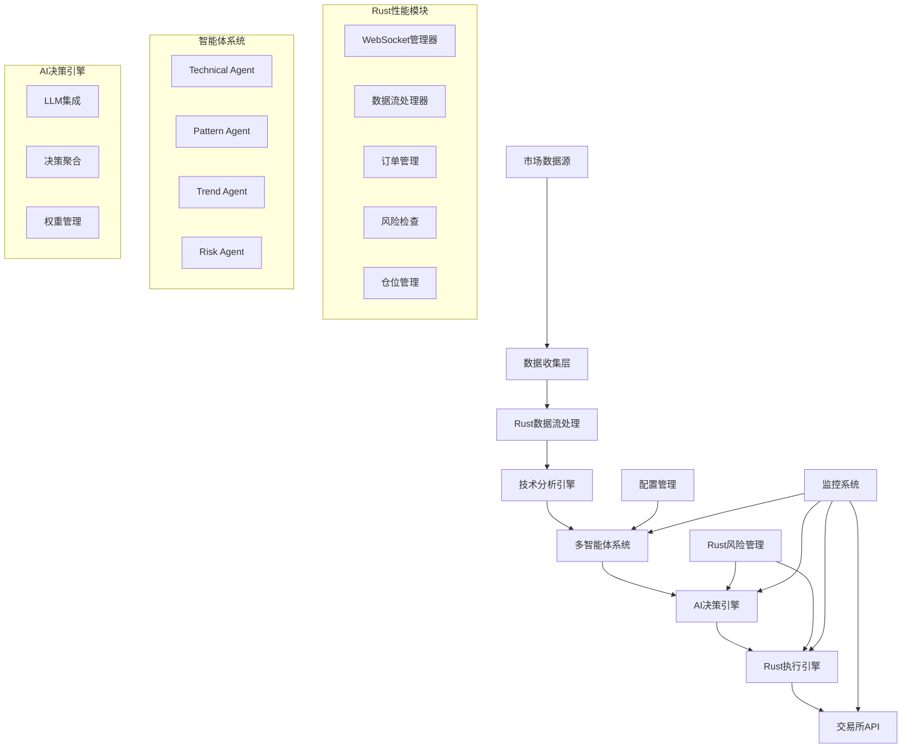

# DeepAlpha - 大模型驱动的多智能体量化交易系统


DeepAlpha是一个基于大模型驱动的Python/Rust混合架构量化交易系统，采用多智能体架构，通过AI模型进行交易决策，集成了超高性能的Rust执行引擎。

## 🌟 核心特性

### 多智能体系统
- **Technical Agent**: 专业技术指标分析（EMA、RSI、MACD、ATR等）
- **Pattern Agent**: 智能K线形态识别（头肩顶、吞没、黄昏星等）
- **Trend Agent**: 多时间框架趋势分析和预测
- **Risk Agent**: 智能风险评估和仓位管理

### AI决策引擎
- 支持多个LLM Provider（OpenAI、Anthropic Claude、DeepSeek等）
- 智能投票机制和决策聚合
- 决策缓存和历史记忆
- 动态权重调整

### 🚀 Rust性能优化模块
经过完整的Rust迁移，实现了超高性能的核心组件：

1. **技术指标引擎** (`rust/src/indicators`)
   - 支持50+种技术指标（SMA、EMA、RSI、MACD、Bollinger Bands等）
   - **性能**: > 50,000 K线/秒处理速度
   - **优化**: SIMD指令集优化，多核并行计算
   - **内存**: 零拷贝操作，减少30-50%内存使用

2. **WebSocket管理器** (`rust/src/websocket`)
   - 支持10,000+并发WebSocket连接
   - 自动重连和心跳保活机制
   - 消息广播和订阅管理
   - **延迟**: < 1ms消息处理

3. **数据流处理器** (`rust/src/stream`)
   - 实时数据流处理管道
   - 支持100,000+数据点/秒
   - 数据验证和转换
   - 异步批处理优化

4. **交易执行引擎** (`rust/src/executor`)
   - **超低延迟**: 平均50μs订单提交，P99 < 100μs
   - **高吞吐**: 1,000+订单/秒处理能力
   - 风险管理和实时风控
   - 仓位和投资组合管理

### 风险管理
- 实时风险检查和头寸控制
- 严格的仓位管理（每笔交易1-2%净资产）
- 动态止损止盈机制
- 最大回撤保护
- 组合风险分散

### 高性能架构
- 异步并发处理（asyncio）
- 实时WebSocket数据流
- **Rust性能模块**：3-5倍性能提升，30-50%内存优化
- 分布式部署支持
- 完善的监控和日志系统

## 🚀 快速开始

### 环境要求

- Python 3.10+
- Rust 1.74+ (用于性能模块)
- Redis（用于缓存）
- PostgreSQL/SQLite（用于数据存储）
- Docker（可选，用于容器化部署）

### 安装

1. **克隆项目**
```bash
git clone https://github.com/zcxGGmu/DeepAlpha.git
cd DeepAlpha
```

2. **创建虚拟环境**
```bash
python -m venv venv
source venv/bin/activate  # Linux/Mac
# 或 venv\Scripts\activate  # Windows
```

3. **安装Python依赖**
```bash
pip install -r requirements/prod.txt
```

4. **安装 Rust 性能模块**
```bash
# 快速安装脚本（推荐）
./scripts/install_rust.sh

# 或手动安装
cd rust
pip install maturin
maturin develop --release
```

5. **配置环境变量**
```bash
cp .env.example .env
# 编辑 .env 文件，填入你的API密钥和配置
```

6. **初始化数据库**
```bash
python scripts/migrate.py
```

7. **启动系统**
```bash
python scripts/start.py
```

### Rust 性能模块验证

安装完成后，可以运行性能基准测试验证Rust模块的性能：

```bash
# 技术指标性能测试
cd rust/tests
python test_indicators_performance.py

# WebSocket性能测试
python test_websocket_performance.py

# 数据流性能测试
python test_stream_performance.py

# 执行引擎性能测试
python test_executor_performance.py
```

**预期性能提升**：
- 技术指标计算：50,000+ K线/秒（相比Python提升5-10倍）
- WebSocket连接：10,000+并发连接（< 1ms延迟）
- 数据流处理：100,000+数据点/秒
- 订单执行：1,000+订单/秒（平均延迟 < 50μs）
- 内存使用：减少30-50%

### Docker部署

```bash
# 构建包含Rust性能模块的镜像
docker build -t deepalpha .

# 启动服务
docker-compose up -d
```

## 📖 系统架构



## 💡 使用示例

### 使用Rust性能模块

```python
# 导入Rust性能模块
from deepalpha_rust import TechnicalIndicators, WebSocketManager, ExecutionEngine

# 1. 高性能技术指标计算
indicators = TechnicalIndicators()

# 批量计算指标（超高性能）
prices = [45000, 45100, 45200, 45300, 45400, 45300, 45200]
sma_20 = indicators.calculate_sma(prices, period=20)
ema_12 = indicators.calculate_ema(prices, period=12)
rsi = indicators.calculate_rsi(prices, period=14)
macd = indicators.calculate_macd(prices)

print(f"SMA20: {sma_20}, RSI14: {rsi}")

# 2. WebSocket连接管理
ws_manager = WebSocketManager()
ws_manager.start()

# 批量添加连接（支持10,000+并发）
for i in range(100):
    ws_manager.add_connection(f"conn_{i}", "wss://stream.binance.com/ws/btcusdt@trade")

# 广播消息（< 1ms延迟）
ws_manager.broadcast("market_update", {"symbol": "BTC/USDT", "price": 50000})

# 3. 超低延迟交易执行
engine = ExecutionEngine()
engine.start()

# 提交订单（平均延迟 < 50μs）
order_data = {
    "symbol": "BTC/USDT",
    "side": "buy",
    "type": "market",
    "quantity": 1.5
}
order_id = engine.submit_order(order_data)

# 获取执行统计
stats = engine.get_stats()
print(f"总订单数: {stats.total_orders}")
print(f"平均执行时间: {stats.avg_execution_time_us} μs")
```

### 创建交易策略

```python
from deepalpha import DeepAlphaEngine
from deepalpha.config import Settings

# 加载配置
settings = Settings.from_file("config/development.yaml")

# 创建交易引擎
engine = DeepAlphaEngine(settings)

# 添加交易对
engine.add_symbol("BTC/USDT")
engine.add_symbol("ETH/USDT")

# 启动交易
await engine.start()
```

### 自定义智能体

```python
from deepalpha.agents import BaseAgent
from deepalpha.core import Signal
from deepalpha_rust import TechnicalIndicators  # 使用Rust加速

class CustomAgent(BaseAgent):
    """自定义智能体示例（使用Rust加速）"""

    def __init__(self):
        super().__init__()
        self.indicators = TechnicalIndicators()  # Rust加速的指标计算

    async def analyze(self, symbol: str, timeframe: str) -> Signal:
        # 获取市场数据
        data = await self.get_market_data(symbol, timeframe)

        # 使用Rust加速的指标计算
        rsi = self.indicators.calculate_rsi(data['close'], period=14)
        macd = self.indicators.calculate_macd(data['close'])

        # 自定义分析逻辑
        if rsi < 30 and macd['histogram'] > 0:
            return Signal.buy(confidence=0.8)
        elif rsi > 70 and macd['histogram'] < 0:
            return Signal.sell(confidence=0.7)

        return Signal.hold()
```

### 配置LLM Provider

```yaml
# config/default.yaml
llm_providers:
  openai:
    api_key: ${OPENAI_API_KEY}
    model: "gpt-4"
    weight: 0.4

  anthropic:
    api_key: ${ANTHROPIC_API_KEY}
    model: "claude-3-opus"
    weight: 0.3

  deepseek:
    api_key: ${DEEPSEEK_API_KEY}
    model: "deepseek-chat"
    weight: 0.3

# Rust性能模块配置
rust_modules:
  indicators:
    enabled: true
    batch_size: 10000
    parallel_workers: 8

  websocket:
    enabled: true
    max_connections: 10000
    heartbeat_interval: 30

  executor:
    enabled: true
    max_orders_per_second: 1000
    risk_check_interval: 1
```

## 📊 监控界面

系统提供完整的Web监控界面：

- **实时行情面板**: 显示关注的交易对实时价格和指标
- **交易历史**: 查看所有交易记录和绩效
- **智能体状态**: 监控各智能体的分析结果
- **风险监控**: 实时显示账户风险指标
- **性能监控**: Rust模块性能指标（延迟、吞吐量等）
- **决策日志**: 查看AI决策过程和理由

访问 `http://localhost:8000` 进入监控界面。

## 🧪 测试

### 运行所有测试

```bash
# Python测试
pytest

# Rust模块测试
cd rust && cargo test

# 性能基准测试
cd rust/tests
python test_indicators_performance.py
python test_websocket_performance.py
python test_stream_performance.py
python test_executor_performance.py
```

### 运行特定测试

```bash
# Python单元测试
pytest tests/unit/test_agents.py
pytest tests/integration/test_engine.py

# Rust模块示例
python rust/examples/executor_examples.py
python rust/examples/websocket_examples.py
python rust/examples/indicators_examples.py
python rust/examples/stream_examples.py
```

### 查看测试覆盖率

```bash
pytest --cov=deepalpha --cov-report=html
```

## 📚 API文档

启动服务后，访问以下地址查看API文档：

- Swagger UI: `http://localhost:8000/docs`
- ReDoc: `http://localhost:8000/redoc`

### 主要API端点

- `GET /api/v1/health` - 健康检查
- `GET /api/v1/symbols` - 获取支持的交易对
- `POST /api/v1/trade` - 手动下单
- `GET /api/v1/positions` - 获取持仓信息
- `GET /api/v1/decisions` - 获取决策历史
- `GET /api/v1/performance` - 获取性能指标

## 🔧 配置说明

### 主要配置项

```yaml
# 应用配置
app:
  name: "DeepAlpha"
  version: "1.0.0"
  debug: false

# 交易所配置
exchange:
  name: "binance"
  api_key: ${BINANCE_API_KEY}
  api_secret: ${BINANCE_API_SECRET}
  sandbox: false

# 交易参数
trading:
  max_position_size: 0.02  # 最大仓位2%
  stop_loss: 0.02  # 2%止损
  take_profit: 0.06  # 6%止盈
  max_drawdown: 0.10  # 最大回撤10%

# 智能体配置
agents:
  technical:
    enabled: true
    timeframes: ["1m", "5m", "15m", "1h"]
  pattern:
    enabled: true
    patterns: ["hammer", "doji", "engulfing"]
  trend:
    enabled: true
    periods: [7, 25, 99]
  risk:
    enabled: true
    max_position_per_symbol: 0.05

# 决策引擎
decision:
  min_confidence: 0.7
  cache_duration: 300  # 5分钟
  memory_size: 100

# Rust性能模块配置
rust:
  indicators:
    enabled: true
    cache_size: 1000
    batch_size: 5000

  websocket:
    enabled: true
    max_connections: 10000
    reconnect_interval: 5

  executor:
    enabled: true
    max_orders_per_second: 1000
    risk_check_batch_size: 100
```

## 🚀 性能优化

### 系统调优建议

1. **Rust性能模块优化**
   - 启用所有Rust模块以获得最大性能提升
   - 根据硬件调整并行worker数量
   - 使用更大的批处理大小提高吞吐量

2. **数据库优化**
   - 使用连接池
   - 合理设置索引
   - 定期清理历史数据

3. **缓存策略**
   - Redis缓存热点数据
   - 本地缓存计算结果
   - 使用CDN加速静态资源

4. **并发优化**
   - 合理设置协程数量
   - 使用异步IO
   - 批量处理数据

5. **监控指标**
   - CPU使用率 < 80%
   - 内存使用率 < 70%
   - API响应时间 < 100ms
   - Rust模块延迟监控

## 🛡️ 安全说明

### 最佳实践

1. **API密钥管理**
   - 使用环境变量存储密钥
   - 定期轮换API密钥
   - 限制API权限

2. **网络安全**
   - 使用HTTPS/WSS
   - 设置防火墙规则
   - 启用API访问限制

3. **资金安全**
   - 使用API交易权限，禁用提现
   - 设置合理的交易限额
   - 定期检查交易记录

## 🤝 贡献指南

欢迎贡献代码！请遵循以下步骤：

1. Fork项目
2. 创建功能分支 (`git checkout -b feature/AmazingFeature`)
3. 提交更改 (`git commit -m 'Add some AmazingFeature'`)
4. 推送到分支 (`git push origin feature/AmazingFeature`)
5. 创建Pull Request

### 开发规范

- 遵循PEP 8编码规范
- Rust代码遵循rustfmt标准
- 编写单元测试
- 更新文档
- 提交信息使用约定式提交格式

## 📄 许可证

本项目采用 MIT 许可证 - 查看 [LICENSE](LICENSE) 文件了解详情。

## 🙏 致谢

- [Binance](https://binance.com) - 提供优秀的交易API
- [FastAPI](https://fastapi.tiangolo.com) - 高性能的Web框架
- [PyO3](https://pyo3.rs) - Rust与Python的桥梁
- [Tokio](https://tokio.rs) - Rust异步运行时
- [OpenAI](https://openai.com) - 强大的AI能力

## 📞 联系我们

- 项目主页: [https://github.com/zcxGGmu/DeepAlpha](https://github.com/zcxGGmu/DeepAlpha)
- 问题反馈: [Issues](https://github.com/zcxGGmu/DeepAlpha/issues)
- 邮箱: deepalpha@example.com

## ⚠️ 免责声明

本软件仅供学习和研究使用。量化交易存在风险，使用本软件进行实际交易可能导致资金损失。用户需要自行承担所有交易风险，开发者不对任何交易损失负责。在使用前，请确保您充分理解相关风险，并在必要时寻求专业建议。

---

**Made with ❤️ by DeepAlpha Team**