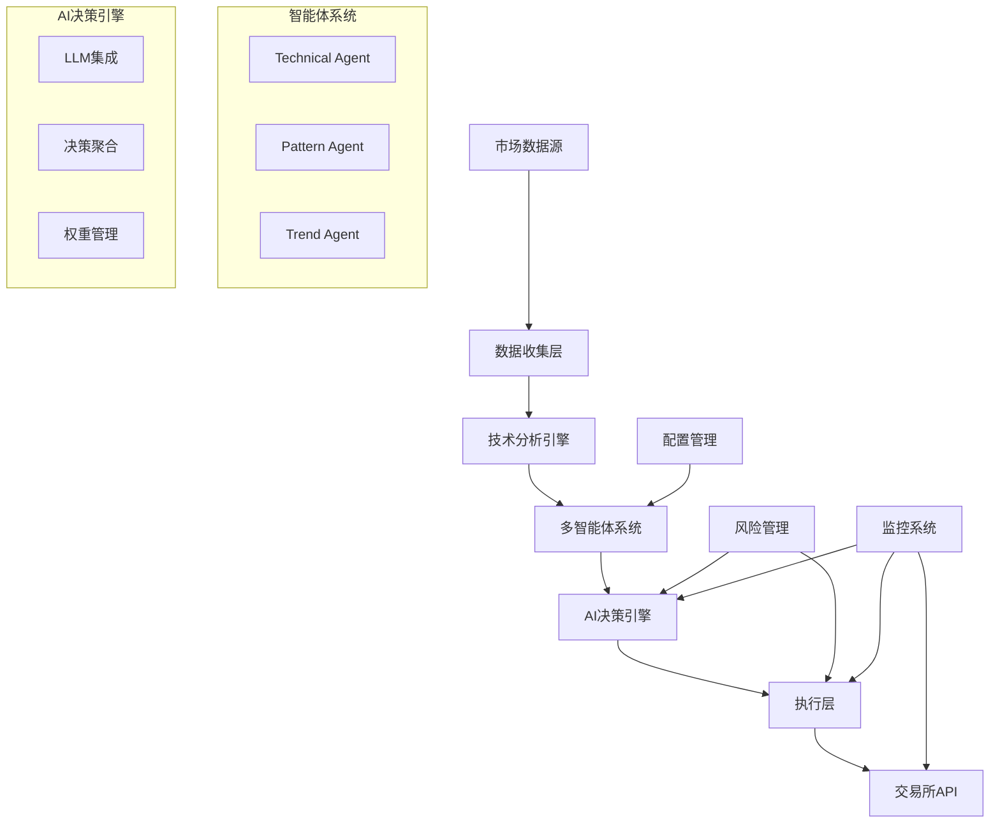

# DeepAlpha - AI驱动的多智能体量化交易系统

[](https://python.org)
[](https://fastapi.tiangolo.com)
[](LICENSE)

DeepAlpha 是一个基于 Python 的高性能量化交易系统，采用多智能体架构和 AI 决策引擎，专注于加密货币市场的自动化交易。系统通过多个专业智能体协同工作，结合大语言模型的决策能力，实现智能化的交易策略执行。

## 🌟 核心特性

### 多智能体系统
- **Technical Agent**: 专业技术指标分析（EMA、RSI、MACD、ATR等）
- **Pattern Agent**: 智能K线形态识别（头肩顶、吞没、黄昏星等）
- **Trend Agent**: 多时间框架趋势分析和预测

### AI决策引擎
- 支持多个LLM Provider（OpenAI、Anthropic Claude、DeepSeek等）
- 智能投票机制和决策聚合
- 决策缓存和历史记忆
- 动态权重调整

### 风险管理
- 严格的仓位控制（每笔交易1-2%净资产）
- 动态止损止盈机制
- 最大回撤保护
- 组合风险分散

### 高性能架构
- 异步并发处理（asyncio）
- WebSocket实时数据流
- 分布式部署支持
- 完善的监控和日志系统

## 🚀 快速开始

### 环境要求

- Python 3.10+
- Redis（用于缓存）
- PostgreSQL/SQLite（用于数据存储）
- Docker（可选，用于容器化部署）

### 安装

1. **克隆项目**
```bash
git clone https://github.com/yourusername/DeepAlpha.git
cd DeepAlpha
```

2. **创建虚拟环境**
```bash
python -m venv venv
source venv/bin/activate  # Linux/Mac
# 或 venv\Scripts\activate  # Windows
```

3. **安装依赖**
```bash
pip install -r requirements/prod.txt
```

4. **配置环境变量**
```bash
cp .env.example .env
# 编辑 .env 文件，填入你的API密钥和配置
```

5. **初始化数据库**
```bash
python scripts/migrate.py
```

6. **启动系统**
```bash
python scripts/start.py
```

### Docker部署

```bash
docker-compose up -d
```

## 📖 系统架构



## 💡 使用示例

### 创建交易策略

```python
from deepalpha import DeepAlphaEngine
from deepalpha.config import Settings

# 加载配置
settings = Settings.from_file("config/development.yaml")

# 创建交易引擎
engine = DeepAlphaEngine(settings)

# 添加交易对
engine.add_symbol("BTC/USDT")
engine.add_symbol("ETH/USDT")

# 启动交易
await engine.start()
```

### 自定义智能体

```python
from deepalpha.agents import BaseAgent
from deepalpha.core import Signal

class CustomAgent(BaseAgent):
    """自定义智能体示例"""

    async def analyze(self, symbol: str, timeframe: str) -> Signal:
        # 获取市场数据
        data = await self.get_market_data(symbol, timeframe)

        # 自定义分析逻辑
        if self.should_buy(data):
            return Signal.buy(confidence=0.8)
        elif self.should_sell(data):
            return Signal.sell(confidence=0.7)

        return Signal.hold()
```

### 配置LLM Provider

```yaml
# config/default.yaml
llm_providers:
  openai:
    api_key: ${OPENAI_API_KEY}
    model: "gpt-4"
    weight: 0.4

  anthropic:
    api_key: ${ANTHROPIC_API_KEY}
    model: "claude-3-opus"
    weight: 0.3

  deepseek:
    api_key: ${DEEPSEEK_API_KEY}
    model: "deepseek-chat"
    weight: 0.3
```

## 📊 监控界面

系统提供完整的Web监控界面：

- **实时行情面板**: 显示关注的交易对实时价格和指标
- **交易历史**: 查看所有交易记录和绩效
- **智能体状态**: 监控各智能体的分析结果
- **风险监控**: 实时显示账户风险指标
- **决策日志**: 查看AI决策过程和理由

访问 `http://localhost:8000` 进入监控界面。

## 🧪 测试

运行所有测试：

```bash
pytest
```

运行特定测试：

```bash
pytest tests/unit/test_agents.py
pytest tests/integration/test_engine.py
```

查看测试覆盖率：

```bash
pytest --cov=deepalpha --cov-report=html
```

## 📚 API文档

启动服务后，访问以下地址查看API文档：

- Swagger UI: `http://localhost:8000/docs`
- ReDoc: `http://localhost:8000/redoc`

### 主要API端点

- `GET /api/v1/health` - 健康检查
- `GET /api/v1/symbols` - 获取支持的交易对
- `POST /api/v1/trade` - 手动下单
- `GET /api/v1/positions` - 获取持仓信息
- `GET /api/v1/decisions` - 获取决策历史

## 🔧 配置说明

### 主要配置项

```yaml
# 应用配置
app:
  name: "DeepAlpha"
  version: "1.0.0"
  debug: false

# 交易所配置
exchange:
  name: "binance"
  api_key: ${BINANCE_API_KEY}
  api_secret: ${BINANCE_API_SECRET}
  sandbox: false

# 交易参数
trading:
  max_position_size: 0.02  # 最大仓位2%
  stop_loss: 0.02  # 2%止损
  take_profit: 0.06  # 6%止盈
  max_drawdown: 0.10  # 最大回撤10%

# 智能体配置
agents:
  technical:
    enabled: true
    timeframes: ["1m", "5m", "15m", "1h"]
  pattern:
    enabled: true
    patterns: ["hammer", "doji", "engulfing"]
  trend:
    enabled: true
    periods: [7, 25, 99]

# 决策引擎
decision:
  min_confidence: 0.7
  cache_duration: 300  # 5分钟
  memory_size: 100
```

## 🚀 性能优化

### 系统调优建议

1. **数据库优化**
   - 使用连接池
   - 合理设置索引
   - 定期清理历史数据

2. **缓存策略**
   - Redis缓存热点数据
   - 本地缓存计算结果
   - 使用CDN加速静态资源

3. **并发优化**
   - 合理设置协程数量
   - 使用异步IO
   - 批量处理数据

4. **监控指标**
   - CPU使用率 < 80%
   - 内存使用率 < 70%
   - API响应时间 < 100ms

## 🛡️ 安全说明

### 最佳实践

1. **API密钥管理**
   - 使用环境变量存储密钥
   - 定期轮换API密钥
   - 限制API权限

2. **网络安全**
   - 使用HTTPS/WSS
   - 设置防火墙规则
   - 启用API访问限制

3. **资金安全**
   - 使用API交易权限，禁用提现
   - 设置合理的交易限额
   - 定期检查交易记录

## 🤝 贡献指南

欢迎贡献代码！请遵循以下步骤：

1. Fork项目
2. 创建功能分支 (`git checkout -b feature/AmazingFeature`)
3. 提交更改 (`git commit -m 'Add some AmazingFeature'`)
4. 推送到分支 (`git push origin feature/AmazingFeature`)
5. 创建Pull Request

### 开发规范

- 遵循PEP 8编码规范
- 编写单元测试
- 更新文档
- 提交信息使用约定式提交格式

## 📄 许可证

本项目采用 MIT 许可证 - 查看 [LICENSE](LICENSE) 文件了解详情。

## 🙏 致谢

- [Binance](https://binance.com) - 提供优秀的交易API
- [FastAPI](https://fastapi.tiangolo.com) - 高性能的Web框架
- [TA-Lib](https://ta-lib.org) - 技术分析库
- [OpenAI](https://openai.com) - 强大的AI能力

## 📞 联系我们

- 项目主页: [https://github.com/yourusername/DeepAlpha](https://github.com/yourusername/DeepAlpha)
- 问题反馈: [Issues](https://github.com/yourusername/DeepAlpha/issues)
- 邮箱: your.email@example.com

## ⚠️ 免责声明

本软件仅供学习和研究使用。量化交易存在风险，使用本软件进行实际交易可能导致资金损失。用户需要自行承担所有交易风险，开发者不对任何交易损失负责。在使用前，请确保您充分理解相关风险，并在必要时寻求专业建议。

---

**Made with ❤️ by DeepAlpha Team**