# DeepAlpha - LLM-Driven Multi-Agent Quantitative Trading System


DeepAlpha is a Python/Rust hybrid architecture quantitative trading system driven by Large Language Models (LLMs), featuring a multi-agent architecture that makes trading decisions through AI models and integrates an ultra-high-performance Rust execution engine.

## 🌟 Core Features

### Multi-Agent System
- **Technical Agent**: Professional technical indicator analysis (EMA, RSI, MACD, ATR, etc.)
- **Pattern Agent**: Intelligent candlestick pattern recognition (head & shoulders, engulfing, evening star, etc.)
- **Trend Agent**: Multi-timeframe trend analysis and prediction
- **Risk Agent**: Intelligent risk assessment and position management
- **News Agent**: News sentiment analysis and market impact assessment

### AI Decision Engine
- Support for multiple LLM Providers (OpenAI, Anthropic Claude, DeepSeek, etc.)
- Intelligent voting mechanism and decision aggregation
- Decision caching and historical memory
- Dynamic weight adjustment

### 🚀 Rust Performance Optimization Modules
Complete Rust migration achieves ultra-high-performance core components:

1. **Technical Indicators Engine** (`rust/src/indicators`)
   - Supports 50+ technical indicators (SMA, EMA, RSI, MACD, Bollinger Bands, etc.)
   - **Performance**: > 50,000 candles/second processing speed
   - **Optimization**: SIMD instruction set optimization, multi-core parallel computing
   - **Memory**: Zero-copy operations, 30-50% memory reduction

2. **WebSocket Manager** (`rust/src/websocket`)
   - Supports 10,000+ concurrent WebSocket connections
   - Automatic reconnection and heartbeat mechanism
   - Message broadcasting and subscription management
   - **Latency**: < 1ms message processing

3. **Data Stream Processor** (`rust/src/stream`)
   - Real-time data stream processing pipeline
   - Supports 100,000+ data points/second
   - Data validation and transformation
   - Asynchronous batch processing optimization

4. **Trading Execution Engine** (`rust/src/executor`)
   - **Ultra-low latency**: Average 50μs order submission, P99 < 100μs
   - **High throughput**: 1,000+ orders/second processing capability
   - Risk management and real-time control
   - Position and portfolio management

### Risk Management
- Real-time risk checking and position control
- Strict position management (1-2% net assets per trade)
- Dynamic stop-loss and take-profit mechanisms
- Maximum drawdown protection
- Portfolio risk diversification

### High-Performance Architecture
- Asynchronous concurrent processing (asyncio)
- Real-time WebSocket data streams
- **Rust Performance Modules**: 3-5x performance improvement, 30-50% memory optimization
- Distributed deployment support
- Comprehensive monitoring and logging system

## 🚀 Quick Start

### Requirements

- Python 3.10+
- Rust 1.74+ (for performance modules)
- Redis (for caching)
- PostgreSQL/SQLite (for data storage)
- Docker (optional, for containerized deployment)

### Installation

1. **Clone the project**
```bash
git clone https://github.com/zcxGGmu/DeepAlpha.git
cd DeepAlpha
```

2. **Create virtual environment**
```bash
python -m venv venv
source venv/bin/activate  # Linux/Mac
# or venv\Scripts\activate  # Windows
```

3. **Install Python dependencies**
```bash
pip install -r requirements/prod.txt
```

4. **Install Rust Performance Modules**
```bash
# Quick installation script (recommended)
./scripts/install_rust.sh

# Or manual installation
cd rust
pip install maturin
maturin develop --release
```

5. **Configure environment variables**
```bash
cp .env.example .env
# Edit .env file, fill in your API keys and configuration
```

6. **Initialize database**
```bash
python scripts/migrate.py
```

7. **Start the system**
```bash
python scripts/start.py
```

### Rust Performance Module Verification

After installation, run performance benchmarks to verify Rust module performance:

```bash
# Technical indicators performance test
cd rust/tests
python test_indicators_performance.py

# WebSocket performance test
python test_websocket_performance.py

# Data stream performance test
python test_stream_performance.py

# Execution engine performance test
python test_executor_performance.py
```

**Expected Performance Improvements**:
- Technical indicators: 50,000+ candles/second (5-10x improvement over Python)
- WebSocket connections: 10,000+ concurrent connections (< 1ms latency)
- Data stream processing: 100,000+ data points/second
- Order execution: 1,000+ orders/second (average latency < 50μs)
- Memory usage: 30-50% reduction

### Docker Deployment

```bash
# Build image with Rust performance modules
docker build -t deepalpha .

# Start services
docker-compose up -d
```

## 📖 System Architecture

### Overall Architecture Overview


### Core Components Details

#### 🚀 Rust Performance Optimization Layer

1. **WebSocket Manager** (`rust/src/websocket/`)
   - Supports 10,000+ concurrent connections
   - Message latency < 1ms
   - Automatic reconnection and heartbeat mechanism
   - JWT authentication and permission control

2. **Data Stream Processor** (`rust/src/stream/`)
   - 100,000+ data points/second processing capability
   - Zero-copy ring buffer
   - Real-time data validation and cleaning
   - Asynchronous batch processing optimization

3. **Technical Indicators Engine** (`rust/src/indicators/`)
   - 50+ technical indicators support
   - SIMD instruction set optimization
   - 50,000+ candles/second calculation speed
   - Batch calculation support

4. **Trading Execution Engine** (`rust/src/executor/`)
   - Ultra-low latency: average 50μs
   - 1,000+ orders/second throughput
   - Real-time risk control
   - Position and portfolio management

#### 🤖 Python Intelligent Agent System

1. **Technical Agent**
   - Professional technical indicator analysis
   - Multi-timeframe support
   - Indicator signal aggregation

2. **Pattern Agent**
   - 30+ candlestick pattern recognition
   - Support and resistance analysis
   - Pattern strength assessment

3. **Trend Agent**
   - Multi-timeframe trend analysis
   - Trend consistency check
   - Trend reversal prediction

4. **Risk Agent**
   - Real-time risk assessment
   - VaR calculation
   - Hedging recommendations

5. **News Agent**
   - Real-time news analysis
   - Sentiment scoring
   - Event impact assessment

### Detailed Architecture Documentation

For complete system architecture documentation, please refer to: [System Architecture](./docs/system-architecture.md)

This document includes:
- Detailed component descriptions
- Data flow analysis
- Performance optimization strategies
- Deployment architecture guide

## 📊 Sub-Function Module Architecture

### 1. Market Data Module Architecture


**Core Features**:
- **Multi-source Data Fusion**: Support for WebSocket, REST API, news, sentiment, and other multi-source data
- **Real-time Stream Processing**: 100,000+ data points/second processing capability
- **RUST Acceleration**: 50,000+ candles/second, 3-5x performance improvement
- **Smart Caching**: Redis millisecond-level access, InfluxDB efficient storage

### 2. Multi-Agent System Architecture


**Core Features**:
- **5 Specialized Agents**: Technical, Pattern, Trend, Risk, News agents
- **LLM Integration**: Support for OpenAI, Claude, DeepSeek and other providers
- **Intelligent Decision Fusion**: Voting mechanism, conflict resolution, dynamic weight adjustment
- **Decision Cache & Memory**: Redis cache, 100 decision history memory

### 3. Decision Engine Architecture


**Core Features**:
- **High-performance Processing**: 1,000+ signals/second, 10ms synthesis latency
- **Intelligent Conflict Resolution**: Risk assessment, historical validation, market environment adaptation
- **LLM Enhancement**: Multi-provider support, intelligent decision explanation
- **Real-time Optimization**: Reinforcement learning, dynamic parameter adjustment

### 4. Execution Engine Architecture

```mermaid
graph TB
    subgraph "Execution Engine Architecture"
        subgraph "Decision Input Layer"
            DI1[Decision Signal<br/>Buy/Sell/Hold]
            DI2[Target Symbol<br/>Symbol Info]
            DI3[Trading Parameters<br/>Quantity/Price]
            DI4[Risk Limits<br/>Max Position]
        end

        subgraph "Order Preprocessing Layer"
            OP1[Order Validator<br/>Parameter Compliance]
            OP2[Risk Pre-checker<br/>100μs Assessment]
            OP3[Position Calculator<br/>Dynamic Adjustment]
            OP4[Price Optimizer<br/>Optimal Price]
        end

        subgraph "RUST Execution Core"
            RU1[Order Router<br/>1,000+ orders/s]
            RU2[State Manager<br/>Real-time Sync]
            RU3[Queue Manager<br/>Priority Queue]
            RU4[Batch Processor<br/>Batch Optimization]
        end

        subgraph "Gateway Adapter Layer"
            GW1[Binance Gateway<br/>Primary Interface]
            GW2[Freqtrade Gateway<br/>Strategy Integration]
            GW3[Simulation Gateway<br/>Backtest Validation]
            GW4[Gateway Manager<br/>Failover]
        end

        subgraph "Risk Control Layer"
            RK1[Real-time Monitor<br/>100μs Check]
            RK2[Limit Executor<br/>1,000+ checks/s]
            RK3[Emergency Stopper<br/>Immediate Response]
            RK4[Recovery Manager<br/>Auto Recovery]
        end

        subgraph "State Sync Layer"
            SS1[Order Tracker<br/>Real-time Status]
            SS2[Position Synchronizer<br/>Account Sync]
            SS3[Trade Recorder<br/>Historical Records]
            SS4[Reconciliation Manager<br/>Consistency Check]
        end

        subgraph "Monitoring & Logging"
            ML1[Performance Monitor<br/><50μs Latency]
            ML2[Audit Logger<br/>Complete Records]
            ML3[Metrics Collector<br/>Real-time Metrics]
            ML4[Report Generator<br/>Periodic Reports]
        end
    end

    DI1 --> OP1
    DI2 --> OP2
    DI3 --> OP3
    DI4 --> OP4

    OP1 --> RU1
    OP2 --> RU2
    OP3 --> RU3
    OP4 --> RU4

    RU1 --> GW1
    RU2 --> GW2
    RU3 --> GW3
    RU4 --> GW4

    GW1 --> RK1
    GW2 --> RK2
    GW3 --> RK3
    GW4 --> RK4

    RK1 --> SS1
    RK2 --> SS2
    RK3 --> SS3
    RK4 --> SS4

    SS1 --> ML1
    SS2 --> ML2
    SS3 --> ML3
    SS4 --> ML4

    classDef rust fill:#ff6b6b,stroke:#c92a2a,color:#fff
    classDef gateway fill:#4dabf7,stroke:#1864ab,color:#fff
    classDef risk fill:#ffd43b,stroke:#fab005,color:#000
    classDef monitor fill:#69db7c,stroke:#2f9e44,color:#fff

    class RU1,RU2,RU3,RU4 rust
    class GW1,GW2,GW3,GW4 gateway
    class RK1,RK2,RK3,RK4 risk
    class ML1,ML2,ML3,ML4 monitor
```



**Core Features**:
- **Ultra-low Latency Execution**: Average 50μs, P99 < 100μs
- **High Throughput**: 1,000+ orders/second processing capability
- **Multi-gateway Support**: Binance, Freqtrade, simulation trading
- **Real-time Risk Control**: 100μs risk assessment, 1,000+ checks/second

### 5. Risk Management Architecture


**Core Features**:
- **Real-time Risk Calculation**: VaR/CVaR models, 100μs risk assessment
- **Multi-level Limits**: Account, strategy, instrument three-tier limit system
- **Dynamic Adjustment**: Volatility, correlation, liquidity-based dynamic adjustment
- **Stress Testing**: Historical scenarios, Monte Carlo, extreme scenario testing

### 6. WebSocket Management Architecture


**Core Features**:
- **High Concurrency Support**: 10,000+ concurrent connections, < 1ms message latency
- **Intelligent Routing**: topic-based routing, priority queue, QoS guarantee
- **RUST Acceleration**: Batch processing, zero-copy buffer, multi-core parallel
- **Security Guarantee**: JWT authentication, TLS encryption, RBAC permission control

### 7. Technical Indicators Architecture


**Core Features**:
- **RUST High Performance**: 50,000+ candles/second, 3-5x performance improvement
- **SIMD Optimization**: AVX2/AVX-512 vectorized computing
- **50+ Technical Indicators**: Trend, momentum, volatility, volume indicators
- **Multi-layer Cache**: L1 memory cache, L2 Redis cache, incremental calculation

### 8. Configuration Management Architecture


**Core Features**:
- **Multi-layer Configuration**: Environment, application, module three-tier configuration system
- **Multi-source Providers**: Files, environment variables, database, remote configuration center
- **Hot Update Mechanism**: File monitoring, seamless update, version rollback
- **5ms Fast Update**: Configuration changes effective within 5ms, 100% configuration validation

### 9. Database Layer Architecture


**Core Features**:
- **Multi-database Architecture**: PostgreSQL, Redis, InfluxDB clusters
- **Smart Sharding**: Data sharding, read-write separation, load balancing
- **Cross-database Transactions**: Distributed transactions, two-phase commit, consistency guarantee
- **High-performance Access**: 50,000+ QPS, < 10ms response latency

### 10. API Layer Architecture


**Core Features**:
- **High-performance API**: 10,000+ QPS, < 100ms response time
- **RESTful & WebSocket**: Complete REST API and real-time WebSocket services
- **Authentication & Authorization**: JWT/OAuth authentication, RBAC permission control
- **Full-chain Monitoring**: Request tracing, performance analysis, bottleneck identification

For detailed documentation of all architecture diagrams, please visit [docs/modules](./docs/modules) directory.

## 🚀 Deployment Architecture

### Production Environment Architecture


### Deployment Options

#### Docker Compose (Quick Start)

```bash
# Clone project
git clone https://github.com/zcxGGmu/DeepAlpha.git
cd DeepAlpha

# Start all services
docker-compose up -d

# Check service status
docker-compose ps

# View logs
docker-compose logs -f deepalpha
```

#### Kubernetes (Production)

```bash
# Create namespace
kubectl create namespace deepalpha

# Deploy application
kubectl apply -f k8s/

# Check deployment status
kubectl get pods -n deepalpha
```

### Monitoring and Observability

- **Prometheus**: Metrics collection
- **Grafana**: Visualization dashboard
- **Jaeger**: Distributed tracing
- **ELK Stack**: Log aggregation and analysis

Access monitoring dashboards:
- Grafana: `http://your-domain:3000`
- Prometheus: `http://your-domain:9090`
- Jaeger: `http://your-domain:16686`

### Detailed Deployment Documentation

For complete deployment guide, please refer to: [Deployment Architecture](./docs/deployment-architecture.md)

Including:
- Production environment deployment architecture
- Kubernetes configuration manifests
- Docker Compose configuration
- Monitoring configuration
- Performance tuning recommendations
- Security configuration
- Disaster recovery plan

## 💡 Usage Examples

### Using Rust Performance Modules

```python
# Import Rust performance modules
from deepalpha_rust import TechnicalIndicators, WebSocketManager, ExecutionEngine

# 1. High-performance technical indicator calculation
indicators = TechnicalIndicators()

# Batch calculate indicators (ultra-high performance)
prices = [45000, 45100, 45200, 45300, 45400, 45300, 45200]
sma_20 = indicators.calculate_sma(prices, period=20)
ema_12 = indicators.calculate_ema(prices, period=12)
rsi = indicators.calculate_rsi(prices, period=14)
macd = indicators.calculate_macd(prices)

print(f"SMA20: {sma_20}, RSI14: {rsi}")

# 2. WebSocket connection management
ws_manager = WebSocketManager()
ws_manager.start()

# Batch add connections (supports 10,000+ concurrent)
for i in range(100):
    ws_manager.add_connection(f"conn_{i}", "wss://stream.binance.com/ws/btcusdt@trade")

# Broadcast message (< 1ms latency)
ws_manager.broadcast("market_update", {"symbol": "BTC/USDT", "price": 50000})

# 3. Ultra-low latency trading execution
engine = ExecutionEngine()
engine.start()

# Submit order (average latency < 50μs)
order_data = {
    "symbol": "BTC/USDT",
    "side": "buy",
    "type": "market",
    "quantity": 1.5
}
order_id = engine.submit_order(order_data)

# Get execution statistics
stats = engine.get_stats()
print(f"Total orders: {stats.total_orders}")
print(f"Average execution time: {stats.avg_execution_time_us} μs")
```

### Creating Trading Strategies

```python
from deepalpha import DeepAlphaEngine
from deepalpha.config import Settings

# Load configuration
settings = Settings.from_file("config/development.yaml")

# Create trading engine
engine = DeepAlphaEngine(settings)

# Add trading pairs
engine.add_symbol("BTC/USDT")
engine.add_symbol("ETH/USDT")

# Start trading
await engine.start()
```

### Custom Agents

```python
from deepalpha.agents import BaseAgent
from deepalpha.core import Signal
from deepalpha_rust import TechnicalIndicators  # Use Rust acceleration

class CustomAgent(BaseAgent):
    """Custom agent example (with Rust acceleration)"""

    def __init__(self):
        super().__init__()
        self.indicators = TechnicalIndicators()  # Rust-accelerated indicator calculation

    async def analyze(self, symbol: str, timeframe: str) -> Signal:
        # Get market data
        data = await self.get_market_data(symbol, timeframe)

        # Use Rust-accelerated indicator calculation
        rsi = self.indicators.calculate_rsi(data['close'], period=14)
        macd = self.indicators.calculate_macd(data['close'])

        # Custom analysis logic
        if rsi < 30 and macd['histogram'] > 0:
            return Signal.buy(confidence=0.8)
        elif rsi > 70 and macd['histogram'] < 0:
            return Signal.sell(confidence=0.7)

        return Signal.hold()
```

### Configuring LLM Providers

```yaml
# config/default.yaml
llm_providers:
  openai:
    api_key: ${OPENAI_API_KEY}
    model: "gpt-4"
    weight: 0.4

  anthropic:
    api_key: ${ANTHROPIC_API_KEY}
    model: "claude-3-opus"
    weight: 0.3

  deepseek:
    api_key: ${DEEPSEEK_API_KEY}
    model: "deepseek-chat"
    weight: 0.3

# Rust performance module configuration
rust_modules:
  indicators:
    enabled: true
    batch_size: 10000
    parallel_workers: 8

  websocket:
    enabled: true
    max_connections: 10000
    heartbeat_interval: 30

  executor:
    enabled: true
    max_orders_per_second: 1000
    risk_check_interval: 1
```

## 📊 Monitoring Dashboard

The system provides a complete web monitoring interface:

- **Real-time Quotes Panel**: Display real-time prices and indicators for watched trading pairs
- **Trading History**: View all trading records and performance
- **Agent Status**: Monitor analysis results of each agent
- **Risk Monitoring**: Display real-time account risk metrics
- **Performance Monitoring**: Rust module performance metrics (latency, throughput, etc.)
- **Decision Logs**: View AI decision process and reasoning

Visit `http://localhost:8000` to access the monitoring interface.

## 🧪 Testing

### Run All Tests

```bash
# Python tests
pytest

# Rust module tests
cd rust && cargo test

# Performance benchmark tests
cd rust/tests
python test_indicators_performance.py
python test_websocket_performance.py
python test_stream_performance.py
python test_executor_performance.py
```

### Run Specific Tests

```bash
# Python unit tests
pytest tests/unit/test_agents.py
pytest tests/integration/test_engine.py

# Rust module examples
python rust/examples/executor_examples.py
python rust/examples/websocket_examples.py
python rust/examples/indicators_examples.py
python rust/examples/stream_examples.py
```

### Check Test Coverage

```bash
pytest --cov=deepalpha --cov-report=html
```

## 📚 API Documentation

After starting the service, visit the following URLs to view API documentation:

- Swagger UI: `http://localhost:8000/docs`
- ReDoc: `http://localhost:8000/redoc`

### Main API Endpoints

- `GET /api/v1/health` - Health check
- `GET /api/v1/symbols` - Get supported trading pairs
- `POST /api/v1/trade` - Manual order placement
- `GET /api/v1/positions` - Get position information
- `GET /api/v1/decisions` - Get decision history
- `GET /api/v1/performance` - Get performance metrics

## 🔧 Configuration

### Main Configuration Items

```yaml
# Application configuration
app:
  name: "DeepAlpha"
  version: "1.0.0"
  debug: false

# Exchange configuration
exchange:
  name: "binance"
  api_key: ${BINANCE_API_KEY}
  api_secret: ${BINANCE_API_SECRET}
  sandbox: false

# Trading parameters
trading:
  max_position_size: 0.02  # Maximum position 2%
  stop_loss: 0.02  # 2% stop loss
  take_profit: 0.06  # 6% take profit
  max_drawdown: 0.10  # Maximum drawdown 10%

# Agent configuration
agents:
  technical:
    enabled: true
    timeframes: ["1m", "5m", "15m", "1h"]
  pattern:
    enabled: true
    patterns: ["hammer", "doji", "engulfing"]
  trend:
    enabled: true
    periods: [7, 25, 99]
  risk:
    enabled: true
    max_position_per_symbol: 0.05

# Decision engine
decision:
  min_confidence: 0.7
  cache_duration: 300  # 5 minutes
  memory_size: 100

# Rust performance module configuration
rust:
  indicators:
    enabled: true
    cache_size: 1000
    batch_size: 5000

  websocket:
    enabled: true
    max_connections: 10000
    reconnect_interval: 5

  executor:
    enabled: true
    max_orders_per_second: 1000
    risk_check_batch_size: 100
```

## 🚀 Performance Optimization

### System Tuning Recommendations

1. **Rust Performance Module Optimization**
   - Enable all Rust modules for maximum performance improvement
   - Adjust parallel worker count based on hardware
   - Use larger batch sizes for improved throughput

2. **Database Optimization**
   - Use connection pooling
   - Set up indexes appropriately
   - Clean up historical data regularly

3. **Caching Strategy**
   - Redis cache hot data
   - Local cache calculation results
   - Use CDN for static resource acceleration

4. **Concurrency Optimization**
   - Set reasonable coroutine count
   - Use async I/O
   - Batch process data

5. **Monitoring Metrics**
   - CPU usage < 80%
   - Memory usage < 70%
   - API response time < 100ms
   - Rust module latency monitoring

## 🛡️ Security

### Best Practices

1. **API Key Management**
   - Use environment variables to store keys
   - Rotate API keys regularly
   - Limit API permissions

2. **Network Security**
   - Use HTTPS/WSS
   - Set up firewall rules
   - Enable API access restrictions

3. **Fund Security**
   - Use API trading permissions, disable withdrawals
   - Set reasonable trading limits
   - Check trading records regularly

## 🤝 Contributing

Contributions are welcome! Please follow these steps:

1. Fork the project
2. Create a feature branch (`git checkout -b feature/AmazingFeature`)
3. Commit your changes (`git commit -m 'Add some AmazingFeature'`)
4. Push to the branch (`git push origin feature/AmazingFeature`)
5. Create a Pull Request

### Development Standards

- Follow PEP 8 coding standards
- Rust code follows rustfmt standards
- Write unit tests
- Update documentation
- Use conventional commit format for commit messages

## 📄 License

This project is licensed under the MIT License - see the [LICENSE](LICENSE) file for details.

## 🙏 Acknowledgments

- [Binance](https://binance.com) - Excellent trading API
- [FastAPI](https://fastapi.tiangolo.com) - High-performance web framework
- [PyO3](https://pyo3.rs) - Bridge between Rust and Python
- [Tokio](https://tokio.rs) - Rust async runtime
- [OpenAI](https://openai.com) - Powerful AI capabilities

## 📞 Contact

- Project homepage: [https://github.com/zcxGGmu/DeepAlpha](https://github.com/zcxGGmu/DeepAlpha)
- Issue feedback: [Issues](https://github.com/zcxGGmu/DeepAlpha/issues)
- Email: deepalpha@example.com

## ⚠️ Disclaimer

This software is for learning and research purposes only. Quantitative trading involves risks, and using this software for actual trading may result in financial losses. Users need to bear all trading risks themselves, and developers are not responsible for any trading losses. Before using, please ensure you fully understand the associated risks and seek professional advice if necessary.

---

**Made with ❤️ by DeepAlpha Team**