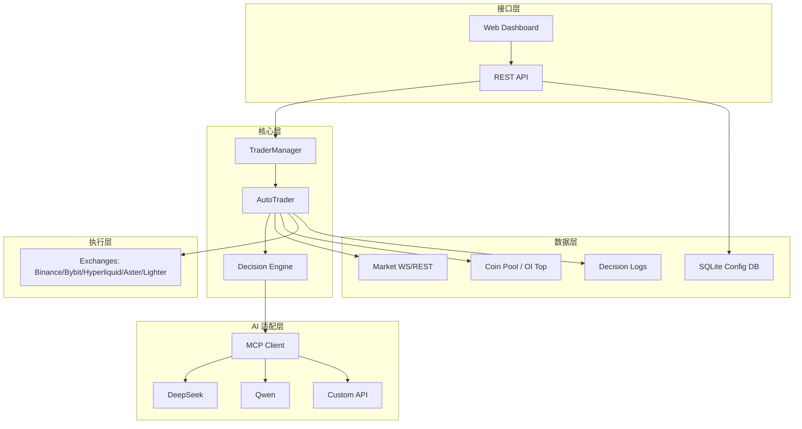
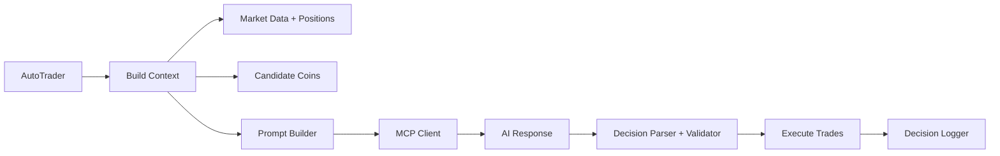

# NOFX 技术分析报告

> 分析对象：`/home/zq/work-space/repo/ai-projs/llm-agent/trading/trade/nofx`
>
> 生成时间：2025-12-29
>
> 角色视角：资深高级软件架构师

---

## 1. 项目概览

NOFX 是一套面向加密市场的 **Agentic Trading OS**，以 Go 作为后端主语言、React/TypeScript 作为前端展示层。核心能力覆盖：

- 多模型 AI 决策（DeepSeek / Qwen / 自定义 OpenAI 兼容接口）
- 多交易所交易执行（Binance / Bybit / Hyperliquid / Aster DEX / Lighter）
- 实时行情获取（Binance Futures WebSocket + REST 补偿）
- 交易决策日志与复盘（决策 JSON + CoT + 账户/持仓快照）
- 用户注册/登录/OTP 双因子认证 + JWT
- 配置数据持久化（SQLite + WAL）+ 加密存储

**工程形态**：后端是一个 monolith Go 服务（API + 调度 + 交易 + 数据 + AI 调度），前端是独立 Vite 应用，通过 Nginx 反向代理访问 API。部署方案提供 Docker Compose。

---

## 2. 仓库结构与技术栈

### 2.1 目录结构（核心模块）

- `main.go`：进程入口，配置加载 + DB 初始化 + API 启动 + 行情监控
- `api/`：Gin HTTP API 层
- `auth/`：JWT + OTP 认证
- `config/`：SQLite 配置数据库 + 配置结构
- `crypto/`：数据加密 + RSA/AES 混合加密 + 安全存储
- `decision/`：AI 决策引擎（Prompt 构建 + 响应解析 + 规则校验）
- `manager/`：交易员生命周期管理（加载/启动/停止）
- `market/`：行情数据与 WS 订阅
- `mcp/`：AI 客户端（DeepSeek/Qwen/Custom）
- `pool/`：币池与 OI Top 数据
- `trader/`：多交易所执行引擎（统一 Trader 接口）
- `logger/`：决策日志、统计分析、Telegram
- `web/`：前端仪表盘（Vite + React + TS）

### 2.2 技术栈概览

- 后端：Go 1.25（`go.mod`） + Gin + SQLite (modernc.org) + JWT + TOTP
- 行情/交易：Binance/Bybit SDK、Hyperliquid SDK、Aster/Lighter API
- AI：自研 MCP 客户端（OpenAI 兼容）
- 前端：React 18 + Vite + TypeScript + Tailwind + SWR + Zustand + Recharts
- 部署：Docker Compose + Nginx

> 注意：README 标注 Go 1.21+，但 `go.mod` 为 Go 1.25.0，存在版本描述不一致风险。

---

## 3. 系统总体架构

### 3.1 分层视角（实现视角）



### 3.2 运行时主流程（后端）

1. `main.go` 启动：加载 `config.json` → 初始化 SQLite → RSA + AES 加密服务 → 启动 API
2. `TraderManager.LoadTradersFromDatabase` 加载用户配置交易员
3. 启动行情监控 `market.NewWSMonitor(...).Start(...)`
4. AutoTrader 运行循环：构建上下文 → AI 决策 → 校验 → 执行交易 → 记录日志

---

## 4. 核心模块深度解析

### 4.1 API 层（`api/`）

- 框架：Gin
- 路由分组：`/api` + JWT 保护子路由
- 关键能力：
  - 用户注册/登录 + OTP 二步验证
  - 管理交易员 CRUD + 启停
  - 模型配置/交易所配置更新（支持加密数据）
  - 交易状态查询：账户、持仓、决策、统计、绩效

**安全注意点**：
- CORS 全开放：`Access-Control-Allow-Origin: *`
- `/crypto/decrypt` 为公开端点（存在解密 Oracle 风险，建议限定为认证用户）

### 4.2 认证与会话（`auth/`）

- JWT：HS256，默认有效期 24h
- OTP：TOTP 双因子
- 黑名单：内存黑名单，超过阈值自动清理（多实例不共享）

### 4.3 配置与数据库（`config/`）

- SQLite (`config.db`) + WAL + FULL 同步
- 系统配置表 + 用户配置表 + 交易员配置表
- 支持字段迁移（`ALTER TABLE` 兼容升级）
- 密钥与敏感数据存储支持 AES-GCM 加密（需 `DATA_ENCRYPTION_KEY`）

**注意**：若未配置 `DATA_ENCRYPTION_KEY`，会自动降级为明文存储。

### 4.4 加密体系（`crypto/`）

- RSA 2048：前端加密 → 后端解密
- AES-GCM：数据库存储字段加密
- 支持 AAD 与时间戳校验（防重放）

### 4.5 AI 决策引擎（`decision/`）

**职责**：
- 构建系统 Prompt + 用户 Prompt
- 拉取行情数据与候选币种
- 解析 AI 输出为结构化 JSON
- 决策校验（杠杆、金额、止损止盈）

**决策约束示例**：
- BTC/ETH 杠杆限制 + 最大仓位倍数限制
- 山寨币仓位 ≤1.5×净值
- 最小开仓金额约束（防止精度归零）

**提示词模板系统**：`prompts/*.txt` 支持模板热加载与动态切换。

### 4.6 行情系统（`market/`）

- REST + WS 结合
- 维护 3m/4h K 线历史缓存
- `CombinedStreamsClient` 订阅多个 symbol

### 4.7 交易执行层（`trader/`）

- 统一接口封装多交易所
- 自动配置杠杆、保证金模式
- 支持多交易所：Binance、Bybit、Hyperliquid、Aster、Lighter
- Lighter 支持 V1/V2 双实现，API Key 缺失时自动降级

### 4.8 Trader 管理器（`manager/`）

- 多用户多交易员加载
- 统一管理生命周期
- 交易员配置与模型/交易所配置关联

### 4.9 日志与统计（`logger/`）

- 决策日志 JSON 文件化
- 统计指标 + 绩效分析
- 支持 Telegram 通知

---

## 5. 数据流与控制流

### 5.1 AI 决策数据流



### 5.2 前端请求链路

```mermaid
graph LR
  UI[Web Dashboard] --> API[/api/*]
  API --> DB[(SQLite Config DB)]
  API --> LOGS[Decision Logs]
  API --> TRADER[TraderManager]
```

---

## 6. 部署与运维

- Docker Compose：`docker-compose.yml`
  - `nofx` 后端（8080）
  - `nofx-frontend` 前端（3000）
- Nginx 代理：`nginx/nginx.conf`
- 配置文件：`config.json` + `config.db`
- 密钥：`secrets/rsa_key` + `DATA_ENCRYPTION_KEY` + `JWT_SECRET`

---

## 7. 测试与质量

- Go 单测覆盖：
  - `decision/` prompt & validate
  - `mcp/` AI client
  - `trader/` 各交易所执行模块
- 前端测试：Vitest + React Testing Library

**不足**：
- 未见 CI 配置
- 版本兼容性在 README 与 `go.mod` 存在冲突

---

## 8. 架构风险与技术债

### 8.1 安全风险
- `/crypto/decrypt` 无鉴权 → 解密 Oracle
- CORS 全开放
- JWT 黑名单仅内存 → 多实例不一致
- `DATA_ENCRYPTION_KEY` 未设置时明文存储

### 8.2 稳定性与扩展性
- WebSocket 全量订阅可能导致高负载（默认批量）
- SQLite 在高并发场景可能成为瓶颈

### 8.3 一致性问题
- README 与 `go.mod` Go 版本不一致
- 配置来源（config.json vs DB）可能出现配置漂移

---

## 9. 优化建议（优先级）

### P0（必须）
1. `/crypto/decrypt` 增加鉴权 + 防滥用
2. 强制配置 `DATA_ENCRYPTION_KEY`，禁止明文降级
3. 补充 CORS 白名单

### P1（重要）
1. JWT 黑名单改为持久化存储（Redis）
2. 统一配置源（DB 或 config.json 单一权威）
3. 给 Market WS 增加熔断与限流机制

### P2（演进）
1. 引入指标系统（Prometheus/Grafana）
2. 模块化拆分：市场数据、决策服务、执行服务
3. 完善 CI/CD 与集成测试矩阵

---

## 10. 关键路径速查

- 入口启动：`main.go`
- API 路由：`api/server.go`
- 数据库：`config/database.go`
- AI 决策：`decision/engine.go`
- 行情监控：`market/monitor.go`
- 交易执行：`trader/auto_trader.go`
- AI 客户端：`mcp/client.go`
- 加密体系：`crypto/crypto.go`
- 前端：`web/src`

---

## 11. 总结

NOFX 是一套架构完整的 AI 自动交易系统，模块划分清晰，核心链路（决策 → 交易 → 监控 → 复盘）已闭环。系统在加密市场具备较高扩展性，但仍存在安全边界不足、配置一致性不足和高并发下稳定性风险。若面向生产化或高风险资金场景，需优先完善安全与持久化能力，并增强模块化拆分与监控体系。

---

> 报告基于当前代码审阅生成，如需“行级代码审计”或“执行链路性能剖析”，可继续指定范围。
