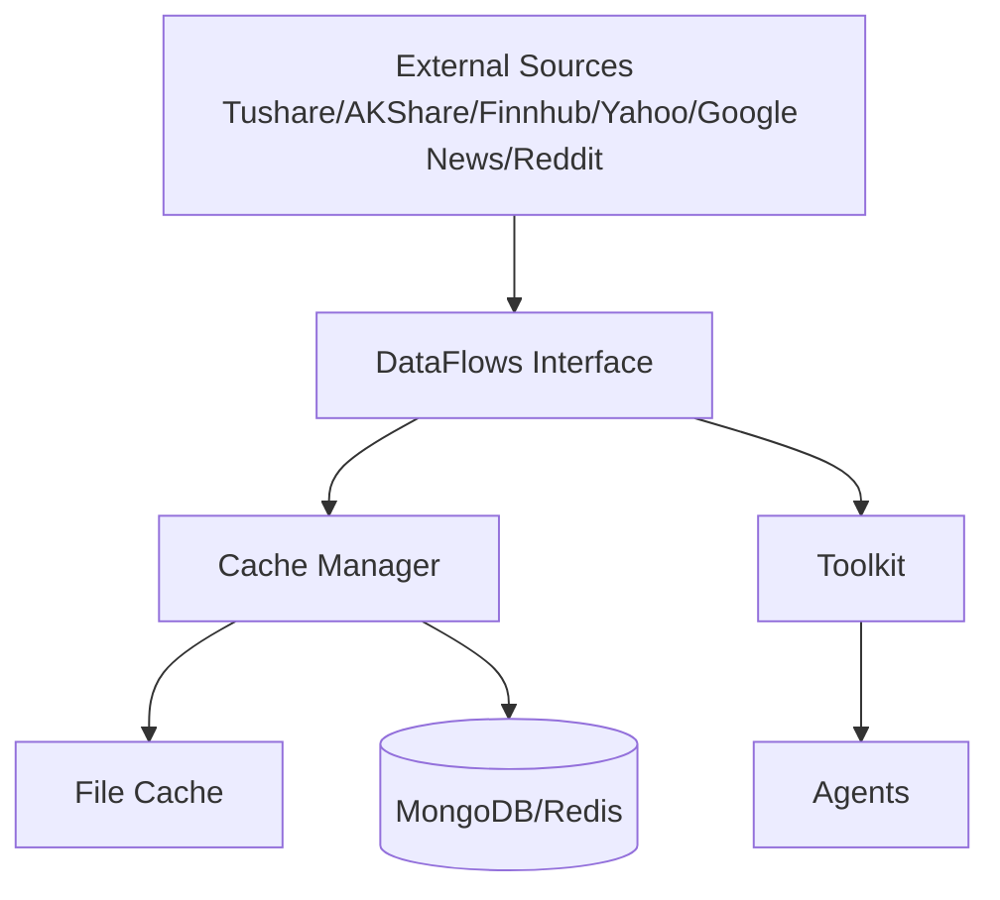
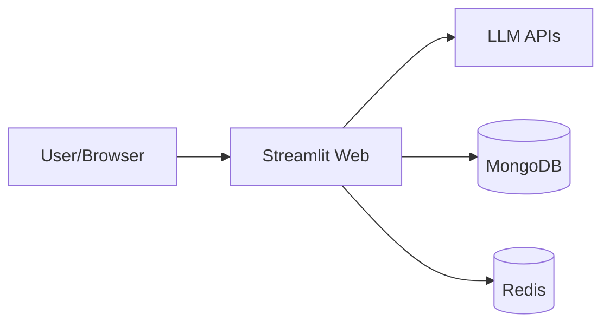

# TradingAgents-CN 技术分析报告

> 分析对象：`/home/zq/work-space/repo/ai-projs/llm-agent/trading/trade/TradingAgents-CN`
>
> 生成时间：2025-12-29
>
> 分析视角：资深软件架构师（系统架构、核心流程、可扩展性、可靠性与风险评估）

---

## 1. 项目概览

TradingAgents-CN 是一个面向金融投资研究的**多智能体协作分析框架**，以 LangGraph 组织多角色智能体的工作流，通过多数据源（A 股/港股/美股）与多 LLM 供应商（OpenAI、Google、DashScope、DeepSeek、Anthropic 等）组合生成**结构化投资建议**。

**核心价值**：
- 以“研究团队协作模型”模拟真实投资团队决策流程（分析 → 辩论 → 交易 → 风险评审）。
- 支持中外市场数据融合与多模型适配，适合中文用户场景。
- 提供 Web（Streamlit）与 CLI 双入口，具备权限管理、日志追踪、成本估算与报告导出能力。

**关键入口**：
- CLI：`cli/main.py`
- Web：`web/app.py`
- 程序化调用入口：`main.py` + `tradingagents/graph/trading_graph.py`

---

## 2. 系统总体架构（分层）

结合代码与文档（`docs/architecture/v0.1.13/*`），系统可概括为以下分层：

1. **用户接口层**：Streamlit Web、CLI、脚本入口、Docker 容器
2. **编排层（核心框架）**：LangGraph DAG 编排、状态管理、条件路由
3. **智能体协作层**：分析师 → 研究员 → 交易员 → 风险管理 → 管理层
4. **工具与数据层**：Toolkit 工具集、统一数据接口、缓存与降级逻辑
5. **LLM 适配层**：OpenAI 兼容适配器、多供应商统一接口
6. **存储与观测层**：日志系统、分析结果保存、数据库/缓存支持

代码对应：
- 编排层：`tradingagents/graph/*`
- 智能体实现：`tradingagents/agents/*`
- 工具与数据：`tradingagents/agents/utils/agent_utils.py` + `tradingagents/dataflows/*`
- LLM 适配：`tradingagents/llm_adapters/*`
- 日志系统：`tradingagents/utils/logging_manager.py`

---

## 2.1 架构图与数据流图（新增）

以下图示均基于当前代码结构与执行路径整理，强调“实现侧真实结构”，与文档中的概念图做区分。

### 2.1.1 系统分层与依赖关系（实现视角）

```mermaid
graph TB
    subgraph UI[用户接口层]
        CLI[CLI]
        WEB[Web(Streamlit)]
        SCRIPT[脚本/SDK]
        DOCKER[Docker]
    end

    subgraph ORCH[编排层]
        GRAPH[TradingAgentsGraph]
        SETUP[GraphSetup]
        STATE[AgentState]
    end

    subgraph AGENTS[智能体协作层]
        ANALYSTS[分析师团队]
        RESEARCH[研究员团队]
        TRADER[交易员]
        RISK[风险管理]
        MANAGER[研究经理]
    end

    subgraph TOOLS[工具与数据层]
        TOOLKIT[Toolkit]
        DATAFLOW[DataFlows Interface]
        CACHE[Cache/File/DB]
    end

    subgraph LLM[LLM 适配层]
        ADAPTERS[OpenAI Compatible Adapters]
        PROVIDERS[OpenAI/Google/DashScope/DeepSeek/Anthropic]
    end

    subgraph OBS[存储与观测层]
        LOGS[Logging]
        RESULTS[Results/Reports]
        DB[(MongoDB/Redis)]
    end

    UI --> GRAPH
    GRAPH --> SETUP
    GRAPH --> STATE
    SETUP --> AGENTS
    AGENTS --> TOOLKIT
    TOOLKIT --> DATAFLOW
    DATAFLOW --> CACHE
    CACHE --> DB
    TOOLKIT --> ADAPTERS
    ADAPTERS --> PROVIDERS
    GRAPH --> LOGS
    GRAPH --> RESULTS
```

### 2.1.2 交易分析执行流（实际串行链路）

```mermaid
graph LR
    START([Start]) --> MKT[Market Analyst]
    MKT --> SOC[Social Analyst]
    SOC --> NEWS[News Analyst]
    NEWS --> FUND[Fundamentals Analyst]
    FUND --> BULL[Bull Researcher]
    BULL --> BEAR[Bear Researcher]
    BEAR --> MGR[Research Manager]
    MGR --> TR[Trader]
    TR --> RISKY[Risky Analyst]
    RISKY --> SAFE[Safe Analyst]
    SAFE --> NEUTRAL[Neutral Analyst]
    NEUTRAL --> JUDGE[Risk Judge]
    JUDGE --> SIGNAL[Signal Processor]
    SIGNAL --> END([Decision])
```



> 说明：该流程与文档描述的“并行分析层”不同，代码实现是**串行链路**（`GraphSetup.setup_graph`）。

### 2.1.3 数据流与缓存路径



### 2.1.4 Docker 部署关系（生产建议形态）



---

## 3. 核心执行流程（从输入到决策）

**主流程入口**：`TradingAgentsGraph.propagate()`（`tradingagents/graph/trading_graph.py`）

**流程概览**：
1. 初始化状态（`Propagator.create_initial_state`）
2. 依次运行分析师（市场/社交/新闻/基本面）
3. 看涨/看跌研究员辩论
4. 研究经理综合形成投资计划
5. 交易员制定具体策略
6. 风险团队（激进/中性/保守）评估
7. 风险经理裁决形成最终决策
8. SignalProcessor 解析并结构化输出（买入/持有/卖出、目标价等）

**关键文件路径**：
- 编排主控：`tradingagents/graph/trading_graph.py`
- 图结构：`tradingagents/graph/setup.py`
- 状态定义：`tradingagents/agents/utils/agent_states.py`
- 信号解析：`tradingagents/graph/signal_processing.py`

---

## 4. 智能体层架构与职责

### 4.1 智能体层级结构
参考 `docs/architecture/v0.1.13/agent-architecture.md`：

- **分析层**：市场分析师、新闻分析师、基本面分析师、社交媒体分析师、中国市场分析师
- **研究层**：看涨研究员 / 看跌研究员
- **执行层**：交易员
- **风险层**：激进 / 中性 / 保守分析师 + 风险经理
- **管理层**：研究经理

实现目录：`tradingagents/agents/*`

### 4.2 智能体状态模型
`AgentState`（`tradingagents/agents/utils/agent_states.py`）统一承载：
- 各分析师报告
- 辩论上下文
- 交易与风险裁决

这种“统一状态 + LangGraph DAG”的方式使数据能在智能体间复用并可追踪。

---

## 5. LangGraph 编排与条件路由

`GraphSetup.setup_graph()` 构建 LangGraph DAG：
- 分析师节点 + ToolNode 组合
- 辩论过程循环（看涨/看跌）
- 风险评估循环（激进/中性/保守）

**注：文档描述为并行分析层（见 `docs/architecture/v0.1.13/graph-structure.md`），但代码实现为“顺序分析师链路”**，并未体现真正的并行执行（仍是串行边连接）。这会影响性能、吞吐与实时性。

---

## 6. 数据流与数据源管理

### 6.1 数据流入口
统一入口：`tradingagents/dataflows/interface.py`
- 聚合 yfinance、finnhub、Tushare、AKShare、BaoStock、Google News、Reddit 等
- 提供统一格式返回给 Toolkit/智能体

### 6.2 数据源管理与降级
- `tradingagents/dataflows/data_source_manager.py`：中国数据源策略（Tushare / AKShare / BaoStock / TDX）
- `tradingagents/dataflows/stock_data_service.py`：MongoDB → TDX API → fallback 多级降级

### 6.3 缓存策略
- 文件缓存：`tradingagents/dataflows/cache_manager.py`
  - 按市场划分缓存目录（美股 / A 股 / 新闻 / 基本面）
  - TTL 策略差异化
- 数据库缓存：`tradingagents/dataflows/db_cache_manager.py`（与 Redis/Mongo 结合）

**优势**：减少 API 调用、避免速率限制

---

## 7. LLM 适配层设计

### 7.1 适配器统一架构
`tradingagents/llm_adapters/openai_compatible_base.py` 定义 OpenAI 兼容基类：
- 所有非 OpenAI 模型统一包装为 OpenAI-compatible 接口
- 支持 token 统计与日志记录

### 7.2 已支持提供商
- OpenAI / Anthropic / Google / DashScope / DeepSeek / Qianfan / OpenRouter / Ollama / 自定义端点
对应逻辑集中在 `tradingagents/graph/trading_graph.py` 与 `tradingagents/llm_adapters/*`

### 7.3 成本与使用统计
`tradingagents/config/config_manager.py`：
- 模型配置
- 定价配置
- Usage 记录

**优点**：对成本敏感场景可控

---

## 8. 记忆机制与反思系统

- `tradingagents/agents/utils/memory.py` 使用 ChromaDB 建立向量记忆
- 根据 LLM 供应商自动选择 embedding，支持降级策略
- `tradingagents/graph/reflection.py` 使用 LLM 对决策进行复盘并写入记忆

**作用**：
- 提升长期一致性
- 构建“策略复盘 → 经验迁移”的能力

---

## 9. Web 与 CLI 入口分析

### 9.1 Web（Streamlit）
- 主入口：`web/app.py`
- 功能模块拆分：`web/components/*` + `web/modules/*` + `web/utils/*`
- 具备登录、权限控制、进度跟踪、结果展示、报告导出、用户活动分析

**认证实现**：
- `web/utils/auth_manager.py` 使用本地 `users.json` 文件
- session 与 localStorage 结合，10 分钟无操作自动失效

**风险**：
- 默认 admin/user 账号写死（`admin123`/`user123`）
- 仅适合内网或开发环境

### 9.2 CLI
- `cli/main.py` 基于 Typer + Rich
- 支持交互式参数选择、进度展示、日志输出

---

## 10. 配置管理与部署

### 10.1 配置系统
- `tradingagents/default_config.py`：全局默认配置
- `tradingagents/config/config_manager.py`：模型与成本配置
- `tradingagents/config/database_manager.py`：Mongo/Redis 自动检测与降级

### 10.2 Docker 部署
`docker-compose.yml`：
- Web 服务 + MongoDB + Redis + 管理界面
- 容器内日志与配置文件挂载

---

## 11. 观测与日志体系

- `tradingagents/utils/logging_manager.py`：统一日志配置与结构化输出
- `tradingagents/utils/tool_logging.py`：工具/数据源/LLM 调用日志埋点

特点：
- 支持 console / file / JSON structured
- Docker 下可切换 stdout only

---

## 12. 模块级审计清单（新增）

以下清单聚焦“可验证的实现风险”，按模块给出责任范围、问题与建议（含优先级）。如需逐文件行级审计，可继续指定范围。

| 子系统 | 关键文件 | 主要职责 | 审计发现（摘录） | 建议 | 优先级 |
| --- | --- | --- | --- | --- | --- |
| 编排核心 | `tradingagents/graph/trading_graph.py` `tradingagents/graph/setup.py` | LLM 初始化、图编排、执行调度 | Google 分支引用未定义 `client_options`，会触发运行时异常；分析师链路为串行，与文档不一致；多处 `get_logger` 重复导入 | 修复 `client_options`；明确并行/串行策略并对齐文档；统一日志初始化入口 | P0/P1 |
| 状态模型 | `tradingagents/agents/utils/agent_states.py` `tradingagents/graph/propagation.py` | 状态结构与初始化 | 初始状态未完整填充 TypedDict 字段（如 `bull_history`/`bear_history`/`judge_decision`），存在 KeyError 风险 | 初始化时补齐默认值；添加状态校验器 | P1 |
| 市场分析师 | `tradingagents/agents/analysts/market_analyst.py` | 技术面分析与数据获取 | ReAct 路径硬编码 `start_date='2025-05-28'`；离线模式仅返回占位文本 | 以 `analysis_date` 与 `research_depth` 计算起始日期；提供离线降级报告 | P1 |
| Toolkit/工具层 | `tradingagents/agents/utils/agent_utils.py` | 工具封装与工具调用 | Toolkit 使用类级可变配置（跨会话共享），可能导致多并发配置串扰 | 改为实例级配置；减少全局可变状态 | P1 |
| 数据接口 | `tradingagents/dataflows/interface.py` | 多数据源聚合 | logger 重复覆盖；部分数据为空时静默返回空字符串 | 明确错误码/异常；统一日志来源 | P2 |
| 数据源管理 | `tradingagents/dataflows/data_source_manager.py` | 中国数据源选择与降级 | “Tushare/TDX”命名与实际实现混用；可用性检测依赖安装库 | 统一命名；补充健康检查与指标输出 | P2 |
| 缓存层 | `tradingagents/dataflows/cache_manager.py` | 文件缓存与 TTL | 内容长度校验默认关闭；TTL 配置分散且难追踪 | 增加统一配置入口与缓存可视化 | P2 |
| LLM 适配 | `tradingagents/llm_adapters/openai_compatible_base.py` | 统一 OpenAI 兼容封装 | token 统计依赖 `usage_metadata`，不同供应商可能缺失 | 增加容错与兼容分支；统一计费策略 | P2 |
| 配置中心 | `tradingagents/config/config_manager.py` | 模型/价格/使用统计 | OpenAI Key 格式校验过于严格（长度=51）；配置文件存明文密钥 | 放宽校验或允许跳过；敏感信息改为环境变量或密钥管理 | P1 |
| Web 分析执行 | `web/utils/analysis_runner.py` | Web 调度与分析入口 | 无论使用何种 LLM，强制要求 `DASHSCOPE_API_KEY` 与 `FINNHUB_API_KEY`，阻断非 DashScope 流程 | 按 provider 动态校验；支持无 Finnhub 降级 | P0 |
| Web 认证 | `web/utils/auth_manager.py` | 用户认证 | 默认账号密码硬编码；localStorage 会话；SHA256 无盐 | 强制首次修改密码；加盐哈希；服务端会话与限流 | P0/P1 |
| CLI | `cli/main.py` | 命令行交互 | 日志输出被移除到文件，CLI 排错成本高 | 提供 `--verbose` 开关恢复终端日志 | P2 |
| 测试体系 | `tests/` | 测试与调试脚本 | 大量临时/调试脚本混入主测试目录，难以自动化 | 区分 `tests/` 与 `tools/`；构建 pytest + CI | P2 |

---

## 13. 测试与质量评估

`tests/` 目录数量庞大，包含：
- 数据源联调测试
- 模型适配/成本追踪测试
- 多市场场景测试
- 许多 debug、临时脚本

**不足**：
- 缺少统一测试框架（pytest 组织不清晰）
- 自动化 CI 信息缺失
- 大量脚本性质测试影响可维护性

---

## 14. 关键优势总结

- 多智能体协作流程完整，覆盖分析 → 研究 → 交易 → 风险 → 裁决
- 多市场数据源适配完善（A/H/US）
- LLM 供应商适配体系统一且可扩展
- 缓存、降级、日志体系健全
- Web 端具备权限控制与运维配置能力

---

## 15. 架构风险与技术债（基于代码审视）

### 15.1 文档与实现偏差
- 文档宣称“分析师并行”，但代码实际是**串行链路**（`GraphSetup.setup_graph`）

### 15.2 潜在 Bug
- `tradingagents/graph/trading_graph.py` 中 Google 分支引用 `client_options` 未定义
- 多处 `get_logger` 来源重复导入（`logging_init` vs `logging_manager`），可能导致日志配置错乱

### 15.3 安全风险
- 默认账号密码硬编码（`web/utils/auth_manager.py`）
- 认证依赖 localStorage，不适合公网环境
- API Key 与模型配置可能存储在 JSON 文件，无加密

### 15.4 可靠性与一致性
- 多处硬编码日期或默认逻辑，例如市场分析师中固定起始日期（`market_analyst.py`）
- 状态模型初始值不完整（`Propagator.create_initial_state` 未显式填充所有字段）

---

## 16. 优化建议（按优先级）

### P0：立即修复
1. 修复 Google LLM 分支中 `client_options` 未定义问题（`tradingagents/graph/trading_graph.py`）
2. Web 端按 provider 校验 API Key，避免强制要求 `DASHSCOPE_API_KEY` 与 `FINNHUB_API_KEY`（`web/utils/analysis_runner.py`）
3. 清理重复的 `get_logger` 导入，统一日志初始化路径
4. 强制修改默认账号密码 + 增加首次登录修改机制

### P1：中期优化
1. 将分析师环节升级为真正并行执行（LangGraph 支持并行节点）
2. 标准化测试体系（pytest + CI），把 debug 脚本移出 `tests/`
3. 统一配置中心：API Key/模型/成本等集中管理并加密存储

### P2：长期演进
1. 引入服务化架构：数据服务、LLM 服务、前端解耦
2. 引入异步任务系统（Celery/Redis Queue）支撑高并发分析
3. 构建策略回测与模型评估模块（连接 backtrader）

---

## 17. 关键目录索引（便于快速定位）

- `tradingagents/graph/`：LangGraph 编排逻辑
- `tradingagents/agents/`：智能体定义与 Prompt 逻辑
- `tradingagents/dataflows/`：数据源 + 缓存 + 降级机制
- `tradingagents/llm_adapters/`：多供应商 LLM 适配
- `tradingagents/config/`：配置、数据库、成本统计
- `web/`：Streamlit Web 应用
- `cli/`：交互式 CLI
- `docs/`：架构与使用文档

---

## 18. 结论

TradingAgents-CN 在**多智能体协作 + 多市场数据 + 多模型适配**领域具有完整而可扩展的架构基础。整体设计思路清晰，工程化程度较高。但仍存在**并行执行与实现不一致、默认安全策略过弱、测试体系松散**等问题。

若继续迭代并面向更高并发或生产化场景，建议优先修复关键漏洞与安全隐患，并逐步将分析流程、数据服务、模型调用体系解耦，向更稳定的服务化架构演进。

---

> 报告已补充“模块级审计清单 + 架构图/数据流图”。如需行级审计、性能基准测试方案或可视化出图版，请继续指定范围。  
