# NOFX - AI 驱动加密货币交易系统技术分析报告

> 项目路径: `/home/zcxggmu/workspace/hello-projs/posp/trading/nofx`
> 分析时间: 2025-12-31
> 分析者: 资深高级软件架构师

---

## 目录

- [1. 项目概述](#1-项目概述)
- [2. 技术栈与依赖](#2-技术栈与依赖)
- [3. 项目架构设计](#3-项目架构设计)
- [4. 核心模块分析](#4-核心模块分析)
  - [4.1 自动交易核心](#41-自动交易核心-traderauto_tradergo)
  - [4.2 决策引擎](#42-决策引擎-decisionenginego)
  - [4.3 AI 客户端](#43-ai-客户端-mcpclientgo)
  - [4.4 回测模块](#44-回测模块-backtestrunnergo)
  - [4.5 加密服务](#45-加密服务-cryptocryptogo)
  - [4.6 认证模块](#46-认证模块-authauthgo)
  - [4.7 数据提供者](#47-数据提供者-providerdata_providergo)
  - [4.8 CoinAnk 客户端](#48-coinank-客户端-providercoinank)
  - [4.9 市场数据 API](#49-市场数据-api-marketapi_clientgo)
- [5. 设计模式识别](#5-设计模式识别)
  - [5.1 策略模式](#51-策略模式-strategy-pattern)
  - [5.2 工厂模式](#52-工厂模式-factory-pattern)
  - [5.3 管理者模式](#53-管理者模式-manager-pattern)
  - [5.4 适配器模式](#54-适配器模式-adapter-pattern)
  - [5.5 构建器模式](#55-构建器模式-builder-pattern)
  - [5.6 单例模式](#56-单例模式-singleton-pattern)
  - [5.7 仓储模式](#57-仓储模式-repository-pattern)
  - [5.8 模板方法模式](#58-模板方法模式-template-method-pattern)
  - [5.9 观察者模式](#59-观察者模式-observer-pattern)
  - [5.10 选项模式](#510-选项模式-options-pattern)
  - [5.11 装饰器模式](#511-装饰器模式-decorator-pattern)
  - [5.12 命令模式](#512-命令模式-command-pattern)
- [6. 数据流与业务流程](#6-数据流与业务流程)
- [7. 安全与风险控制](#7-安全与风险控制)
- [8. 性能与可扩展性](#8-性能与可扩展性)
- [9. 架构优势与改进建议](#9-架构优势与改进建议)
- [10. 总结](#10-总结)

---

## 1. 项目概述

### 1.1 项目简介

**NOFX** 是一个开源的 AI 驱动加密货币自动交易系统（Agentic Trading OS），支持多 AI 模型、多交易所、多策略配置，能够自动执行交易决策。

### 1.2 核心特性

| 特性 | 描述 |
|--------|------|
| **多 AI 支持** | DeepSeek、Qwen、OpenAI (GPT)、Claude、Gemini、Grok、Kimi |
| **多交易所支持** | Binance、Bybit、OKX、Bitget、Hyperliquid、Aster DEX、Lighter DEX |
| **策略工作室** | 可视化策略构建器，支持币种来源、技术指标、风险控制配置 |
| **AI 辩论竞技场** | 多 AI 模型扮演不同角色进行辩论，投票达成共识 |
| **AI 竞争模式** | 多个 AI 交易者实时竞争，对比性能表现 |
| **回测实验室** | 历史数据回测，支持检查点恢复、性能指标分析 |
| **实时仪表盘** | 实时持仓、P/L 跟踪、AI 决策日志 |

### 1.3 项目结构

```
nofx/
├── main.go                 # 应用入口
├── api/                   # HTTP API 服务层
├── auth/                  # 认证与授权
├── backtest/              # 回测模块
├── config/                # 全局配置
├── crypto/                # 加密服务
├── debate/                # AI 辩论模块
├── decision/              # 决策引擎
├── logger/                # 日志系统
├── manager/               # 交易者管理器
├── market/                # 市场数据获取
├── mcp/                   # AI 客户端 (MCP 协议)
├── provider/              # 外部数据提供者
├── security/              # 安全模块
├── store/                 # 数据持久化层
├── trader/                # 交易所适配器
└── web/                   # 前端 (React)
```

---

## 2. 技术栈与依赖

### 2.1 配置管理 ([`config/config.go`](posp/trading/nofx/config/config.go))

全局配置模块负责系统配置管理：

#### 配置结构

```go
type Config struct {
    // 服务配置
    APIServerPort       int
    JWTSecret           string
    RegistrationEnabled bool
    MaxUsers            int // 最大用户数（0 = 无限制，默认 = 10）

    // 安全配置
    // TransportEncryption 启用浏览器端 API 密钥加密
    // 需要 HTTPS 或 localhost。HTTP 访问通过 IP 时设置为 false
    TransportEncryption bool

    // 体验改进（匿名使用统计）
    // 帮助我们了解产品使用情况并改进体验
    // 设置 EXPERIENCE_IMPROVEMENT=false 禁用
    ExperienceImprovement bool
}
```

#### 配置加载流程

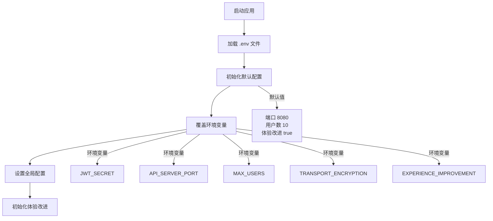

#### 环境变量

| 环境变量 | 默认值 | 描述 |
|---------|--------|------|
| `JWT_SECRET` | `default-jwt-secret-change-in-production` | JWT 签名密钥 |
| `REGISTRATION_ENABLED` | `true` | 是否允许用户注册 |
| `MAX_USERS` | `10` | 最大用户数（0 = 无限制） |
| `API_SERVER_PORT` | `8080` | API 服务器端口 |
| `TRANSPORT_ENCRYPTION` | `false` | 是否启用传输加密 |
| `EXPERIENCE_IMPROVEMENT` | `true` | 是否启用匿名使用统计 |

### 2.2 后端技术栈

| 组件 | 技术/库 | 版本 | 用途 |
|--------|----------|------|------|
| **语言** | Go | 1.25.0 | 后端开发 |
| **Web 框架** | Gin | v1.11.0 | HTTP API 服务器 |
| **数据库** | SQLite | modernc.org/sqlite v1.40.0 | 数据持久化 |
| **日志** | Zerolog | v1.34.0 | 结构化日志 |
| **加密** | golang.org/x/crypto | v0.42.0 | 加密服务 |
| **JWT** | golang-jwt/jwt | v5.2.0 | 身份验证 |
| **UUID** | google/uuid | v1.6.0 | 唯一生成 |
| **WebSocket** | gorilla/websocket | v1.5.3 | 实时通信 |
| **环境变量** | joho/godotenv | v1.5.1 | 配置管理 |

### 2.2 交易所 SDK

| 交易所 | SDK | 用途 |
|--------|-----|------|
| **Binance** | github.com/adshao/go-binance/v2 v2.8.9 | Binance 期货交易 |
| **Hyperliquid** | github.com/sonirico/go-hyperliquid v0.17.0 | Hyperliquid DEX 交易 |
| **Bybit** | github.com/bybit-exchange/bybit.go.api | Bybit 期货交易 |
| **Lighter** | github.com/elliottech/lighter-go v0.0.0 | Lighter DEX 交易 |
| **Ethereum** | github.com/ethereum/go-ethereum v1.16.5 | 以太坊交互 |

### 2.3 AI 模型 SDK

项目实现了统一的 AI 客户端接口，支持多种 AI 提供商：

| AI 提供商 | 客户端类 | API 类型 |
|------------|----------|---------|
| **DeepSeek** | DeepSeekClient | DeepSeek API |
| **Qwen** | QwenClient | 阿里云 DashScope API |
| **OpenAI** | OpenAIClient | OpenAI Chat Completions API |
| **Claude** | ClaudeClient | Anthropic Claude API |
| **Gemini** | GeminiClient | Google Gemini API |
| **Grok** | GrokClient | xAI Grok API |
| **Kimi** | KimiClient | Moonshot Kimi API |
| **Custom** | Client | 自定义 OpenAI 兼容 API |

---

## 3. 项目架构设计

### 3.1 整体架构图

```mermaid
graph TB
    subgraph Frontend[Frontend Layer]
        Web[React Frontend]
    end
    
    subgraph APILayer[API Layer]
        Server[Gin HTTP Server]
        Auth[Auth Middleware]
        CryptoHandler[Crypto Handler]
        DebateHandler[Debate Handler]
    end
    
    subgraph BusinessLayer[Business Logic Layer]
        TraderManager[Trader Manager]
        BacktestManager[Backtest Manager]
        StrategyEngine[Strategy Engine]
        DebateManager[Debate Manager]
    end
    
    subgraph DataAccessLayer[Data Access Layer]
        Store[Data Store]
        UserStore[User Store]
        TraderStore[Trader Store]
        StrategyStore[Strategy Store]
        BacktestStore[Backtest Store]
        OrderStore[Order Store]
        PositionStore[Position Store]
        EquityStore[Equity Store]
    end
    
    subgraph ExchangeAdapterLayer[Exchange Adapter Layer]
        BinanceTrader[Binance Adapter]
        BybitTrader[Bybit Adapter]
        OKXTrader[OKX Adapter]
        BitgetTrader[Bitget Adapter]
        HyperliquidTrader[Hyperliquid Adapter]
        AsterTrader[Aster Adapter]
        LighterTrader[Lighter Adapter]
    end
    
    subgraph AIClientLayer[AI Client Layer]
        MCPClient[MCP AI Client]
        DeepSeekClient[DeepSeek Client]
        QwenClient[Qwen Client]
        OpenAIClient[OpenAI Client]
        ClaudeClient[Claude Client]
        GeminiClient[Gemini Client]
        GrokClient[Grok Client]
        KimiClient[Kimi Client]
    end
    
    subgraph ExternalServiceLayer[External Service Layer]
        MarketAPI[Market Data API]
        CoinAnk[CoinAnk Data Source]
        QuantAPI[Quant Data API]
        OIRankingAPI[OI Ranking API]
    end
    
    subgraph DataStorageLayer[Data Storage Layer]
        SQLite[(SQLite Database)]
    end
    
    Web --> Server
    Server --> TraderManager
    Server --> BacktestManager
    Server --> DebateHandler
    Server --> Auth
    Server --> CryptoHandler
    
    TraderManager --> StrategyEngine
    TraderManager --> Store
    
    StrategyEngine --> MCPClient
    StrategyEngine --> MarketAPI
    
    BacktestManager --> Store
    DebateManager --> Store
    
    TraderManager --> BinanceTrader
    TraderManager --> BybitTrader
    TraderManager --> OKXTrader
    TraderManager --> BitgetTrader
    TraderManager --> HyperliquidTrader
    TraderManager --> AsterTrader
    TraderManager --> LighterTrader
    
    MarketAPI --> CoinAnk
    MarketAPI --> QuantAPI
    MarketAPI --> OIRankingAPI
    
    Store --> SQLite
```

### 3.2 分层架构说明

#### 3.2.1 API 层 ([`api/`](posp/trading/nofx/api/server.go))

负责处理 HTTP 请求，提供 RESTful API 接口：

- **认证中间件**: JWT 令牌验证、黑名单检查
- **路由分组**: 
  - 公开路由：健康检查、系统配置、交易所列表、AI 模型列表
  - 保护路由：需要认证的交易者管理、策略管理、回测等接口
- **加密处理**: 支持传输加密（基于 Web Crypto API）

#### 3.2.2 业务逻辑层

- **[`TraderManager`](posp/trading/nofx/manager/trader_manager.go)**: 管理多个交易者实例，提供启动、停止、竞争数据获取等功能
- **[`BacktestManager`](posp/trading/nofx/backtest/manager.go)**: 管理回测任务，支持暂停、恢复、检查点
- **[`StrategyEngine`](posp/trading/nofx/decision/engine.go)**: 策略执行引擎，负责构建 AI 提示、解析 AI 响应

#### 3.2.3 数据访问层 ([`store/`](posp/trading/nofx/store/store.go))

统一的数据存储接口，支持加密/解密：

- **UserStore**: 用户管理
- **AIModelStore**: AI 模型配置
- **ExchangeStore**: 交易所账户配置
- **TraderStore**: 交易者配置
- **StrategyStore**: 策略配置
- **BacktestStore**: 回测数据
- **OrderStore**: 订单记录
- **PositionStore**: 持仓记录
- **EquityStore**: 权益快照

#### 3.2.4 交易所适配层 ([`trader/`](posp/trading/nofx/trader/auto_trader.go))

统一的 [`Trader`](posp/trading/nofx/trader/auto_trader.go) 接口，支持多个交易所：

| 方法 | 说明 |
|------|------|
| `GetBalance()` | 获取账户余额 |
| `GetPositions()` | 获取持仓列表 |
| `OpenLong()` | 开多仓 |
| `OpenShort()` | 开空仓 |
| `CloseLong()` | 平多仓 |
| `CloseShort()` | 平空仓 |
| `SetStopLoss()` | 设置止损 |
| `SetTakeProfit()` | 设置止盈 |
| `GetOrderStatus()` | 获取订单状态 |

---

## 4. 核心模块分析

### 4.1 自动交易核心 ([`trader/auto_trader.go`](posp/trading/nofx/trader/auto_trader.go))

[`AutoTrader`](posp/trading/nofx/trader/auto_trader.go) 是系统的核心交易执行器：

#### 核心流程

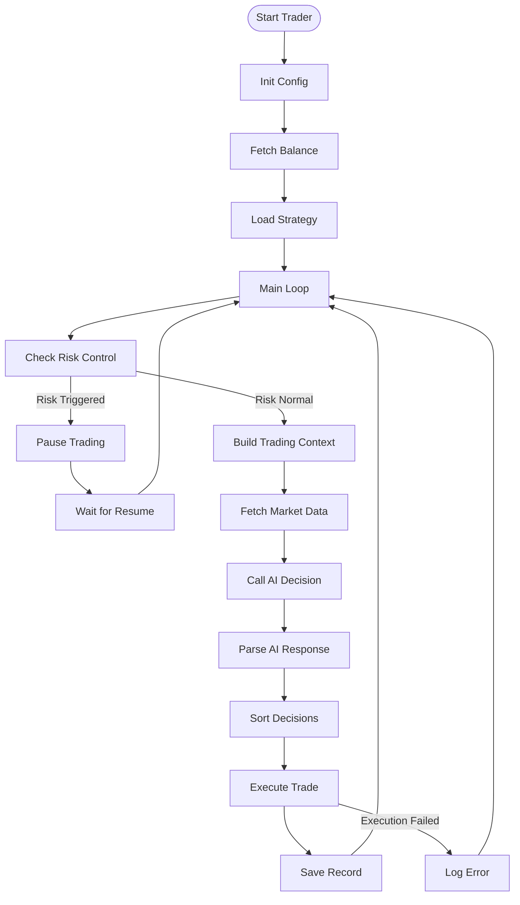

#### 关键特性

1. **风险控制强制执行**:
   - 最大持仓数量限制
   - 仓位价值比例限制（BTC/ETH vs Altcoin）
   - 最小仓位大小检查
   - 杠杆倍数限制

2. **回撤监控**:
   - 每分钟检查持仓回撤
   - 利润 > 5% 且回撤 ≥ 40% 时自动平仓

3. **决策执行顺序**:
   - 先平仓，后开仓（避免仓位堆叠溢出）

### 4.2 决策引擎 ([`decision/engine.go`](posp/trading/nofx/decision/engine.go))

[`StrategyEngine`](posp/trading/nofx/decision/engine.go) 负责 AI 决策的完整流程：

#### 决策流程

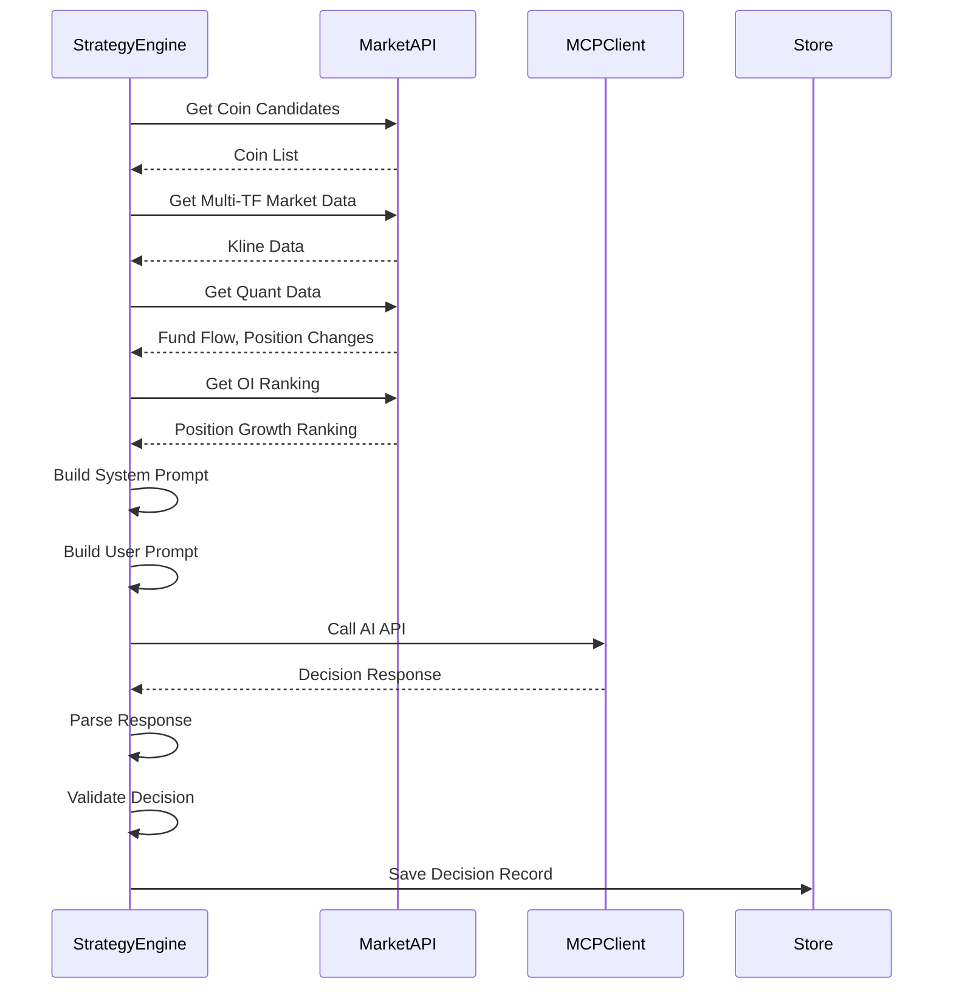

#### 提示词构建策略

1. **系统提示词** 包含：
   - 角色定义（可编辑）
   - 硬约束（风险控制）
   - AI 指导原则
   - 仓位规模指导
   - 交易频率意识
   - 入场标准（可编辑）
   - 决策流程（可编辑）
   - 输出格式要求

2. **用户提示词** 包含：
   - 系统状态（时间、周期、运行时间）
   - 账户信息（权益、余额、P/L、保证金使用率）
   - 当前持仓（详细数据）
   - 候选币种（市场数据）
   - 最近完成订单
   - OI 排名数据
   - 量化数据（资金流向、价格变化）

### 4.3 AI 客户端 ([`mcp/client.go`](posp/trading/nofx/mcp/client.go))

实现了统一的 AI 客户端接口，支持：

#### 核心特性

1. **Builder 模式 API**:
   ```go
   request := NewRequestBuilder().
       WithSystemPrompt("You are helpful").
       WithUserPrompt("Hello").
       WithTemperature(0.8).
       Build()
   result, err := client.CallWithRequest(request)
   ```

2. **重试机制**:
   - 可配置最大重试次数
   - 指数退避等待时间
   - 可配置可重试错误类型

3. **动态分发**:
   - 使用 hooks 实现多态
   - 子类可覆盖关键方法

4. **高级参数支持**:
   - Temperature、Top P
   - Frequency/Presence Penalty
   - Stop 序列
   - Tools/Function Calling
   - Streaming 响应（未来支持）

### 4.4 回测模块 ([`backtest/runner.go`](posp/trading/nofx/backtest/runner.go))

[`Runner`](posp/trading/nofx/backtest/runner.go:32-65) 是回测执行的核心组件，约 1466 行代码：

#### 回测架构

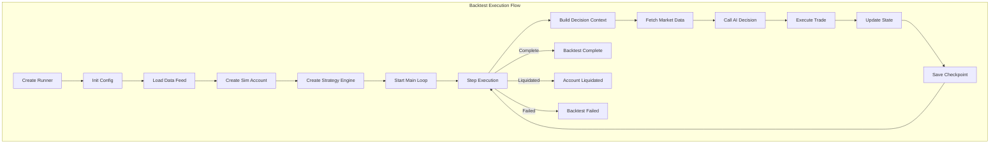

#### 核心方法

| 方法 | 功能 |
|------|------|
| `NewRunner()` | 创建回测运行器，初始化数据源、账户、策略引擎 |
| `Start()` | 启动回测循环 |
| `stepOnce()` | 单步执行一个时间周期 |
| `executeDecision()` | 执行 AI 决策（开仓/平仓） |
| `checkLiquidation()` | 检查爆仓条件 |
| `maybeCheckpoint()` | 条件性保存检查点 |
| `RestoreFromCheckpoint()` | 从检查点恢复 |
| `StatusPayload()` | 构建状态响应 |

#### 回测特性

| 特性 | 描述 |
|--------|------|
| **检查点恢复** | 支持暂停后从检查点恢复，支持 AI 缓存共享 |
| **权益曲线** | 实时记录权益快照，包含 P/L、回撤等指标 |
| **性能指标** | 收益率、最大回撤、夏普比率、胜率 |
| **决策追踪** | 保存 AI 决策链（CoT）、输入输出 |
| **爆仓检测** | 自动检测并执行强平 |
| **AI 缓存** | 支持 AI 决策缓存，加速重复回测 |
| **锁机制** | 进程锁防止并发执行 |

#### 填单策略

回测支持多种填单策略：

| 策略 | 描述 |
|------|------|
| `FillPolicyNextOpen` | 下一根 K 线开盘价 |
| `FillPolicyBarVWAP` | 当前 K 线 VWAP |
| `FillPolicyMidPrice` | 当前 K 线中点价格 |

#### 决策执行优先级

回测执行决策时按优先级排序：
1. **平仓操作** (close_long, close_short) - 优先级 1
2. **开仓操作** (open_long, open_short) - 优先级 2
3. **观望操作** (hold, wait) - 优先级 3

这样可以避免仓位堆叠溢出。

### 4.5 加密服务 ([`crypto/crypto.go`](posp/trading/nofx/crypto/crypto.go))

[`CryptoService`](posp/trading/nofx/crypto/crypto.go:48-52) 提供完整的数据加密解决方案：

#### 加密架构

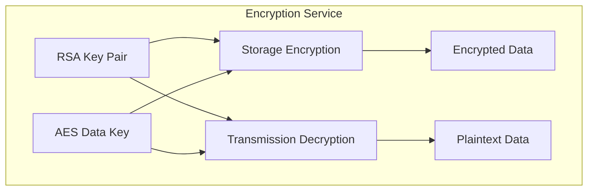

#### 核心功能

| 方法 | 功能 |
|------|------|
| `NewCryptoService()` | 创建加密服务，加载 RSA 和 AES 密钥 |
| `EncryptForStorage()` | 使用 AES-GCM 加密存储数据 |
| `DecryptFromStorage()` | 解密存储数据 |
| `DecryptPayload()` | 解密传输载荷（RSA-OAEP + AES-GCM） |
| `GetPublicKeyPEM()` | 获取 RSA 公钥 PEM 格式 |
| `GenerateKeyPair()` | 生成 RSA 密钥对 |
| `GenerateDataKey()` | 生成 AES 数据密钥 |

#### 加密流程

1. **存储加密** (AES-GCM):
   - 使用 AES-256-GCM 算法
   - 生成随机 Nonce
   - 支持附加认证数据 (AAD)
   - 格式: `ENC:v1:<nonce>:<ciphertext>`

2. **传输解密** (混合加密):
   - 使用 RSA-OAEP 解密 AES 密钥
   - 使用 AES-GCM 解密实际数据
   - 时间戳验证（防止重放攻击）
   - AAD 数据验证

#### 密钥来源

| 密钥类型 | 环境变量 | 格式 |
|---------|-----------|------|
| **RSA 私钥** | `RSA_PRIVATE_KEY` | PEM 格式（支持 `\n` 换行） |
| **AES 数据密钥** | `DATA_ENCRYPTION_KEY` | Base64 / Hex / 原始字符串 |

### 4.6 认证模块 ([`auth/auth.go`](posp/trading/nofx/auth/auth.go))

认证模块提供完整的用户认证和授权功能：

#### 认证流程

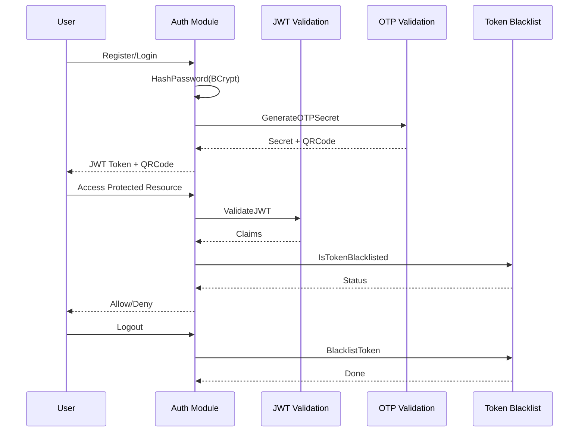

#### 核心功能

| 方法 | 功能 |
|------|------|
| `HashPassword()` | 使用 BCrypt 哈希密码 |
| `CheckPassword()` | 验证密码 |
| `GenerateOTPSecret()` | 生成 TOTP 密钥 |
| `VerifyOTP()` | 验证 OTP 代码 |
| `GenerateJWT()` | 生成 JWT 令牌（24小时有效期） |
| `ValidateJWT()` | 验证 JWT 令牌 |
| `BlacklistToken()` | 将令牌加入黑名单 |
| `IsTokenBlacklisted()` | 检查令牌是否被黑名单 |

#### 令牌黑名单机制

- **内存存储**: 使用 `map[string]time.Time` 存储
- **自动清理**: 检查时自动清理过期令牌
- **容量限制**: 最大 100,000 条记录
- **过期清理**: 超过阈值时触发清理

### 4.7 数据提供者 ([`provider/data_provider.go`](posp/trading/nofx/provider/data_provider.go))

数据提供者模块负责从外部 API 获取市场数据：

#### 数据源架构

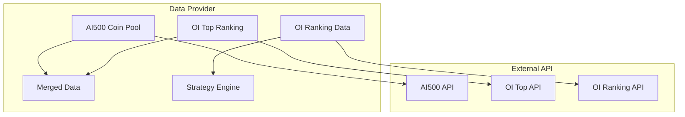

#### 核心数据类型

| 数据类型 | 结构 | 用途 |
|---------|------|------|
| **CoinData** | 币种评分数据 | AI500 币池 |
| **OIPosition** | 持仓量变化数据 | OI 排名 |
| **OIRankingData** | OI 排名（Top + Low） | 辩论分析 |

#### 核心方法

| 方法 | 功能 |
|------|------|
| `GetAI500Data()` | 获取 AI500 币种列表（带重试） |
| `GetTopRatedCoins()` | 获取评分最高的 N 个币种 |
| `GetOITopPositions()` | 获取 OI Top 20 数据 |
| `GetOIRankingData()` | 获取 OI 排名数据（Top + Low） |
| `GetMergedData()` | 获取合并数据（AI500 + OI Top） |
| `FormatOIRankingForAI()` | 格式化 OI 数据供 AI 消费 |

#### 重试机制

所有 API 请求都实现了重试机制：
- 最大重试次数: 3 次
- 重试间隔: 2 秒
- 指数退避等待

#### SSRF 防护

所有外部请求都通过 `security.SafeGet()` 进行 URL 验证，防止 SSRF 攻击。

### 4.8 CoinAnk 客户端 ([`provider/coinank/`](posp/trading/nofx/provider/coinank/))

CoinAnk 是专业的加密货币市场数据提供商：

#### CoinAnkClient 结构

```go
type CoinankClient struct {
    Url    string  // API 基础 URL
    Apikey string  // API 密钥
}
```

#### 核心功能

| 功能 | 方法 | 描述 |
|------|------|------|
| **K 线数据** | `Kline()` | 获取交易对 K 线数据 |
| **持仓量** | `OpenInterestAll()` | 获取所有交易所持仓量 |
| **持仓图表** | `OpenInterestChartV2()` | 获取持仓量历史图表 |
| **持仓 K 线** | `OpenInterestKline()` | 获取持仓量 K 线 |
| **持仓排名** | `TickersTopOIByEx()` | 获取按交易所排名的持仓量 |
| **OI/MC 比率** | `InstrumentsOiVsMc()` | 获取持仓量/市值比率 |

#### API 响应格式

```go
type CoinankResponse[T any] struct {
    Success bool   `json:"success"`
    Code    string `json:"code"`
    Data    T      `json:"data"`
}
```

### 4.9 市场数据 API ([`market/api_client.go`](posp/trading/nofx/market/api_client.go))

市场数据 API 客户端负责从 Binance 获取实时市场数据：

#### 核心方法

| 方法 | 功能 |
|------|------|
| `GetExchangeInfo()` | 获取交易所信息（交易对、规则等） |
| `GetKlines()` | 获取 K 线数据 |
| `GetCurrentPrice()` | 获取当前价格 |

#### K 线数据结构

```go
type Kline struct {
    OpenTime         int64   // 开盘时间
    Open             float64 // 开盘价
    High             float64 // 最高价
    Low              float64 // 最低价
    Close            float64 // 收盘价
    Volume           float64 // 成交量
    CloseTime        int64   // 收盘时间
    QuoteVolume      float64 // 成交额
    Trades           int     // 成交笔数
    TakerBuyBaseVolume    float64 // 主动买入成交量
    TakerBuyQuoteVolume   float64 // 主动买入成交额
}
```

---

## 5. 设计模式识别

### 5.1 策略模式 (Strategy Pattern)

**应用场景**: AI 客户端配置

```go
// mcp/client.go
type Client struct {
    Provider   string
    APIKey     string
    BaseURL    string
    Model      string
    // ...
}

func NewClient(opts ...ClientOption) AIClient {
    cfg := DefaultConfig()
    for _, opt := range opts {
        opt(cfg)
    }
    return &Client{...}
}
```

### 5.2 工厂模式 (Factory Pattern)

**应用场景**: 交易所适配器创建

```go
// trader/auto_trader.go
switch config.Exchange {
case "binance":
    trader = NewFuturesTrader(config.BinanceAPIKey, config.BinanceSecretKey, userID)
case "bybit":
    trader = NewBybitTrader(config.BybitAPIKey, config.BybitSecretKey)
case "hyperliquid":
    trader, err = NewHyperliquidTrader(...)
case "aster":
    trader, err = NewAsterTrader(...)
case "lighter":
    trader, err = NewLighterTraderV2(...)
// ...
}
```

### 5.3 管理者模式 (Manager Pattern)

**应用场景**: 交易者管理、回测管理

```go
// manager/trader_manager.go
type TraderManager struct {
    traders          map[string]*trader.AutoTrader
    loadErrors       map[string]error
    competitionCache *CompetitionCache
    mu               sync.RWMutex
}

func (tm *TraderManager) GetTrader(id string) (*trader.AutoTrader, error)
func (tm *TraderManager) StartAll()
func (tm *TraderManager) StopAll()
func (tm *TraderManager) GetCompetitionData() (map[string]interface{}, error)
```

### 5.4 适配器模式 (Adapter Pattern)

**应用场景**: 交易者与辩论模块的桥接

```go
// manager/trader_manager.go
type TraderExecutorAdapter struct {
    autoTrader *trader.AutoTrader
}

func (a *TraderExecutorAdapter) ExecuteDecision(d *decision.Decision) error {
    return a.autoTrader.ExecuteDecision(d)
}
```

### 5.5 构建器模式 (Builder Pattern)

**应用场景**: AI 请求构建

```go
// mcp/client.go
func NewRequestBuilder() *RequestBuilder {
    return &RequestBuilder{
        messages:  []Message{},
    }
}

func (b *RequestBuilder) WithSystemPrompt(prompt string) *RequestBuilder {
    b.messages = append([]Message{{Role: "system", Content: prompt}}, b.messages...)
    return b
}

func (b *RequestBuilder) WithUserPrompt(prompt string) *RequestBuilder {
    b.messages = append(b.messages, {Role: "user", Content: prompt})
    return b
}

func (b *RequestBuilder) Build() *Request {
    // 构建最终请求对象
}
```

### 5.6 单例模式 (Singleton Pattern)

**应用场景**: 全局配置

```go
// config/config.go
var global *Config

func Init() {
    cfg := &Config{...}
    global = cfg
}

func Get() *Config {
    if global == nil {
        Init()
    }
    return global
}
```

### 5.7 仓储模式 (Repository Pattern)

**应用场景**: 数据访问层

```go
// store/store.go
type Store struct {
    db *sql.DB
    
    // 子存储（懒加载）
    user     *UserStore
    aiModel  *AIModelStore
    exchange *ExchangeStore
    trader   *TraderStore
    // ...
}

func (s *Store) User() *UserStore {
    s.mu.Lock()
    defer s.mu.Unlock()
    if s.user == nil {
        s.user = &UserStore{db: s.db}
    }
    return s.user
}
```

### 5.8 模板方法模式 (Template Method Pattern)

**应用场景**: AI 客户端多态分发

```go
// mcp/client.go
type clientHooks interface {
    buildMCPRequestBody(systemPrompt, userPrompt string) map[string]any
    marshalRequestBody(requestBody map[string]any) ([]byte, error)
    buildUrl() string
    buildRequest(url string, jsonData []byte) (*http.Request, error)
    parseMCPResponse(body []byte) (string, error)
    setAuthHeader(reqHeader http.Header)
    isRetryableError(err error) bool
}

type Client struct {
    hooks clientHooks  // 子类覆盖 hooks 实现多态
}
```

### 5.9 观察者模式 (Observer Pattern)

**应用场景**: 竞争数据缓存

```go
// manager/trader_manager.go
type CompetitionCache struct {
    data      map[string]interface{}
    timestamp time.Time
    mu        sync.RWMutex
}

func (cc *CompetitionCache) Get() map[string]interface{} {
    cc.mu.RLock()
    defer cc.mu.RUnlock()
    
    if time.Since(cc.timestamp) > 30*time.Second {
        return nil // 缓存过期
    }
    return cc.data
}
```

### 5.10 选项模式 (Options Pattern)

**应用场景**: 配置初始化

```go
// config/config.go
func Init() {
    cfg := &Config{
        APIServerPort:         8080,
        RegistrationEnabled:   true,
        MaxUsers:              10,
        ExperienceImprovement: true,
    }
    // 从环境变量加载配置
    if v := os.Getenv("JWT_SECRET"); v != "" {
        cfg.JWTSecret = strings.TrimSpace(v)
    }
    // ...
}
```

### 5.11 装饰器模式 (Decorator Pattern)

**应用场景**: HTTP 客户端装饰

```go
// market/api_client.go
func NewAPIClient() *APIClient {
    client := &http.Client{
        Timeout: 30 * time.Second,
    }
    
    // Hook 装饰器
    hookRes := hook.HookExec[hook.SetHttpClientResult](hook.SET_HTTP_CLIENT, client)
    if hookRes != nil && hookRes.Error() == nil {
        client = hookRes.GetResult()
    }
    
    return &APIClient{client: client}
}
```

### 5.12 命令模式 (Command Pattern)

**应用场景**: 交易决策执行

```go
// backtest/runner.go
func (r *Runner) executeDecision(dec decision.Decision, priceMap map[string]float64, ts int64, cycle int) (store.DecisionAction, []TradeEvent, string, error) {
    switch dec.Action {
    case "open_long":
        return r.executeOpenLong(dec, priceMap, ts, cycle)
    case "open_short":
        return r.executeOpenShort(dec, priceMap, ts, cycle)
    case "close_long":
        return r.executeCloseLong(dec, priceMap, ts, cycle)
    case "close_short":
        return r.executeCloseShort(dec, priceMap, ts, cycle)
    default:
        return actionRecord, nil, "", fmt.Errorf("unsupported action %s", dec.Action)
    }
}
```

---

## 6. 数据流与业务流程

### 6.1 交易决策流程

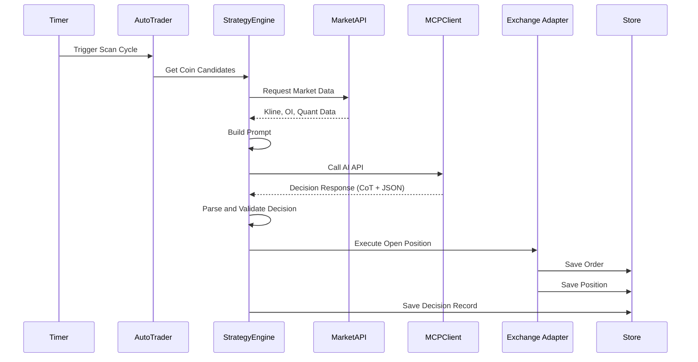

### 6.2 回测流程

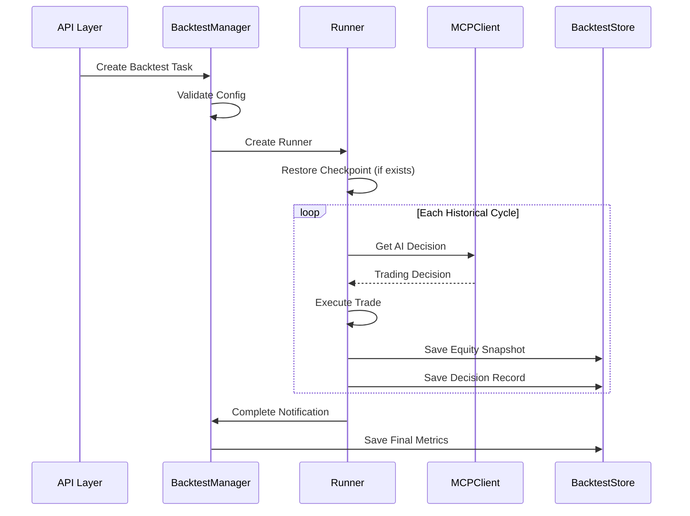

### 6.3 辩论流程

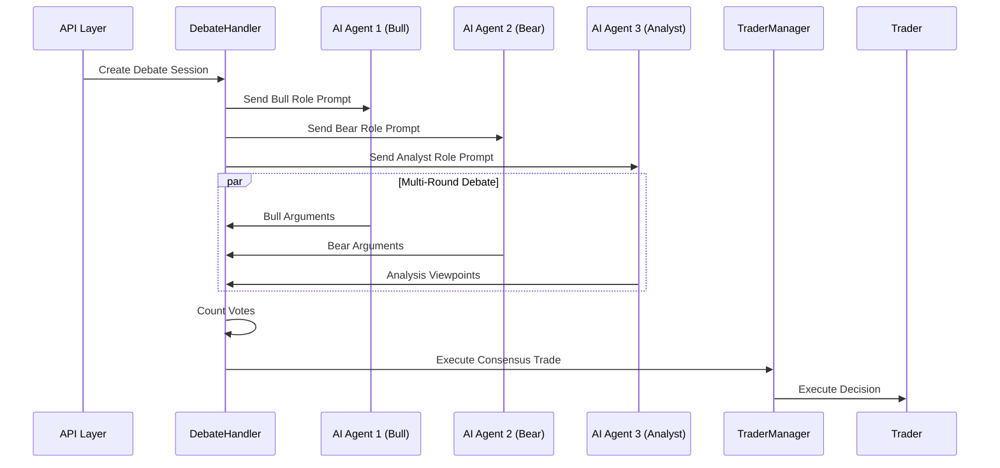

---

## 7. 安全与风险控制

### 7.1 安全机制

| 安全层面 | 实现方式 |
|---------|---------|
| **传输加密** | Web Crypto API 加密 API 密钥（可选） |
| **存储加密** | AES 加密敏感数据（API 密钥、私钥） |
| **认证授权** | JWT 令牌 + OTP 双因素认证 |
| **SSRF 防护** | URL 白名单验证 |
| **输入验证** | 严格的参数验证和类型检查 |

### 7.2 风险控制机制

| 风险类型 | 实现方式 | 强制执行 |
|---------|---------|---------|
| **最大持仓数** | 配置 MaxPositions | ✅ 代码强制 |
| **仓位价值限制** | BTC/ETH vs Altcoin 不同比例 | ✅ 代码强制 |
| **最小仓位** | MinPositionSize | ✅ 代码强制 |
| **杠杆限制** | BTC/ETH vs Altcoin 不同倍数 | ✅ 代码强制 |
| **保证金使用率** | MaxMarginUsage | ✅ 代码强制 |
| **风险回报比** | MinRiskRewardRatio ≥ 3.0 | AI 指导 |
| **回撤保护** | 利润 > 5% 且回撤 ≥ 40% 自动平仓 | ✅ 代码强制 |
| **每日亏损限制** | MaxDailyLoss 暂停交易 | AI 指导 |

### 7.3 代码强制示例

```go
// trader/auto_trader.go - Lines 2096-2111
func (at *AutoTrader) enforceMaxPositions(currentPositionCount int) error {
    if at.config.StrategyConfig == nil {
        return nil
    }
    
    maxPositions := at.config.StrategyConfig.RiskControl.MaxPositions
    if maxPositions <= 0 {
        maxPositions = 3 // Default: 3 positions
    }
    
    if currentPositionCount >= maxPositions {
        return fmt.Errorf("❌ [RISK CONTROL] Already at max positions (%d/%d)", 
            currentPositionCount, maxPositions)
    }
    return nil
}
```

---

## 8. 性能与可扩展性

### 8.1 性能优化

| 优化点 | 实现方式 |
|--------|---------|
| **正则预编译** | 预编译常用正则表达式 |
| **数据库连接池** | SQLite 单连接（DELETE 模式） |
| **并发数据获取** | goroutine 并发获取多个交易者数据 |
| **缓存机制** | 竞争数据缓存（30秒） |
| **懒加载** | Store 子存储按需初始化 |

### 8.2 可扩展性设计

| 扩展点 | 说明 |
|--------|------|
| **新 AI 模型** | 实现 AIClient 接口即可添加 |
| **新交易所** | 实现 Trader 接口即可添加 |
| **新指标** | 策略配置支持动态指标 |
| **新数据源** | ExternalDataSource 支持自定义 API |

---

## 9. 架构优势与改进建议

### 9.1 架构优势

1. **模块化设计**: 清晰的分层架构，各模块职责明确
2. **接口抽象**: 统一的 Trader、AIClient 接口，易于扩展
3. **配置驱动**: 策略配置化，无需修改代码即可调整交易逻辑
4. **多租户支持**: 用户隔离，支持多账户管理
5. **可观测性**: 完整的日志、决策记录、性能指标

### 9.2 改进建议

#### 9.2.1 短期改进

1. **单元测试覆盖**: 补充核心模块的单元测试
2. **错误处理优化**: 统一错误处理和错误码
3. **配置验证增强**: 启动时验证所有配置的合法性
4. **日志结构化**: 统一日志格式，便于日志分析

#### 9.2.2 中期改进

1. **引入消息队列**: 使用 Redis/RabbitMQ 处理异步任务
2. **微服务化**: 将回测、辩论等模块拆分为独立服务
3. **数据库升级**: 考虑 PostgreSQL/MySQL 替代 SQLite
4. **监控告警**: 集成 Prometheus + Grafana 监控

#### 9.2.3 长期改进

1. **分布式部署**: 支持多实例部署，负载均衡
2. **插件系统**: 支持第三方策略插件
3. **AI 模型微调**: 基于历史数据微调专用模型
4. **风险管理增强**: 引入 VaR、压力测试等高级风控

---

## 10. 总结

NOFX 是一个架构设计良好的 AI 驱动交易系统，具有以下特点：

- ✅ **清晰的分层架构**：API、业务逻辑、数据访问层分离
- ✅ **丰富的设计模式**：策略、工厂、管理器、适配器、构建器等
- ✅ **强大的扩展性**：统一的接口设计，易于添加新交易所和 AI 模型
- ✅ **完善的风险控制**：多层次风险控制机制，代码强制执行关键约束
- ✅ **全面的功能模块**：交易、回测、辩论、策略工作室等

该项目适合作为 AI 交易系统的参考实现，为后续功能扩展和优化提供了良好的基础。

---

**报告完成时间**: 2025-12-31
