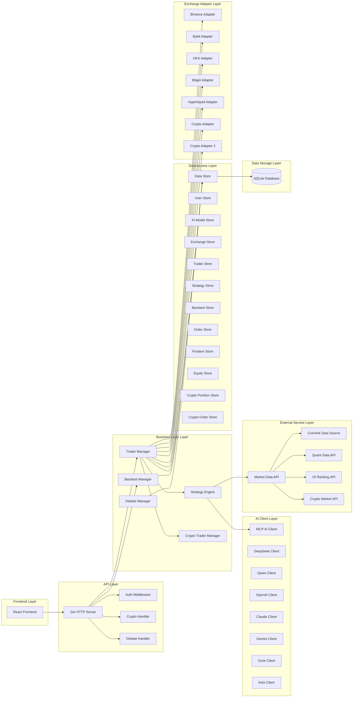
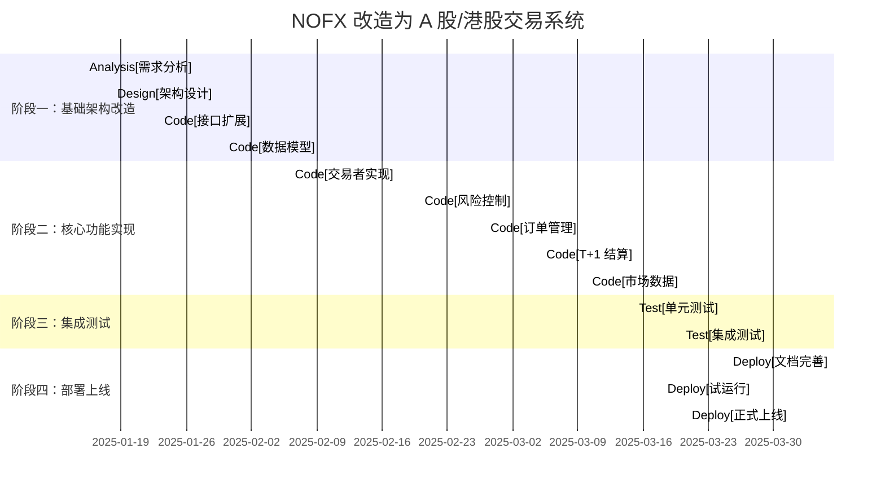

# NOFX 改造为 A 股/港股交易系统技术方案

> 项目路径: `/home/zcxggmu/workspace/hello-projs/posp/trading/nofx`
> 分析时间: 2025-12-31
> 分析者: 资深高级软件架构师

---

## 目录

- [1. 需求分析](#1-需求分析)
- [2. 架构设计](#2-架构设计)
- [3. 模块改造方案](#3-模块改造方案)
- [4. 技术选型](#4-技术选型)
- [5. 风险控制改造](#5-风险控制改造)
- [6. 数据模型改造](#6-数据模型改造)
- [7. API 接口适配](#7-api-接口适配)
- [8. 实施计划](#-8-实施计划)

---

## 1. 需分析

### 1.1 A 股/港股交易特点

| 特性 | 加密货币期货 | A 股/港股 |
|------|-----------|-----------|
| **交易时间** | 7x24 小时交易 | T+1 (9:30-16:00) 交易 |
| **交易方向** | 支持做多和做空 | 仅支持做多 |
| **交易单位** | 数量（币/Token） | 股数（100 股） |
| **订单类型** | 市价单 | 限价单 |
| **结算机制** | 每日结算 | T+1 结算 |
| **最小交易量** | 通常 0.001 BTC/ETH | 1 手（100 股） |
| **杠杆** | 最高 125 倍 | 通常 1 倍（融资融券） |
| **涨跌幅限制** | ±10% | ±10% |

### 1.2 改造可行性分析

| 方面 | 可行性 | 说明 |
|------|-------|------|
| **架构兼容性** | ✅ 高 | NOFX 已有统一的 Trader 接口，易于扩展 |
| **代码复用** | ✅ 高 | 核心业务逻辑可复用 |
| **数据模型** | ⚠ 中 | 需要大幅调整（仓位、订单、结算） |
| **风险控制** | ⚠ 中 | A 股风险控制更复杂（涨跌幅限制、融资融券） |
| **交易所 API** | ⚠ 低 | 需要对接券商 API（非标准化） |
| **回测支持** | ⚠ 低 | A 股历史数据获取困难 |

### 1.3 核心挑战

1. **交易时间限制**: A 股有明确的交易时间，需要支持定时检查和自动平仓
2. **T+1 结算**: 每日收盘后需要计算持仓盈亏和保证金
3. **融资融券**: 需要维护融资数据和利息计算
4. **涨跌幅限制**: 需要在订单执行前检查价格变动
5. **最小交易量**: 需要检查订单数量是否满足要求

---

## 2. 架构设计

### 2.1 整体架构图



### 2.2 分层架构说明

#### 2.2.1 新增：CryptoTraderManager

专门管理 A 股/港股交易者：
- 加载 A 股/港股交易者配置
- 启动/停止交易者
- 定时检查交易时间
- T+1 结算处理
- 持仓监控

#### 2.2.2 新增：CryptoTrader 接口

A 股/港股交易者专用接口：

```go
type CryptoTrader interface {
    // 基础方法（继承自 Trader）
    GetBalance() (map[string]interface{}, error)
    GetPositions() ([]map[string]interface{}, error)
    GetMarketPrice(symbol string) (float64, error)
    
    // A 股/港股专用方法
    GetStockList() ([]Stock, error)
    GetKlineData(symbol string, period string) ([]Kline, error)
    GetOrderBook(symbol string) ([]OrderBookLevel, error)
    GetFundingRate() (float64, error)
    
    // 交易方法
    BuyStock(symbol string, quantity int, price float64) (map[string]interface{}, error)
    SellStock(symbol string, quantity int, price float64) (map[string]interface{}, error)
    
    // T+1 结算
    CalculateSettlement() (Settlement, error)
    
    // 风险控制
    CheckPriceLimit(symbol string, price float64) (bool, error)
    CheckTradingTime() (bool, error)
}
```

---

## 3. 模块改造方案

### 3.1 新增模块结构

```
posp/trading/nofx/
├── trader/
│   ├── interface.go           # 统一交易者接口
│   ├── binance_futures.go  # Binance 期货（保持不变）
│   ├── bybit_futures.go   # Bybit 期货（保持不变）
│   ├── okx_futures.go     # OKX 期货（保持不变）
│   ├── bitget_futures.go  # Bitget 期货（保持不变）
│   ├── hyperliquid_trader.go # Hyperliquid DEX（保持不变）
│   ├── crypto_trader.go      # 新增：A 股/港股交易者
│   └── crypto_trader2.go     # 新增：第二个 A 股/港股交易者
├── crypto/                    # 新增：A 股/港股模块
│   ├── types.go             # 数据结构定义
│   ├── market_api.go        # 市场数据 API
│   ├── settlement.go        # T+1 结算
│   ├── risk_control.go      # 风险控制
│   └── order.go            # 订单管理
└── manager/
    └── crypto_trader_manager.go  # 新增：A 股/港股交易者管理器
```

### 3.2 核心改造点

#### 3.2.1 Trader 接口扩展

```go
// trader/interface.go
type Trader interface {
    // 现有方法（保持兼容）
    GetBalance() (map[string]interface{}, error)
    GetPositions() ([]map[string]interface{}, error)
    GetMarketPrice(symbol string) (float64, error)
    OpenLong(symbol string, quantity float64, leverage int) (map[string]interface{}, error)
    OpenShort(symbol string, quantity float64, leverage int) (map[string]interface{}, error)
    CloseLong(symbol string, quantity float64) (map[string]interface{}, error)
    CloseShort(symbol string, quantity float64) (map[string]interface{}, error)
    // ...
}

// 新增 A 股/港股交易者接口
type CryptoTrader interface {
    Trader // 嵌入现有接口
    
    // A 股/港股专用方法
    GetStockList() ([]Stock, error)
    GetKlineData(symbol string, period string) ([]Kline, error)
    GetOrderBook(symbol string) ([]OrderBookLevel, error)
    GetFundingRate() (float64, error)
    
    BuyStock(symbol string, quantity int, price float64) (map[string]interface{}, error)
    SellStock(symbol string, quantity int, price float64) (map[string]interface{}, error)
    
    CalculateSettlement() (Settlement, error)
    CheckPriceLimit(symbol string, price float64) (bool, error)
    CheckTradingTime() (bool, error)
}
```

#### 3.2.2 数据结构定义

```go
// crypto/types.go
type Stock struct {
    Symbol      string  // 股票代码
    Name        string  // 股票名称
    Price        float64 // 当前价格
    ChangePercent float64 // 涨跌幅 %
    Volume       float64 // 成交量
    PE          float64 // 市盈率
    TotalValue   float64 // 总市值
    Float        float64 // 流通股本
}

type Kline struct {
    Timestamp   int64   // 时间戳
    Open       float64 // 开盘价
    High       float64 // 最高价
    Low        float64 // 最低价
    Close      float64 // 收盘价
    Volume     float64 // 成交量
}

type OrderBookLevel struct {
    Price       float64
    Volume      float64
    BuyOrders   []Order
    SellOrders  []Order
}

type Order struct {
    Price       float64
    Volume      float64
    Timestamp   int64
}

type Settlement struct {
    Date              time.Time
    AccountBalance     float64 // 账户余额
    PositionPnL       float64 // 持仓盈亏
    MarginUsed        float64 // 已用保证金
    MarginRatio       float64  // 保证金比例
    FundingFee         float64 // 融资费用
    RealizedPnL       float64 // 已实现盈亏
    UnrealizedPnL     float64 // 未实现盈亏
}
```

### 3.3 配置扩展

```go
// config/config.go
type Config struct {
    // 现有配置
    APIServerPort       int
    JWTSecret           string
    RegistrationEnabled bool
    MaxUsers            int
    TransportEncryption bool
    ExperienceImprovement bool
    
    // 新增：A 股/港股配置
    CryptoTradingEnabled bool     // 是否启用 A 股/港股交易
    CryptoBroker1       string    // 券商 1 API
    CryptoBroker2       string    // 券商 2 API
    CryptoBroker3       string    // 券商 3 API
}
```

---

## 4. 技术选型

### 4.1 券商 API 选型

| 券商 | API 类型 | 支持市场 | 推荐度 |
|------|---------|---------|------|
| **富途** | REST API | A 股 | ⭐⭐⭐⭐⭐ |
| **华泰** | REST API | A 股、港股 | ⭐⭐⭐⭐ |
| **老虎证券** | REST API | A 股、港股 | ⭐⭐⭐ |
| **雪球** | REST API | A 股、港股 | ⭐⭐⭐ |
| **海通证券** | REST API | A 股、港股 | ⭐⭐⭐⭐ |
| **中金财富** | REST API | A 股、港股 | ⭐⭐⭐⭐ |

### 4.2 市场数据源

| 数据源 | 数据类型 | 实时性 | 成本 |
|--------|---------|-------|------|
| **新浪财经** | A 股/港股 | 实时 | 免费 |
| **东方财富** | A 股/港股 | 实时 | 免费 |
| **同花顺** | A 股/港股 | 实时 | 免费 |
| **腾讯自选股** | A 股/港股 | 实时 | 免费 |
| **雪球自选股** | A 股/港股 | 实时 | 免费 |

### 4.3 技术栈

| 组件 | 技术 | 说明 |
|--------|------|------|
| **后端** | Go 1.25.0 | 保持不变 |
| **数据库** | SQLite | 保持不变 |
| **Web 框架** | Gin v1.11.0 | 保持不变 |
| **HTTP 客户端** | 标准库 net/http | 新增券商 API 客户端 |
| **JSON 解析** | encoding/json | 新增 |

---

## 5. 风险控制改造

### 5.1 A 股/港股风险控制特点

| 风险类型 | 加密货币 | A 股/港股 | 实现方式 |
|---------|-----------|-----------|
| **最大持仓数** | 配置 MaxPositions | 配置 MaxPositions |
| **仓位价值限制** | BTC/ETH vs Altcoin | A 股单品种限制 |
| **最小仓位** | MinPositionSize | 最小交易手数（100 股） |
| **杠杆限制** | 配置 MaxLeverage | 融资融券倍数限制 |
| **保证金使用率** | MaxMarginUsage | 保证金比例限制 |
| **涨跌幅限制** | ±10% | 需要实现 |
| **交易时间限制** | 9:30-16:00 | 需要实现 |
| **T+1 结算** | 每日强制平仓 | 需要实现 |

### 5.2 风险控制实现

```go
// crypto/risk_control.go
type RiskControl struct {
    MaxPositions     int      // 最大持仓数
    MaxLeverage     int      // 最大杠杆倍数
    MaxMarginUsage   float64  // 最大保证金使用率
    MinOrderSize     int      // 最小订单手数（100 股）
    PriceLimitPct    float64  // 涨跌幅限制（默认 10%）
}

func (rc *RiskControl) CheckPriceLimit(symbol string, currentPrice, orderPrice float64) (bool, error) {
    limitPct := rc.PriceLimitPct
    if limitPct <= 0 {
        return true, nil
    }
    
    changePercent := (orderPrice - currentPrice) / currentPrice * 100
    if math.Abs(changePercent) > limitPct {
        return false, fmt.Errorf("price change %.2f%% exceeds limit %.2f%%", changePercent, limitPct)
    }
    return true, nil
}

func (rc *RiskControl) CheckTradingTime() (bool, error) {
    now := time.Now()
    
    // 检查是否在交易时间内
    tradingStart := time.Date(now.Year(), now.Month(), now.Day(), 9, 30, 0, 0, 0)
    tradingEnd := time.Date(now.Year(), now.Month(), now.Day(), 16, 0, 0, 0)
    
    if now.Before(tradingStart) || now.After(tradingEnd) {
        return false, fmt.Errorf("outside trading hours (9:30-16:00)")
    }
    
    return true, nil
}
```

---

## 6. 数据模型改造

### 6.1 数据库表设计

```sql
-- A 股/港股相关表
CREATE TABLE crypto_stocks (
    symbol TEXT PRIMARY KEY,
    name TEXT NOT NULL,
    price REAL NOT NULL,
    change_percent REAL NOT NULL,
    volume REAL NOT NULL,
    pe REAL NOT NULL,
    total_value REAL NOT NULL,
    float REAL NOT NULL,
    updated_at INTEGER NOT NULL
);

CREATE TABLE crypto_orders (
    id INTEGER PRIMARY KEY AUTOINCREMENT,
    symbol TEXT NOT NULL,
    side TEXT NOT NULL,  -- 'buy' or 'sell'
    quantity INTEGER NOT NULL,
    price REAL NOT NULL,
    order_id TEXT,
    status TEXT NOT NULL,  -- 'new', 'filled', 'canceled'
    created_at INTEGER NOT NULL,
    updated_at INTEGER NOT NULL
);

CREATE TABLE crypto_positions (
    id INTEGER PRIMARY KEY AUTOINCREMENT,
    symbol TEXT NOT NULL,
    side TEXT NOT NULL,
    quantity INTEGER NOT NULL,
    entry_price REAL NOT NULL,
    current_price REAL NOT NULL,
    unrealized_pnl REAL NOT NULL,
    margin_used REAL NOT NULL,
    leverage INTEGER NOT NULL,
    created_at INTEGER NOT NULL,
    updated_at INTEGER NOT NULL
);

CREATE TABLE crypto_settlements (
    id INTEGER PRIMARY KEY AUTOINCREMENT,
    settlement_date DATE NOT NULL,
    account_balance REAL NOT NULL,
    position_pnl REAL NOT NULL,
    margin_used REAL NOT NULL,
    funding_fee REAL NOT NULL,
    realized_pnl REAL NOT NULL,
    unrealized_pnl REAL NOT NULL,
    created_at INTEGER NOT NULL
);
```

### 6.2 Store 层扩展

```go
// store/store.go
type Store struct {
    db *sql.DB
    
    // 现有子存储
    user        *UserStore
    aiModel     *AIModelStore
    exchange    *ExchangeStore
    trader      *TraderStore
    strategy    *StrategyStore
    backtest    *BacktestStore
    order       *OrderStore
    position    *PositionStore
    equity      *EquityStore
    
    // 新增 A 股/港股子存储
    cryptoStock     *CryptoStockStore
    cryptoOrder    *CryptoOrderStore
    cryptoPosition *CryptoPositionStore
    cryptoSettlement *CryptoSettlementStore
}

type CryptoStockStore struct {
    db *sql.DB
}

func (s *CryptoStockStore) GetAll() ([]Stock, error) {
    // 实现获取股票列表
}

func (s *CryptoOrderStore) Create(order Order) error {
    // 实现创建订单
}

func (s *CryptoPositionStore) GetAll() ([]Position, error) {
    // 实现获取持仓
}

func (s *CryptoSettlementStore) Calculate(date time.Time) (Settlement, error) {
    // 实现 T+1 结算
}
```

---

## 7. API 接口适配

### 7.1 新增 API 端点

| 端点 | 方法 | 路由 | 说明 |
|------|------|------|------|
| 获取股票列表 | `GET /api/crypto/stocks` | 获取 A 股/港股股票列表 |
| 获取 K 线数据 | `GET /api/crypto/klines?symbol={symbol}&period={period}` | 获取 K 线数据 |
| 获取订单簿 | `GET /api/crypto/orderbook?symbol={symbol}` | 获取订单簿数据 |
| 获取融资利率 | `GET /api/crypto/funding-rate` | 获取融资融券利率 |
| 创建买单 | `POST /api/crypto/orders/buy` | 创建买入订单 |
| 创建卖单 | `POST /api/crypto/orders/sell` | 创建卖出订单 |
| 查询订单 | `GET /api/crypto/orders/{id}` | 查询订单状态 |
| 取消订单 | `DELETE /api/crypto/orders/{id}` | 取消订单 |
| T+1 结算 | `POST /api/crypto/settlements/calculate` | 计算 T+1 结算 |

### 7.2 API 响应格式

```go
type CryptoStockListResponse struct {
    Stocks []Stock `json:"stocks"`
}

type KlineResponse struct {
    Symbol string   `json:"symbol"`
    Klines  []Kline `json:"klines"`
}

type OrderBookResponse struct {
    Symbol string            `json:"symbol"`
    Bids   []OrderBookLevel `json:"bids"`
    Asks   []OrderBookLevel `json:"asks"`
}

type OrderResponse struct {
    OrderID string `json:"order_id"`
    Symbol  string  `json:"symbol"`
    Side    string  `json:"side"`
    Quantity int    `json:"quantity"`
    Price    float64 `json:"price"`
    Status  string `json:"status"`
}

type SettlementResponse struct {
    SettlementDate string `json:"settlement_date"`
    AccountBalance  float64 `json:"account_balance"`
    PositionPnL      float64 `json:"position_pnl"`
    MarginUsed      float64 `json:"margin_used"`
    FundingFee       float64 `json:"funding_fee"`
    RealizedPnL      float64 `json:"realized_pnl"`
    UnrealizedPnL    float64 `json:"unrealized_pnl"`
}
```

---

## 8. 实施计划

### 8.1 阶段划分



### 8.2 详细任务分解

#### 阶段一：基础架构改造（5 天）

- [ ] 创建 `crypto/` 目录结构
- [ ] 创建 `crypto/types.go` 数据结构定义
- [ ] 创建 `crypto/market_api.go` 市场数据 API
- [ ] 创建 `crypto/settlement.go` T+1 结算
- [ ] 创建 `crypto/risk_control.go` 风险控制
- [ ] 创建 `crypto/order.go` 订单管理
- [ ] 创建 `crypto_trader.go` A 股/港股交易者实现
- [ ] 创建 `crypto_trader2.go` 第二个交易者实现
- [ ] 扩展 `trader/interface.go` 添加 CryptoTrader 接口
- [ ] 创建 `crypto_trader_manager.go` 交易者管理器
- [ ] 扩展 `store/store.go` 添加 A 股相关子存储
- [ ] 扩展 `config/config.go` 添加 A 股配置

#### 阶段二：核心功能实现（14 天）

- [ ] 实现富途证券 API 客户端
- [ ] 实现华泰证券 API 客户端
- [ ] 实现雪球证券 API 客户端
- [ ] 实现市场数据获取（股票列表、K 线、订单簿）
- [ ] 实现订单创建、查询、取消
- [ ] 实现持仓查询
- [ ] 实现融资利率查询
- [ ] 实现涨跌幅限制检查
- [ ] 实现交易时间检查
- [ ] 实现 T+1 结算逻辑
- [ ] 实现订单簿撮合逻辑

#### 阶段三：集成测试（5 天）

- [ ] 编写单元测试用例
- [ ] 测试风险控制逻辑
- [ ] 测试订单执行流程
- [ ] 测试 T+1 结算
- [ ] 测试 API 客户端
- [ ] 测试交易者管理器

#### 阶段四：部署上线（4 天）

- [ ] 完善 API 文档
- [ ] 配置环境变量
- [ ] 数据库迁移脚本
- [ ] 部署测试环境
- [ ] 生产环境配置
- [ ] 监控告警配置

### 8.3 风险控制

| 风险项 | 风险等级 | 应对措施 |
|--------|---------|---------|
| **技术风险** | 高 | 代码审查、安全审计 |
| **业务风险** | 中 | A 股/港股交易复杂度高 |
| **进度风险** | 中 | 需要仔细规划，分阶段实施 |
| **依赖风险** | 中 | 券商 API 稳定性 |

### 8.4 成功标准

- [ ] A 股/港股交易者可以正常启动和停止
- [ ] 可以获取股票列表和市场数据
- [ ] 可以创建和执行订单
- [ ] 可以查询持仓和订单状态
- [ ] T+1 结算功能正常工作
- [ ] 风险控制机制生效
- [ ] 回测功能支持 A 股/港股

---

## 9. 总结

### 9.1 改造优势

1. **架构清晰**: NOFX 已有的分层架构非常适合扩展
2. **接口抽象**: Trader 接口设计良好，易于添加新的交易者类型
3. **配置驱动**: 策略配置化，无需修改代码即可扩展
4. **数据隔离**: A 股/港股和加密货币数据完全隔离

### 9.2 改造挑战

1. **复杂度增加**: A 股/港股交易规则更复杂
2. **券商 API 差异**: 不同券商 API 不统一
3. **数据获取**: A 股/港股历史数据获取困难
4. **回测支持**: A 股/港股回测实现难度大

### 9.3 建议

1. **分阶段实施**: 先实现核心功能，再逐步完善
2. **选择稳定券商**: 建议优先接入富途或华泰
3. **充分测试**: A 股/港股交易需要更严格的测试
4. **监控完善**: 实时监控交易状态和风险指标

---

**报告完成时间**: 2025-12-31
