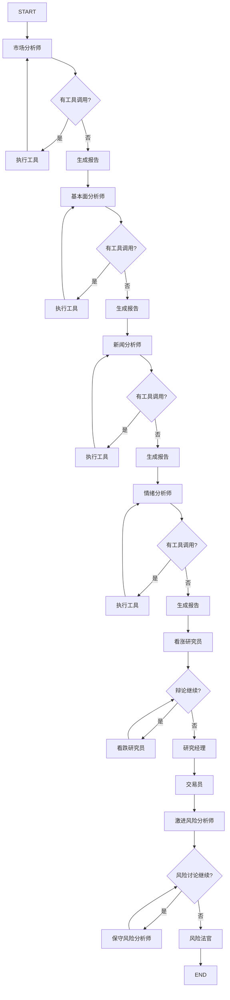
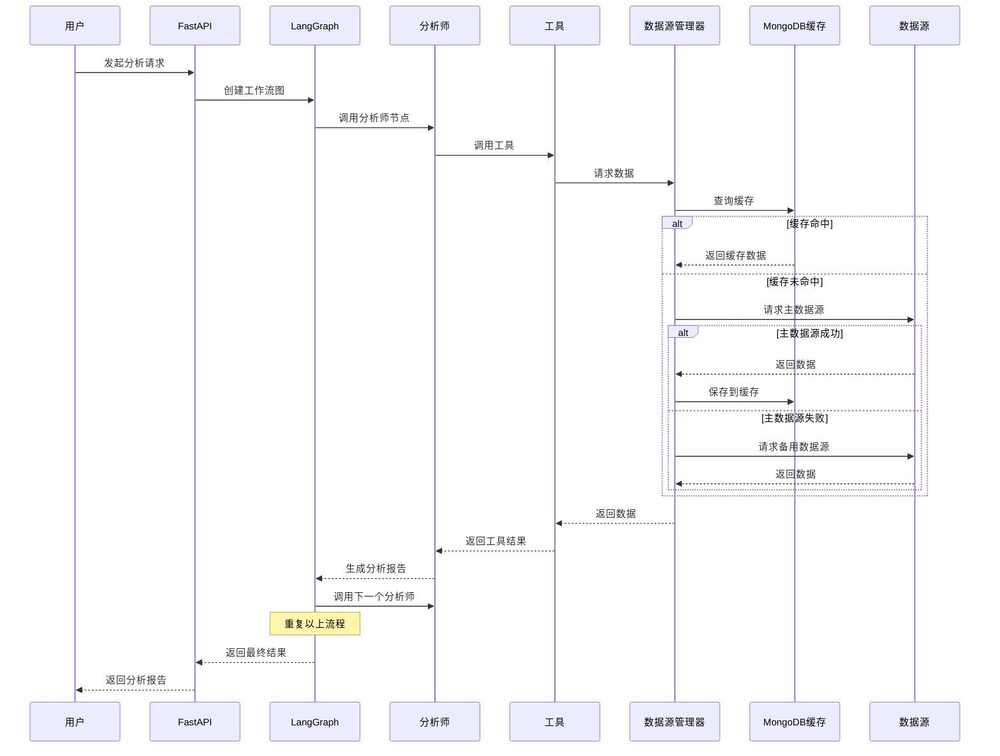

# TradingAgents-CN 技术分析报告

## 1. 项目概述

### 1.1 项目简介

**TradingAgents-CN** 是一个基于 LangGraph 和 LangChain 的 AI 股票分析智能体系统，专为 A 股、港股和美股市场设计。该项目采用多智能体协作架构，通过多个专业分析师（市场、基本面、新闻、情绪）的协作，结合投资辩论和风险管理，生成综合性的股票投资建议。

**项目版本**: v1.0.0-preview  
**版权**: (c) 2025 hsliuping. All rights reserved.  
**技术许可**: 专有软件，商业许可请联系 hsliup@163.com

### 1.2 核心特性

- **多市场支持**: A 股、港股、美股
- **多数据源**: Tushare、AKShare、BaoStock、MongoDB 缓存
- **多 LLM 支持**: DeepSeek、DashScope、Qianfan、Zhipu、OpenAI、Anthropic、Google、自定义
- **智能体协作**: 市场分析师、基本面分析师、新闻分析师、情绪分析师
- **投资辩论**: 看涨/看跌研究员辩论机制
- **风险管理**: 激进/中性/保守风险分析师辩论
- **记忆学习**: ChromaDB 向量存储，支持基于历史经验的反思
- **技术指标**: MA、MACD、RSI（同花顺风格）、布林带
- **Web API**: FastAPI 后端 + Streamlit 前端
- **定时同步**: APScheduler 定时任务调度

### 1.3 项目结构

```
TradingAgents-CN/
├── tradingagents/           # 核心库
│   ├── agents/              # 智能体
│   │   ├── analysts/        # 分析师
│   │   │   ├── market_analyst.py
│   │   │   ├── fundamentals_analyst.py
│   │   │   ├── news_analyst.py
│   │   │   ├── social_analyst.py
│   │   │   └── ...
│   │   ├── managers/        # 管理器
│   │   │   ├── research_manager.py
│   │   │   └── risk_manager.py
│   │   └── researchers/     # 研究员
│   │       ├── bull_researcher.py
│   │       └── bear_researcher.py
│   ├── dataflows/           # 数据流
│   │   ├── interface.py     # 统一数据接口
│   │   ├── data_source_manager.py  # 数据源管理器
│   │   ├── cache/          # 缓存适配器
│   │   │   └── mongodb_cache_adapter.py
│   │   └── providers/      # 数据源提供器
│   │       ├── china/       # A股数据源
│   │       ├── hk/          # 港股数据源
│   │       └── us/          # 美股数据源
│   ├── graph/               # 工作流图
│   │   ├── trading_graph.py
│   │   └── setup.py
│   ├── llm_adapters/       # LLM 适配器
│   │   └── openai_compatible_base.py
│   ├── tools/               # 工具
│   │   └── unified_news_tool.py
│   ├── config/              # 配置
│   │   ├── default_config.py
│   │   └── runtime_settings.py
│   ├── utils/               # 工具函数
│   │   ├── stock_utils.py
│   │   └── logging_init.py
│   └── constants.py        # 常量定义
├── app/                     # FastAPI 后端
│   ├── core/                # 核心模块
│   │   ├── config.py
│   │   ├── database.py
│   │   └── logging_config.py
│   ├── routers/             # API 路由
│   ├── services/            # 业务服务
│   ├── worker/              # 后台任务
│   └── main.py              # 应用入口
├── requirements-lock.txt    # 锁定依赖
├── .env.example            # 环境变量示例
└── VERSION                # 版本号
```

---

## 2. 技术栈分析

### 2.1 核心框架

| 框架/库 | 版本 | 用途 |
|---------|------|------|
| **langchain** | 0.3.27 | LLM 集成框架 |
| **langgraph** | 0.6.7 | 智能体编排框架 |
| **langchain-openai** | - | OpenAI 兼容接口 |
| **langchain-core** | - | LangChain 核心组件 |
| **langchain-community** | - | 社区集成 |

### 2.2 数据处理

| 框架/库 | 版本 | 用途 |
|---------|------|------|
| **pandas** | 2.3.2 | 数据处理和分析 |
| **numpy** | 2.2.6 | 数值计算 |
| **akshare** | 1.17.54 | A股数据源 |
| **tushare** | 1.4.24 | A股数据源 |
| **baostock** | 0.8.9 | A股数据源 |
| **yfinance** | - | 美股数据源 |
| **chromadb** | 1.1.0 | 向量数据库（记忆存储） |

### 2.3 Web 框架

| 框架/库 | 版本 | 用途 |
|---------|------|------|
| **fastapi** | 0.116.2 | Web API 框架 |
| **uvicorn** | - | ASGI 服务器 |
| **streamlit** | 1.49.1 | Web 前端 |
| **pydantic** | 2.x | 数据验证 |
| **pydantic-settings** | - | 配置管理 |

### 2.4 数据库

| 框架/库 | 版本 | 用途 |
|---------|------|------|
| **pymongo** | - | MongoDB 客户端 |
| **redis** | - | Redis 客户端 |
| **motor** | - | MongoDB 异步驱动 |

### 2.5 任务调度

| 框架/库 | 版本 | 用途 |
|---------|------|------|
| **apscheduler** | - | 定时任务调度 |
| **croniter** | - | Cron 表达式解析 |

### 2.6 其他依赖

| 框架/库 | 版本 | 用途 |
|---------|------|------|
| **httpx** | - | HTTP 客户端 |
| **python-dotenv** | - | 环境变量管理 |
| **python-multipart** | - | 文件上传支持 |
| **pyjwt** | - | JWT 认证 |
| **passlib** | - | 密码哈希 |
| **bcrypt** | - | 密码加密 |
| **python-dateutil** | - | 日期处理 |
| **tzdata** | - | 时区数据 |

---

## 3. 架构设计分析

### 3.1 整体架构

TradingAgents-CN 采用**分层架构**和**智能体协作模式**，主要分为以下层次：

```
┌─────────────────────────────────────────────────────────────┐
│                    表示层 (Presentation)                    │
│  ┌──────────────┐         ┌──────────────┐              │
│  │  FastAPI     │         │  Streamlit   │              │
│  │  Web API     │         │  Frontend    │              │
│  └──────────────┘         └──────────────┘              │
└─────────────────────────────────────────────────────────────┘
                            ↓
┌─────────────────────────────────────────────────────────────┐
│                    业务层 (Business)                       │
│  ┌──────────────┐  ┌──────────────┐  ┌──────────────┐  │
│  │  分析服务    │  │  队列管理    │  │  配置管理    │  │
│  └──────────────┘  └──────────────┘  └──────────────┘  │
└─────────────────────────────────────────────────────────────┘
                            ↓
┌─────────────────────────────────────────────────────────────┐
│                   智能体层 (Agent)                         │
│  ┌──────────────┐  ┌──────────────┐  ┌──────────────┐  │
│  │  市场分析师  │  │  基本面分析  │  │  新闻分析师  │  │
│  └──────────────┘  └──────────────┘  └──────────────┘  │
│  ┌──────────────┐  ┌──────────────┐  ┌──────────────┐  │
│  │  情绪分析师  │  │  研究经理    │  │  风险经理    │  │
│  └──────────────┘  └──────────────┘  └──────────────┘  │
│  ┌──────────────┐  ┌──────────────┐                     │
│  │  看涨研究员  │  │  看跌研究员  │                     │
│  └──────────────┘  └──────────────┘                     │
└─────────────────────────────────────────────────────────────┘
                            ↓
┌─────────────────────────────────────────────────────────────┐
│                  编排层 (Orchestration)                    │
│  ┌──────────────────────────────────────────────────┐     │
│  │         LangGraph StateGraph (工作流图)           │     │
│  │  - 条件路由  - 工具调用  - 状态管理            │     │
│  └──────────────────────────────────────────────────┘     │
└─────────────────────────────────────────────────────────────┘
                            ↓
┌─────────────────────────────────────────────────────────────┐
│                   数据层 (Data)                            │
│  ┌──────────────┐  ┌──────────────┐  ┌──────────────┐  │
│  │  Tushare     │  │  AKShare     │  │  BaoStock    │  │
│  └──────────────┘  └──────────────┘  └──────────────┘  │
│  ┌──────────────┐  ┌──────────────┐  ┌──────────────┐  │
│  │  MongoDB     │  │  Redis       │  │  ChromaDB    │  │
│  └──────────────┘  └──────────────┘  └──────────────┘  │
└─────────────────────────────────────────────────────────────┘
```

### 3.2 智能体工作流

智能体工作流采用**顺序执行 + 条件分支**的模式，具体流程如下：



### 3.3 设计模式

#### 3.3.1 工厂模式 (Factory Pattern)

**LLM 工厂**: [`create_llm_by_provider()`](posp/trading/TradingAgents-CN/tradingagents/graph/trading_graph.py:140) 根据提供商创建不同的 LLM 实例

```python
def create_llm_by_provider(provider, model_name, config):
    if provider == "deepseek":
        return ChatDeepSeekOpenAI(model=model_name, ...)
    elif provider == "dashscope":
        return ChatDashScopeOpenAI(model=model_name, ...)
    elif provider == "openai":
        return ChatOpenAI(model=model_name, ...)
    # ...
```

#### 3.3.2 适配器模式 (Adapter Pattern)

**LLM 适配器**: [`OpenAICompatibleBase`](posp/trading/TradingAgents-CN/tradingagents/llm_adapters/openai_compatible_base.py:30) 将不同 LLM 提供商适配为统一的 OpenAI 兼容接口

**数据源适配器**: [`MongoDBCacheAdapter`](posp/trading/TradingAgents-CN/tradingagents/dataflows/cache/mongodb_cache_adapter.py:18) 将 MongoDB 数据适配为统一的数据接口

#### 3.3.3 策略模式 (Strategy Pattern)

**数据源策略**: [`DataSourceManager`](posp/trading/TradingAgents-CN/tradingagents/dataflows/data_source_manager.py:57) 根据配置动态选择数据源策略（Tushare/AKShare/BaoStock）

**优先级策略**: [`_get_data_source_priority_order()`](posp/trading/TradingAgents-CN/tradingagents/dataflows/data_source_manager.py:91) 根据市场类型和数据库配置动态调整数据源优先级

#### 3.3.4 装饰器模式 (Decorator Pattern)

**日志装饰器**: [`@log_analyst_module`](posp/trading/TradingAgents-CN/tradingagents/utils/tool_logging.py) 为分析师模块添加日志功能

#### 3.3.5 状态模式 (State Pattern)

**智能体状态**: [`AgentState`](posp/trading/TradingAgents-CN/tradingagents/agents/utils/agent_states.py:60) 使用 TypedDict 定义智能体的状态结构

**辩论状态**: [`InvestDebateState`](posp/trading/TradingAgents-CN/tradingagents/agents/utils/agent_states.py:21) 和 [`RiskDebateState`](posp/trading/TradingAgents-CN/tradingagents/agents/utils/agent_states.py:33) 管理辩论历史

#### 3.3.6 单例模式 (Singleton Pattern)

**缓存适配器**: [`get_mongodb_cache_adapter()`](posp/trading/TradingAgents-CN/tradingagents/dataflows/cache/mongodb_cache_adapter.py:354) 使用全局变量确保缓存适配器单例

#### 3.3.7 观察者模式 (Observer Pattern)

**任务调度**: APScheduler 使用观察者模式管理定时任务

### 3.4 核心模块分析

#### 3.4.1 LangGraph 工作流编排

**核心类**: [`TradingAgentsGraph`](posp/trading/TradingAgents-CN/tradingagents/graph/trading_graph.py:70)

**主要职责**:
- LLM 初始化和管理
- 工作流图设置和编译
- 智能体节点创建
- 工具节点绑定
- 条件逻辑配置
- 性能跟踪和统计

**关键方法**:
- `__init__()`: 初始化 LLMs、工具包、记忆、条件逻辑
- `propagate()`: 执行完整的分析流程
- `_build_performance_data()`: 构建性能统计数据
- `_print_timing_summary()`: 打印时间统计

**工作流图设置**: [`GraphSetup.setup_graph()`](posp/trading/TradingAgents-CN/tradingagents/graph/setup.py:51)

**节点类型**:
- 分析师节点: Market Analyst, Social Analyst, News Analyst, Fundamentals Analyst
- 研究员节点: Bull Researcher, Bear Researcher
- 管理器节点: Research Manager, Risk Manager
- 交易员节点: Trader
- 风险分析师节点: Risky Analyst, Neutral Analyst, Safe Analyst
- 工具节点: ToolNode (工具调用)
- 消息清理节点: Msg Clear (清理消息历史)

#### 3.4.2 多 LLM 支持

**核心类**: [`OpenAICompatibleBase`](posp/trading/TradingAgents-CN/tradingagents/llm_adapters/openai_compatible_base.py:30)

**支持的提供商**:
- DeepSeek: [`ChatDeepSeekOpenAI`](posp/trading/TradingAgents-CN/tradingagents/llm_adapters/openai_compatible_base.py:200)
- DashScope: [`ChatDashScopeOpenAIUnified`](posp/trading/TradingAgents-CN/tradingagents/llm_adapters/openai_compatible_base.py:260)
- Qianfan: [`ChatQianfanOpenAI`](posp/trading/TradingAgents-CN/tradingagents/llm_adapters/openai_compatible_base.py:320)
- Zhipu: [`ChatZhipuOpenAI`](posp/trading/TradingAgents-CN/tradingagents/llm_adapters/openai_compatible_base.py:380)
- 自定义: [`ChatCustomOpenAI`](posp/trading/TradingAgents-CN/tradingagents/llm_adapters/openai_compatible_base.py:440)

**特性**:
- 统一的 OpenAI 兼容接口
- Token 使用跟踪
- 上下文长度管理
- 错误处理和重试

#### 3.4.3 统一数据接口

**核心模块**: [`interface.py`](posp/trading/TradingAgents-CN/tradingagents/dataflows/interface.py)

**主要函数**:
- `get_stock_data_by_market()`: 自动识别市场类型并获取股票数据
- `get_china_stock_data_unified()`: 统一 A 股数据接口（自动扩展日期范围）
- `get_hk_stock_data_unified()`: 统一港股数据接口
- `get_fundamentals_openai()`: 美股基本面数据（Alpha Vantage/yfinance/FinnHub）
- `get_google_news()`: Google 新闻搜索（支持中文关键词增强）

**技术指标计算**:
- 移动平均线: MA5, MA10, MA20, MA60
- MACD: DIF, DEA, MACD 柱状图
- RSI: RSI6, RSI12, RSI24 (同花顺风格), RSI14 (国际标准)
- 布林带: 上轨、中轨、下轨

**同花顺风格 RSI 实现**:
```python
# 使用中国式 SMA (EMA with adjust=True)
delta = data['close'].diff()
gain = delta.where(delta > 0, 0)
loss = -delta.where(delta < 0, 0)

# RSI6 - 使用中国式SMA
avg_gain6 = gain.ewm(com=5, adjust=True).mean()  # com = N - 1
avg_loss6 = loss.ewm(com=5, adjust=True).mean()
rs6 = avg_gain6 / avg_loss6.replace(0, np.nan)
data['rsi6'] = 100 - (100 / (1 + rs6))
```

#### 3.4.4 数据源管理器

**核心类**: [`DataSourceManager`](posp/trading/TradingAgents-CN/tradingagents/dataflows/data_source_manager.py:57)

**数据源优先级**:
1. MongoDB 缓存（最高优先级）
2. Tushare
3. AKShare
4. BaoStock

**主要方法**:
- `get_stock_data()`: 获取股票数据（支持多周期）
- `get_fundamentals_data()`: 获取基本面数据
- `get_news_data()`: 获取新闻数据
- `get_stock_info()`: 获取股票基本信息
- `_try_fallback_sources()`: 降级到备用数据源

**动态优先级配置**:
- 从数据库 `system_configs` 集合读取数据源配置
- 支持按市场分类（a_shares/us_stocks/hk_stocks）配置优先级
- 支持启用/禁用数据源
- 支持优先级排序（数字越大优先级越高）

#### 3.4.5 MongoDB 缓存适配器

**核心类**: [`MongoDBCacheAdapter`](posp/trading/TradingAgents-CN/tradingagents/dataflows/cache/mongodb_cache_adapter.py:18)

**主要方法**:
- `get_stock_basic_info()`: 获取股票基础信息
- `get_historical_data()`: 获取历史数据（支持多周期）
- `get_financial_data()`: 获取财务数据
- `get_news_data()`: 获取新闻数据
- `get_social_media_data()`: 获取社媒数据
- `get_market_quotes()`: 获取实时行情

**数据集合**:
- `stock_basic_info`: 股票基础信息
- `stock_daily_quotes`: 日K线数据
- `stock_financial_data`: 财务数据
- `stock_news`: 新闻数据
- `social_media_messages`: 社媒数据
- `market_quotes`: 实时行情

#### 3.4.6 分析师实现

**市场分析师**: [`create_market_analyst()`](posp/trading/TradingAgents-CN/tradingagents/agents/analysts/market_analyst.py:95)

**职责**:
- 技术指标分析（MA、MACD、RSI、布林带）
- 价格趋势分析
- 基于技术面的投资建议

**工具**:
- `get_stock_market_data_unified`: 统一市场数据工具

**特性**:
- 自动识别股票类型（A股/港股/美股）
- Google 模型特殊处理
- 工具调用计数器防止无限循环

**基本面分析师**: [`create_fundamentals_analyst()`](posp/trading/TradingAgents-CN/tradingagents/agents/analysts/fundamentals_analyst.py:98)

**职责**:
- 财务数据分析
- 估值指标分析（PE、PB、PEG）
- 公司基本面评估
- 基于基本面的投资建议

**工具**:
- `get_stock_fundamentals_unified`: 统一基本面分析工具

**特性**:
- 固定获取10天数据（处理周末/节假日/数据延迟）
- 强制工具调用机制
- DashScope/DeepSeek/Zhipu 预处理

**新闻分析师**: [`create_news_analyst()`](posp/trading/TradingAgents-CN/tradingagents/agents/analysts/news_analyst.py:19)

**职责**:
- 新闻事件分析
- 市场情绪评估
- 新闻对股价的影响分析
- 基于新闻的投资建议

**工具**:
- `get_stock_news_unified`: 统一新闻工具

**特性**:
- 优先分析15-30分钟内的新闻
- 自动识别股票类型
- DashScope/DeepSeek/Zhipu 预处理强制新闻获取

#### 3.4.7 风险管理

**风险经理**: [`create_risk_manager()`](posp/trading/TradingAgents-CN/tradingagents/agents/managers/risk_manager.py:9)

**职责**:
- 评估三位风险分析师（激进/中性/保守）的辩论
- 生成最终交易决策（买入/卖出/持有）
- 基于历史记忆反思

**特性**:
- 重试机制（最多3次）
- Prompt 大小统计和 Token 估算
- 默认决策生成（LLM 调用失败时）

#### 3.4.8 配置管理

**运行时配置**: [`runtime_settings.py`](posp/trading/TradingAgents-CN/tradingagents/config/runtime_settings.py)

**主要函数**:
- `get_float()`: 获取浮点数配置（DB > ENV > DEFAULT）
- `get_int()`: 获取整数配置（DB > ENV > DEFAULT）
- `get_bool()`: 获取布尔配置（DB > ENV > DEFAULT）
- `use_app_cache_enabled()`: 是否启用 MongoDB 缓存
- `get_timezone_name()`: 获取时区配置
- `get_zoneinfo()`: 获取 ZoneInfo 对象

**特性**:
- 优先级: 数据库动态配置 > 环境变量 > 代码默认值
- 避免事件循环冲突（异步环境中的同步调用）
- 弱依赖设计（不可用时静默回退）

#### 3.4.9 FastAPI 后端

**主应用**: [`app/main.py`](posp/trading/TradingAgents-CN/app/main.py)

**主要组件**:
- FastAPI 应用实例
- CORS 中间件
- 操作日志中间件
- 请求 ID 中间件
- 全局异常处理

**生命周期管理**:
- `lifespan()`: 应用启动和关闭时的初始化/清理
- 启动时: 初始化数据库、配置桥接、显示配置摘要、启动定时任务
- 关闭时: 关闭调度器、关闭数据库连接

**定时任务**:
- 股票基础信息同步（多数据源）
- 实时行情入库（每N秒）
- Tushare 数据同步（基础信息、行情、历史、财务、状态检查）
- AKShare 数据同步（基础信息、行情、历史、财务、状态检查）
- BaoStock 数据同步（基础信息、日K线、历史、状态检查）
- 新闻数据同步（仅自选股）

**路由注册**:
- `/api/health`: 健康检查
- `/api/auth`: 认证
- `/api/analysis`: 分析
- `/api/screening`: 筛选
- `/api/queue`: 队列
- `/api/favorites`: 自选股
- `/api/stocks`: 股票
- `/api/system`: 系统
- `/api/stream`: 流式传输
- `/api/scheduler`: 定时任务
- WebSocket 通知

---

## 4. 数据流分析

### 4.1 数据获取流程



### 4.2 数据源优先级

**市场分类识别**:
```python
def _identify_market_category(symbol: str) -> Optional[str]:
    """识别股票代码所属的市场分类"""
    market = StockUtils.identify_stock_market(symbol)
    
    market_mapping = {
        StockMarket.CHINA_A: 'a_shares',
        StockMarket.US: 'us_stocks',
        StockMarket.HONG_KONG: 'hk_stocks',
    }
    
    return market_mapping.get(market)
```

**动态优先级配置**:
```python
def _get_data_source_priority_order(symbol: str) -> List[ChinaDataSource]:
    """从数据库获取数据源优先级顺序"""
    # 1. 识别市场类型
    market_category = self._identify_market_category(symbol)
    
    # 2. 从数据库读取配置
    config_data = config_collection.find_one({"is_active": True})
    
    # 3. 过滤启用的数据源
    enabled_sources = []
    for ds in data_source_configs:
        if not ds.get('enabled', True):
            continue
        # 检查市场分类
        if market_category not in ds.get('market_categories', []):
            continue
        enabled_sources.append(ds)
    
    # 4. 按优先级排序
    enabled_sources.sort(key=lambda x: x.get('priority', 0), reverse=True)
    
    return enabled_sources
```

### 4.3 技术指标计算

**移动平均线 (MA)**:
```python
data['ma5'] = data['close'].rolling(window=5, min_periods=1).mean()
data['ma10'] = data['close'].rolling(window=10, min_periods=1).mean()
data['ma20'] = data['close'].rolling(window=20, min_periods=1).mean()
data['ma60'] = data['close'].rolling(window=60, min_periods=1).mean()
```

**MACD**:
```python
ema12 = data['close'].ewm(span=12, adjust=False).mean()
ema26 = data['close'].ewm(span=26, adjust=False).mean()
data['macd_dif'] = ema12 - ema26
data['macd_dea'] = data['macd_dif'].ewm(span=9, adjust=False).mean()
data['macd'] = (data['macd_dif'] - data['macd_dea']) * 2
```

**RSI (同花顺风格)**:
```python
delta = data['close'].diff()
gain = delta.where(delta > 0, 0)
loss = -delta.where(delta < 0, 0)

# RSI6 - 使用中国式SMA (EMA with adjust=True)
avg_gain6 = gain.ewm(com=5, adjust=True).mean()
avg_loss6 = loss.ewm(com=5, adjust=True).mean()
rs6 = avg_gain6 / avg_loss6.replace(0, np.nan)
data['rsi6'] = 100 - (100 / (1 + rs6))
```

**布林带**:
```python
data['boll_mid'] = data['close'].rolling(window=20, min_periods=1).mean()
std = data['close'].rolling(window=20, min_periods=1).std()
data['boll_upper'] = data['boll_mid'] + 2 * std
data['boll_lower'] = data['boll_mid'] - 2 * std
```

---

## 5. 配置管理分析

### 5.1 环境变量配置

**关键配置项** (`.env.example`):

```bash
# MongoDB 配置
MONGODB_HOST=localhost
MONGODB_PORT=27017
MONGODB_USERNAME=
MONGODB_PASSWORD=
MONGODB_DATABASE=tradingagents

# Redis 配置
REDIS_HOST=localhost
REDIS_PORT=6379
REDIS_PASSWORD=
REDIS_DB=0

# JWT 配置
JWT_SECRET_KEY=your-secret-key
JWT_ALGORITHM=HS256
JWT_EXPIRE_MINUTES=1440

# LLM 配置
LLM_PROVIDER=deepseek
DEEPSEEK_API_KEY=
DASHSCOPE_API_KEY=
OPENAI_API_KEY=
ANTHROPIC_API_KEY=
GOOGLE_API_KEY=

# 数据源配置
TUSHARE_TOKEN=
TUSHARE_ENABLED=true
AKSHARE_ENABLED=true
BAOSTOCK_ENABLED=true

# 统一数据同步配置
UNIFIED_SYNC_ENABLED=true
UNIFIED_SYNC_CRON=0 6 * * *

# 实时行情配置
QUOTES_INGEST_ENABLED=true
QUOTES_INGEST_INTERVAL_SECONDS=30

# 缓存配置
TA_USE_APP_CACHE=true

# 运行时配置
MARKET_ANALYST_LOOKBACK_DAYS=365
```

### 5.2 配置优先级

**优先级顺序**: 数据库动态配置 > 环境变量 > 代码默认值

**示例**:
```python
# 获取浮点数配置
def get_float(env_var: str, system_key: Optional[str], default: float) -> float:
    # 1) DB 动态设置
    if system_key:
        eff = _get_system_settings_sync()
        if isinstance(eff, dict) and system_key in eff:
            return _coerce(eff.get(system_key), float, default)
    
    # 2) 环境变量
    env_val = os.getenv(env_var)
    if env_val is not None and str(env_val).strip() != "":
        return _coerce(env_val, float, default)
    
    # 3) 代码默认
    return default
```

### 5.3 默认配置

**文件**: [`tradingagents/default_config.py`](posp/trading/TradingAgents-CN/tradingagents/default_config.py)

**主要配置**:
```python
# 项目路径
PROJECT_DIR = os.path.dirname(os.path.dirname(os.path.abspath(__file__)))
RESULTS_DIR = os.path.join(PROJECT_DIR, "results")
DATA_DIR = os.path.join(PROJECT_DIR, "data")
CACHE_DIR = os.path.join(PROJECT_DIR, "cache")

# LLM 配置
LLM_PROVIDER = os.getenv("LLM_PROVIDER", "deepseek")
DEEP_THINK_LLM = os.getenv("DEEP_THINK_LLM", "deepseek-chat")
QUICK_THINK_LLM = os.getenv("QUICK_THINK_LLM", "deepseek-chat")
BACKEND_URL = os.getenv("BACKEND_URL", "")

# 辩论配置
MAX_DEBATE_ROUNDS = 3
MAX_RISK_DISCUSS_ROUNDS = 3

# 工具配置
ONLINE_TOOLS = True
ONLINE_NEWS = True
REALTIME_DATA = True
```

---

## 6. API 接口分析

### 6.1 主要 API 端点

| 端点 | 方法 | 描述 |
|------|------|------|
| `/api/health` | GET | 健康检查 |
| `/api/auth/login` | POST | 用户登录 |
| `/api/auth/register` | POST | 用户注册 |
| `/api/analysis/analyze` | POST | 执行股票分析 |
| `/api/screening/screen` | POST | 股票筛选 |
| `/api/queue/jobs` | GET | 获取队列任务 |
| `/api/favorites` | GET/POST/DELETE | 自选股管理 |
| `/api/stocks` | GET | 获取股票列表 |
| `/api/stocks/{code}` | GET | 获取股票详情 |
| `/api/system/config` | GET | 获取系统配置 |
| `/api/system/database` | GET | 数据库状态 |
| `/api/system/logs` | GET | 系统日志 |
| `/api/scheduler/jobs` | GET | 定时任务列表 |
| `/api/stream/analysis` | GET | SSE 流式分析 |

### 6.2 WebSocket 通知

**端点**: `/api/ws/notifications`

**用途**: 实时推送分析进度和结果

**特性**:
- 替代 SSE + Redis PubSub
- 支持多客户端连接
- 实时消息推送

---

## 7. 部署架构分析

### 7.1 应用部署

**启动方式**:
```bash
# 开发模式
uvicorn app.main:app --reload --host 0.0.0.0 --port 8000

# 生产模式
uvicorn app.main:app --host 0.0.0.0 --port 8000 --workers 4
```

**Docker 部署** (假设):
```dockerfile
FROM python:3.11-slim

WORKDIR /app

COPY requirements.txt .
RUN pip install --no-cache-dir -r requirements.txt

COPY . .

CMD ["uvicorn", "app.main:app", "--host", "0.0.0.0", "--port", "8000"]
```

### 7.2 数据库部署

**MongoDB**:
- 用途: 缓存、基础信息、历史数据、财务数据、新闻数据
- 集合: `stock_basic_info`, `stock_daily_quotes`, `stock_financial_data`, `stock_news`, `social_media_messages`, `market_quotes`, `system_configs`

**Redis**:
- 用途: 会话缓存、队列管理
- 数据结构: String, Hash, List

**ChromaDB**:
- 用途: 智能体记忆存储（向量数据库）
- 集合: `bull_memory`, `bear_memory`, `trader_memory`, `invest_judge_memory`, `risk_manager_memory`

### 7.3 定时任务

**任务类型**:
- 股票基础信息同步（多数据源）
- 实时行情入库（每N秒）
- Tushare 数据同步（基础信息、行情、历史、财务、状态检查）
- AKShare 数据同步（基础信息、行情、历史、财务、状态检查）
- BaoStock 数据同步（基础信息、日K线、历史、状态检查）
- 新闻数据同步（仅自选股）

**调度器**: APScheduler (AsyncIOScheduler)

**触发器**: CronTrigger, IntervalTrigger

---

## 8. 性能优化分析

### 8.1 缓存策略

**MongoDB 缓存**:
- 优先从 MongoDB 缓存读取数据
- 缓存未命中时从数据源获取并保存到缓存
- 按数据源优先级查询缓存

**文件缓存**:
- 统一缓存管理器 (`cache.py`)
- 支持缓存过期时间
- 支持缓存键管理

### 8.2 数据源降级

**自动降级机制**:
- 主数据源失败时自动切换到备用数据源
- 按优先级顺序尝试所有可用数据源
- 记录降级日志便于排查问题

**降级示例**:
```python
def _try_fallback_sources(self, symbol: str, start_date: str, end_date: str):
    """尝试备用数据源"""
    fallback_order = self._get_data_source_priority_order(symbol)
    
    for source in fallback_order:
        if source != self.current_source and source in self.available_sources:
            try:
                result = self._get_data_from_source(source, symbol, start_date, end_date)
                if "❌" not in result:
                    return result
            except Exception as e:
                logger.error(f"数据源 {source.value} 失败: {e}")
                continue
    
    return f"❌ 所有数据源都无法获取数据"
```

### 8.3 异步处理

**异步数据获取**:
- 使用 `asyncio` 并发获取数据
- 支持多数据源并发查询
- 减少总等待时间

**异步任务调度**:
- APScheduler 异步调度器
- 支持异步任务执行
- 避免阻塞主线程

### 8.4 性能监控

**节点计时**:
```python
start_time = time.time()
# 执行节点逻辑
duration = time.time() - start_time
logger.info(f"节点执行耗时: {duration:.2f}秒")
```

**Token 使用跟踪**:
```python
# OpenAI 兼容适配器
if hasattr(response, 'response_metadata'):
    metadata = response.response_metadata
    if 'token_usage' in metadata:
        token_usage = metadata['token_usage']
        logger.info(f"Token 使用: {token_usage}")
```

**性能统计**:
- 节点执行时间
- Token 使用量
- 成本估算
- 数据源响应时间

---

## 9. 安全性分析

### 9.1 认证授权

**JWT 认证**:
- 用户登录后生成 JWT Token
- Token 包含用户信息和过期时间
- API 请求需要携带 Token

**密码加密**:
- 使用 `bcrypt` 加密密码
- 使用 `passlib` 管理密码哈希

### 9.2 数据安全

**敏感信息保护**:
- API Key 存储在环境变量中
- 数据库密码加密存储
- 日志中隐藏敏感信息

**CORS 配置**:
- 配置允许的来源
- 支持跨域请求
- 生产环境限制允许的域名

### 9.3 输入验证

**Pydantic 数据验证**:
- 使用 Pydantic 模型验证请求数据
- 自动类型转换和验证
- 错误提示友好

**SQL 注入防护**:
- 使用 MongoDB 驱动（参数化查询）
- 避免字符串拼接查询

---

## 10. 可扩展性分析

### 10.1 智能体扩展

**添加新分析师**:
1. 在 `tradingagents/agents/analysts/` 创建新的分析师文件
2. 实现分析师节点函数
3. 在 `GraphSetup.setup_graph()` 中注册节点
4. 添加条件逻辑

**示例**:
```python
def create_custom_analyst(llm, toolkit):
    def custom_analyst_node(state):
        # 分析师逻辑
        return {"custom_report": report}
    return custom_analyst_node

# 在 setup_graph 中注册
analyst_nodes["custom"] = create_custom_analyst(
    self.quick_thinking_llm, self.toolkit
)
workflow.add_node("Custom Analyst", analyst_nodes["custom"])
```

### 10.2 数据源扩展

**添加新数据源**:
1. 在 `tradingagents/dataflows/providers/` 创建新的数据源提供器
2. 实现数据获取接口
3. 在 `DataSourceManager` 中注册数据源
4. 在数据库配置中添加数据源配置

**示例**:
```python
# 新数据源提供器
class NewDataSourceProvider:
    def get_historical_data(self, symbol, start_date, end_date):
        # 数据获取逻辑
        return data
    
    def get_stock_basic_info(self, symbol):
        # 基础信息获取逻辑
        return info

# 在 DataSourceManager 中注册
class ChinaDataSource(Enum):
    NEW_SOURCE = "new_source"
```

### 10.3 LLM 扩展

**添加新 LLM 提供商**:
1. 继承 `OpenAICompatibleBase` 创建新的适配器
2. 实现 `__init__` 和 `_generate` 方法
3. 在 `create_llm_by_provider()` 中添加提供商逻辑
4. 在 `OPENAI_COMPATIBLE_PROVIDERS` 中添加模型配置

**示例**:
```python
class ChatNewProvider(OpenAICompatibleBase):
    def __init__(self, model: str, api_key: str, **kwargs):
        super().__init__(model, api_key, **kwargs)
        self.client = NewProviderClient(api_key=api_key)
    
    def _generate(self, messages, **kwargs):
        # LLM 调用逻辑
        return response

# 在 create_llm_by_provider 中添加
if provider == "new_provider":
    return ChatNewProvider(model=model_name, api_key=config.get('api_key'))
```

---

## 11. 最佳实践分析

### 11.1 代码组织

**模块化设计**:
- 按功能模块划分目录
- 清晰的职责分离
- 避免循环依赖

**命名规范**:
- 使用有意义的变量名和函数名
- 遵循 PEP 8 命名规范
- 常量使用大写字母

### 11.2 错误处理

**异常捕获**:
```python
try:
    # 可能出错的代码
    result = risky_operation()
except SpecificException as e:
    # 特定异常处理
    logger.error(f"操作失败: {e}")
    return fallback_result
except Exception as e:
    # 通用异常处理
    logger.error(f"未知错误: {e}", exc_info=True)
    return default_result
```

**重试机制**:
```python
max_retries = 3
retry_count = 0

while retry_count < max_retries:
    try:
        result = operation()
        break
    except Exception as e:
        retry_count += 1
        if retry_count < max_retries:
            time.sleep(2)
        else:
            logger.error(f"重试失败: {e}")
            raise
```

### 11.3 日志记录

**日志级别**:
- DEBUG: 调试信息
- INFO: 一般信息
- WARNING: 警告信息
- ERROR: 错误信息
- CRITICAL: 严重错误

**结构化日志**:
```python
logger.info(
    "数据获取成功",
    extra={
        'symbol': symbol,
        'data_source': source,
        'duration': duration,
        'result_length': len(result),
        'event_type': 'data_fetch_success'
    }
)
```

### 11.4 配置管理

**环境变量**:
- 敏感信息使用环境变量
- 提供 `.env.example` 示例
- 支持默认值

**动态配置**:
- 支持数据库动态配置
- 配置优先级明确
- 避免硬编码

---

## 12. 潜在问题和改进建议

### 12.1 潜在问题

1. **事件循环冲突**:
   - 问题: 异步环境中同步调用可能导致事件循环冲突
   - 影响: 可能导致应用卡死或性能下降
   - 建议: 使用线程池或完全异步化

2. **数据源依赖**:
   - 问题: 过度依赖第三方数据源
   - 影响: 数据源故障时系统不可用
   - 建议: 增加更多备用数据源

3. **LLM 成本**:
   - 问题: 频繁调用 LLM 导致成本高昂
   - 影响: 运营成本增加
   - 建议: 优化 Prompt、使用缓存、选择更便宜的模型

4. **内存管理**:
   - 问题: 长时间运行可能导致内存泄漏
   - 影响: 应用性能下降
   - 建议: 定期清理缓存、监控内存使用

5. **并发控制**:
   - 问题: 高并发时可能导致资源竞争
   - 影响: 数据不一致或性能下降
   - 建议: 使用锁、限流、队列

### 12.2 改进建议

1. **性能优化**:
   - 实现请求批处理
   - 增加更多缓存层
   - 优化数据库查询
   - 使用连接池

2. **可观测性**:
   - 增加 Prometheus 指标
   - 集成 OpenTelemetry
   - 实现分布式追踪
   - 增加性能分析工具

3. **测试覆盖**:
   - 增加单元测试
   - 增加集成测试
   - 增加端到端测试
   - 实现测试覆盖率监控

4. **文档完善**:
   - 完善 API 文档
   - 增加架构文档
   - 增加部署文档
   - 增加故障排查指南

5. **用户体验**:
   - 优化前端界面
   - 增加更多可视化图表
   - 实现实时数据更新
   - 增加用户反馈机制

---

## 13. 总结

### 13.1 项目优势

1. **架构设计优秀**:
   - 清晰的分层架构
   - 模块化设计良好
   - 职责分离明确

2. **技术栈先进**:
   - 使用 LangGraph 和 LangChain 等前沿框架
   - 支持多 LLM 提供商
   - 支持多数据源

3. **功能完善**:
   - 多市场支持
   - 多智能体协作
   - 投资辩论机制
   - 风险管理

4. **可扩展性强**:
   - 易于添加新分析师
   - 易于添加新数据源
   - 易于添加新 LLM 提供商

5. **部署便捷**:
   - FastAPI 后端
   - Streamlit 前端
   - Docker 支持

### 13.2 项目劣势

1. **复杂度高**:
   - 学习曲线陡峭
   - 调试困难
   - 维护成本高

2. **依赖较多**:
   - 依赖大量第三方库
   - 版本兼容性问题
   - 安全漏洞风险

3. **成本较高**:
   - LLM 调用成本高
   - 数据源费用
   - 服务器成本

4. **性能瓶颈**:
   - LLM 调用延迟
   - 数据源响应慢
   - 数据库查询慢

### 13.3 适用场景

1. **个人投资者**:
   - 股票分析辅助
   - 投资决策支持
   - 风险评估

2. **机构投资者**:
   - 批量股票分析
   - 投研辅助工具
   - 风险管理

3. **金融科技公司**:
   - 智能投顾系统
   - 量化交易平台
   - 风险控制系统

### 13.4 不适用场景

1. **高频交易**:
   - LLM 延迟过高
   - 不适合实时决策

2. **低成本场景**:
   - LLM 成本高
   - 数据源费用高

3. **简单场景**:
   - 过度设计
   - 维护成本高

---

## 14. 参考资料

### 14.1 官方文档

- [LangChain 文档](https://python.langchain.com/)
- [LangGraph 文档](https://langchain-ai.github.io/langgraph/)
- [FastAPI 文档](https://fastapi.tiangolo.com/)
- [Streamlit 文档](https://docs.streamlit.io/)

### 14.2 数据源文档

- [Tushare 文档](https://tushare.pro/)
- [AKShare 文档](https://akshare.akfamily.xyz/)
- [BaoStock 文档](http://baostock.com/)

### 14.3 LLM 文档

- [DeepSeek 文档](https://platform.deepseek.com/)
- [DashScope 文档](https://dashscope.aliyun.com/)
- [OpenAI 文档](https://platform.openai.com/)

---

**报告生成时间**: 2026-01-01  
**报告版本**: v1.0  
**分析者**: AI Assistant (Architect Mode)
