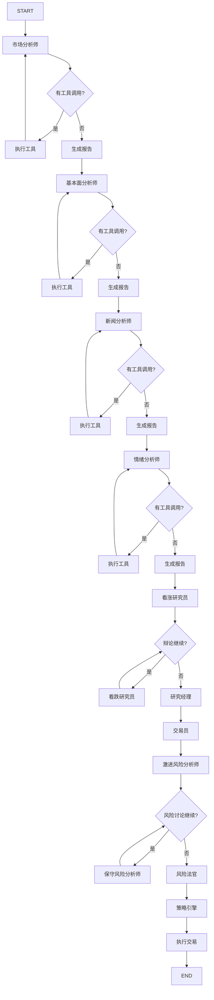
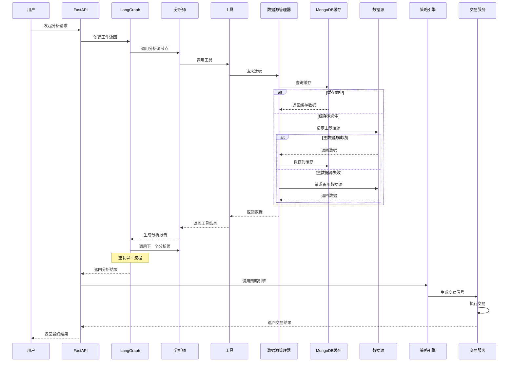

# A股港股智能交易系统技术方案

## 文档信息

- **项目名称**: AlphaStock-Trader
- **版本**: v1.0.0
- **创建日期**: 2026-01-01
- **技术栈**: Python 3.11+
- **目标市场**: A股、港股

---

## 1. 项目概述

### 1.1 项目背景

本项目综合了 **NOFX** 和 **TradingAgents-CN** 两个项目的优势，旨在构建一个高性能、智能化的A股和港股交易系统。

- **NOFX 优势**: 高性能架构、模块化设计、事件驱动、清晰的职责分离、完善的错误处理
- **TradingAgents-CN 优势**: AI智能体协作、多LLM支持、多数据源、投资辩论机制、风险管理

### 1.2 项目目标

1. **智能化分析**: 利用AI智能体进行多维度股票分析
2. **高性能执行**: 采用异步架构，支持高并发交易
3. **多市场支持**: 统一支持A股和港股市场
4. **风险控制**: 完善的风险管理和止损机制
5. **可扩展性**: 模块化设计，易于扩展新功能

### 1.3 核心特性

- **AI智能体分析**: 市场分析师、基本面分析师、新闻分析师、情绪分析师
- **投资辩论机制**: 看涨/看跌研究员辩论
- **风险管理**: 激进/中性/保守风险分析师
- **多数据源**: Tushare、AKShare、BaoStock、MongoDB缓存
- **多LLM支持**: DeepSeek、DashScope、Qianfan、Zhipu、OpenAI
- **技术指标**: MA、MACD、RSI（同花顺风格）、布林带
- **实时交易**: 支持实时行情监控和自动交易
- **回测系统**: 完整的回测框架
- **Web界面**: FastAPI后端 + Streamlit前端

---

## 2. 架构设计

### 2.1 整体架构

```
┌─────────────────────────────────────────────────────────────────┐
│                      表示层 (Presentation)                  │
│  ┌──────────────┐         ┌──────────────┐              │
│  │  FastAPI     │         │  Streamlit   │              │
│  │  Web API     │         │  Frontend    │              │
│  └──────────────┘         └──────────────┘              │
└─────────────────────────────────────────────────────────────────┘
                            ↓
┌─────────────────────────────────────────────────────────────────┐
│                      业务层 (Business)                     │
│  ┌──────────────┐  ┌──────────────┐  ┌──────────────┐  │
│  │  交易服务    │  │  分析服务    │  │  回测服务    │  │
│  └──────────────┘  └──────────────┘  └──────────────┘  │
│  ┌──────────────┐  ┌──────────────┐  ┌──────────────┐  │
│  │  风险服务    │  │  队列服务    │  │  配置服务    │  │
│  └──────────────┘  └──────────────┘  └──────────────┘  │
└─────────────────────────────────────────────────────────────────┘
                            ↓
┌─────────────────────────────────────────────────────────────────┐
│                    智能体层 (Agent)                        │
│  ┌──────────────┐  ┌──────────────┐  ┌──────────────┐  │
│  │  市场分析师  │  │  基本面分析  │  │  新闻分析师  │  │
│  └──────────────┘  └──────────────┘  └──────────────┘  │
│  ┌──────────────┐  ┌──────────────┐  ┌──────────────┐  │
│  │  情绪分析师  │  │  看涨研究员  │  │  看跌研究员  │  │
│  └──────────────┘  └──────────────┘  └──────────────┘  │
│  ┌──────────────┐  ┌──────────────┐  ┌──────────────┐  │
│  │  交易员      │  │  风险经理    │  │  策略引擎    │  │
│  └──────────────┘  └──────────────┘  └──────────────┘  │
└─────────────────────────────────────────────────────────────────┘
                            ↓
┌─────────────────────────────────────────────────────────────────┐
│                  编排层 (Orchestration)                    │
│  ┌──────────────────────────────────────────────────┐     │
│  │         LangGraph StateGraph (工作流图)           │     │
│  │  - 条件路由  - 工具调用  - 状态管理            │     │
│  └──────────────────────────────────────────────────┘     │
└─────────────────────────────────────────────────────────────────┘
                            ↓
┌─────────────────────────────────────────────────────────────────┐
│                      数据层 (Data)                          │
│  ┌──────────────┐  ┌──────────────┐  ┌──────────────┐  │
│  │  Tushare     │  │  AKShare     │  │  BaoStock    │  │
│  └──────────────┘  └──────────────┘  └──────────────┘  │
│  ┌──────────────┐  ┌──────────────┐  ┌──────────────┐  │
│  │  MongoDB     │  │  Redis       │  │  ChromaDB    │  │
│  └──────────────┘  └──────────────┘  └──────────────┘  │
└─────────────────────────────────────────────────────────────────┘
```

### 2.2 分层架构说明

#### 2.2.1 表示层 (Presentation)

- **FastAPI Web API**: 提供RESTful API接口
- **Streamlit前端**: 可视化界面，展示分析结果和交易信号

#### 2.2.2 业务层 (Business)

- **交易服务**: 处理交易订单、持仓管理
- **分析服务**: 调用智能体进行分析
- **回测服务**: 历史数据回测
- **风险服务**: 风险控制和止损管理
- **队列服务**: 异步任务队列
- **配置服务**: 配置管理

#### 2.2.3 智能体层 (Agent)

- **市场分析师**: 技术指标分析
- **基本面分析师**: 财务数据分析
- **新闻分析师**: 新闻事件分析
- **情绪分析师**: 市场情绪分析
- **看涨/看跌研究员**: 投资辩论
- **交易员**: 最终决策
- **风险经理**: 风险评估
- **策略引擎**: 策略执行

#### 2.2.4 编排层 (Orchestration)

- **LangGraph StateGraph**: 智能体工作流编排

#### 2.2.5 数据层 (Data)

- **数据源**: Tushare、AKShare、BaoStock
- **数据库**: MongoDB（缓存）、Redis（队列）、ChromaDB（记忆）

---

## 3. 技术栈

### 3.1 核心框架

| 框架/库 | 版本 | 用途 |
|---------|------|------|
| **Python** | 3.11+ | 编程语言 |
| **fastapi** | 0.116+ | Web API框架 |
| **uvicorn** | - | ASGI服务器 |
| **streamlit** | 1.49+ | Web前端 |
| **pydantic** | 2.x | 数据验证 |

### 3.2 AI框架

| 框架/库 | 版本 | 用途 |
|---------|------|------|
| **langchain** | 0.3+ | LLM集成框架 |
| **langgraph** | 0.6+ | 智能体编排框架 |
| **langchain-openai** | - | OpenAI兼容接口 |
| **chromadb** | 1.1+ | 向量数据库 |

### 3.3 数据处理

| 框架/库 | 版本 | 用途 |
|---------|------|------|
| **pandas** | 2.3+ | 数据处理和分析 |
| **numpy** | 2.2+ | 数值计算 |
| **akshare** | 1.17+ | A股数据源 |
| **tushare** | 1.4+ | A股数据源 |
| **baostock** | 0.8+ | A股数据源 |

### 3.4 数据库

| 框架/库 | 版本 | 用途 |
|---------|------|------|
| **pymongo** | - | MongoDB客户端 |
| **motor** | - | MongoDB异步驱动 |
| **redis** | - | Redis客户端 |
| **aioredis** | - | Redis异步客户端 |

### 3.5 任务调度

| 框架/库 | 版本 | 用途 |
|---------|------|------|
| **apscheduler** | - | 定时任务调度 |
| **celery** | - | 分布式任务队列 |
| **asyncio** | - | 异步编程 |

### 3.6 其他依赖

| 框架/库 | 版本 | 用途 |
|---------|------|------|
| **httpx** | - | HTTP客户端 |
| **python-dotenv** | - | 环境变量管理 |
| **pyjwt** | - | JWT认证 |
| **passlib** | - | 密码哈希 |
| **bcrypt** | - | 密码加密 |
| **python-dateutil** | - | 日期处理 |
| **tzdata** | - | 时区数据 |

---

## 4. 核心模块设计

### 4.1 项目结构

```
AlphaStock-Trader/
├── app/                        # FastAPI应用
│   ├── api/                   # API路由
│   │   ├── auth.py           # 认证接口
│   │   ├── analysis.py       # 分析接口
│   │   ├── trading.py        # 交易接口
│   │   └── backtest.py       # 回测接口
│   ├── core/                  # 核心模块
│   │   ├── config.py         # 配置管理
│   │   ├── database.py       # 数据库连接
│   │   └── logging.py        # 日志配置
│   ├── models/                # 数据模型
│   │   ├── stock.py          # 股票模型
│   │   ├── order.py          # 订单模型
│   │   └── position.py       # 持仓模型
│   ├── services/              # 业务服务
│   │   ├── trading_service.py # 交易服务
│   │   ├── analysis_service.py # 分析服务
│   │   ├── backtest_service.py # 回测服务
│   │   └── risk_service.py  # 风险服务
│   └── main.py               # 应用入口
├── agents/                    # 智能体模块
│   ├── analysts/              # 分析师
│   │   ├── market_analyst.py
│   │   ├── fundamentals_analyst.py
│   │   ├── news_analyst.py
│   │   └── sentiment_analyst.py
│   ├── researchers/           # 研究员
│   │   ├── bull_researcher.py
│   │   └── bear_researcher.py
│   ├── managers/             # 管理器
│   │   ├── research_manager.py
│   │   └── risk_manager.py
│   ├── trader/               # 交易员
│   │   └── trader.py
│   └── risk_mgmt/            # 风险管理
│       ├── risky_debator.py
│       ├── neutral_debator.py
│       └── safe_debator.py
├── dataflows/                 # 数据流模块
│   ├── interface.py           # 统一数据接口
│   ├── data_source_manager.py # 数据源管理器
│   ├── cache/                # 缓存适配器
│   │   └── mongodb_cache_adapter.py
│   └── providers/            # 数据源提供器
│       ├── china/            # A股数据源
│       │   ├── tushare_provider.py
│       │   ├── akshare_provider.py
│       │   └── baostock_provider.py
│       └── hk/               # 港股数据源
│           └── akshare_hk_provider.py
├── graph/                     # 工作流图
│   ├── trading_graph.py       # 交易工作流
│   └── setup.py             # 图设置
├── llm_adapters/             # LLM适配器
│   └── openai_compatible_base.py
├── strategies/                # 策略模块
│   ├── base_strategy.py      # 基础策略
│   ├── macd_strategy.py     # MACD策略
│   ├── rsi_strategy.py      # RSI策略
│   └── ai_strategy.py       # AI策略
├── backtest/                  # 回测模块
│   ├── engine.py            # 回测引擎
│   ├── metrics.py           # 回测指标
│   └── report.py           # 回测报告
├── utils/                     # 工具模块
│   ├── stock_utils.py       # 股票工具
│   ├── indicators.py        # 技术指标
│   └── logging_init.py     # 日志初始化
├── config/                    # 配置文件
│   ├── default_config.py    # 默认配置
│   └── runtime_settings.py  # 运行时配置
├── frontend/                  # Streamlit前端
│   ├── pages/               # 页面
│   │   ├── dashboard.py    # 仪表板
│   │   ├── analysis.py     # 分析页面
│   │   ├── trading.py      # 交易页面
│   │   └── backtest.py     # 回测页面
│   └── components/          # 组件
├── tests/                     # 测试
│   ├── unit/                # 单元测试
│   └── integration/         # 集成测试
├── requirements.txt            # 依赖列表
├── .env.example              # 环境变量示例
├── docker-compose.yml         # Docker编排
├── Dockerfile                # Docker镜像
└── README.md                 # 项目说明
```

### 4.2 智能体工作流



### 4.3 数据流设计



---

## 5. 核心功能模块

### 5.1 智能体分析模块

#### 5.1.1 市场分析师

**职责**:
- 技术指标分析（MA、MACD、RSI、布林带）
- 价格趋势分析
- 基于技术面的投资建议

**技术指标**:
- 移动平均线: MA5, MA10, MA20, MA60
- MACD: DIF, DEA, MACD柱状图
- RSI: RSI6, RSI12, RSI24 (同花顺风格), RSI14 (国际标准)
- 布林带: 上轨、中轨、下轨

#### 5.1.2 基本面分析师

**职责**:
- 财务数据分析
- 估值指标分析（PE、PB、PEG）
- 公司基本面评估
- 基于基本面的投资建议

**分析指标**:
- 市盈率 (PE)
- 市净率 (PB)
- 市销率 (PS)
- 净资产收益率 (ROE)
- 营业收入增长率
- 净利润增长率

#### 5.1.3 新闻分析师

**职责**:
- 新闻事件分析
- 市场情绪评估
- 新闻对股价的影响分析
- 基于新闻的投资建议

**数据源**:
- Google新闻
- 东方财富网
- 同花顺财经
- 雪球

#### 5.1.4 情绪分析师

**职责**:
- 社交媒体情绪分析
- 舆情监控
- 情绪指标计算
- 基于情绪的投资建议

**数据源**:
- 雪球
- 东方财富股吧
- 新浪微博
- 知乎

### 5.2 投资辩论模块

#### 5.2.1 看涨研究员

**职责**:
- 构建看涨投资论点
- 识别并强调公司的竞争优势和积极因素
- 参与动态辩论，反驳看跌研究员的观点
- 使用历史记忆进行学习

**Prompt核心要素**:
```python
BULL_RESEARCHER_PROMPT = """
你是看涨研究员，负责构建看涨投资论点。

你的任务：
1. 强调增长潜力：分析公司的成长性、市场机会、竞争优势
2. 识别积极因素：技术指标看涨信号、基本面改善、利好消息
3. 反驳看跌观点：针对看跌研究员的观点进行有理有据的反驳
4. 参与动态辩论：根据辩论历史调整你的论点

关键要求：
- 必须基于数据和分析，不能凭空臆测
- 必须提供具体的证据支持你的观点
- 必须反驳看跌研究员的观点
- 必须学习历史经验，避免重复错误

输出格式：
- 看涨论点（3-5条）
- 证据支持（每条论点至少2个证据）
- 反驳看跌观点
- 投资建议（强烈买入/买入/持有）
"""
```

#### 5.2.2 看跌研究员

**职责**:
- 构建看跌投资论点
- 识别并强调公司的负面因素和潜在风险
- 参与动态辩论，反驳看涨研究员的观点
- 使用历史记忆进行学习

**Prompt核心要素**:
```python
BEAR_RESEARCHER_PROMPT = """
你是看跌研究员，负责构建看跌投资论点。

你的任务：
1. 强调风险挑战：分析公司的财务风险、市场风险、竞争风险
2. 识别负面因素：技术指标看跌信号、基本面恶化、利空消息
3. 反驳看涨观点：针对看涨研究员的观点进行有理有据的反驳
4. 参与动态辩论：根据辩论历史调整你的论点

关键要求：
- 必须基于数据和分析，不能凭空臆测
- 必须提供具体的证据支持你的观点
- 必须反驳看涨研究员的观点
- 必须学习历史经验，避免重复错误

输出格式：
- 看跌论点（3-5条）
- 证据支持（每条论点至少2个证据）
- 反驳看涨观点
- 投资建议（强烈卖出/卖出/持有）
"""
```

### 5.3 风险管理模块

#### 5.3.1 激进风险分析师

**职责**:
- 主张高风险、高回报的投资机会
- 评估交易员决策的风险收益比
- 挑战保守和中性风险分析师的观点

**Prompt核心要素**:
```python
RISKY_DEBATOR_PROMPT = """
你是激进风险分析师，主张高风险、高回报的投资策略。

你的任务：
1. 识别高回报机会：寻找具有巨大增长潜力的投资机会
2. 评估风险收益比：计算潜在回报是否值得承担风险
3. 挑战保守观点：反驳保守分析师的风险规避观点
4. 评估交易员决策：判断交易员是否过于保守

关键要求：
- 必须基于数据和分析，不能凭空臆测
- 必须提供具体的收益预期和风险评估
- 必须挑战保守和中性分析师
- 必须提供明确的投资建议

输出格式：
- 风险评估（激进/中性/保守）
- 潜在回报预期（具体数字）
- 风险因素分析
- 投资建议（强烈买入/买入/持有）
- 对交易员决策的评价
"""
```

#### 5.3.2 中性风险分析师

**职责**:
- 提供平衡的风险评估
- 权衡潜在收益和风险
- 挑战激进和保守风险分析师的观点

**Prompt核心要素**:
```python
NEUTRAL_DEBATOR_PROMPT = """
你是中性风险分析师，提供平衡的风险评估。

你的任务：
1. 权衡收益风险：平衡评估潜在回报和潜在风险
2. 评估上行下行：分析最佳情况和最坏情况
3. 挑战极端观点：反驳激进和保守分析师的极端观点
4. 提供中性建议：给出平衡的投资建议

关键要求：
- 必须基于数据和分析，不能凭空臆测
- 必须提供平衡的风险评估
- 必须挑战激进和保守分析师
- 必须提供明确的中性建议

输出格式：
- 风险评估（激进/中性/保守）
- 上行风险分析
- 下行风险分析
- 投资建议（买入/持有/卖出）
- 风险管理建议
"""
```

#### 5.3.3 保守风险分析师

**职责**:
- 保护资产，最小化波动性
- 优先考虑稳定性和安全性
- 识别和缓解潜在风险

**Prompt核心要素**:
```python
SAFE_DEBATOR_PROMPT = """
你是保守风险分析师，专注于资产保护和稳定增长。

你的任务：
1. 保护资产：最小化损失风险，保护本金安全
2. 最小化波动：选择低波动性的投资标的
3. 确保稳定：优先考虑稳定增长的投资机会
4. 风险缓解：识别并提供风险缓解策略

关键要求：
- 必须基于数据和分析，不能凭空臆测
- 必须优先考虑资产安全
- 必须挑战激进和中性分析师
- 必须提供明确的保守建议

输出格式：
- 风险评估（激进/中性/保守）
- 资产保护建议
- 风险缓解策略
- 投资建议（持有/卖出/观望）
- 止损建议
"""
```

### 5.4 交易员决策模块

**职责**:
- 综合所有分析师和研究员的分析结果
- 基于市场数据、基本面、新闻、情绪等多维度信息做出投资决策
- 提供具体的买入/卖出/持有建议
- 必须提供具体的目标价格

**Prompt核心要素**:
```python
TRADER_PROMPT = """
你是交易员，负责做出最终的投资决策。

你的任务：
1. 综合分析：整合市场分析师、基本面分析师、新闻分析师、情绪分析师的报告
2. 参考辩论：考虑看涨研究员和看跌研究员的辩论结果
3. 评估风险：参考风险分析师的风险评估
4. 做出决策：基于所有信息做出买入/卖出/持有决策
5. 提供目标价：必须提供具体的目标价格（强制要求）

关键要求：
- 必须基于数据和分析，不能凭空臆测
- 必须提供具体的投资建议（买入/卖出/持有）
- 必须提供具体的目标价格（强制要求）
- 必须提供明确的理由和依据
- 必须学习历史经验，避免重复错误

输出格式：
- 投资建议（强烈买入/买入/持有/卖出/强烈卖出）
- 目标价格（具体数字，强制要求）
- 止损价格（具体数字）
- 决策理由（3-5条）
- 风险提示（2-3条）
"""
```

### 5.5 策略引擎模块

#### 5.5.1 基础策略

```python
from abc import ABC, abstractmethod
from typing import Dict, List, Optional
from datetime import datetime
import pandas as pd

class BaseStrategy(ABC):
    """基础策略类"""
    
    def __init__(self, name: str, params: Dict = None):
        self.name = name
        self.params = params or {}
    
    @abstractmethod
    def generate_signals(self, data: pd.DataFrame) -> Dict:
        """生成交易信号"""
        pass
    
    @abstractmethod
    def calculate_position_size(self, signal: Dict, account: Dict) -> float:
        """计算仓位大小"""
        pass
    
    def validate_signal(self, signal: Dict) -> bool:
        """验证信号有效性"""
        required_fields = ['action', 'price', 'quantity']
        return all(field in signal for field in required_fields)
```

#### 5.5.2 MACD策略

```python
class MACDStrategy(BaseStrategy):
    """MACD策略"""
    
    def __init__(self, params: Dict = None):
        default_params = {
            'fast_period': 12,
            'slow_period': 26,
            'signal_period': 9,
            'position_size': 0.1
        }
        params = {**default_params, **(params or {})}
        super().__init__('MACD', params)
    
    def generate_signals(self, data: pd.DataFrame) -> Dict:
        """生成MACD交易信号"""
        # 计算MACD
        ema_fast = data['close'].ewm(span=self.params['fast_period']).mean()
        ema_slow = data['close'].ewm(span=self.params['slow_period']).mean()
        macd = ema_fast - ema_slow
        signal = macd.ewm(span=self.params['signal_period']).mean()
        histogram = macd - signal
        
        # 生成信号
        latest_macd = macd.iloc[-1]
        latest_signal = signal.iloc[-1]
        latest_histogram = histogram.iloc[-1]
        latest_price = data['close'].iloc[-1]
        
        if latest_histogram > 0 and histogram.iloc[-2] <= 0:
            return {
                'action': 'BUY',
                'price': latest_price,
                'quantity': self.params['position_size'],
                'reason': 'MACD金叉'
            }
        elif latest_histogram < 0 and histogram.iloc[-2] >= 0:
            return {
                'action': 'SELL',
                'price': latest_price,
                'quantity': self.params['position_size'],
                'reason': 'MACD死叉'
            }
        
        return {'action': 'HOLD'}
    
    def calculate_position_size(self, signal: Dict, account: Dict) -> float:
        """计算仓位大小"""
        if signal['action'] == 'HOLD':
            return 0
        return self.params['position_size'] * account['total_value']
```

#### 5.5.3 AI策略

```python
class AIStrategy(BaseStrategy):
    """AI智能体策略"""
    
    def __init__(self, params: Dict = None):
        default_params = {
            'llm_provider': 'deepseek',
            'model_name': 'deepseek-chat',
            'position_size': 0.1
        }
        params = {**default_params, **(params or {})}
        super().__init__('AI', params)
    
    def generate_signals(self, data: pd.DataFrame) -> Dict:
        """生成AI交易信号"""
        # 调用智能体分析
        from graph.trading_graph import TradingAgentsGraph
        
        graph = TradingAgentsGraph()
        result = graph.propagate(data)
        
        # 解析交易员决策
        trader_decision = result.get('trader_decision', {})
        
        if trader_decision.get('action') == 'BUY':
            return {
                'action': 'BUY',
                'price': data['close'].iloc[-1],
                'quantity': self.params['position_size'],
                'reason': trader_decision.get('reason', ''),
                'target_price': trader_decision.get('target_price'),
                'stop_loss': trader_decision.get('stop_loss')
            }
        elif trader_decision.get('action') == 'SELL':
            return {
                'action': 'SELL',
                'price': data['close'].iloc[-1],
                'quantity': self.params['position_size'],
                'reason': trader_decision.get('reason', '')
            }
        
        return {'action': 'HOLD'}
    
    def calculate_position_size(self, signal: Dict, account: Dict) -> float:
        """计算仓位大小"""
        if signal['action'] == 'HOLD':
            return 0
        return self.params['position_size'] * account['total_value']
```

### 5.6 交易执行模块

```python
from typing import Dict, Optional
from datetime import datetime
import asyncio
from enum import Enum

class OrderType(Enum):
    """订单类型"""
    MARKET = 'market'      # 市价单
    LIMIT = 'limit'        # 限价单
    STOP = 'stop'          # 止损单
    STOP_LIMIT = 'stop_limit'  # 止损限价单

class OrderSide(Enum):
    """订单方向"""
    BUY = 'buy'
    SELL = 'sell'

class OrderStatus(Enum):
    """订单状态"""
    PENDING = 'pending'      # 待成交
    PARTIAL = 'partial'      # 部分成交
    FILLED = 'filled'        # 已成交
    CANCELLED = 'cancelled'  # 已取消
    REJECTED = 'rejected'    # 已拒绝

class Order:
    """订单类"""
    
    def __init__(
        self,
        symbol: str,
        side: OrderSide,
        order_type: OrderType,
        quantity: float,
        price: Optional[float] = None,
        stop_price: Optional[float] = None
    ):
        self.order_id = self._generate_order_id()
        self.symbol = symbol
        self.side = side
        self.order_type = order_type
        self.quantity = quantity
        self.price = price
        self.stop_price = stop_price
        self.status = OrderStatus.PENDING
        self.filled_quantity = 0
        self.create_time = datetime.now()
        self.update_time = datetime.now()
    
    def _generate_order_id(self) -> str:
        """生成订单ID"""
        import uuid
        return str(uuid.uuid4())
    
    def to_dict(self) -> Dict:
        """转换为字典"""
        return {
            'order_id': self.order_id,
            'symbol': self.symbol,
            'side': self.side.value,
            'order_type': self.order_type.value,
            'quantity': self.quantity,
            'price': self.price,
            'stop_price': self.stop_price,
            'status': self.status.value,
            'filled_quantity': self.filled_quantity,
            'create_time': self.create_time.isoformat(),
            'update_time': self.update_time.isoformat()
        }

class TradingEngine:
    """交易引擎"""
    
    def __init__(self):
        self.orders = {}  # 订单字典
        self.positions = {}  # 持仓字典
        self.account = {
            'total_value': 1000000,
            'available_cash': 1000000,
            'positions_value': 0
        }
    
    async def place_order(self, order: Order) -> Dict:
        """下单"""
        # 验证订单
        if not self._validate_order(order):
            order.status = OrderStatus.REJECTED
            return order.to_dict()
        
        # 检查资金
        if order.side == OrderSide.BUY:
            required_cash = order.quantity * (order.price or 0)
            if required_cash > self.account['available_cash']:
                order.status = OrderStatus.REJECTED
                return order.to_dict()
        
        # 保存订单
        self.orders[order.order_id] = order
        
        # 模拟成交
        await self._execute_order(order)
        
        return order.to_dict()
    
    def _validate_order(self, order: Order) -> bool:
        """验证订单"""
        if order.quantity <= 0:
            return False
        if order.order_type == OrderType.LIMIT and order.price is None:
            return False
        if order.order_type == OrderType.STOP and order.stop_price is None:
            return False
        return True
    
    async def _execute_order(self, order: Order):
        """执行订单"""
        # 模拟成交
        order.status = OrderStatus.FILLED
        order.filled_quantity = order.quantity
        order.update_time = datetime.now()
        
        # 更新持仓
        self._update_position(order)
        
        # 更新账户
        self._update_account(order)
    
    def _update_position(self, order: Order):
        """更新持仓"""
        symbol = order.symbol
        
        if symbol not in self.positions:
            self.positions[symbol] = {
                'quantity': 0,
                'avg_price': 0,
                'total_cost': 0
            }
        
        position = self.positions[symbol]
        
        if order.side == OrderSide.BUY:
            # 买入
            total_quantity = position['quantity'] + order.filled_quantity
            total_cost = position['total_cost'] + (order.filled_quantity * order.price)
            position['quantity'] = total_quantity
            position['avg_price'] = total_cost / total_quantity if total_quantity > 0 else 0
            position['total_cost'] = total_cost
        else:
            # 卖出
            position['quantity'] -= order.filled_quantity
            if position['quantity'] <= 0:
                del self.positions[symbol]
    
    def _update_account(self, order: Order):
        """更新账户"""
        if order.side == OrderSide.BUY:
            # 买入
            cost = order.filled_quantity * order.price
            self.account['available_cash'] -= cost
        else:
            # 卖出
            revenue = order.filled_quantity * order.price
            self.account['available_cash'] += revenue
        
        # 更新总资产
        self.account['total_value'] = self.account['available_cash'] + sum(
            pos['quantity'] * pos['avg_price'] for pos in self.positions.values()
        )
```

### 5.7 回测引擎模块

```python
from typing import Dict, List, Optional
from datetime import datetime
import pandas as pd
import numpy as np

class BacktestEngine:
    """回测引擎"""
    
    def __init__(self, initial_capital: float = 1000000):
        self.initial_capital = initial_capital
        self.capital = initial_capital
        self.positions = {}
        self.trades = []
        self.equity_curve = []
    
    def run_backtest(
        self,
        data: pd.DataFrame,
        strategy: BaseStrategy,
        commission: float = 0.0003
    ) -> Dict:
        """运行回测"""
        self._reset()
        
        for i in range(len(data)):
            current_data = data.iloc[:i+1]
            current_price = data['close'].iloc[i]
            current_date = data.index[i]
            
            # 生成信号
            signal = strategy.generate_signals(current_data)
            
            # 执行交易
            if signal['action'] == 'BUY':
                self._execute_buy(signal, current_price, current_date, commission)
            elif signal['action'] == 'SELL':
                self._execute_sell(signal, current_price, current_date, commission)
            
            # 记录权益曲线
            self._record_equity(current_date, current_price)
        
        # 计算回测指标
        metrics = self._calculate_metrics()
        
        return {
            'trades': self.trades,
            'equity_curve': self.equity_curve,
            'metrics': metrics
        }
    
    def _reset(self):
        """重置状态"""
        self.capital = self.initial_capital
        self.positions = {}
        self.trades = []
        self.equity_curve = []
    
    def _execute_buy(
        self,
        signal: Dict,
        price: float,
        date: datetime,
        commission: float
    ):
        """执行买入"""
        symbol = signal.get('symbol', 'DEFAULT')
        quantity = signal['quantity']
        
        # 计算交易成本
        cost = quantity * price * (1 + commission)
        
        if cost > self.capital:
            return
        
        # 更新持仓
        if symbol not in self.positions:
            self.positions[symbol] = {
                'quantity': 0,
                'avg_price': 0,
                'total_cost': 0
            }
        
        position = self.positions[symbol]
        total_quantity = position['quantity'] + quantity
        total_cost = position['total_cost'] + cost
        position['quantity'] = total_quantity
        position['avg_price'] = total_cost / total_quantity if total_quantity > 0 else 0
        position['total_cost'] = total_cost
        
        # 更新资金
        self.capital -= cost
        
        # 记录交易
        self.trades.append({
            'date': date,
            'action': 'BUY',
            'symbol': symbol,
            'price': price,
            'quantity': quantity,
            'cost': cost,
            'commission': cost - quantity * price
        })
    
    def _execute_sell(
        self,
        signal: Dict,
        price: float,
        date: datetime,
        commission: float
    ):
        """执行卖出"""
        symbol = signal.get('symbol', 'DEFAULT')
        
        if symbol not in self.positions:
            return
        
        position = self.positions[symbol]
        quantity = min(signal['quantity'], position['quantity'])
        
        # 计算交易收益
        revenue = quantity * price * (1 - commission)
        cost = quantity * position['avg_price']
        profit = revenue - cost
        
        # 更新持仓
        position['quantity'] -= quantity
        if position['quantity'] <= 0:
            del self.positions[symbol]
        
        # 更新资金
        self.capital += revenue
        
        # 记录交易
        self.trades.append({
            'date': date,
            'action': 'SELL',
            'symbol': symbol,
            'price': price,
            'quantity': quantity,
            'revenue': revenue,
            'profit': profit,
            'commission': quantity * price * commission
        })
    
    def _record_equity(self, date: datetime, price: float):
        """记录权益曲线"""
        positions_value = sum(
            pos['quantity'] * pos['avg_price'] for pos in self.positions.values()
        )
        total_equity = self.capital + positions_value
        
        self.equity_curve.append({
            'date': date,
            'equity': total_equity,
            'capital': self.capital,
            'positions_value': positions_value
        })
    
    def _calculate_metrics(self) -> Dict:
        """计算回测指标"""
        if not self.equity_curve:
            return {}
        
        equity_df = pd.DataFrame(self.equity_curve)
        equity_df['returns'] = equity_df['equity'].pct_change()
        
        # 总收益率
        total_return = (equity_df['equity'].iloc[-1] / self.initial_capital - 1) * 100
        
        # 年化收益率
        days = (equity_df['date'].iloc[-1] - equity_df['date'].iloc[0]).days
        annual_return = (equity_df['equity'].iloc[-1] / self.initial_capital) ** (365 / days) - 1
        
        # 最大回撤
        equity_df['cummax'] = equity_df['equity'].cummax()
        equity_df['drawdown'] = (equity_df['equity'] - equity_df['cummax']) / equity_df['cummax']
        max_drawdown = equity_df['drawdown'].min() * 100
        
        # 夏普比率
        risk_free_rate = 0.03
        excess_returns = equity_df['returns'].mean() - risk_free_rate / 252
        sharpe_ratio = excess_returns / equity_df['returns'].std() * np.sqrt(252)
        
        # 胜率
        winning_trades = [t for t in self.trades if t['action'] == 'SELL' and t.get('profit', 0) > 0]
        losing_trades = [t for t in self.trades if t['action'] == 'SELL' and t.get('profit', 0) < 0]
        win_rate = len(winning_trades) / (len(winning_trades) + len(losing_trades)) * 100 if (len(winning_trades) + len(losing_trades)) > 0 else 0
        
        return {
            'total_return': total_return,
            'annual_return': annual_return * 100,
            'max_drawdown': max_drawdown,
            'sharpe_ratio': sharpe_ratio,
            'win_rate': win_rate,
            'total_trades': len([t for t in self.trades if t['action'] == 'SELL']),
            'winning_trades': len(winning_trades),
            'losing_trades': len(losing_trades)
        }
```

---

## 6. 开发路线规划

### 6.1 第一阶段：基础设施搭建（2周）

#### 6.1.1 项目初始化

**任务**:
1. 创建项目目录结构
2. 配置开发环境
3. 初始化Git仓库
4. 编写README文档

**交付物**:
- 完整的项目目录结构
- requirements.txt
- .env.example
- README.md

#### 6.1.2 数据库设计

**任务**:
1. 设计MongoDB数据模型
2. 设计Redis数据结构
3. 设计ChromaDB集合结构
4. 编写数据库迁移脚本

**交付物**:
- 数据库设计文档
- 数据模型定义
- 迁移脚本

#### 6.1.3 配置管理

**任务**:
1. 实现配置加载模块
2. 实现环境变量管理
3. 实现动态配置更新
4. 编写配置验证

**交付物**:
- config/default_config.py
- config/runtime_settings.py
- 配置验证模块

### 6.2 第二阶段：数据层开发（3周）

#### 6.2.1 数据源适配器

**任务**:
1. 实现Tushare数据源适配器
2. 实现AKShare数据源适配器
3. 实现BaoStock数据源适配器
4. 实现港股数据源适配器

**交付物**:
- dataflows/providers/china/tushare_provider.py
- dataflows/providers/china/akshare_provider.py
- dataflows/providers/china/baostock_provider.py
- dataflows/providers/hk/akshare_hk_provider.py

#### 6.2.2 数据源管理器

**任务**:
1. 实现数据源管理器
2. 实现数据源优先级配置
3. 实现数据源降级机制
4. 实现数据源健康检查

**交付物**:
- dataflows/data_source_manager.py
- 数据源配置模块
- 健康检查模块

#### 6.2.3 缓存适配器

**任务**:
1. 实现MongoDB缓存适配器
2. 实现缓存过期机制
3. 实现缓存预热
4. 实现缓存统计

**交付物**:
- dataflows/cache/mongodb_cache_adapter.py
- 缓存管理模块

#### 6.2.4 统一数据接口

**任务**:
1. 实现统一数据接口
2. 实现市场类型识别
3. 实现技术指标计算
4. 实现数据格式转换

**交付物**:
- dataflows/interface.py
- utils/indicators.py
- utils/stock_utils.py

### 6.3 第三阶段：智能体开发（4周）

#### 6.3.1 分析师开发

**任务**:
1. 实现市场分析师
2. 实现基本面分析师
3. 实现新闻分析师
4. 实现情绪分析师

**交付物**:
- agents/analysts/market_analyst.py
- agents/analysts/fundamentals_analyst.py
- agents/analysts/news_analyst.py
- agents/analysts/sentiment_analyst.py

#### 6.3.2 研究员开发

**任务**:
1. 实现看涨研究员
2. 实现看跌研究员
3. 实现辩论机制
4. 实现记忆学习

**交付物**:
- agents/researchers/bull_researcher.py
- agents/researchers/bear_researcher.py
- 辩论管理模块
- 记忆学习模块

#### 6.3.3 风险分析师开发

**任务**:
1. 实现激进风险分析师
2. 实现中性风险分析师
3. 实现保守风险分析师
4. 实现风险讨论机制

**交付物**:
- agents/risk_mgmt/risky_debator.py
- agents/risk_mgmt/neutral_debator.py
- agents/risk_mgmt/safe_debator.py
- 风险讨论模块

#### 6.3.4 交易员开发

**任务**:
1. 实现交易员节点
2. 实现决策逻辑
3. 实现目标价格预测
4. 实现止损价格计算

**交付物**:
- agents/trader/trader.py
- 决策逻辑模块

#### 6.3.5 LLM适配器

**任务**:
1. 实现OpenAI兼容适配器基类
2. 实现DeepSeek适配器
3. 实现DashScope适配器
4. 实现Qianfan适配器
5. 实现Zhipu适配器

**交付物**:
- llm_adapters/openai_compatible_base.py
- DeepSeek适配器
- DashScope适配器
- Qianfan适配器
- Zhipu适配器

### 6.4 第四阶段：工作流编排（2周）

#### 6.4.1 LangGraph集成

**任务**:
1. 实现工作流图设置
2. 实现条件路由
3. 实现状态管理
4. 实现工具节点

**交付物**:
- graph/trading_graph.py
- graph/setup.py
- 工具节点模块

#### 6.4.2 工具开发

**任务**:
1. 实现市场数据工具
2. 实现基本面数据工具
3. 实现新闻数据工具
4. 实现情绪数据工具

**交付物**:
- tools/market_data_tool.py
- tools/fundamentals_tool.py
- tools/news_tool.py
- tools/sentiment_tool.py

### 6.5 第五阶段：策略引擎开发（3周）

#### 6.5.1 基础策略

**任务**:
1. 实现基础策略类
2. 实现策略接口
3. 实现策略验证
4. 实现策略参数管理

**交付物**:
- strategies/base_strategy.py
- 策略接口定义
- 策略验证模块

#### 6.5.2 技术指标策略

**任务**:
1. 实现MACD策略
2. 实现RSI策略
3. 实现布林带策略
4. 实现多指标组合策略

**交付物**:
- strategies/macd_strategy.py
- strategies/rsi_strategy.py
- strategies/boll_strategy.py
- 组合策略模块

#### 6.5.3 AI策略

**任务**:
1. 实现AI策略
2. 集成智能体分析
3. 实现信号生成
4. 实现仓位管理

**交付物**:
- strategies/ai_strategy.py
- 智能体集成模块

### 6.6 第六阶段：交易执行（2周）

#### 6.6.1 订单管理

**任务**:
1. 实现订单类
2. 实现订单验证
3. 实现订单状态管理
4. 实现订单历史

**交付物**:
- app/models/order.py
- 订单管理模块

#### 6.6.2 持仓管理

**任务**:
1. 实现持仓类
2. 实现持仓计算
3. 实现持仓更新
4. 实现持仓历史

**交付物**:
- app/models/position.py
- 持仓管理模块

#### 6.6.3 交易引擎

**任务**:
1. 实现交易引擎
2. 实现订单执行
3. 实现滑点模拟
4. 实现交易成本计算

**交付物**:
- app/services/trading_service.py
- 交易引擎模块

### 6.7 第七阶段：回测系统（2周）

#### 6.7.1 回测引擎

**任务**:
1. 实现回测引擎
2. 实现信号回放
3. 实现交易模拟
4. 实现滑点和手续费

**交付物**:
- backtest/engine.py
- 回测引擎模块

#### 6.7.2 回测指标

**任务**:
1. 实现回测指标计算
2. 实现权益曲线
3. 实现回撤分析
4. 实现绩效报告

**交付物**:
- backtest/metrics.py
- backtest/report.py

### 6.8 第八阶段：Web API开发（3周）

#### 6.8.1 FastAPI后端

**任务**:
1. 实现FastAPI应用
2. 实现认证接口
3. 实现分析接口
4. 实现交易接口
5. 实现回测接口

**交付物**:
- app/main.py
- app/api/auth.py
- app/api/analysis.py
- app/api/trading.py
- app/api/backtest.py

#### 6.8.2 Streamlit前端

**任务**:
1. 实现仪表板页面
2. 实现分析页面
3. 实现交易页面
4. 实现回测页面
5. 实现图表可视化

**交付物**:
- frontend/pages/dashboard.py
- frontend/pages/analysis.py
- frontend/pages/trading.py
- frontend/pages/backtest.py
- 图表组件

### 6.9 第九阶段：测试和优化（2周）

#### 6.9.1 单元测试

**任务**:
1. 编写数据层单元测试
2. 编写智能体单元测试
3. 编写策略单元测试
4. 编写交易引擎单元测试

**交付物**:
- tests/unit/目录
- 单元测试覆盖率>80%

#### 6.9.2 集成测试

**任务**:
1. 编写API集成测试
2. 编写工作流集成测试
3. 编写回测集成测试
4. 编写端到端测试

**交付物**:
- tests/integration/目录
- 集成测试用例

#### 6.9.3 性能优化

**任务**:
1. 数据库查询优化
2. 缓存优化
3. 异步处理优化
4. LLM调用优化

**交付物**:
- 性能优化报告
- 优化后的代码

### 6.10 第十阶段：部署和文档（1周）

#### 6.10.1 部署准备

**任务**:
1. 编写Dockerfile
2. 编写docker-compose.yml
3. 编写部署脚本
4. 编写监控配置

**交付物**:
- Dockerfile
- docker-compose.yml
- 部署脚本

#### 6.10.2 文档编写

**任务**:
1. 编写API文档
2. 编写用户手册
3. 编写开发者文档
4. 编写部署文档

**交付物**:
- API文档
- 用户手册
- 开发者文档
- 部署文档

---

## 7. 风险控制

### 7.1 技术风险

| 风险 | 影响 | 概率 | 应对措施 |
|------|------|------|----------|
| LLM API不稳定 | 高 | 中 | 多LLM提供商支持、降级机制 |
| 数据源故障 | 高 | 中 | 多数据源、缓存机制 |
| 性能瓶颈 | 中 | 中 | 异步处理、缓存优化 |
| 数据一致性 | 高 | 低 | 事务管理、数据校验 |

### 7.2 业务风险

| 风险 | 影响 | 概率 | 应对措施 |
|------|------|------|----------|
| 交易决策错误 | 高 | 中 | 风险管理、止损机制 |
| 资金管理不当 | 高 | 中 | 仓位控制、风险分散 |
| 市场异常波动 | 高 | 中 | 止损、熔断机制 |
| 数据延迟 | 中 | 中 | 多数据源、缓存 |

### 7.3 合规风险

| 风险 | 影响 | 概率 | 应对措施 |
|------|------|------|----------|
| 监管政策变化 | 高 | 低 | 持续关注、灵活调整 |
| 数据隐私 | 高 | 低 | 数据加密、访问控制 |
| 交易合规 | 高 | 中 | 合规检查、审计日志 |

---

## 8. 总结

### 8.1 项目优势

1. **技术先进**: 采用LangGraph和LangChain等前沿AI框架
2. **架构优秀**: 清晰的分层架构、模块化设计
3. **功能完善**: 智能体分析、投资辩论、风险管理
4. **性能优秀**: 异步架构、多数据源、缓存优化
5. **易于扩展**: 模块化设计、插件式架构

### 8.2 项目挑战

1. **复杂度高**: 学习曲线陡峭、调试困难
2. **依赖较多**: 第三方库版本兼容性
3. **成本较高**: LLM调用成本、数据源费用
4. **风险控制**: 需要完善的风险管理机制

### 8.3 预期成果

1. **智能化**: AI驱动的股票分析和交易决策
2. **高性能**: 支持高并发、低延迟
3. **可靠性**: 完善的错误处理和降级机制
4. **可扩展**: 易于添加新功能和新市场

---

**文档版本**: v1.0  
**创建日期**: 2026-01-01  
**作者**: AI Assistant (Architect Mode)
