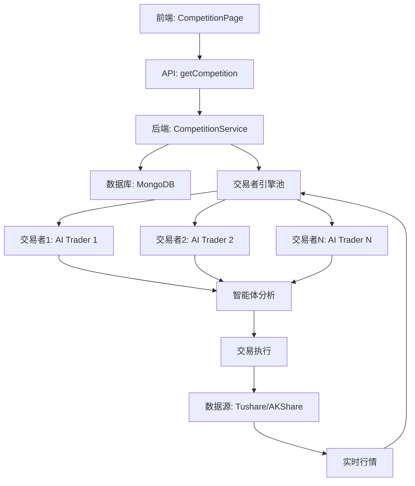
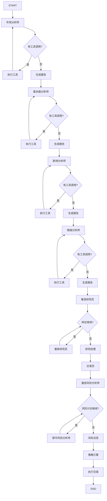
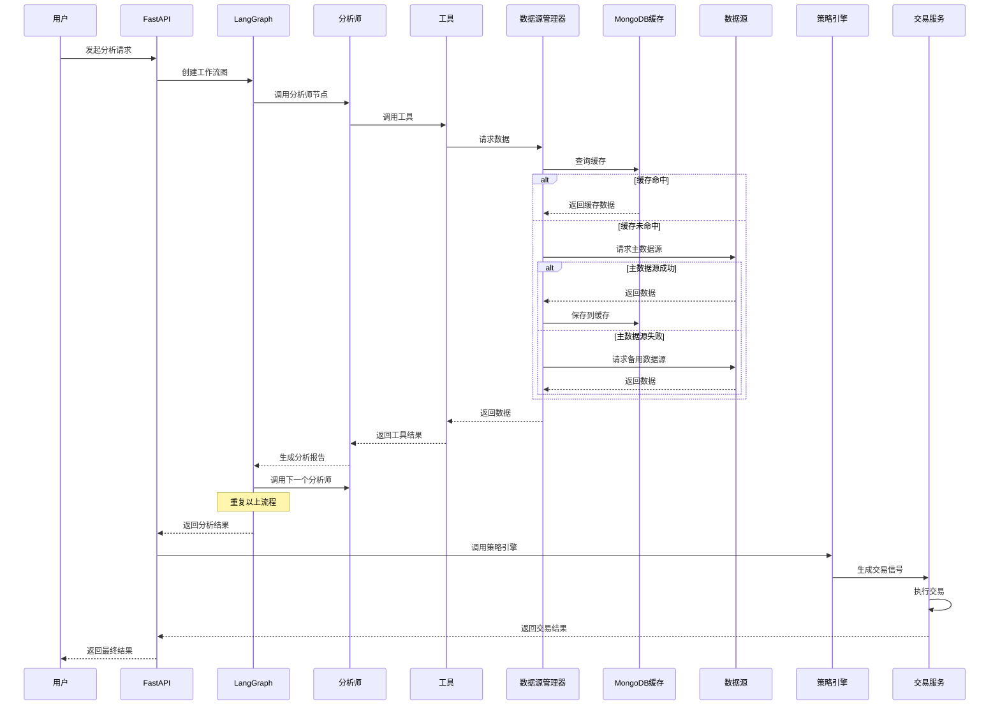

# A股港股智能交易系统技术方案

## 文档信息

- **项目名称**: AlphaStock-Trader
- **版本**: v1.0.0
- **创建日期**: 2026-01-01
- **后端技术栈**: Python 3.11+
- **前端技术栈**: React 18 + TypeScript + Vite
- **目标市场**: A股、港股

---

## 1. 项目概述

### 1.1 项目背景

本项目综合了 **NOFX** 和 **TradingAgents-CN** 两个项目的优势，旨在构建一个高性能、智能化的A股和港股交易系统。

- **NOFX 优势**: 高性能架构、模块化设计、事件驱动、清晰的职责分离、完善的错误处理
- **TradingAgents-CN 优势**: AI智能体协作、多LLM支持、多数据源、投资辩论机制、风险管理

### 1.2 项目目标

1. **智能化分析**: 利用AI智能体进行多维度股票分析
2. **高性能执行**: 采用异步架构，支持高并发交易
3. **多市场支持**: 统一支持A股和港股市场
4. **风险控制**: 完善的风险管理和止损机制
5. **可扩展性**: 模块化设计，易于扩展新功能

### 1.3 核心特性

- **AI智能体分析**: 市场分析师、基本面分析师、新闻分析师、情绪分析师
- **投资辩论机制**: 看涨/看跌研究员辩论
- **风险管理**: 激进/中性/保守风险分析师
- **多数据源**: Tushare、AKShare、BaoStock、MongoDB缓存
- **多LLM支持**: DeepSeek、DashScope、Qianfan、Zhipu、OpenAI
- **技术指标**: MA、MACD、RSI（同花顺风格）、布林带
- **实时交易**: 支持实时行情监控和自动交易
- **回测系统**: 完整的回测框架
- **AI竞争模式**: 参考NOFX的AI竞争模式
  - 实时排行榜：显示所有AI交易者的表现排名
  - 性能对比图表：多交易者PnL曲线对比
  - 头对头统计：交易者直接对比分析
  - 实时数据更新：15秒自动刷新
  - 交易者配置查看：点击查看详细配置
  - Punk头像：为每个交易者生成独特头像
- **Web界面**: FastAPI后端 + React前端（参考NOFX前端实现）
  - React 18.3.1 + TypeScript 5.8.3 + Vite 6.0.7
  - Zustand 5.0.2 状态管理
  - Recharts 2.15.2 + Lightweight Charts 5.1.0 图表库
  - Framer Motion 12.23.24 动画库
  - TailwindCSS 3.4.17 + Radix UI UI组件库

---

## 2. 架构设计

### 2.1 整体架构

```
┌─────────────────────────────────────────────────────────────────┐
│                      表示层 (Presentation)                  │
│  ┌──────────────┐         ┌──────────────┐              │
│  │  FastAPI     │         │  Streamlit   │              │
│  │  Web API     │         │  Frontend    │              │
│  └──────────────┘         └──────────────┘              │
└─────────────────────────────────────────────────────────────────┘
                            ↓
┌─────────────────────────────────────────────────────────────────┐
│                      业务层 (Business)                     │
│  ┌──────────────┐  ┌──────────────┐  ┌──────────────┐  │
│  │  交易服务    │  │  分析服务    │  │  回测服务    │  │
│  └──────────────┘  └──────────────┘  └──────────────┘  │
│  ┌──────────────┐  ┌──────────────┐  ┌──────────────┐  │
│  │  风险服务    │  │  队列服务    │  │  配置服务    │  │
│  └──────────────┘  └──────────────┘  └──────────────┘  │
└─────────────────────────────────────────────────────────────────┘
                            ↓
┌─────────────────────────────────────────────────────────────────┐
│                    智能体层 (Agent)                        │
│  ┌──────────────┐  ┌──────────────┐  ┌──────────────┐  │
│  │  市场分析师  │  │  基本面分析  │  │  新闻分析师  │  │
│  └──────────────┘  └──────────────┘  └──────────────┘  │
│  ┌──────────────┐  ┌──────────────┐  ┌──────────────┐  │
│  │  情绪分析师  │  │  看涨研究员  │  │  看跌研究员  │  │
│  └──────────────┘  └──────────────┘  └──────────────┘  │
│  ┌──────────────┐  ┌──────────────┐  ┌──────────────┐  │
│  │  交易员      │  │  风险经理    │  │  策略引擎    │  │
│  └──────────────┘  └──────────────┘  └──────────────┘  │
└─────────────────────────────────────────────────────────────────┘
                            ↓
┌─────────────────────────────────────────────────────────────────┐
│                  编排层 (Orchestration)                    │
│  ┌──────────────────────────────────────────────────┐     │
│  │         LangGraph StateGraph (工作流图)           │     │
│  │  - 条件路由  - 工具调用  - 状态管理            │     │
│  └──────────────────────────────────────────────────┘     │
└─────────────────────────────────────────────────────────────────┘
                            ↓
┌─────────────────────────────────────────────────────────────────┐
│                      数据层 (Data)                          │
│  ┌──────────────┐  ┌──────────────┐  ┌──────────────┐  │
│  │  Tushare     │  │  AKShare     │  │  BaoStock    │  │
│  └──────────────┘  └──────────────┘  └──────────────┘  │
│  ┌──────────────┐  ┌──────────────┐  ┌──────────────┐  │
│  │  MongoDB     │  │  Redis       │  │  ChromaDB    │  │
│  └──────────────┘  └──────────────┘  └──────────────┘  │
└─────────────────────────────────────────────────────────────────┘
```

### 2.2 分层架构说明

#### 2.2.1 表示层 (Presentation)

- **FastAPI Web API**: 提供RESTful API接口
- **Streamlit前端**: 可视化界面，展示分析结果和交易信号

#### 2.2.2 业务层 (Business)

- **交易服务**: 处理交易订单、持仓管理
- **分析服务**: 调用智能体进行分析
- **回测服务**: 历史数据回测
- **风险服务**: 风险控制和止损管理
- **队列服务**: 异步任务队列
- **配置服务**: 配置管理

#### 2.2.3 智能体层 (Agent)

- **市场分析师**: 技术指标分析
- **基本面分析师**: 财务数据分析
- **新闻分析师**: 新闻事件分析
- **情绪分析师**: 市场情绪分析
- **看涨/看跌研究员**: 投资辩论
- **交易员**: 最终决策
- **风险经理**: 风险评估
- **策略引擎**: 策略执行

#### 2.2.4 编排层 (Orchestration)

- **LangGraph StateGraph**: 智能体工作流编排

#### 2.2.5 数据层 (Data)

- **数据源**: Tushare、AKShare、BaoStock
- **数据库**: MongoDB（缓存）、Redis（队列）、ChromaDB（记忆）

---

## 3. 技术栈

### 3.1 后端核心框架

| 框架/库 | 版本 | 用途 |
|---------|------|------|
| **Python** | 3.11+ | 编程语言 |
| **fastapi** | 0.116+ | Web API框架 |
| **uvicorn** | - | ASGI服务器 |
| **pydantic** | 2.x | 数据验证 |

### 3.2 前端核心框架

| 框架/库 | 版本 | 用途 |
|---------|------|------|
| **React** | 18.3.1 | UI框架 |
| **TypeScript** | 5.8.3 | 类型系统 |
| **Vite** | 6.0.7 | 构建工具 |
| **Zustand** | 5.0.2 | 状态管理 |
| **Recharts** | 2.15.2 | 图表库 |
| **Lightweight Charts** | 5.1.0 | K线图库 |
| **Framer Motion** | 12.23.24 | 动画库 |
| **TailwindCSS** | 3.4.17 | CSS框架 |
| **Radix UI** | - | UI组件库 |
| **Lucide React** | - | 图标库 |
| **date-fns** | - | 日期处理 |
| **axios** | - | HTTP客户端 |

### 3.3 AI框架

| 框架/库 | 版本 | 用途 |
|---------|------|------|
| **langchain** | 0.3+ | LLM集成框架 |
| **langgraph** | 0.6+ | 智能体编排框架 |
| **langchain-openai** | - | OpenAI兼容接口 |
| **chromadb** | 1.1+ | 向量数据库 |

### 3.4 数据处理

| 框架/库 | 版本 | 用途 |
|---------|------|------|
| **pandas** | 2.3+ | 数据处理和分析 |
| **numpy** | 2.2+ | 数值计算 |
| **akshare** | 1.17+ | A股数据源 |
| **tushare** | 1.4+ | A股数据源 |
| **baostock** | 0.8+ | A股数据源 |

### 3.5 数据库

| 框架/库 | 版本 | 用途 |
|---------|------|------|
| **pymongo** | - | MongoDB客户端 |
| **motor** | - | MongoDB异步驱动 |
| **redis** | - | Redis客户端 |
| **aioredis** | - | Redis异步客户端 |

### 3.6 任务调度

| 框架/库 | 版本 | 用途 |
|---------|------|------|
| **apscheduler** | - | 定时任务调度 |
| **celery** | - | 分布式任务队列 |
| **asyncio** | - | 异步编程 |

### 3.7 后端其他依赖

| 框架/库 | 版本 | 用途 |
|---------|------|------|
| **httpx** | - | HTTP客户端 |
| **python-dotenv** | - | 环境变量管理 |
| **pyjwt** | - | JWT认证 |
| **passlib** | - | 密码哈希 |
| **bcrypt** | - | 密码加密 |
| **python-dateutil** | - | 日期处理 |
| **tzdata** | - | 时区数据 |

### 3.8 前端开发工具

| 框架/库 | 版本 | 用途 |
|---------|------|------|
| **@vitejs/plugin-react** | - | Vite React插件 |
| **@types/react** | - | React类型定义 |
| **@types/react-dom** | - | React DOM类型定义 |
| **eslint** | - | 代码检查 |
| **eslint-plugin-react** | - | React ESLint插件 |
| **eslint-plugin-react-hooks** | - | React Hooks插件 |
| **prettier** | - | 代码格式化 |
| **postcss** | - | CSS处理 |
| **autoprefixer** | - | CSS自动前缀 |

---

## 4. 核心模块设计

### 4.1 项目结构

```
AlphaStock-Trader/
├── app/                        # FastAPI应用
│   ├── api/                   # API路由
│   │   ├── auth.py           # 认证接口
│   │   ├── analysis.py       # 分析接口
│   │   ├── trading.py        # 交易接口
│   │   └── backtest.py       # 回测接口
│   ├── core/                  # 核心模块
│   │   ├── config.py         # 配置管理
│   │   ├── database.py       # 数据库连接
│   │   └── logging.py        # 日志配置
│   ├── models/                # 数据模型
│   │   ├── stock.py          # 股票模型
│   │   ├── order.py          # 订单模型
│   │   └── position.py       # 持仓模型
│   ├── services/              # 业务服务
│   │   ├── trading_service.py # 交易服务
│   │   ├── analysis_service.py # 分析服务
│   │   ├── backtest_service.py # 回测服务
│   │   └── risk_service.py  # 风险服务
│   └── main.py               # 应用入口
├── frontend/                  # React前端（参考NOFX前端实现）
│   ├── public/               # 静态资源
│   │   ├── images/           # 图片资源
│   │   ├── icons/            # 图标资源
│   │   └── exchange-icons/  # 交易所图标
│   ├── src/                  # 源代码
│   │   ├── components/       # 组件库
│   │   │   ├── charts/          # 图表组件
│   │   │   ├── ui/              # UI组件
│   │   │   ├── strategy/        # 策略组件
│   │   │   ├── traders/         # 交易者组件
│   │   │   ├── landing/         # Landing页面
│   │   │   ├── faq/             # FAQ组件
│   │   ├── pages/            # 页面组件
│   │   ├── contexts/         # 上下文管理
│   │   ├── hooks/            # 自定义Hooks
│   │   ├── stores/           # 状态管理
│   │   ├── utils/            # 工具函数
│   │   ├── constants/        # 常量定义
│   │   ├── types.ts          # TypeScript类型定义
│   │   ├── App.tsx           # 应用入口
│   │   └── main.tsx          # 主页面
│   ├── package.json           # 依赖配置
│   ├── vite.config.ts         # Vite配置
│   ├── tailwind.config.js      # TailwindCSS配置
│   ├── tsconfig.json         # TypeScript配置
│   ├── .eslintrc.js         # ESLint配置
│   ├── .prettierrc.json      # Prettier配置
│   └── index.html            # HTML入口
├── agents/                    # 智能体模块
│   ├── analysts/              # 分析师
│   │   ├── market_analyst.py
│   │   ├── fundamentals_analyst.py
│   │   ├── news_analyst.py
│   │   └── sentiment_analyst.py
│   ├── researchers/           # 研究员
│   │   ├── bull_researcher.py
│   │   └── bear_researcher.py
│   ├── managers/             # 管理器
│   │   ├── research_manager.py
│   │   └── risk_manager.py
│   ├── trader/               # 交易员
│   │   └── trader.py
│   └── risk_mgmt/            # 风险管理
│       ├── risky_debator.py
│       ├── neutral_debator.py
│       └── safe_debator.py
├── dataflows/                 # 数据流模块
│   ├── interface.py           # 统一数据接口
│   ├── data_source_manager.py # 数据源管理器
│   ├── cache/                # 缓存适配器
│   │   └── mongodb_cache_adapter.py
│   └── providers/            # 数据源提供器
│       ├── china/            # A股数据源
│       │   ├── tushare_provider.py
│       │   ├── akshare_provider.py
│       │   └── baostock_provider.py
│       └── hk/               # 港股数据源
│           └── akshare_hk_provider.py
├── graph/                     # 工作流图
│   ├── trading_graph.py       # 交易工作流
│   └── setup.py             # 图设置
├── llm_adapters/             # LLM适配器
│   └── openai_compatible_base.py
├── strategies/                # 策略模块
│   ├── base_strategy.py      # 基础策略
│   ├── macd_strategy.py     # MACD策略
│   ├── rsi_strategy.py      # RSI策略
│   └── ai_strategy.py       # AI策略
├── backtest/                  # 回测模块
│   ├── engine.py            # 回测引擎
│   ├── metrics.py           # 回测指标
│   └── report.py           # 回测报告
├── utils/                     # 工具模块
│   ├── stock_utils.py       # 股票工具
│   ├── indicators.py        # 技术指标
│   └── logging_init.py     # 日志初始化
├── config/                    # 配置文件
│   ├── default_config.py    # 默认配置
│   └── runtime_settings.py  # 运行时配置
├── tests/                     # 测试
│   ├── unit/                # 单元测试
│   └── integration/         # 集成测试
├── requirements.txt            # 依赖列表
├── .env.example              # 环境变量示例
├── docker-compose.yml         # Docker编排
├── Dockerfile                # Docker镜像
└── README.md                 # 项目说明
```

### 4.2 前端架构设计（参考NOFX前端实现）

#### 4.2.1 前端技术栈详解

**核心框架**:
- **React 18.3.1**: 采用最新的React特性，包括Hooks、Suspense、Concurrent Mode
- **TypeScript 5.8.3**: 强类型系统，提供完整的类型安全和智能提示
- **Vite 6.0.7**: 极速的构建工具，支持HMR（热模块替换）和优化的生产构建

**状态管理**:
- **Zustand 5.0.2**: 轻量级状态管理库，API简洁，性能优异
  - 全局状态管理（用户信息、交易状态、市场数据）
  - 持久化存储（localStorage同步）
  - 中间件支持（日志、时间旅行）

**UI组件库**:
- **Radix UI**: 无样式的可访问性组件库
  - Dialog、Dropdown Menu、Popover、Tooltip、Toast等
  - 完整的键盘导航和屏幕阅读器支持
- **TailwindCSS 3.4.17**: 实用优先的CSS框架
  - 响应式设计
  - 深色模式支持
  - 自定义主题配置

**图表库**:
- **Recharts 2.15.2**: 声明式React图表库
  - LineChart、BarChart、AreaChart、PieChart等
  - 自定义Tooltip和Legend
  - 响应式图表
- **Lightweight Charts 5.1.0**: 高性能K线图库
  - 专业的金融图表
  - 实时数据更新
  - 缩放和平移支持

**动画库**:
- **Framer Motion 12.23.24**: React动画库
  - 页面过渡动画
  - 手势支持
  - 布局动画

**工具库**:
- **Lucide React**: 图标库（200+图标）
- **date-fns**: 日期处理工具
- **axios**: HTTP客户端，支持拦截器
- **clsx**: 条件类名工具

#### 4.2.2 前端项目结构详解

```
frontend/
├── public/                          # 静态资源
│   ├── images/                      # 图片资源
│   │   ├── logo.png                # Logo
│   │   ├── hero-bg.png             # 首页背景
│   │   └── trading-bg.png          # 交易背景
│   ├── icons/                       # 图标资源
│   │   ├── exchanges/              # 交易所图标
│   │   │   ├── a-share.svg         # A股图标
│   │   │   ├── hk-stock.svg         # 港股图标
│   │   │   └── us-stock.svg         # 美股图标
│   │   └── strategies/             # 策略图标
│   ├── fonts/                       # 字体文件
│   └── favicon.ico                  # 网站图标
├── src/                            # 源代码
│   ├── components/                  # 组件库
│   │   ├── charts/                 # 图表组件
│   │   │   ├── CandlestickChart.tsx     # K线图组件
│   │   │   ├── LineChart.tsx            # 折线图组件
│   │   │   ├── BarChart.tsx             # 柱状图组件
│   │   │   ├── PieChart.tsx             # 饼图组件
│   │   │   ├── EquityCurve.tsx          # 权益曲线
│   │   │   └── DrawdownChart.tsx        # 回撤图
│   │   ├── ui/                     # UI组件（基于Radix UI）
│   │   │   ├── Button.tsx              # 按钮组件
│   │   │   ├── Card.tsx                # 卡片组件
│   │   │   ├── Dialog.tsx              # 对话框
│   │   │   ├── DropdownMenu.tsx        # 下拉菜单
│   │   │   ├── Input.tsx               # 输入框
│   │   │   ├── Select.tsx              # 选择器
│   │   │   ├── Table.tsx               # 表格
│   │   │   ├── Tabs.tsx                # 标签页
│   │   │   ├── Toast.tsx               # 提示消息
│   │   │   └── Loading.tsx             # 加载动画
│   │   ├── strategy/               # 策略组件
│   │   │   ├── StrategyCard.tsx        # 策略卡片
│   │   │   ├── StrategyList.tsx        # 策略列表
│   │   │   ├── StrategyDetail.tsx      # 策略详情
│   │   │   ├── StrategyConfig.tsx      # 策略配置
│   │   │   └── StrategyPerformance.tsx # 策略绩效
│   │   ├── traders/                # 交易者组件
│   │   │   ├── TraderCard.tsx          # 交易者卡片
│   │   │   ├── TraderList.tsx          # 交易者列表
│   │   │   ├── TraderDetail.tsx        # 交易者详情
│   │   │   └── TraderPerformance.tsx   # 交易者绩效
│   │   ├── landing/                # Landing页面组件
│   │   │   ├── Hero.tsx                # 首页Hero区域
│   │   │   ├── Features.tsx             # 特性展示
│   │   │   ├── HowItWorks.tsx          # 工作流程
│   │   │   ├── Testimonials.tsx        # 用户评价
│   │   │   └── CTA.tsx                 # 行动号召
│   │   ├── faq/                    # FAQ组件
│   │   │   ├── FAQItem.tsx             # FAQ单项
│   │   │   └── FAQList.tsx             # FAQ列表
│   │   └── common/                 # 通用组件
│   │       ├── Header.tsx              # 页头
│   │       ├── Footer.tsx              # 页脚
│   │       ├── Sidebar.tsx             # 侧边栏
│   │       └── Layout.tsx              # 布局
│   ├── pages/                       # 页面组件
│   │   ├── Dashboard.tsx              # 仪表板页面
│   │   ├── Analysis.tsx               # 分析页面
│   │   ├── Trading.tsx                # 交易页面
│   │   ├── Backtest.tsx               # 回测页面
│   │   ├── Portfolio.tsx              # 投资组合页面
│   │   ├── Settings.tsx               # 设置页面
│   │   └── Landing.tsx                # Landing页面
│   ├── contexts/                    # 上下文管理
│   │   ├── AuthContext.tsx           # 认证上下文
│   │   ├── ThemeContext.tsx          # 主题上下文
│   │   └── WebSocketContext.tsx       # WebSocket上下文
│   ├── hooks/                       # 自定义Hooks
│   │   ├── useAuth.ts                # 认证Hook
│   │   ├── useTheme.ts               # 主题Hook
│   │   ├── useWebSocket.ts           # WebSocket Hook
│   │   ├── useMarketData.ts          # 市场数据Hook
│   │   ├── useAnalysis.ts            # 分析Hook
│   │   ├── useTrading.ts             # 交易Hook
│   │   ├── useBacktest.ts            # 回测Hook
│   │   └── useDebounce.ts            # 防抖Hook
│   ├── stores/                      # Zustand状态管理
│   │   ├── authStore.ts              # 认证状态
│   │   ├── marketStore.ts            # 市场数据状态
│   │   ├── tradingStore.ts           # 交易状态
│   │   ├── analysisStore.ts          # 分析状态
│   │   ├── backtestStore.ts          # 回测状态
│   │   ├── portfolioStore.ts         # 投资组合状态
│   │   └── settingsStore.ts          # 设置状态
│   ├── services/                    # API服务
│   │   ├── api.ts                    # API基础配置
│   │   ├── authApi.ts                # 认证API
│   │   ├── marketApi.ts              # 市场数据API
│   │   ├── tradingApi.ts             # 交易API
│   │   ├── analysisApi.ts           # 分析API
│   │   ├── backtestApi.ts            # 回测API
│   │   └── portfolioApi.ts           # 投资组合API
│   ├── utils/                       # 工具函数
│   │   ├── format.ts                 # 格式化工具
│   │   ├── date.ts                   # 日期工具
│   │   ├── validation.ts             # 验证工具
│   │   ├── cn.ts                     # 类名合并
│   │   └── constants.ts              # 常量
│   ├── types/                       # TypeScript类型定义
│   │   ├── index.ts                  # 类型导出
│   │   ├── auth.ts                   # 认证类型
│   │   ├── market.ts                 # 市场类型
│   │   ├── trading.ts                # 交易类型
│   │   ├── analysis.ts               # 分析类型
│   │   ├── backtest.ts               # 回测类型
│   │   └── portfolio.ts              # 投资组合类型
│   ├── constants/                   # 常量定义
│   │   ├── index.ts                  # 常量导出
│   │   ├── exchanges.ts              # 交易所常量
│   │   ├── markets.ts                # 市场常量
│   │   ├── strategies.ts             # 策略常量
│   │   └── traders.ts                # 交易者常量
│   ├── styles/                      # 样式文件
│   │   ├── globals.css               # 全局样式
│   │   └── themes.css                # 主题样式
│   ├── App.tsx                      # 应用入口组件
│   ├── main.tsx                     # 主入口文件
│   └── vite-env.d.ts                # Vite类型声明
├── package.json                    # 依赖配置
├── vite.config.ts                  # Vite配置
├── tailwind.config.js              # TailwindCSS配置
├── tsconfig.json                   # TypeScript配置
├── tsconfig.node.json              # Node TypeScript配置
├── .eslintrc.js                    # ESLint配置
├── .prettierrc.json                # Prettier配置
├── .env.example                    # 环境变量示例
└── index.html                      # HTML入口
```

#### 4.2.3 前端核心模块设计

##### 4.2.3.1 状态管理（Zustand）

**认证状态管理** (`stores/authStore.ts`):
```typescript
import { create } from 'zustand';
import { persist } from 'zustand/middleware';

interface AuthState {
  user: User | null;
  token: string | null;
  isAuthenticated: boolean;
  login: (credentials: LoginCredentials) => Promise<void>;
  logout: () => void;
  refreshToken: () => Promise<void>;
}

export const useAuthStore = create<AuthState>()(
  persist(
    (set, get) => ({
      user: null,
      token: null,
      isAuthenticated: false,
      
      login: async (credentials) => {
        const response = await authApi.login(credentials);
        set({
          user: response.user,
          token: response.token,
          isAuthenticated: true
        });
      },
      
      logout: () => {
        set({
          user: null,
          token: null,
          isAuthenticated: false
        });
      },
      
      refreshToken: async () => {
        const response = await authApi.refreshToken();
        set({
          token: response.token,
          user: response.user
        });
      }
    }),
    {
      name: 'auth-storage',
      partialize: (state) => ({
        token: state.token,
        user: state.user
      })
    }
  )
);
```

**市场数据状态管理** (`stores/marketStore.ts`):
```typescript
import { create } from 'zustand';

interface MarketState {
  stocks: Record<string, StockData>;
  indices: Record<string, IndexData>;
  lastUpdate: Date | null;
  isLoading: boolean;
  error: string | null;
  
  fetchStockData: (symbol: string) => Promise<void>;
  fetchIndexData: (symbol: string) => Promise<void>;
  updateStockData: (symbol: string, data: StockData) => void;
  clearError: () => void;
}

export const useMarketStore = create<MarketState>((set, get) => ({
  stocks: {},
  indices: {},
  lastUpdate: null,
  isLoading: false,
  error: null,
  
  fetchStockData: async (symbol) => {
    set({ isLoading: true, error: null });
    try {
      const data = await marketApi.getStockData(symbol);
      set((state) => ({
        stocks: { ...state.stocks, [symbol]: data },
        lastUpdate: new Date(),
        isLoading: false
      }));
    } catch (error) {
      set({
        error: error.message,
        isLoading: false
      });
    }
  },
  
  fetchIndexData: async (symbol) => {
    set({ isLoading: true, error: null });
    try {
      const data = await marketApi.getIndexData(symbol);
      set((state) => ({
        indices: { ...state.indices, [symbol]: data },
        lastUpdate: new Date(),
        isLoading: false
      }));
    } catch (error) {
      set({
        error: error.message,
        isLoading: false
      });
    }
  },
  
  updateStockData: (symbol, data) => {
    set((state) => ({
      stocks: { ...state.stocks, [symbol]: data }
    }));
  },
  
  clearError: () => {
    set({ error: null });
  }
}));
```

##### 4.2.3.2 自定义Hooks

**市场数据Hook** (`hooks/useMarketData.ts`):
```typescript
import { useEffect, useState } from 'react';
import { useMarketStore } from '../stores/marketStore';
import { useWebSocket } from './useWebSocket';

export function useMarketData(symbol: string) {
  const { stocks, fetchStockData, updateStockData } = useMarketStore();
  const { isConnected, subscribe, unsubscribe } = useWebSocket();
  const [isRealtime, setIsRealtime] = useState(false);
  
  useEffect(() => {
    // 初始加载数据
    fetchStockData(symbol);
    
    // 订阅实时数据
    if (isConnected) {
      subscribe(`stock:${symbol}`, (data) => {
        updateStockData(symbol, data);
        setIsRealtime(true);
      });
    }
    
    return () => {
      unsubscribe(`stock:${symbol}`);
    };
  }, [symbol, isConnected]);
  
  return {
    data: stocks[symbol],
    isLoading: !stocks[symbol],
    isRealtime
  };
}
```

**分析Hook** (`hooks/useAnalysis.ts`):
```typescript
import { useState } from 'react';
import { analysisApi } from '../services/analysisApi';
import { useAuthStore } from '../stores/authStore';

export function useAnalysis() {
  const [isLoading, setIsLoading] = useState(false);
  const [error, setError] = useState<string | null>(null);
  const { token } = useAuthStore();
  
  const analyzeStock = async (symbol: string, options: AnalysisOptions) => {
    setIsLoading(true);
    setError(null);
    
    try {
      const result = await analysisApi.analyzeStock(symbol, options, token);
      return result;
    } catch (err) {
      setError(err.message);
      throw err;
    } finally {
      setIsLoading(false);
    }
  };
  
  const getAnalysisHistory = async (symbol: string) => {
    setIsLoading(true);
    setError(null);
    
    try {
      const history = await analysisApi.getAnalysisHistory(symbol, token);
      return history;
    } catch (err) {
      setError(err.message);
      throw err;
    } finally {
      setIsLoading(false);
    }
  };
  
  return {
    analyzeStock,
    getAnalysisHistory,
    isLoading,
    error
  };
}
```

##### 4.2.3.3 图表组件

**K线图组件** (`components/charts/CandlestickChart.tsx`):
```typescript
import React, { useEffect, useRef } from 'react';
import { createChart, IChartApi, ISeriesApi, CandlestickData } from 'lightweight-charts';

interface CandlestickChartProps {
  data: CandlestickData[];
  width?: number;
  height?: number;
}

export function CandlestickChart({ data, width = 800, height = 400 }: CandlestickChartProps) {
  const chartContainerRef = useRef<HTMLDivElement>(null);
  const chartRef = useRef<IChartApi | null>(null);
  const seriesRef = useRef<ISeriesApi<'Candlestick'> | null>(null);
  
  useEffect(() => {
    if (!chartContainerRef.current) return;
    
    // 创建图表
    const chart = createChart(chartContainerRef.current, {
      width,
      height,
      layout: {
        background: { color: '#1a1a1a' },
        textColor: '#d1d5db'
      },
      grid: {
        vertLines: { color: '#2a2a2a' },
        horzLines: { color: '#2a2a2a' }
      },
      crosshair: {
        mode: 1,
        vertLine: {
          color: '#758696',
          width: 1,
          style: 3
        },
        horzLine: {
          color: '#758696',
          width: 1,
          style: 3
        }
      },
      rightPriceScale: {
        borderColor: '#2a2a2a'
      },
      timeScale: {
        borderColor: '#2a2a2a',
        timeVisible: true,
        secondsVisible: false
      }
    });
    
    // 创建K线系列
    const series = chart.addCandlestickSeries({
      upColor: '#10b981',
      downColor: '#ef4444',
      borderDownColor: '#ef4444',
      borderUpColor: '#10b981',
      wickDownColor: '#ef4444',
      wickUpColor: '#10b981'
    });
    
    // 设置数据
    series.setData(data);
    
    chartRef.current = chart;
    seriesRef.current = series;
    
    // 响应式调整
    const handleResize = () => {
      if (chartContainerRef.current) {
        chart.applyOptions({
          width: chartContainerRef.current.clientWidth,
          height: chartContainerRef.current.clientHeight
        });
      }
    };
    
    window.addEventListener('resize', handleResize);
    
    return () => {
      window.removeEventListener('resize', handleResize);
      chart.remove();
    };
  }, []);
  
  useEffect(() => {
    if (seriesRef.current) {
      seriesRef.current.setData(data);
    }
  }, [data]);
  
  return (
    <div
      ref={chartContainerRef}
      style={{ width: '100%', height: `${height}px` }}
    />
  );
}
```

**权益曲线组件** (`components/charts/EquityCurve.tsx`):
```typescript
import React from 'react';
import {
  LineChart,
  Line,
  XAxis,
  YAxis,
  CartesianGrid,
  Tooltip,
  Legend,
  ResponsiveContainer
} from 'recharts';

interface EquityCurveProps {
  data: Array<{
    date: string;
    equity: number;
    benchmark?: number;
  }>;
}

export function EquityCurve({ data }: EquityCurveProps) {
  return (
    <ResponsiveContainer width="100%" height={400}>
      <LineChart data={data}>
        <CartesianGrid strokeDasharray="3 3" stroke="#2a2a2a" />
        <XAxis
          dataKey="date"
          stroke="#d1d5db"
          tick={{ fill: '#d1d5db' }}
        />
        <YAxis
          stroke="#d1d5db"
          tick={{ fill: '#d1d5db' }}
          tickFormatter={(value) => `¥${value.toLocaleString()}`}
        />
        <Tooltip
          contentStyle={{
            backgroundColor: '#1a1a1a',
            border: '1px solid #2a2a2a',
            borderRadius: '8px'
          }}
          labelStyle={{ color: '#d1d5db' }}
          itemStyle={{ color: '#d1d5db' }}
          formatter={(value: number) => `¥${value.toLocaleString()}`}
        />
        <Legend />
        <Line
          type="monotone"
          dataKey="equity"
          stroke="#10b981"
          strokeWidth={2}
          dot={false}
          name="策略收益"
        />
        {data[0]?.benchmark && (
          <Line
            type="monotone"
            dataKey="benchmark"
            stroke="#6b7280"
            strokeWidth={2}
            dot={false}
            strokeDasharray="5 5"
            name="基准收益"
          />
        )}
      </LineChart>
    </ResponsiveContainer>
  );
}
```

##### 4.2.3.4 页面组件

**仪表板页面** (`pages/Dashboard.tsx`):
```typescript
import React from 'react';
import { motion } from 'framer-motion';
import { useAuthStore } from '../stores/authStore';
import { Card } from '../components/ui/Card';
import { CandlestickChart } from '../components/charts/CandlestickChart';
import { EquityCurve } from '../components/charts/EquityCurve';
import { StrategyList } from '../components/strategy/StrategyList';
import { TraderList } from '../components/traders/TraderList';

export function Dashboard() {
  const { user } = useAuthStore();
  
  return (
    <motion.div
      initial={{ opacity: 0, y: 20 }}
      animate={{ opacity: 1, y: 0 }}
      transition={{ duration: 0.5 }}
      className="space-y-6"
    >
      {/* 欢迎区域 */}
      <div>
        <h1 className="text-3xl font-bold text-gray-900 dark:text-white">
          欢迎回来，{user?.name}
        </h1>
        <p className="text-gray-600 dark:text-gray-400 mt-2">
          今日市场概览和投资组合状态
        </p>
      </div>
      
      {/* 关键指标 */}
      <div className="grid grid-cols-1 md:grid-cols-4 gap-6">
        <Card>
          <div className="p-6">
            <p className="text-sm text-gray-600 dark:text-gray-400">总资产</p>
            <p className="text-2xl font-bold text-gray-900 dark:text-white mt-2">
              ¥1,234,567.89
            </p>
            <p className="text-sm text-green-600 mt-2">+12.34%</p>
          </div>
        </Card>
        
        <Card>
          <div className="p-6">
            <p className="text-sm text-gray-600 dark:text-gray-400">今日收益</p>
            <p className="text-2xl font-bold text-green-600 dark:text-green-400 mt-2">
              +¥12,345.67
            </p>
            <p className="text-sm text-gray-600 dark:text-gray-400 mt-2">+1.00%</p>
          </div>
        </Card>
        
        <Card>
          <div className="p-6">
            <p className="text-sm text-gray-600 dark:text-gray-400">持仓数量</p>
            <p className="text-2xl font-bold text-gray-900 dark:text-white mt-2">
              12
            </p>
            <p className="text-sm text-gray-600 dark:text-gray-400 mt-2">3个策略</p>
          </div>
        </Card>
        
        <Card>
          <div className="p-6">
            <p className="text-sm text-gray-600 dark:text-gray-400">胜率</p>
            <p className="text-2xl font-bold text-gray-900 dark:text-white mt-2">
              67.5%
            </p>
            <p className="text-sm text-green-600 mt-2">+2.3%</p>
          </div>
        </Card>
      </div>
      
      {/* 图表区域 */}
      <div className="grid grid-cols-1 lg:grid-cols-2 gap-6">
        <Card>
          <div className="p-6">
            <h2 className="text-xl font-bold text-gray-900 dark:text-white mb-4">
              权益曲线
            </h2>
            <EquityCurve data={equityData} />
          </div>
        </Card>
        
        <Card>
          <div className="p-6">
            <h2 className="text-xl font-bold text-gray-900 dark:text-white mb-4">
              持仓分布
            </h2>
            {/* 持仓分布图表 */}
          </div>
        </Card>
      </div>
      
      {/* 策略和交易者 */}
      <div className="grid grid-cols-1 lg:grid-cols-2 gap-6">
        <Card>
          <div className="p-6">
            <h2 className="text-xl font-bold text-gray-900 dark:text-white mb-4">
              活跃策略
            </h2>
            <StrategyList />
          </div>
        </Card>
        
        <Card>
          <div className="p-6">
            <h2 className="text-xl font-bold text-gray-900 dark:text-white mb-4">
              AI交易者
            </h2>
            <TraderList />
          </div>
        </Card>
      </div>
    </motion.div>
  );
}
```

##### 4.2.3.5 API服务

**API基础配置** (`services/api.ts`):
```typescript
import axios, { AxiosInstance, AxiosError } from 'axios';
import { useAuthStore } from '../stores/authStore';

const API_BASE_URL = import.meta.env.VITE_API_BASE_URL || 'http://localhost:8000';

export const api: AxiosInstance = axios.create({
  baseURL: API_BASE_URL,
  timeout: 30000,
  headers: {
    'Content-Type': 'application/json'
  }
});

// 请求拦截器
api.interceptors.request.use(
  (config) => {
    const token = useAuthStore.getState().token;
    if (token) {
      config.headers.Authorization = `Bearer ${token}`;
    }
    return config;
  },
  (error) => {
    return Promise.reject(error);
  }
);

// 响应拦截器
api.interceptors.response.use(
  (response) => response,
  async (error: AxiosError) => {
    const originalRequest = error.config as any;
    
    if (error.response?.status === 401 && !originalRequest._retry) {
      originalRequest._retry = true;
      
      try {
        await useAuthStore.getState().refreshToken();
        const token = useAuthStore.getState().token;
        
        if (token) {
          originalRequest.headers.Authorization = `Bearer ${token}`;
          return api(originalRequest);
        }
      } catch (refreshError) {
        useAuthStore.getState().logout();
        window.location.href = '/login';
      }
    }
    
    return Promise.reject(error);
  }
);
```

**市场数据API** (`services/marketApi.ts`):
```typescript
import { api } from './api';

export interface StockData {
  symbol: string;
  name: string;
  price: number;
  change: number;
  changePercent: number;
  volume: number;
  high: number;
  low: number;
  open: number;
  close: number;
  timestamp: string;
}

export interface IndexData {
  symbol: string;
  name: string;
  price: number;
  change: number;
  changePercent: number;
  timestamp: string;
}

export const marketApi = {
  getStockData: async (symbol: string): Promise<StockData> => {
    const response = await api.get(`/api/market/stocks/${symbol}`);
    return response.data;
  },
  
  getStockHistory: async (symbol: string, period: string): Promise<StockData[]> => {
    const response = await api.get(`/api/market/stocks/${symbol}/history`, {
      params: { period }
    });
    return response.data;
  },
  
  getIndexData: async (symbol: string): Promise<IndexData> => {
    const response = await api.get(`/api/market/indices/${symbol}`);
    return response.data;
  },
  
  searchStocks: async (query: string): Promise<StockData[]> => {
    const response = await api.get('/api/market/search', {
      params: { q: query }
    });
    return response.data;
  }
};
```

#### 4.2.4 前端配置文件

**package.json**:
```json
{
  "name": "alphastock-trader-frontend",
  "version": "1.0.0",
  "type": "module",
  "scripts": {
    "dev": "vite",
    "build": "tsc && vite build",
    "preview": "vite preview",
    "lint": "eslint . --ext ts,tsx --report-unused-disable-directives --max-warnings 0",
    "format": "prettier --write \"src/**/*.{ts,tsx,css}\""
  },
  "dependencies": {
    "react": "^18.3.1",
    "react-dom": "^18.3.1",
    "react-router-dom": "^6.22.0",
    "zustand": "^5.0.2",
    "recharts": "^2.15.2",
    "lightweight-charts": "^5.1.0",
    "framer-motion": "^12.23.24",
    "clsx": "^2.1.0",
    "tailwind-merge": "^2.2.1",
    "lucide-react": "^0.344.0",
    "date-fns": "^3.3.1",
    "axios": "^1.6.7",
    "@radix-ui/react-dialog": "^1.0.5",
    "@radix-ui/react-dropdown-menu": "^2.0.6",
    "@radix-ui/react-select": "^2.0.0",
    "@radix-ui/react-tabs": "^1.0.4",
    "@radix-ui/react-toast": "^1.1.5"
  },
  "devDependencies": {
    "@types/react": "^18.2.55",
    "@types/react-dom": "^18.2.19",
    "@typescript-eslint/eslint-plugin": "^6.21.0",
    "@typescript-eslint/parser": "^6.21.0",
    "@vitejs/plugin-react": "^4.2.1",
    "eslint": "^8.56.0",
    "eslint-plugin-react-hooks": "^4.6.0",
    "eslint-plugin-react-refresh": "^0.4.5",
    "prettier": "^3.2.5",
    "typescript": "^5.8.3",
    "vite": "^6.0.7",
    "tailwindcss": "^3.4.17",
    "postcss": "^8.4.35",
    "autoprefixer": "^10.4.17"
  }
}
```

**vite.config.ts**:
```typescript
import { defineConfig } from 'vite';
import react from '@vitejs/plugin-react';
import path from 'path';

export default defineConfig({
  plugins: [react()],
  resolve: {
    alias: {
      '@': path.resolve(__dirname, './src'),
      '@components': path.resolve(__dirname, './src/components'),
      '@pages': path.resolve(__dirname, './src/pages'),
      '@hooks': path.resolve(__dirname, './src/hooks'),
      '@stores': path.resolve(__dirname, './src/stores'),
      '@services': path.resolve(__dirname, './src/services'),
      '@utils': path.resolve(__dirname, './src/utils'),
      '@types': path.resolve(__dirname, './src/types'),
      '@constants': path.resolve(__dirname, './src/constants')
    }
  },
  server: {
    port: 3000,
    proxy: {
      '/api': {
        target: 'http://localhost:8000',
        changeOrigin: true
      },
      '/ws': {
        target: 'ws://localhost:8000',
        ws: true
      }
    }
  }
});
```

**tailwind.config.js**:
```javascript
/** @type {import('tailwindcss').Config} */
export default {
  darkMode: 'class',
  content: [
    "./index.html",
    "./src/**/*.{js,ts,jsx,tsx}",
  ],
  theme: {
    extend: {
      colors: {
        primary: {
          50: '#f0fdf4',
          100: '#dcfce7',
          200: '#bbf7d0',
          300: '#86efac',
          400: '#4ade80',
          500: '#22c55e',
          600: '#16a34a',
          700: '#15803d',
          800: '#166534',
          900: '#14532d',
        },
        dark: {
          50: '#1a1a1a',
          100: '#2a2a2a',
          200: '#3a3a3a',
          300: '#4a4a4a',
          400: '#5a5a5a',
          500: '#6a6a6a',
          600: '#7a7a7a',
          700: '#8a8a8a',
          800: '#9a9a9a',
          900: '#aaaaaa',
        }
      },
      fontFamily: {
        sans: ['Inter', 'system-ui', 'sans-serif'],
        mono: ['JetBrains Mono', 'monospace'],
      },
      animation: {
        'fade-in': 'fadeIn 0.5s ease-in-out',
        'slide-up': 'slideUp 0.5s ease-out',
      },
      keyframes: {
        fadeIn: {
          '0%': { opacity: '0' },
          '100%': { opacity: '1' },
        },
        slideUp: {
          '0%': { transform: 'translateY(20px)', opacity: '0' },
          '100%': { transform: 'translateY(0)', opacity: '1' },
        },
      },
    },
  },
  plugins: [],
}
```

### 4.3 AI竞争模式（参考NOFX实现）

#### 4.3.1 竞争模式概述

AI竞争模式是系统的核心功能之一，允许多个AI交易者同时运行，实时对比它们的交易表现。该模式参考NOFX的CompetitionPage实现，提供直观的排行榜和性能对比界面。

**核心特性**:
- **实时排行榜**: 按收益率排序显示所有交易者
- **性能对比图表**: 多交易者PnL曲线实时对比
- **头对头统计**: 两个交易者直接对比分析
- **实时数据更新**: 15秒自动刷新竞赛数据
- **交易者配置查看**: 点击查看详细配置和策略
- **Punk头像**: 为每个交易者生成独特头像

#### 4.3.2 竞争模式架构



#### 4.3.3 前端组件设计

##### 4.3.3.1 CompetitionPage组件

**组件结构**:
```typescript
// frontend/pages/CompetitionPage.tsx
import { useState } from 'react';
import { Trophy } from 'lucide-react';
import useSWR from 'swr';
import { api } from '../services/api';
import type { CompetitionData } from '../types';
import { ComparisonChart } from '../components/charts/ComparisonChart';
import { TraderConfigViewModal } from '../components/modals/TraderConfigViewModal';
import { getTraderColor } from '../utils/traderColors';
import { PunkAvatar, getTraderAvatar } from '../components/common/PunkAvatar';

export function CompetitionPage() {
  const [selectedTrader, setSelectedTrader] = useState<any>(null);
  const [isModalOpen, setIsModalOpen] = useState(false);

  const { data: competition } = useSWR<CompetitionData>(
    'competition',
    api.getCompetition,
    {
      refreshInterval: 15000, // 15秒刷新
      revalidateOnFocus: false,
      dedupingInterval: 10000,
    }
  );

  const handleTraderClick = async (traderId: string) => {
    try {
      const traderConfig = await api.getTraderConfig(traderId);
      setSelectedTrader(traderConfig);
      setIsModalOpen(true);
    } catch (error) {
      console.error('Failed to fetch trader config:', error);
    }
  };

  // 按收益率排序
  const sortedTraders = [...competition.traders].sort(
    (a, b) => b.total_pnl_pct - a.total_pnl_pct
  );

  const leader = sortedTraders[0];

  return (
    <div className="space-y-5 animate-fade-in">
      {/* Competition Header */}
      <CompetitionHeader
        count={competition.count}
        leader={leader}
      />
      
      {/* Left/Right Split: Performance Chart + Leaderboard */}
      <div className="grid grid-cols-1 lg:grid-cols-2 gap-5">
        {/* Performance Comparison Chart */}
        <PerformanceChart traders={sortedTraders.slice(0, 10)} />
        
        {/* Leaderboard */}
        <Leaderboard
          traders={sortedTraders}
          onTraderClick={handleTraderClick}
        />
      </div>
      
      {/* Head-to-Head Stats */}
      {competition.traders.length === 2 && (
        <HeadToHeadStats traders={sortedTraders} />
      )}
      
      {/* Trader Config View Modal */}
      <TraderConfigViewModal
        isOpen={isModalOpen}
        onClose={() => setIsModalOpen(false)}
        traderData={selectedTrader}
      />
    </div>
  );
}
```

##### 4.3.3.2 ComparisonChart组件

**性能对比图表组件**:
```typescript
// frontend/components/charts/ComparisonChart.tsx
import React from 'react';
import {
  LineChart,
  Line,
  XAxis,
  YAxis,
  CartesianGrid,
  Tooltip,
  Legend,
  ResponsiveContainer
} from 'recharts';
import { getTraderColor } from '../../utils/traderColors';

interface ComparisonChartProps {
  traders: Array<{
    trader_id: string;
    trader_name: string;
    history: Array<{ timestamp: string; pnl: number }>;
  }>;
}

export function ComparisonChart({ traders }: ComparisonChartProps) {
  const chartData = traders.length > 0 ?
    traders[0].history.map((item, index) => {
      const dataPoint: any = {
        timestamp: item.timestamp,
      };
      traders.forEach(trader => {
        dataPoint[trader.trader_id] = trader.history[index]?.pnl || 0;
      });
      return dataPoint;
    }) : [];

  return (
    <ResponsiveContainer width="100%" height={400}>
      <LineChart data={chartData}>
        <CartesianGrid strokeDasharray="3 3" stroke="#2a2a2a" />
        <XAxis
          dataKey="timestamp"
          stroke="#d1d5db"
          tick={{ fill: '#d1d5db' }}
          tickFormatter={(value) => new Date(value).toLocaleTimeString()}
        />
        <YAxis
          stroke="#d1d5db"
          tick={{ fill: '#d1d5db' }}
          tickFormatter={(value) => `${(value * 100).toFixed(2)}%`}
        />
        <Tooltip
          contentStyle={{
            backgroundColor: '#1a1a1a',
            border: '1px solid #2a2a2a',
            borderRadius: '8px'
          }}
          labelStyle={{ color: '#d1d5db' }}
          itemStyle={{ color: '#d1d5db' }}
          formatter={(value: number) => `${(value * 100).toFixed(2)}%`}
        />
        <Legend />
        {traders.map(trader => (
          <Line
            key={trader.trader_id}
            type="monotone"
            dataKey={trader.trader_id}
            stroke={getTraderColor(traders, trader.trader_id)}
            strokeWidth={2}
            dot={false}
            name={trader.trader_name}
          />
        ))}
      </LineChart>
    </ResponsiveContainer>
  );
}
```

##### 4.3.3.3 Leaderboard组件

**排行榜组件**:
```typescript
// frontend/components/competition/Leaderboard.tsx
import React from 'react';
import { PunkAvatar, getTraderAvatar } from '../common/PunkAvatar';
import { getTraderColor } from '../../utils/traderColors';

interface LeaderboardProps {
  traders: Array<{
    trader_id: string;
    trader_name: string;
    ai_model: string;
    exchange: string;
    total_equity: number;
    total_pnl: number;
    total_pnl_pct: number;
    position_count: number;
    margin_used_pct: number;
    is_running: boolean;
  }>;
  onTraderClick: (traderId: string) => void;
}

export function Leaderboard({ traders, onTraderClick }: LeaderboardProps) {
  return (
    <div className="space-y-2">
      {traders.map((trader, index) => {
        const isLeader = index === 0;
        const traderColor = getTraderColor(traders, trader.trader_id);

        return (
          <div
            key={trader.trader_id}
            onClick={() => onTraderClick(trader.trader_id)}
            className="rounded p-3 transition-all duration-300 hover:translate-y-[-1px] cursor-pointer hover:shadow-lg"
            style={{
              background: isLeader
                ? 'linear-gradient(135deg, rgba(240, 185, 11, 0.08) 0%, #0B0E11 100%)'
                : '#0B0E11',
              border: `1px solid ${isLeader ? 'rgba(240, 185, 11, 0.4)' : '#2B3139'}`,
              boxShadow: isLeader
                ? '0 3px 15px rgba(240, 185, 11, 0.12), 0 0 0 1px rgba(240, 185, 11, 0.15)'
                : '0 1px 4px rgba(0, 0, 0, 0.3)',
            }}
          >
            <div className="flex items-center justify-between">
              {/* Rank & Avatar & Name */}
              <div className="flex items-center gap-3">
                {/* Rank Badge */}
                <div
                  className="w-6 h-6 rounded-full flex items-center justify-center text-xs font-bold"
                  style={{
                    background: index === 0
                      ? 'linear-gradient(135deg, #F0B90B 0%, #FCD535 100%)'
                      : index === 1
                        ? 'linear-gradient(135deg, #C0C0C0 0%, #E8E8E8 100%)'
                        : index === 2
                          ? 'linear-gradient(135deg, #CD7F32 0%, #E8A64C 100%)'
                          : '#2B3139',
                    color: index < 3 ? '#000' : '#848E9C',
                  }}
                >
                  {index + 1}
                </div>
                
                {/* Punk Avatar */}
                <PunkAvatar
                  seed={getTraderAvatar(trader.trader_id, trader.trader_name)}
                  size={36}
                  className="rounded-lg"
                />
                
                <div>
                  <div
                    className="font-bold text-sm"
                    style={{ color: '#EAECEF' }}
                  >
                    {trader.trader_name}
                  </div>
                  <div
                    className="text-xs mono font-semibold"
                    style={{ color: traderColor }}
                  >
                    {trader.ai_model.toUpperCase()} {trader.exchange.toUpperCase()}
                  </div>
                </div>
              </div>

              {/* Stats */}
              <div className="flex items-center gap-2 md:gap-3 flex-wrap md:flex-nowrap">
                {/* Total Equity */}
                <div className="text-right">
                  <div className="text-xs" style={{ color: '#848E9C' }}>
                    权益
                  </div>
                  <div
                    className="text-xs md:text-sm font-bold mono"
                    style={{ color: '#EAECEF' }}
                  >
                    ¥{trader.total_equity?.toFixed(2) || '0.00'}
                  </div>
                </div>

                {/* P&L */}
                <div className="text-right min-w-[70px] md:min-w-[90px]">
                  <div className="text-xs" style={{ color: '#848E9C' }}>
                    收益率
                  </div>
                  <div
                    className="text-base md:text-lg font-bold mono"
                    style={{
                      color:
                        (trader.total_pnl ?? 0) >= 0
                          ? '#0ECB81'
                          : '#F6465D',
                    }}
                  >
                    {(trader.total_pnl ?? 0) >= 0 ? '+' : ''}
                    {trader.total_pnl_pct?.toFixed(2) || '0.00'}%
                  </div>
                </div>

                {/* Positions */}
                <div className="text-right">
                  <div className="text-xs" style={{ color: '#848E9C' }}>
                    持仓
                  </div>
                  <div
                    className="text-xs md:text-sm font-bold mono"
                    style={{ color: '#EAECEF' }}
                  >
                    {trader.position_count}
                  </div>
                </div>

                {/* Status */}
                <div>
                  <div
                    className="px-2 py-1 rounded text-xs font-bold"
                    style={
                      trader.is_running
                        ? {
                            background: 'rgba(14, 203, 129, 0.1)',
                            color: '#0ECB81',
                          }
                        : {
                            background: 'rgba(246, 70, 93, 0.1)',
                            color: '#F6465D',
                          }
                    }
                  >
                    {trader.is_running ? '●' : '○'}
                  </div>
                </div>
              </div>
            </div>
          </div>
        );
      })}
    </div>
  );
}
```

##### 4.3.3.4 PunkAvatar组件

**Punk头像生成组件**:
```typescript
// frontend/components/common/PunkAvatar.tsx
import React from 'react';

interface PunkAvatarProps {
  seed: string;
  size?: number;
  className?: string;
}

export function PunkAvatar({ seed, size = 40, className = '' }: PunkAvatarProps) {
  // 使用DiceBear API生成独特的头像
  const avatarUrl = `https://api.dicebear.com/7.x/pixel-art/svg?seed=${seed}`;
  return (
    
  );
}

export function getTraderAvatar(traderId: string, traderName: string): string {
  // 结合交易者ID和名称生成唯一种子
  return `${traderId}-${traderName}`;
}
```

#### 4.3.4 后端API设计

##### 4.3.4.1 Competition API

```python
# app/api/competition.py
from fastapi import APIRouter, Depends
from typing import List
from datetime import datetime
from app.services.competition_service import CompetitionService
from app.core.auth import get_current_user

router = APIRouter(prefix="/api/competition", tags=["competition"])

@router.get("/", response_model=CompetitionData)
async def get_competition(
    current_user: User = Depends(get_current_user)
):
    """获取竞争数据"""
    service = CompetitionService()
    return await service.get_competition_data()

@router.get("/traders/{trader_id}", response_model=TraderConfig)
async def get_trader_config(
    trader_id: str,
    current_user: User = Depends(get_current_user)
):
    """获取交易者配置"""
    service = CompetitionService()
    return await service.get_trader_config(trader_id)

@router.post("/traders/{trader_id}/start")
async def start_trader(
    trader_id: str,
    current_user: User = Depends(get_current_user)
):
    """启动交易者"""
    service = CompetitionService()
    return await service.start_trader(trader_id, current_user.id)

@router.post("/traders/{trader_id}/stop")
async def stop_trader(
    trader_id: str,
    current_user: User = Depends(get_current_user)
):
    """停止交易者"""
    service = CompetitionService()
    return await service.stop_trader(trader_id, current_user.id)
```

##### 4.3.4.2 CompetitionService

```python
# app/services/competition_service.py
from typing import List, Dict, Any
from datetime import datetime
from motor.motor_asyncio import AsyncIOMotorClient
from bson import ObjectId

class CompetitionService:
    def __init__(self):
        self.db: AsyncIOMotorClient = get_database()
    
    async def get_competition_data(self) -> Dict[str, Any]:
        """获取竞争数据"""
        # 获取所有活跃的交易者
        traders_cursor = self.db.traders.find({
            'status': 'active'
        })
        traders = await traders_cursor.to_list(length=100)
        
        # 计算每个交易者的统计数据
        trader_stats = []
        for trader in traders:
            stats = await self._calculate_trader_stats(trader)
            trader_stats.append(stats)
        
        # 按收益率排序
        trader_stats.sort(key=lambda x: x['total_pnl_pct'], reverse=True)
        
        return {
            'count': len(trader_stats),
            'traders': trader_stats,
            'last_update': datetime.now().isoformat()
        }
    
    async def _calculate_trader_stats(self, trader: Dict) -> Dict[str, Any]:
        """计算交易者统计数据"""
        trader_id = trader['_id']
        
        # 获取交易记录
        trades_cursor = self.db.trades.find({
            'trader_id': trader_id
        }).sort('timestamp', -1)
        trades = await trades_cursor.to_list(length=1000)
        
        # 计算总权益
        total_equity = trader.get('initial_capital', 1000000)
        for trade in trades:
            if trade['side'] == 'buy':
                total_equity -= trade['cost']
            else:
                total_equity += trade['revenue']
        
        # 计算PnL
        initial_capital = trader.get('initial_capital', 1000000)
        total_pnl = total_equity - initial_capital
        total_pnl_pct = (total_pnl / initial_capital) * 100
        
        # 获取当前持仓
        positions_cursor = self.db.positions.find({
            'trader_id': trader_id,
            'status': 'open'
        })
        positions = await positions_cursor.to_list(length=100)
        
        return {
            'trader_id': str(trader_id),
            'trader_name': trader.get('name', 'Unknown'),
            'ai_model': trader.get('ai_model', 'Unknown'),
            'exchange': trader.get('exchange', 'Unknown'),
            'total_equity': total_equity,
            'total_pnl': total_pnl,
            'total_pnl_pct': total_pnl_pct,
            'position_count': len(positions),
            'margin_used_pct': trader.get('margin_used_pct', 0),
            'is_running': trader.get('status') == 'running',
            'history': await self._get_trader_history(trader_id)
        }
    
    async def _get_trader_history(self, trader_id: str) -> List[Dict]:
        """获取交易者历史数据"""
        # 获取每日权益历史
        history_cursor = self.db.trader_history.find({
            'trader_id': trader_id
        }).sort('date', 1)
        return await history_cursor.to_list(length=365)
    
    async def get_trader_config(self, trader_id: str) -> Dict[str, Any]:
        """获取交易者配置"""
        trader = await self.db.traders.find_one({
            '_id': ObjectId(trader_id)
        })
        
        if not trader:
            raise HTTPException(status_code=404, detail="Trader not found")
        
        return {
            'trader_id': str(trader['_id']),
            'name': trader.get('name'),
            'ai_model': trader.get('ai_model'),
            'exchange': trader.get('exchange'),
            'strategy': trader.get('strategy'),
            'risk_management': trader.get('risk_management'),
            'initial_capital': trader.get('initial_capital'),
            'created_at': trader.get('created_at'),
            'status': trader.get('status')
        }
    
    async def start_trader(self, trader_id: str, user_id: str):
        """启动交易者"""
        # 验证权限
        trader = await self.db.traders.find_one({
            '_id': ObjectId(trader_id),
            'user_id': user_id
        })
        
        if not trader:
            raise HTTPException(status_code=403, detail="Access denied")
        
        # 更新状态
        await self.db.traders.update_one(
            {'_id': ObjectId(trader_id)},
            {'$set': {
                'status': 'running',
                'started_at': datetime.now()
            }}
        )
        
        # 启动交易者引擎
        await self._start_trader_engine(trader_id)
        
        return {'status': 'success'}
    
    async def stop_trader(self, trader_id: str, user_id: str):
        """停止交易者"""
        # 验证权限
        trader = await self.db.traders.find_one({
            '_id': ObjectId(trader_id),
            'user_id': user_id
        })
        
        if not trader:
            raise HTTPException(status_code=403, detail="Access denied")
        
        # 更新状态
        await self.db.traders.update_one(
            {'_id': ObjectId(trader_id)},
            {'$set': {
                'status': 'stopped',
                'stopped_at': datetime.now()
            }}
        )
        
        # 停止交易者引擎
        await self._stop_trader_engine(trader_id)
        
        return {'status': 'success'}
    
    async def _start_trader_engine(self, trader_id: str):
        """启动交易者引擎"""
        # 这里可以集成到交易引擎，启动对应的交易者
        pass
    
    async def _stop_trader_engine(self, trader_id: str):
        """停止交易者引擎"""
        # 这里可以集成到交易引擎，停止对应的交易者
        pass
```

#### 4.3.5 数据模型

```python
# app/models/competition.py
from pydantic import BaseModel, Field
from typing import List, Optional
from datetime import datetime

class TraderStats(BaseModel):
    trader_id: str
    trader_name: str
    ai_model: str
    exchange: str
    total_equity: float
    total_pnl: float
    total_pnl_pct: float
    position_count: int
    margin_used_pct: float
    is_running: bool
    history: List[Dict]

class CompetitionData(BaseModel):
    count: int
    traders: List[TraderStats]
    last_update: str

class TraderConfig(BaseModel):
    trader_id: str
    name: str
    ai_model: str
    exchange: str
    strategy: Dict
    risk_management: Dict
    initial_capital: float
    created_at: datetime
    status: str
```

#### 4.3.6 竞争模式开发路线

##### 4.3.6.1 前端开发（2周）

**任务**:
1. 实现CompetitionPage组件
2. 实现ComparisonChart组件
3. 实现Leaderboard组件
4. 实现PunkAvatar组件
5. 实现HeadToHeadStats组件
6. 实现TraderConfigViewModal组件
7. 实现实时数据更新（SWR）

**交付物**:
- frontend/pages/CompetitionPage.tsx
- frontend/components/charts/ComparisonChart.tsx
- frontend/components/competition/Leaderboard.tsx
- frontend/components/common/PunkAvatar.tsx
- frontend/components/competition/HeadToHeadStats.tsx
- frontend/components/modals/TraderConfigViewModal.tsx

##### 4.3.6.2 后端开发（2周）

**任务**:
1. 实现Competition API
2. 实现CompetitionService
3. 实现交易者统计数据计算
4. 实现交易者历史记录
5. 实现交易者启动/停止功能
6. 实现WebSocket实时推送

**交付物**:
- app/api/competition.py
- app/services/competition_service.py
- app/models/competition.py
- WebSocket实时推送模块

##### 4.3.6.3 数据库设计（1周）

**任务**:
1. 设计traders集合
2. 设计trades集合
3. 设计positions集合
4. 设计trader_history集合
5. 创建索引

**交付物**:
- 数据库设计文档
- 索引创建脚本

### 4.4 智能体工作流



### 4.3 数据流设计



---

## 5. 核心功能模块

### 5.1 智能体分析模块

#### 5.1.1 市场分析师

**职责**:
- 技术指标分析（MA、MACD、RSI、布林带）
- 价格趋势分析
- 基于技术面的投资建议

**技术指标**:
- 移动平均线: MA5, MA10, MA20, MA60
- MACD: DIF, DEA, MACD柱状图
- RSI: RSI6, RSI12, RSI24 (同花顺风格), RSI14 (国际标准)
- 布林带: 上轨、中轨、下轨

#### 5.1.2 基本面分析师

**职责**:
- 财务数据分析
- 估值指标分析（PE、PB、PEG）
- 公司基本面评估
- 基于基本面的投资建议

**分析指标**:
- 市盈率 (PE)
- 市净率 (PB)
- 市销率 (PS)
- 净资产收益率 (ROE)
- 营业收入增长率
- 净利润增长率

#### 5.1.3 新闻分析师

**职责**:
- 新闻事件分析
- 市场情绪评估
- 新闻对股价的影响分析
- 基于新闻的投资建议

**数据源**:
- Google新闻
- 东方财富网
- 同花顺财经
- 雪球

#### 5.1.4 情绪分析师

**职责**:
- 社交媒体情绪分析
- 舆情监控
- 情绪指标计算
- 基于情绪的投资建议

**数据源**:
- 雪球
- 东方财富股吧
- 新浪微博
- 知乎

### 5.2 投资辩论模块

#### 5.2.1 看涨研究员

**职责**:
- 构建看涨投资论点
- 识别并强调公司的竞争优势和积极因素
- 参与动态辩论，反驳看跌研究员的观点
- 使用历史记忆进行学习

**Prompt核心要素**:
```python
BULL_RESEARCHER_PROMPT = """
你是看涨研究员，负责构建看涨投资论点。

你的任务：
1. 强调增长潜力：分析公司的成长性、市场机会、竞争优势
2. 识别积极因素：技术指标看涨信号、基本面改善、利好消息
3. 反驳看跌观点：针对看跌研究员的观点进行有理有据的反驳
4. 参与动态辩论：根据辩论历史调整你的论点

关键要求：
- 必须基于数据和分析，不能凭空臆测
- 必须提供具体的证据支持你的观点
- 必须反驳看跌研究员的观点
- 必须学习历史经验，避免重复错误

输出格式：
- 看涨论点（3-5条）
- 证据支持（每条论点至少2个证据）
- 反驳看跌观点
- 投资建议（强烈买入/买入/持有）
"""
```

#### 5.2.2 看跌研究员

**职责**:
- 构建看跌投资论点
- 识别并强调公司的负面因素和潜在风险
- 参与动态辩论，反驳看涨研究员的观点
- 使用历史记忆进行学习

**Prompt核心要素**:
```python
BEAR_RESEARCHER_PROMPT = """
你是看跌研究员，负责构建看跌投资论点。

你的任务：
1. 强调风险挑战：分析公司的财务风险、市场风险、竞争风险
2. 识别负面因素：技术指标看跌信号、基本面恶化、利空消息
3. 反驳看涨观点：针对看涨研究员的观点进行有理有据的反驳
4. 参与动态辩论：根据辩论历史调整你的论点

关键要求：
- 必须基于数据和分析，不能凭空臆测
- 必须提供具体的证据支持你的观点
- 必须反驳看涨研究员的观点
- 必须学习历史经验，避免重复错误

输出格式：
- 看跌论点（3-5条）
- 证据支持（每条论点至少2个证据）
- 反驳看涨观点
- 投资建议（强烈卖出/卖出/持有）
"""
```

### 5.3 风险管理模块

#### 5.3.1 激进风险分析师

**职责**:
- 主张高风险、高回报的投资机会
- 评估交易员决策的风险收益比
- 挑战保守和中性风险分析师的观点

**Prompt核心要素**:
```python
RISKY_DEBATOR_PROMPT = """
你是激进风险分析师，主张高风险、高回报的投资策略。

你的任务：
1. 识别高回报机会：寻找具有巨大增长潜力的投资机会
2. 评估风险收益比：计算潜在回报是否值得承担风险
3. 挑战保守观点：反驳保守分析师的风险规避观点
4. 评估交易员决策：判断交易员是否过于保守

关键要求：
- 必须基于数据和分析，不能凭空臆测
- 必须提供具体的收益预期和风险评估
- 必须挑战保守和中性分析师
- 必须提供明确的投资建议

输出格式：
- 风险评估（激进/中性/保守）
- 潜在回报预期（具体数字）
- 风险因素分析
- 投资建议（强烈买入/买入/持有）
- 对交易员决策的评价
"""
```

#### 5.3.2 中性风险分析师

**职责**:
- 提供平衡的风险评估
- 权衡潜在收益和风险
- 挑战激进和保守风险分析师的观点

**Prompt核心要素**:
```python
NEUTRAL_DEBATOR_PROMPT = """
你是中性风险分析师，提供平衡的风险评估。

你的任务：
1. 权衡收益风险：平衡评估潜在回报和潜在风险
2. 评估上行下行：分析最佳情况和最坏情况
3. 挑战极端观点：反驳激进和保守分析师的极端观点
4. 提供中性建议：给出平衡的投资建议

关键要求：
- 必须基于数据和分析，不能凭空臆测
- 必须提供平衡的风险评估
- 必须挑战激进和保守分析师
- 必须提供明确的中性建议

输出格式：
- 风险评估（激进/中性/保守）
- 上行风险分析
- 下行风险分析
- 投资建议（买入/持有/卖出）
- 风险管理建议
"""
```

#### 5.3.3 保守风险分析师

**职责**:
- 保护资产，最小化波动性
- 优先考虑稳定性和安全性
- 识别和缓解潜在风险

**Prompt核心要素**:
```python
SAFE_DEBATOR_PROMPT = """
你是保守风险分析师，专注于资产保护和稳定增长。

你的任务：
1. 保护资产：最小化损失风险，保护本金安全
2. 最小化波动：选择低波动性的投资标的
3. 确保稳定：优先考虑稳定增长的投资机会
4. 风险缓解：识别并提供风险缓解策略

关键要求：
- 必须基于数据和分析，不能凭空臆测
- 必须优先考虑资产安全
- 必须挑战激进和中性分析师
- 必须提供明确的保守建议

输出格式：
- 风险评估（激进/中性/保守）
- 资产保护建议
- 风险缓解策略
- 投资建议（持有/卖出/观望）
- 止损建议
"""
```

### 5.4 交易员决策模块

**职责**:
- 综合所有分析师和研究员的分析结果
- 基于市场数据、基本面、新闻、情绪等多维度信息做出投资决策
- 提供具体的买入/卖出/持有建议
- 必须提供具体的目标价格

**Prompt核心要素**:
```python
TRADER_PROMPT = """
你是交易员，负责做出最终的投资决策。

你的任务：
1. 综合分析：整合市场分析师、基本面分析师、新闻分析师、情绪分析师的报告
2. 参考辩论：考虑看涨研究员和看跌研究员的辩论结果
3. 评估风险：参考风险分析师的风险评估
4. 做出决策：基于所有信息做出买入/卖出/持有决策
5. 提供目标价：必须提供具体的目标价格（强制要求）

关键要求：
- 必须基于数据和分析，不能凭空臆测
- 必须提供具体的投资建议（买入/卖出/持有）
- 必须提供具体的目标价格（强制要求）
- 必须提供明确的理由和依据
- 必须学习历史经验，避免重复错误

输出格式：
- 投资建议（强烈买入/买入/持有/卖出/强烈卖出）
- 目标价格（具体数字，强制要求）
- 止损价格（具体数字）
- 决策理由（3-5条）
- 风险提示（2-3条）
"""
```

### 5.5 策略引擎模块

#### 5.5.1 基础策略

```python
from abc import ABC, abstractmethod
from typing import Dict, List, Optional
from datetime import datetime
import pandas as pd

class BaseStrategy(ABC):
    """基础策略类"""
    
    def __init__(self, name: str, params: Dict = None):
        self.name = name
        self.params = params or {}
    
    @abstractmethod
    def generate_signals(self, data: pd.DataFrame) -> Dict:
        """生成交易信号"""
        pass
    
    @abstractmethod
    def calculate_position_size(self, signal: Dict, account: Dict) -> float:
        """计算仓位大小"""
        pass
    
    def validate_signal(self, signal: Dict) -> bool:
        """验证信号有效性"""
        required_fields = ['action', 'price', 'quantity']
        return all(field in signal for field in required_fields)
```

#### 5.5.2 MACD策略

```python
class MACDStrategy(BaseStrategy):
    """MACD策略"""
    
    def __init__(self, params: Dict = None):
        default_params = {
            'fast_period': 12,
            'slow_period': 26,
            'signal_period': 9,
            'position_size': 0.1
        }
        params = {**default_params, **(params or {})}
        super().__init__('MACD', params)
    
    def generate_signals(self, data: pd.DataFrame) -> Dict:
        """生成MACD交易信号"""
        # 计算MACD
        ema_fast = data['close'].ewm(span=self.params['fast_period']).mean()
        ema_slow = data['close'].ewm(span=self.params['slow_period']).mean()
        macd = ema_fast - ema_slow
        signal = macd.ewm(span=self.params['signal_period']).mean()
        histogram = macd - signal
        
        # 生成信号
        latest_macd = macd.iloc[-1]
        latest_signal = signal.iloc[-1]
        latest_histogram = histogram.iloc[-1]
        latest_price = data['close'].iloc[-1]
        
        if latest_histogram > 0 and histogram.iloc[-2] <= 0:
            return {
                'action': 'BUY',
                'price': latest_price,
                'quantity': self.params['position_size'],
                'reason': 'MACD金叉'
            }
        elif latest_histogram < 0 and histogram.iloc[-2] >= 0:
            return {
                'action': 'SELL',
                'price': latest_price,
                'quantity': self.params['position_size'],
                'reason': 'MACD死叉'
            }
        
        return {'action': 'HOLD'}
    
    def calculate_position_size(self, signal: Dict, account: Dict) -> float:
        """计算仓位大小"""
        if signal['action'] == 'HOLD':
            return 0
        return self.params['position_size'] * account['total_value']
```

#### 5.5.3 AI策略

```python
class AIStrategy(BaseStrategy):
    """AI智能体策略"""
    
    def __init__(self, params: Dict = None):
        default_params = {
            'llm_provider': 'deepseek',
            'model_name': 'deepseek-chat',
            'position_size': 0.1
        }
        params = {**default_params, **(params or {})}
        super().__init__('AI', params)
    
    def generate_signals(self, data: pd.DataFrame) -> Dict:
        """生成AI交易信号"""
        # 调用智能体分析
        from graph.trading_graph import TradingAgentsGraph
        
        graph = TradingAgentsGraph()
        result = graph.propagate(data)
        
        # 解析交易员决策
        trader_decision = result.get('trader_decision', {})
        
        if trader_decision.get('action') == 'BUY':
            return {
                'action': 'BUY',
                'price': data['close'].iloc[-1],
                'quantity': self.params['position_size'],
                'reason': trader_decision.get('reason', ''),
                'target_price': trader_decision.get('target_price'),
                'stop_loss': trader_decision.get('stop_loss')
            }
        elif trader_decision.get('action') == 'SELL':
            return {
                'action': 'SELL',
                'price': data['close'].iloc[-1],
                'quantity': self.params['position_size'],
                'reason': trader_decision.get('reason', '')
            }
        
        return {'action': 'HOLD'}
    
    def calculate_position_size(self, signal: Dict, account: Dict) -> float:
        """计算仓位大小"""
        if signal['action'] == 'HOLD':
            return 0
        return self.params['position_size'] * account['total_value']
```

### 5.6 交易执行模块

```python
from typing import Dict, Optional
from datetime import datetime
import asyncio
from enum import Enum

class OrderType(Enum):
    """订单类型"""
    MARKET = 'market'      # 市价单
    LIMIT = 'limit'        # 限价单
    STOP = 'stop'          # 止损单
    STOP_LIMIT = 'stop_limit'  # 止损限价单

class OrderSide(Enum):
    """订单方向"""
    BUY = 'buy'
    SELL = 'sell'

class OrderStatus(Enum):
    """订单状态"""
    PENDING = 'pending'      # 待成交
    PARTIAL = 'partial'      # 部分成交
    FILLED = 'filled'        # 已成交
    CANCELLED = 'cancelled'  # 已取消
    REJECTED = 'rejected'    # 已拒绝

class Order:
    """订单类"""
    
    def __init__(
        self,
        symbol: str,
        side: OrderSide,
        order_type: OrderType,
        quantity: float,
        price: Optional[float] = None,
        stop_price: Optional[float] = None
    ):
        self.order_id = self._generate_order_id()
        self.symbol = symbol
        self.side = side
        self.order_type = order_type
        self.quantity = quantity
        self.price = price
        self.stop_price = stop_price
        self.status = OrderStatus.PENDING
        self.filled_quantity = 0
        self.create_time = datetime.now()
        self.update_time = datetime.now()
    
    def _generate_order_id(self) -> str:
        """生成订单ID"""
        import uuid
        return str(uuid.uuid4())
    
    def to_dict(self) -> Dict:
        """转换为字典"""
        return {
            'order_id': self.order_id,
            'symbol': self.symbol,
            'side': self.side.value,
            'order_type': self.order_type.value,
            'quantity': self.quantity,
            'price': self.price,
            'stop_price': self.stop_price,
            'status': self.status.value,
            'filled_quantity': self.filled_quantity,
            'create_time': self.create_time.isoformat(),
            'update_time': self.update_time.isoformat()
        }

class TradingEngine:
    """交易引擎"""
    
    def __init__(self):
        self.orders = {}  # 订单字典
        self.positions = {}  # 持仓字典
        self.account = {
            'total_value': 1000000,
            'available_cash': 1000000,
            'positions_value': 0
        }
    
    async def place_order(self, order: Order) -> Dict:
        """下单"""
        # 验证订单
        if not self._validate_order(order):
            order.status = OrderStatus.REJECTED
            return order.to_dict()
        
        # 检查资金
        if order.side == OrderSide.BUY:
            required_cash = order.quantity * (order.price or 0)
            if required_cash > self.account['available_cash']:
                order.status = OrderStatus.REJECTED
                return order.to_dict()
        
        # 保存订单
        self.orders[order.order_id] = order
        
        # 模拟成交
        await self._execute_order(order)
        
        return order.to_dict()
    
    def _validate_order(self, order: Order) -> bool:
        """验证订单"""
        if order.quantity <= 0:
            return False
        if order.order_type == OrderType.LIMIT and order.price is None:
            return False
        if order.order_type == OrderType.STOP and order.stop_price is None:
            return False
        return True
    
    async def _execute_order(self, order: Order):
        """执行订单"""
        # 模拟成交
        order.status = OrderStatus.FILLED
        order.filled_quantity = order.quantity
        order.update_time = datetime.now()
        
        # 更新持仓
        self._update_position(order)
        
        # 更新账户
        self._update_account(order)
    
    def _update_position(self, order: Order):
        """更新持仓"""
        symbol = order.symbol
        
        if symbol not in self.positions:
            self.positions[symbol] = {
                'quantity': 0,
                'avg_price': 0,
                'total_cost': 0
            }
        
        position = self.positions[symbol]
        
        if order.side == OrderSide.BUY:
            # 买入
            total_quantity = position['quantity'] + order.filled_quantity
            total_cost = position['total_cost'] + (order.filled_quantity * order.price)
            position['quantity'] = total_quantity
            position['avg_price'] = total_cost / total_quantity if total_quantity > 0 else 0
            position['total_cost'] = total_cost
        else:
            # 卖出
            position['quantity'] -= order.filled_quantity
            if position['quantity'] <= 0:
                del self.positions[symbol]
    
    def _update_account(self, order: Order):
        """更新账户"""
        if order.side == OrderSide.BUY:
            # 买入
            cost = order.filled_quantity * order.price
            self.account['available_cash'] -= cost
        else:
            # 卖出
            revenue = order.filled_quantity * order.price
            self.account['available_cash'] += revenue
        
        # 更新总资产
        self.account['total_value'] = self.account['available_cash'] + sum(
            pos['quantity'] * pos['avg_price'] for pos in self.positions.values()
        )
```

### 5.7 回测引擎模块

```python
from typing import Dict, List, Optional
from datetime import datetime
import pandas as pd
import numpy as np

class BacktestEngine:
    """回测引擎"""
    
    def __init__(self, initial_capital: float = 1000000):
        self.initial_capital = initial_capital
        self.capital = initial_capital
        self.positions = {}
        self.trades = []
        self.equity_curve = []
    
    def run_backtest(
        self,
        data: pd.DataFrame,
        strategy: BaseStrategy,
        commission: float = 0.0003
    ) -> Dict:
        """运行回测"""
        self._reset()
        
        for i in range(len(data)):
            current_data = data.iloc[:i+1]
            current_price = data['close'].iloc[i]
            current_date = data.index[i]
            
            # 生成信号
            signal = strategy.generate_signals(current_data)
            
            # 执行交易
            if signal['action'] == 'BUY':
                self._execute_buy(signal, current_price, current_date, commission)
            elif signal['action'] == 'SELL':
                self._execute_sell(signal, current_price, current_date, commission)
            
            # 记录权益曲线
            self._record_equity(current_date, current_price)
        
        # 计算回测指标
        metrics = self._calculate_metrics()
        
        return {
            'trades': self.trades,
            'equity_curve': self.equity_curve,
            'metrics': metrics
        }
    
    def _reset(self):
        """重置状态"""
        self.capital = self.initial_capital
        self.positions = {}
        self.trades = []
        self.equity_curve = []
    
    def _execute_buy(
        self,
        signal: Dict,
        price: float,
        date: datetime,
        commission: float
    ):
        """执行买入"""
        symbol = signal.get('symbol', 'DEFAULT')
        quantity = signal['quantity']
        
        # 计算交易成本
        cost = quantity * price * (1 + commission)
        
        if cost > self.capital:
            return
        
        # 更新持仓
        if symbol not in self.positions:
            self.positions[symbol] = {
                'quantity': 0,
                'avg_price': 0,
                'total_cost': 0
            }
        
        position = self.positions[symbol]
        total_quantity = position['quantity'] + quantity
        total_cost = position['total_cost'] + cost
        position['quantity'] = total_quantity
        position['avg_price'] = total_cost / total_quantity if total_quantity > 0 else 0
        position['total_cost'] = total_cost
        
        # 更新资金
        self.capital -= cost
        
        # 记录交易
        self.trades.append({
            'date': date,
            'action': 'BUY',
            'symbol': symbol,
            'price': price,
            'quantity': quantity,
            'cost': cost,
            'commission': cost - quantity * price
        })
    
    def _execute_sell(
        self,
        signal: Dict,
        price: float,
        date: datetime,
        commission: float
    ):
        """执行卖出"""
        symbol = signal.get('symbol', 'DEFAULT')
        
        if symbol not in self.positions:
            return
        
        position = self.positions[symbol]
        quantity = min(signal['quantity'], position['quantity'])
        
        # 计算交易收益
        revenue = quantity * price * (1 - commission)
        cost = quantity * position['avg_price']
        profit = revenue - cost
        
        # 更新持仓
        position['quantity'] -= quantity
        if position['quantity'] <= 0:
            del self.positions[symbol]
        
        # 更新资金
        self.capital += revenue
        
        # 记录交易
        self.trades.append({
            'date': date,
            'action': 'SELL',
            'symbol': symbol,
            'price': price,
            'quantity': quantity,
            'revenue': revenue,
            'profit': profit,
            'commission': quantity * price * commission
        })
    
    def _record_equity(self, date: datetime, price: float):
        """记录权益曲线"""
        positions_value = sum(
            pos['quantity'] * pos['avg_price'] for pos in self.positions.values()
        )
        total_equity = self.capital + positions_value
        
        self.equity_curve.append({
            'date': date,
            'equity': total_equity,
            'capital': self.capital,
            'positions_value': positions_value
        })
    
    def _calculate_metrics(self) -> Dict:
        """计算回测指标"""
        if not self.equity_curve:
            return {}
        
        equity_df = pd.DataFrame(self.equity_curve)
        equity_df['returns'] = equity_df['equity'].pct_change()
        
        # 总收益率
        total_return = (equity_df['equity'].iloc[-1] / self.initial_capital - 1) * 100
        
        # 年化收益率
        days = (equity_df['date'].iloc[-1] - equity_df['date'].iloc[0]).days
        annual_return = (equity_df['equity'].iloc[-1] / self.initial_capital) ** (365 / days) - 1
        
        # 最大回撤
        equity_df['cummax'] = equity_df['equity'].cummax()
        equity_df['drawdown'] = (equity_df['equity'] - equity_df['cummax']) / equity_df['cummax']
        max_drawdown = equity_df['drawdown'].min() * 100
        
        # 夏普比率
        risk_free_rate = 0.03
        excess_returns = equity_df['returns'].mean() - risk_free_rate / 252
        sharpe_ratio = excess_returns / equity_df['returns'].std() * np.sqrt(252)
        
        # 胜率
        winning_trades = [t for t in self.trades if t['action'] == 'SELL' and t.get('profit', 0) > 0]
        losing_trades = [t for t in self.trades if t['action'] == 'SELL' and t.get('profit', 0) < 0]
        win_rate = len(winning_trades) / (len(winning_trades) + len(losing_trades)) * 100 if (len(winning_trades) + len(losing_trades)) > 0 else 0
        
        return {
            'total_return': total_return,
            'annual_return': annual_return * 100,
            'max_drawdown': max_drawdown,
            'sharpe_ratio': sharpe_ratio,
            'win_rate': win_rate,
            'total_trades': len([t for t in self.trades if t['action'] == 'SELL']),
            'winning_trades': len(winning_trades),
            'losing_trades': len(losing_trades)
        }
```

---

## 6. 开发路线规划

### 6.1 第一阶段：基础设施搭建（2周）

#### 6.1.1 项目初始化（3天）

**任务清单**:
1. 创建项目目录结构（4小时）
   - 创建后端目录结构：app/, agents/, dataflows/, graph/, strategies/, backtest/, utils/, config/, tests/
   - 创建前端目录结构：frontend/src/, frontend/public/, frontend/components/
   - 创建配置目录：config/, .vscode/, .github/
   - 创建文档目录：docs/, docs/api/, docs/user/

2. 配置开发环境（8小时）
   - Python 3.11+ 环境配置
   - Node.js 20+ 环境配置
   - MongoDB 7.0 安装配置
   - Redis 7.0 安装配置
   - ChromaDB 安装配置
   - Docker 环境配置

3. 初始化Git仓库（2小时）
   - 初始化Git仓库
   - 配置.gitignore文件
   - 配置GitHub Actions CI/CD
   - 配置pre-commit hooks
   - 配置commitlint

4. 编写基础文档（4小时）
   - README.md（项目介绍、快速开始、开发指南）
   - CONTRIBUTING.md（贡献指南）
   - LICENSE文件选择
   - CHANGELOG.md模板

5. 配置开发工具（2小时）
   - VSCode配置（settings.json, launch.json）
   - ESLint配置
   - Prettier配置
   - Python代码格式化工具（black, isort）

**交付物**:
- 完整的项目目录结构
- requirements.txt（后端依赖）
- package.json（前端依赖）
- .env.example（环境变量示例）
- README.md
- .gitignore
- .vscode/settings.json
- .github/workflows/ci.yml
- pre-commit-config.yaml
- .commitlintrc.js

**验收标准**:
- [ ] 项目目录结构符合设计规范
- [ ] 所有依赖能正常安装
- [ ] Git仓库能正常提交和推送
- [ ] CI/CD流程能正常运行
- [ ] 代码格式化工具能正常工作

**风险点**:
- 环境配置可能因操作系统不同而遇到问题
- 依赖版本兼容性问题

**依赖关系**:
- 无前置依赖

#### 6.1.2 数据库设计（4天）

**任务清单**:
1. MongoDB数据模型设计（12小时）
   - 设计用户集合（users）
     - 字段：_id, username, email, password_hash, created_at, updated_at, settings
     - 索引：username（唯一索引）, email（唯一索引）
   - 设计交易者集合（traders）
     - 字段：_id, user_id, name, ai_model, exchange, strategy, risk_management, initial_capital, status, created_at, updated_at
     - 索引：user_id, status, created_at
   - 设计订单集合（orders）
     - 字段：_id, trader_id, symbol, side, order_type, quantity, price, status, create_time, update_time
     - 索引：trader_id, symbol, status, create_time
   - 设计持仓集合（positions）
     - 字段：_id, trader_id, symbol, quantity, avg_price, total_cost, status, created_at, updated_at
     - 索引：trader_id, symbol, status
   - 设计交易记录集合（trades）
     - 字段：_id, trader_id, symbol, side, price, quantity, commission, profit, timestamp
     - 索引：trader_id, symbol, timestamp
   - 设计交易者历史集合（trader_history）
     - 字段：_id, trader_id, date, equity, capital, positions_value, pnl, pnl_pct
     - 索引：trader_id, date
   - 设计分析记录集合（analysis_records）
     - 字段：_id, symbol, analyst_type, result, created_at
     - 索引：symbol, analyst_type, created_at
   - 设计回测记录集合（backtest_records）
     - 字段：_id, strategy_name, start_date, end_date, initial_capital, metrics, created_at
     - 索引：strategy_name, created_at

2. Redis数据结构设计（4小时）
   - 设计缓存键命名规范
   - 设计股票数据缓存结构（stock:{symbol}）
   - 设计行情数据缓存结构（market:{symbol}）
   - 设计分析结果缓存结构（analysis:{symbol}:{date}）
   - 设计限流计数器（rate_limit:{user_id}:{endpoint}）
   - 设计会话存储（session:{session_id}）

3. ChromaDB集合结构设计（2小时）
   - 设计agent_memory集合
     - 元数据：agent_id, conversation_id, timestamp
   - 设计knowledge_base集合
     - 元数据：source, category, created_at

4. 编写数据库迁移脚本（6小时）
   - 编写MongoDB初始化脚本（init_mongodb.py）
   - 编写索引创建脚本（create_indexes.py）
   - 编写数据清理脚本（cleanup_data.py）
   - 编写数据备份脚本（backup_data.py）
   - 编写数据恢复脚本（restore_data.py）

5. 编写数据库操作封装（6小时）
   - 编写MongoDB连接管理（app/core/database.py）
   - 编写Redis连接管理（app/core/redis_client.py）
   - 编写ChromaDB连接管理（app/core/chroma_client.py）
   - 编写数据库异常处理

**交付物**:
- docs/database/mongodb_schema.md（MongoDB数据模型文档）
- docs/database/redis_schema.md（Redis数据结构文档）
- docs/database/chroma_schema.md（ChromaDB集合结构文档）
- scripts/db/init_mongodb.py（MongoDB初始化脚本）
- scripts/db/create_indexes.py（索引创建脚本）
- scripts/db/backup_data.py（数据备份脚本）
- scripts/db/restore_data.py（数据恢复脚本）
- app/core/database.py（MongoDB连接管理）
- app/core/redis_client.py（Redis连接管理）
- app/core/chroma_client.py（ChromaDB连接管理）

**验收标准**:
- [ ] 所有数据模型设计文档完整
- [ ] 所有索引创建成功
- [ ] 数据库连接池配置合理
- [ ] 数据备份和恢复功能正常
- [ ] 数据库操作封装能正常使用

**风险点**:
- 数据模型设计可能需要根据业务需求调整
- 索引设计可能影响查询性能
- 数据库连接池配置不当可能导致性能问题

**依赖关系**:
- 依赖6.1.1项目初始化完成

#### 6.1.3 配置管理（3天）

**任务清单**:
1. 实现配置加载模块（6小时）
   - 创建配置基类（config/base.py）
   - 实现默认配置（config/default_config.py）
   - 实现运行时配置（config/runtime_settings.py）
   - 实现配置优先级：环境变量 > 配置文件 > 默认值
   - 实现配置热更新

2. 实现环境变量管理（4小时）
   - 创建.env.example文件
   - 实现环境变量加载（app/core/config.py）
   - 实现环境变量验证
   - 实现敏感信息加密存储

3. 实现动态配置更新（4小时）
   - 实现配置变更监听
   - 实现配置变更通知
   - 实现配置变更日志
   - 实现配置回滚机制

4. 编写配置验证（4小时）
   - 实现配置Schema验证（使用Pydantic）
   - 实现配置范围检查
   - 实现配置依赖检查
   - 实现配置错误提示

5. 配置文档编写（2小时）
   - 编写配置说明文档
   - 编写配置示例
   - 编写配置最佳实践

**交付物**:
- config/base.py（配置基类）
- config/default_config.py（默认配置）
- config/runtime_settings.py（运行时配置）
- app/core/config.py（配置管理模块）
- .env.example（环境变量示例）
- docs/configuration/config_guide.md（配置指南）
- docs/configuration/env_vars.md（环境变量说明）

**验收标准**:
- [ ] 配置加载功能正常
- [ ] 环境变量能正确读取
- [ ] 配置验证功能正常
- [ ] 配置热更新功能正常
- [ ] 配置文档完整清晰

**风险点**:
- 配置热更新可能导致运行时错误
- 配置验证可能过于严格影响灵活性

**依赖关系**:
- 依赖6.1.1项目初始化完成
- 依赖6.1.2数据库设计完成

### 6.2 第二阶段：数据层开发（3周）

#### 6.2.1 数据源适配器（5天）

**任务清单**:
1. 实现Tushare数据源适配器（12小时）
   - 实现Tushare API客户端封装
   - 实现A股实时行情获取
   - 实现A股历史数据获取
   - 实现A股财务数据获取
   - 实现A股新闻数据获取
   - 实现数据格式标准化
   - 实现异常处理和重试机制
   - 实现请求限流

2. 实现AKShare数据源适配器（12小时）
   - 实现AKShare API客户端封装
   - 实现A股实时行情获取
   - 实现A股历史数据获取
   - 实现A股财务数据获取
   - 实现数据格式标准化
   - 实现异常处理和重试机制
   - 实现请求限流

3. 实现BaoStock数据源适配器（8小时）
   - 实现BaoStock API客户端封装
   - 实现A股历史数据获取
   - 实现A股财务数据获取
   - 实现数据格式标准化
   - 实现异常处理和重试机制

4. 实现港股数据源适配器（8小时）
   - 实现AKShare港股数据获取
   - 实现港股实时行情获取
   - 实现港股历史数据获取
   - 实现数据格式标准化
   - 实现异常处理和重试机制

**交付物**:
- dataflows/providers/china/tushare_provider.py（Tushare适配器）
- dataflows/providers/china/akshare_provider.py（AKShare适配器）
- dataflows/providers/china/baostock_provider.py（BaoStock适配器）
- dataflows/providers/hk/akshare_hk_provider.py（港股适配器）
- tests/unit/test_providers.py（数据源单元测试）

**验收标准**:
- [ ] 所有数据源能正常连接
- [ ] 数据获取功能正常
- [ ] 数据格式符合统一规范
- [ ] 异常处理机制完善
- [ ] 单元测试覆盖率>80%

**风险点**:
- 数据源API可能变更
- 数据源可能限流或封禁
- 数据格式可能不一致

**依赖关系**:
- 依赖6.1.2数据库设计完成
- 依赖6.1.3配置管理完成

#### 6.2.2 数据源管理器（4天）

**任务清单**:
1. 实现数据源管理器（8小时）
   - 创建数据源管理器类（DataSourceManager）
   - 实现数据源注册机制
   - 实现数据源选择逻辑
   - 实现数据源调用接口
   - 实现数据源状态管理

2. 实现数据源优先级配置（4小时）
   - 实现优先级配置加载
   - 实现动态优先级调整
   - 实现优先级持久化

3. 实现数据源降级机制（8小时）
   - 实现主数据源失败检测
   - 实现自动切换到备用数据源
   - 实现降级通知
   - 实现降级恢复机制

4. 实现数据源健康检查（4小时）
   - 实现健康检查接口
   - 实现定时健康检查
   - 实现健康状态记录
   - 实现健康告警

**交付物**:
- dataflows/data_source_manager.py（数据源管理器）
- config/data_source_config.py（数据源配置）
- tests/unit/test_data_source_manager.py（单元测试）

**验收标准**:
- [ ] 数据源管理器能正常工作
- [ ] 优先级配置生效
- [ ] 降级机制正常
- [ ] 健康检查功能正常
- [ ] 单元测试覆盖率>80%

**风险点**:
- 数据源切换可能导致数据不一致
- 健康检查可能误判

**依赖关系**:
- 依赖6.2.1数据源适配器完成

#### 6.2.3 缓存适配器（3天）

**任务清单**:
1. 实现MongoDB缓存适配器（8小时）
   - 创建缓存适配器基类（CacheAdapter）
   - 实现MongoDB缓存适配器（MongoDBCacheAdapter）
   - 实现缓存读写接口
   - 实现缓存删除接口
   - 实现缓存批量操作

2. 实现缓存过期机制（4小时）
   - 实现TTL过期策略
   - 实现LRU淘汰策略
   - 实现过期数据清理

3. 实现缓存预热（2小时）
   - 实现热点数据识别
   - 实现预热任务调度
   - 实现预热数据加载

4. 实现缓存统计（2小时）
   - 实现缓存命中率统计
   - 实现缓存容量统计
   - 实现缓存性能监控

**交付物**:
- dataflows/cache/base_cache_adapter.py（缓存适配器基类）
- dataflows/cache/mongodb_cache_adapter.py（MongoDB缓存适配器）
- tests/unit/test_cache_adapter.py（单元测试）

**验收标准**:
- [ ] 缓存读写功能正常
- [ ] 过期机制正常
- [ ] 预热功能正常
- [ ] 统计功能正常
- [ ] 单元测试覆盖率>80%

**风险点**:
- 缓存可能占用过多内存
- 缓存失效可能导致性能下降

**依赖关系**:
- 依赖6.1.2数据库设计完成

#### 6.2.4 统一数据接口（3天）

**任务清单**:
1. 实现统一数据接口（8小时）
   - 创建数据接口基类（DataInterface）
   - 实现市场数据获取接口
   - 实现历史数据获取接口
   - 实现财务数据获取接口
   - 实现新闻数据获取接口

2. 实现市场类型识别（2小时）
   - 实现A股代码识别（utils/stock_utils.py）
   - 实现港股代码识别
   - 实现美股代码识别
   - 实现市场类型枚举

3. 实现技术指标计算（6小时）
   - 实现移动平均线计算（MA5, MA10, MA20, MA60）
   - 实现MACD计算
   - 实现RSI计算（同花顺风格）
   - 实现布林带计算
   - 实现指标缓存

4. 实现数据格式转换（2小时）
   - 实现DataFrame转换
   - 实现JSON转换
   - 实现时间格式统一
   - 实现数据验证

**交付物**:
- dataflows/interface.py（统一数据接口）
- utils/stock_utils.py（股票工具类）
- utils/indicators.py（技术指标计算）
- tests/unit/test_interface.py（单元测试）

**验收标准**:
- [ ] 统一接口功能正常
- [ ] 市场类型识别准确
- [ ] 技术指标计算正确
- [ ] 数据格式转换正常
- [ ] 单元测试覆盖率>80%

**风险点**:
- 技术指标计算可能有误差
- 数据格式转换可能丢失精度

**依赖关系**:
- 依赖6.2.1数据源适配器完成
- 依赖6.2.2数据源管理器完成
- 依赖6.2.3缓存适配器完成

### 6.3 第三阶段：智能体开发（4周）

#### 6.3.1 分析师开发（5天）

**任务清单**:
1. 实现市场分析师（12小时）
   - 创建分析师基类（agents/analysts/base_analyst.py）
   - 实现技术指标计算（MA、MACD、RSI、布林带）
   - 实现价格趋势分析
   - 实现支撑位和阻力位识别
   - 实现技术面投资建议生成
   - 实现工具调用接口
   - 实现异常处理
   - 编写单元测试

2. 实现基本面分析师（12小时）
   - 创建基本面分析师类（agents/analysts/fundamentals_analyst.py）
   - 实现财务数据获取（PE、PB、ROE等）
   - 实现估值指标分析
   - 实现财务健康度评估
   - 实现基本面投资建议生成
   - 实现工具调用接口
   - 实现异常处理
   - 编写单元测试

3. 实现新闻分析师（10小时）
   - 创建新闻分析师类（agents/analysts/news_analyst.py）
   - 实现新闻数据获取（Google新闻、东方财富）
   - 实现新闻事件分类
   - 实现新闻情绪分析
   - 实现新闻影响评估
   - 实现新闻投资建议生成
   - 实现工具调用接口
   - 实现异常处理
   - 编写单元测试

4. 实现情绪分析师（10小时）
   - 创建情绪分析师类（agents/analysts/sentiment_analyst.py）
   - 实现社交媒体数据获取（雪球、东方财富股吧）
   - 实现情绪指标计算
   - 实现舆情监控
   - 实现情绪投资建议生成
   - 实现工具调用接口
   - 实现异常处理
   - 编写单元测试

**交付物**:
- agents/analysts/base_analyst.py（分析师基类）
- agents/analysts/market_analyst.py（市场分析师）
- agents/analysts/fundamentals_analyst.py（基本面分析师）
- agents/analysts/news_analyst.py（新闻分析师）
- agents/analysts/sentiment_analyst.py（情绪分析师）
- tests/unit/test_analysts.py（分析师单元测试）

**验收标准**:
- [ ] 所有分析师能正常工作
- [ ] 技术指标计算正确
- [ ] 基本面分析准确
- [ ] 新闻分析合理
- [ ] 情绪分析有效
- [ ] 单元测试覆盖率>80%

**风险点**:
- LLM输出可能不稳定
- 数据源可能限流
- 分析结果可能不准确

**依赖关系**:
- 依赖6.2.4统一数据接口完成
- 依赖6.2.1数据源适配器完成

#### 6.3.2 研究员开发（5天）

**任务清单**:
1. 实现看涨研究员（12小时）
   - 创建看涨研究员类（agents/researchers/bull_researcher.py）
   - 设计看涨研究员Prompt
   - 实现看涨论点构建
   - 实现积极因素识别
   - 实现看跌观点反驳
   - 实现历史记忆学习
   - 实现工具调用接口
   - 实现异常处理
   - 编写单元测试

2. 实现看跌研究员（12小时）
   - 创建看跌研究员类（agents/researchers/bear_researcher.py）
   - 设计看跌研究员Prompt
   - 实现看跌论点构建
   - 实现负面因素识别
   - 实现看涨观点反驳
   - 实现历史记忆学习
   - 实现工具调用接口
   - 实现异常处理
   - 编写单元测试

3. 实现辩论机制（8小时）
   - 创建辩论管理器（agents/managers/research_manager.py）
   - 实现辩论流程控制
   - 实现辩论历史管理
   - 实现辩论结果汇总
   - 实现辩论终止条件
   - 编写单元测试

4. 实现记忆学习（4小时）
   - 创建记忆存储模块（agents/memory/agent_memory.py）
   - 实现ChromaDB集成
   - 实现记忆检索
   - 实现记忆更新
   - 实现记忆清理
   - 编写单元测试

**交付物**:
- agents/researchers/bull_researcher.py（看涨研究员）
- agents/researchers/bear_researcher.py（看跌研究员）
- agents/managers/research_manager.py（辩论管理器）
- agents/memory/agent_memory.py（记忆存储模块）
- tests/unit/test_researchers.py（研究员单元测试）

**验收标准**:
- [ ] 看涨研究员能正常工作
- [ ] 看跌研究员能正常工作
- [ ] 辩论机制运行正常
- [ ] 记忆学习功能正常
- [ ] 单元测试覆盖率>80%

**风险点**:
- 辩论可能陷入死循环
- 记忆可能占用过多存储
- 学习效果可能不明显

**依赖关系**:
- 依赖6.3.1分析师开发完成
- 依赖6.1.2ChromaDB设计完成

#### 6.3.3 风险分析师开发（4天）

**任务清单**:
1. 实现激进风险分析师（8小时）
   - 创建激进风险分析师类（agents/risk_mgmt/risky_debator.py）
   - 设计激进风险分析师Prompt
   - 实现高回报机会识别
   - 实现风险收益比评估
   - 实现保守观点挑战
   - 实现工具调用接口
   - 实现异常处理
   - 编写单元测试

2. 实现中性风险分析师（8小时）
   - 创建中性风险分析师类（agents/risk_mgmt/neutral_debator.py）
   - 设计中性风险分析师Prompt
   - 实现收益风险权衡
   - 实现上行下行分析
   - 实现极端观点挑战
   - 实现工具调用接口
   - 实现异常处理
   - 编写单元测试

3. 实现保守风险分析师（8小时）
   - 创建保守风险分析师类（agents/risk_mgmt/safe_debator.py）
   - 设计保守风险分析师Prompt
   - 实现资产保护策略
   - 实现波动性最小化
   - 实现风险缓解建议
   - 实现工具调用接口
   - 实现异常处理
   - 编写单元测试

4. 实现风险讨论机制（8小时）
   - 创建风险管理器（agents/managers/risk_manager.py）
   - 实现风险讨论流程控制
   - 实现风险讨论历史管理
   - 实现风险评估汇总
   - 实现风险等级判定
   - 编写单元测试

**交付物**:
- agents/risk_mgmt/risky_debator.py（激进风险分析师）
- agents/risk_mgmt/neutral_debator.py（中性风险分析师）
- agents/risk_mgmt/safe_debator.py（保守风险分析师）
- agents/managers/risk_manager.py（风险管理器）
- tests/unit/test_risk_mgmt.py（风险管理单元测试）

**验收标准**:
- [ ] 所有风险分析师能正常工作
- [ ] 风险讨论机制运行正常
- [ ] 风险评估准确
- [ ] 单元测试覆盖率>80%

**风险点**:
- 风险评估可能过于保守或激进
- 风险讨论可能无法达成一致
- 风险等级判定可能不准确

**依赖关系**:
- 依赖6.3.2研究员开发完成

#### 6.3.4 交易员开发（3天）

**任务清单**:
1. 实现交易员节点（12小时）
   - 创建交易员类（agents/trader/trader.py）
   - 设计交易员Prompt
   - 实现多维度信息综合
   - 实现投资决策生成
   - 实现目标价格预测
   - 实现止损价格计算
   - 实现工具调用接口
   - 实现异常处理
   - 编写单元测试

2. 实现决策逻辑（6小时）
   - 创建决策模块（agents/trader/decision_logic.py）
   - 实现决策权重分配
   - 实现决策冲突解决
   - 实现决策历史记录
   - 实现决策优化
   - 编写单元测试

3. 实现价格预测（3小时）
   - 创建价格预测模块（agents/trader/price_prediction.py）
   - 实现技术面价格预测
   - 实现基本面价格预测
   - 实现综合价格预测
   - 实现价格置信度计算
   - 编写单元测试

4. 实现止损计算（3小时）
   - 创建止损计算模块（agents/trader/stop_loss.py）
   - 实现ATR止损
   - 实现百分比止损
   - 实现波动率止损
   - 实现动态止损调整
   - 编写单元测试

**交付物**:
- agents/trader/trader.py（交易员）
- agents/trader/decision_logic.py（决策逻辑模块）
- agents/trader/price_prediction.py（价格预测模块）
- agents/trader/stop_loss.py（止损计算模块）
- tests/unit/test_trader.py（交易员单元测试）

**验收标准**:
- [ ] 交易员能正常工作
- [ ] 决策逻辑合理
- [ ] 价格预测准确
- [ ] 止损计算合理
- [ ] 单元测试覆盖率>80%

**风险点**:
- 决策可能过于依赖某个分析师
- 价格预测可能不准确
- 止损可能过于严格或宽松

**依赖关系**:
- 依赖6.3.3风险分析师开发完成

#### 6.3.5 LLM适配器（3天）

**任务清单**:
1. 实现OpenAI兼容适配器基类（6小时）
   - 创建适配器基类（llm_adapters/openai_compatible_base.py）
   - 实现LLM接口定义
   - 实现消息格式化
   - 实现响应解析
   - 实现错误处理
   - 实现重试机制
   - 实现Token统计
   - 编写单元测试

2. 实现DeepSeek适配器（4小时）
   - 创建DeepSeek适配器（llm_adapters/deepseek_adapter.py）
   - 实现API调用
   - 实现流式响应
   - 实现参数配置
   - 实现异常处理
   - 编写单元测试

3. 实现DashScope适配器（4小时）
   - 创建DashScope适配器（llm_adapters/dashscope_adapter.py）
   - 实现API调用
   - 实现流式响应
   - 实现参数配置
   - 实现异常处理
   - 编写单元测试

4. 实现Qianfan适配器（4小时）
   - 创建Qianfan适配器（llm_adapters/qianfan_adapter.py）
   - 实现API调用
   - 实现流式响应
   - 实现参数配置
   - 实现异常处理
   - 编写单元测试

5. 实现Zhipu适配器（4小时）
   - 创建Zhipu适配器（llm_adapters/zhipu_adapter.py）
   - 实现API调用
   - 实现流式响应
   - 实现参数配置
   - 实现异常处理
   - 编写单元测试

**交付物**:
- llm_adapters/openai_compatible_base.py（适配器基类）
- llm_adapters/deepseek_adapter.py（DeepSeek适配器）
- llm_adapters/dashscope_adapter.py（DashScope适配器）
- llm_adapters/qianfan_adapter.py（Qianfan适配器）
- llm_adapters/zhipu_adapter.py（Zhipu适配器）
- tests/unit/test_llm_adapters.py（LLM适配器单元测试）

**验收标准**:
- [ ] 所有适配器能正常工作
- [ ] API调用成功
- [ ] 流式响应正常
- [ ] 错误处理完善
- [ ] 单元测试覆盖率>80%

**风险点**:
- LLM API可能变更
- API调用可能失败
- Token统计可能不准确

**依赖关系**:
- 依赖6.1.3配置管理完成

### 6.4 第四阶段：工作流编排（2周）

#### 6.4.1 LangGraph集成（5天）

**任务清单**:
1. 实现工作流图设置（12小时）
   - 创建图配置（graph/setup.py）
   - 定义StateGraph状态结构
   - 创建节点定义
   - 创建边定义
   - 实现图编译
   - 实现图执行
   - 实现图调试
   - 编写单元测试

2. 实现条件路由（8小时）
   - 创建路由条件函数
   - 实现分析师路由
   - 实现研究员路由
   - 实现风险分析师路由
   - 实现交易员路由
   - 实现错误处理路由
   - 编写单元测试

3. 实现状态管理（8小时）
   - 创建状态管理模块
   - 实现状态初始化
   - 实现状态更新
   - 实现状态持久化
   - 实现状态查询
   - 实现状态清理
   - 编写单元测试

4. 实现工具节点（8小时）
   - 创建工具节点基类
   - 实现工具调用
   - 实现工具结果处理
   - 实现工具错误处理
   - 实现工具超时处理
   - 编写单元测试

**交付物**:
- graph/trading_graph.py（交易工作流图）
- graph/setup.py（图配置）
- graph/state.py（状态管理）
- graph/routing.py（路由条件）
- graph/nodes.py（节点定义）
- tests/unit/test_graph.py（工作流图单元测试）

**验收标准**:
- [ ] 工作流图能正常执行
- [ ] 条件路由准确
- [ ] 状态管理正常
- [ ] 工具调用正常
- [ ] 单元测试覆盖率>80%

**风险点**:
- 工作流可能陷入死循环
- 状态管理可能复杂
- 工具调用可能超时

**依赖关系**:
- 依赖6.3智能体开发完成

#### 6.4.2 工具开发（5天）

**任务清单**:
1. 实现市场数据工具（8小时）
   - 创建市场数据工具（tools/market_data_tool.py）
   - 实现实时行情获取
   - 实现历史数据获取
   - 实现技术指标计算
   - 实现数据格式化
   - 实现异常处理
   - 编写单元测试

2. 实现基本面数据工具（8小时）
   - 创建基本面数据工具（tools/fundamentals_tool.py）
   - 实现财务数据获取
   - 实现估值指标计算
   - 实现财务健康度评估
   - 实现数据格式化
   - 实现异常处理
   - 编写单元测试

3. 实现新闻数据工具（8小时）
   - 创建新闻数据工具（tools/news_tool.py）
   - 实现新闻获取
   - 实现新闻分类
   - 实现新闻情绪分析
   - 实现数据格式化
   - 实现异常处理
   - 编写单元测试

4. 实现情绪数据工具（8小时）
   - 创建情绪数据工具（tools/sentiment_tool.py）
   - 实现社交媒体数据获取
   - 实现情绪指标计算
   - 实现舆情分析
   - 实现数据格式化
   - 实现异常处理
   - 编写单元测试

**交付物**:
- tools/market_data_tool.py（市场数据工具）
- tools/fundamentals_tool.py（基本面数据工具）
- tools/news_tool.py（新闻数据工具）
- tools/sentiment_tool.py（情绪数据工具）
- tools/base_tool.py（工具基类）
- tests/unit/test_tools.py（工具单元测试）

**验收标准**:
- [ ] 所有工具能正常工作
- [ ] 数据获取准确
- [ ] 异常处理完善
- [ ] 单元测试覆盖率>80%

**风险点**:
- 数据源可能限流
- 数据可能不准确
- 工具调用可能失败

**依赖关系**:
- 依赖6.2.4统一数据接口完成
- 依赖6.4.1 LangGraph集成完成

### 6.5 第五阶段：策略引擎开发（3周）

#### 6.5.1 基础策略（4天）

**任务清单**:
1. 实现基础策略类（8小时）
   - 创建策略基类（strategies/base_strategy.py）
   - 定义策略接口
   - 实现策略基类方法
   - 实现策略参数管理
   - 实现策略状态管理
   - 编写单元测试

2. 实现策略接口（4小时）
   - 定义信号生成接口
   - 定义仓位计算接口
   - 定义风险控制接口
   - 定义策略验证接口
   - 编写接口文档

3. 实现策略验证（4小时）
   - 创建策略验证模块
   - 实现参数验证
   - 实现数据验证
   - 实现逻辑验证
   - 实现性能验证
   - 编写单元测试

4. 实现策略参数管理（4小时）
   - 创建参数管理模块
   - 实现参数加载
   - 实现参数保存
   - 实现参数验证
   - 实现参数优化
   - 编写单元测试

**交付物**:
- strategies/base_strategy.py（策略基类）
- strategies/strategy_interface.py（策略接口）
- strategies/strategy_validator.py（策略验证）
- strategies/param_manager.py（参数管理）
- tests/unit/test_base_strategy.py（基础策略单元测试）

**验收标准**:
- [ ] 策略基类功能完整
- [ ] 接口定义清晰
- [ ] 验证功能正常
- [ ] 参数管理正常
- [ ] 单元测试覆盖率>80%

**风险点**:
- 接口设计可能不够灵活
- 验证可能过于严格
- 参数管理可能复杂

**依赖关系**:
- 依赖6.4工作流编排完成

#### 6.5.2 技术指标策略（5天）

**任务清单**:
1. 实现MACD策略（8小时）
   - 创建MACD策略类（strategies/macd_strategy.py）
   - 实现MACD计算
   - 实现金叉死叉识别
   - 实现信号生成
   - 实现仓位计算
   - 实现风险控制
   - 编写单元测试

2. 实现RSI策略（8小时）
   - 创建RSI策略类（strategies/rsi_strategy.py）
   - 实现RSI计算（同花顺风格）
   - 实现超买超卖识别
   - 实现信号生成
   - 实现仓位计算
   - 实现风险控制
   - 编写单元测试

3. 实现布林带策略（8小时）
   - 创建布林带策略类（strategies/boll_strategy.py）
   - 实现布林带计算
   - 实现突破识别
   - 实现信号生成
   - 实现仓位计算
   - 实现风险控制
   - 编写单元测试

4. 实现多指标组合策略（8小时）
   - 创建组合策略类（strategies/combo_strategy.py）
   - 实现多指标综合
   - 实现信号融合
   - 实现权重分配
   - 实现仓位计算
   - 实现风险控制
   - 编写单元测试

**交付物**:
- strategies/macd_strategy.py（MACD策略）
- strategies/rsi_strategy.py（RSI策略）
- strategies/boll_strategy.py（布林带策略）
- strategies/combo_strategy.py（组合策略）
- tests/unit/test_indicator_strategies.py（技术指标策略单元测试）

**验收标准**:
- [ ] 所有策略能正常工作
- [ ] 信号生成准确
- [ ] 仓位计算合理
- [ ] 风险控制有效
- [ ] 单元测试覆盖率>80%

**风险点**:
- 策略可能过拟合
- 信号可能滞后
- 仓位可能过大

**依赖关系**:
- 依赖6.5.1基础策略完成
- 依赖6.2.4统一数据接口完成

#### 6.5.3 AI策略（6天）

**任务清单**:
1. 实现AI策略（12小时）
   - 创建AI策略类（strategies/ai_strategy.py）
   - 实现智能体调用
   - 实现信号解析
   - 实现信号验证
   - 实现仓位计算
   - 实现风险控制
   - 编写单元测试

2. 集成智能体分析（8小时）
   - 创建智能体集成模块（strategies/agent_integration.py）
   - 实现工作流图调用
   - 实现结果解析
   - 实现错误处理
   - 实现重试机制
   - 编写单元测试

3. 实现信号生成（8小时）
   - 创建信号生成模块（strategies/signal_generator.py）
   - 实现买入信号生成
   - 实现卖出信号生成
   - 实现持有信号生成
   - 实现信号过滤
   - 实现信号优先级
   - 编写单元测试

4. 实现仓位管理（8小时）
   - 创建仓位管理模块（strategies/position_manager.py）
   - 实现固定仓位
   - 实现动态仓位
   - 实现凯利公式仓位
   - 实现风险平价仓位
   - 实现仓位限制
   - 编写单元测试

**交付物**:
- strategies/ai_strategy.py（AI策略）
- strategies/agent_integration.py（智能体集成）
- strategies/signal_generator.py（信号生成）
- strategies/position_manager.py（仓位管理）
- tests/unit/test_ai_strategy.py（AI策略单元测试）

**验收标准**:
- [ ] AI策略能正常工作
- [ ] 智能体调用成功
- [ ] 信号生成合理
- [ ] 仓位管理有效
- [ ] 单元测试覆盖率>80%

**风险点**:
- 智能体可能不稳定
- 信号可能不一致
- 仓位可能过大

**依赖关系**:
- 依赖6.4工作流编排完成
- 依赖6.5.1基础策略完成

### 6.6 第六阶段：交易执行（2周）

#### 6.6.1 订单管理（4天）

**任务清单**:
1. 实现订单类（8小时）
   - 创建订单模型（app/models/order.py）
   - 定义订单类型枚举
   - 定义订单方向枚举
   - 定义订单状态枚举
   - 实现订单初始化
   - 实现订单验证
   - 实现订单序列化
   - 编写单元测试

2. 实现订单验证（4小时）
   - 创建订单验证模块
   - 实现参数验证
   - 实现资金验证
   - 实现持仓验证
   - 实现风险验证
   - 编写单元测试

3. 实现订单状态管理（4小时）
   - 创建状态管理模块
   - 实现状态转换
   - 实现状态持久化
   - 实现状态查询
   - 实现状态历史
   - 编写单元测试

4. 实现订单历史（4小时）
   - 创建历史管理模块
   - 实现历史记录
   - 实现历史查询
   - 实现历史统计
   - 实现历史导出
   - 编写单元测试

**交付物**:
- app/models/order.py（订单模型）
- app/services/order_validator.py（订单验证）
- app/services/order_state.py（订单状态管理）
- app/services/order_history.py（订单历史）
- tests/unit/test_order.py（订单单元测试）

**验收标准**:
- [ ] 订单模型完整
- [ ] 验证功能正常
- [ ] 状态管理正常
- [ ] 历史记录正常
- [ ] 单元测试覆盖率>80%

**风险点**:
- 订单验证可能过于严格
- 状态转换可能出错
- 历史记录可能过多

**依赖关系**:
- 依赖6.5策略引擎完成
- 依赖6.1.2数据库设计完成

#### 6.6.2 持仓管理（3天）

**任务清单**:
1. 实现持仓类（8小时）
   - 创建持仓模型（app/models/position.py）
   - 定义持仓类型枚举
   - 定义持仓状态枚举
   - 实现持仓初始化
   - 实现持仓验证
   - 实现持仓序列化
   - 编写单元测试

2. 实现持仓计算（4小时）
   - 创建计算模块
   - 实现成本计算
   - 实现收益计算
   - 实现盈亏计算
   - 实现市值计算
   - 编写单元测试

3. 实现持仓更新（4小时）
   - 创建更新模块
   - 实现持仓增加
   - 实现持仓减少
   - 实现持仓调整
   - 实现持仓平仓
   - 编写单元测试

4. 实现持仓历史（4小时）
   - 创建历史模块
   - 实现历史记录
   - 实现历史查询
   - 实现历史统计
   - 实现历史导出
   - 编写单元测试

**交付物**:
- app/models/position.py（持仓模型）
- app/services/position_calc.py（持仓计算）
- app/services/position_update.py（持仓更新）
- app/services/position_history.py（持仓历史）
- tests/unit/test_position.py（持仓单元测试）

**验收标准**:
- [ ] 持仓模型完整
- [ ] 计算准确
- [ ] 更新正常
- [ ] 历史记录正常
- [ ] 单元测试覆盖率>80%

**风险点**:
- 计算可能有误差
- 更新可能失败
- 历史记录可能过多

**依赖关系**:
- 依赖6.6.1订单管理完成
- 依赖6.1.2数据库设计完成

#### 6.6.3 交易引擎（7天）

**任务清单**:
1. 实现交易引擎（16小时）
   - 创建交易引擎类（app/services/trading_engine.py）
   - 实现订单接收
   - 实现订单验证
   - 实现订单执行
   - 实现订单取消
   - 实现订单查询
   - 实现异常处理
   - 编写单元测试

2. 实现订单执行（12小时）
   - 创建执行模块
   - 实现市价单执行
   - 实现限价单执行
   - 实现止损单执行
   - 实现部分成交处理
   - 实现成交确认
   - 编写单元测试

3. 实现滑点模拟（4小时）
   - 创建滑点模块
   - 实现固定滑点
   - 实现随机滑点
   - 实现动态滑点
   - 实现滑点统计
   - 编写单元测试

4. 实现交易成本计算（4小时）
   - 创建成本模块
   - 实现手续费计算
   - 实现印花税计算
   - 实现过户费计算
   - 实现总成本计算
   - 编写单元测试

**交付物**:
- app/services/trading_engine.py（交易引擎）
- app/services/order_execution.py（订单执行）
- app/services/slippage.py（滑点模拟）
- app/services/trading_cost.py（交易成本）
- tests/unit/test_trading_engine.py（交易引擎单元测试）

**验收标准**:
- [ ] 交易引擎功能完整
- [ ] 订单执行准确
- [ ] 滑点模拟合理
- [ ] 成本计算准确
- [ ] 单元测试覆盖率>80%

**风险点**:
- 订单执行可能失败
- 滑点可能过大
- 成本计算可能有误

**依赖关系**:
- 依赖6.6.1订单管理完成
- 依赖6.6.2持仓管理完成

### 6.7 第七阶段：回测系统（2周）

#### 6.7.1 回测引擎（5天）

**任务清单**:
1. 实现回测引擎（16小时）
   - 创建回测引擎类（backtest/engine.py）
   - 实现数据加载
   - 实现信号回放
   - 实现交易模拟
   - 实现状态管理
   - 实现进度跟踪
   - 实现异常处理
   - 编写单元测试

2. 实现信号回放（8小时）
   - 创建回放模块
   - 实现信号解析
   - 实现信号执行
   - 实现信号验证
   - 实现信号统计
   - 编写单元测试

3. 实现交易模拟（8小时）
   - 创建模拟模块
   - 实现订单模拟
   - 实现成交模拟
   - 实现滑点模拟
   - 实现成本模拟
   - 编写单元测试

4. 实现滑点和手续费（4小时）
   - 创建成本模块
   - 实现滑点配置
   - 实现手续费配置
   - 实现成本计算
   - 实现成本统计
   - 编写单元测试

**交付物**:
- backtest/engine.py（回测引擎）
- backtest/signal_replay.py（信号回放）
- backtest/trading_simulation.py（交易模拟）
- backtest/cost_model.py（成本模型）
- tests/unit/test_backtest_engine.py（回测引擎单元测试）

**验收标准**:
- [ ] 回测引擎功能完整
- [ ] 信号回放准确
- [ ] 交易模拟合理
- [ ] 成本计算准确
- [ ] 单元测试覆盖率>80%

**风险点**:
- 回测可能不准确
- 信号可能丢失
- 模拟可能过于简化

**依赖关系**:
- 依赖6.6交易执行完成
- 依赖6.5策略引擎完成

#### 6.7.2 回测指标（5天）

**任务清单**:
1. 实现回测指标计算（12小时）
   - 创建指标模块（backtest/metrics.py）
   - 实现收益率计算
   - 实现年化收益率计算
   - 实现最大回撤计算
   - 实现夏普比率计算
   - 实现胜率计算
   - 实现盈亏比计算
   - 编写单元测试

2. 实现权益曲线（4小时）
   - 创建曲线模块
   - 实现权益记录
   - 实现曲线绘制
   - 实现曲线导出
   - 实现曲线对比
   - 编写单元测试

3. 实现回撤分析（4小时）
   - 创建回撤模块
   - 实现回撤计算
   - 实现回撤统计
   - 实现回撤分布
   - 实现回撤预警
   - 编写单元测试

4. 实现绩效报告（8小时）
   - 创建报告模块（backtest/report.py）
   - 实现报告生成
   - 实现图表生成
   - 实现报告导出
   - 实现报告对比
   - 编写单元测试

**交付物**:
- backtest/metrics.py（回测指标）
- backtest/equity_curve.py（权益曲线）
- backtest/drawdown_analysis.py（回撤分析）
- backtest/report.py（绩效报告）
- tests/unit/test_metrics.py（回测指标单元测试）

**验收标准**:
- [ ] 指标计算准确
- [ ] 权益曲线正确
- [ ] 回撤分析合理
- [ ] 报告生成正常
- [ ] 单元测试覆盖率>80%

**风险点**:
- 指标计算可能有误
- 曲线可能不准确
- 报告可能不完整

**依赖关系**:
- 依赖6.7.1回测引擎完成

### 6.8 第八阶段：Web API开发（3周）

#### 6.8.1 FastAPI后端（5天）

**任务清单**:
1. 实现FastAPI应用（8小时）
   - 创建应用入口（app/main.py）
   - 配置CORS中间件
   - 配置日志中间件
   - 配置请求ID中间件
   - 配置异常处理
   - 配置路由注册
   - 编写单元测试

2. 实现认证接口（8小时）
   - 创建认证路由（app/api/auth.py）
   - 实现用户注册
   - 实现用户登录
   - 实现Token刷新
   - 实现密码重置
   - 实现JWT验证
   - 编写单元测试

3. 实现分析接口（8小时）
   - 创建分析路由（app/api/analysis.py）
   - 实现股票分析接口
   - 实现分析历史查询
   - 实现分析结果导出
   - 实现批量分析接口
   - 编写单元测试

4. 实现交易接口（8小时）
   - 创建交易路由（app/api/trading.py）
   - 实现下单接口
   - 实现撤单接口
   - 实现持仓查询
   - 实现交易历史查询
   - 实现账户信息查询
   - 编写单元测试

5. 实现回测接口（8小时）
   - 创建回测路由（app/api/backtest.py）
   - 实现回测启动接口
   - 实现回测查询接口
   - 实现回测结果导出
   - 实现回测对比接口
   - 编写单元测试

6. 实现WebSocket实时推送（8小时）
   - 创建WebSocket管理器
   - 实现行情推送
   - 实现交易推送
   - 实现通知推送
   - 实现连接管理
   - 编写单元测试

**交付物**:
- app/main.py（应用入口）
- app/api/auth.py（认证接口）
- app/api/analysis.py（分析接口）
- app/api/trading.py（交易接口）
- app/api/backtest.py（回测接口）
- app/websocket/manager.py（WebSocket管理器）
- tests/unit/test_api.py（API单元测试）

**验收标准**:
- [ ] FastAPI应用能正常启动
- [ ] 所有接口功能正常
- [ ] WebSocket推送正常
- [ ] 异常处理完善
- [ ] 单元测试覆盖率>80%

**风险点**:
- 接口可能存在安全漏洞
- WebSocket连接可能不稳定
- 异常处理可能不完善

**依赖关系**:
- 依赖6.7回测系统完成
- 依赖6.6交易执行完成

#### 6.8.2 React前端开发（参考NOFX前端实现）（10天）

**任务清单**:
1. 前端项目初始化和配置（8小时）
   - 创建Vite + React + TypeScript项目
   - 配置TailwindCSS
   - 配置ESLint和Prettier
   - 配置路径别名
   - 配置开发服务器代理
   - 编写package.json
   - 编写vite.config.ts
   - 编写tailwind.config.js

2. 实现UI组件库（16小时）
   - 实现Button组件（基于Radix UI）
   - 实现Card组件
   - 实现Dialog组件
   - 实现Input组件
   - 实现Select组件
   - 实现Table组件
   - 实现Tabs组件
   - 实现Toast组件
   - 实现Loading组件
   - 编写组件测试

3. 实现图表组件（16小时）
   - 实现K线图组件（Lightweight Charts）
   - 实现折线图组件（Recharts）
   - 实现柱状图组件（Recharts）
   - 实现饼图组件（Recharts）
   - 实现权益曲线组件
   - 实现回撤图组件
   - 实现性能对比图表（ComparisonChart）
   - 编写组件测试

4. 实现状态管理（12小时）
   - 实现认证状态管理（authStore）
   - 实现市场数据状态管理（marketStore）
   - 实现交易状态管理（tradingStore）
   - 实现分析状态管理（analysisStore）
   - 实现回测状态管理（backtestStore）
   - 实现投资组合状态管理（portfolioStore）
   - 实现设置状态管理（settingsStore）
   - 编写状态管理测试

5. 实现自定义Hooks（12小时）
   - 实现认证Hook（useAuth）
   - 实现主题Hook（useTheme）
   - 实现WebSocket Hook（useWebSocket）
   - 实现市场数据Hook（useMarketData）
   - 实现分析Hook（useAnalysis）
   - 实现交易Hook（useTrading）
   - 实现回测Hook（useBacktest）
   - 实现防抖Hook（useDebounce）
   - 编写Hook测试

6. 实现API服务层（8小时）
   - 实现API基础配置（axios + 拦截器）
   - 实现认证API（authApi）
   - 实现市场数据API（marketApi）
   - 实现交易API（tradingApi）
   - 实现分析API（analysisApi）
   - 实现回测API（backtestApi）
   - 实现投资组合API（portfolioApi）
   - 实现竞争模式API（competitionApi）
   - 编写API测试

7. 实现页面组件（24小时）
   - 实现仪表板页面（Dashboard）
   - 实现分析页面（Analysis）
   - 实现交易页面（Trading）
   - 实现回测页面（Backtest）
   - 实现投资组合页面（Portfolio）
   - 实现设置页面（Settings）
   - 实现Landing页面
   - 实现竞争模式页面（Competition）
   - 编写页面测试

8. 实现竞争模式组件（8小时）
   - 实现CompetitionPage组件
   - 实现ComparisonChart组件
   - 实现Leaderboard组件
   - 实现HeadToHeadStats组件
   - 实现PunkAvatar组件
   - 实现TraderConfigViewModal组件
   - 编写组件测试

**交付物**:
- 前端项目结构和配置文件
- UI组件库（Button、Card、Dialog、Input、Select、Table、Tabs、Toast、Loading等）
- 图表组件（CandlestickChart、LineChart、BarChart、PieChart、EquityCurve、DrawdownChart、ComparisonChart等）
- Zustand状态管理（authStore、marketStore、tradingStore、analysisStore、backtestStore、portfolioStore、settingsStore）
- 自定义Hooks（useAuth、useTheme、useWebSocket、useMarketData、useAnalysis、useTrading、useBacktest、useDebounce）
- API服务层（api、authApi、marketApi、tradingApi、analysisApi、backtestApi、portfolioApi、competitionApi）
- 页面组件（Dashboard、Analysis、Trading、Backtest、Portfolio、Settings、Landing、Competition）
- 竞争模式组件（CompetitionPage、ComparisonChart、Leaderboard、HeadToHeadStats、PunkAvatar、TraderConfigViewModal）

**验收标准**:
- [ ] 前端项目能正常启动
- [ ] 所有UI组件功能正常
- [ ] 所有图表组件显示正常
- [ ] 状态管理功能正常
- [ ] 所有Hooks功能正常
- [ ] API调用成功
- [ ] 所有页面功能正常
- [ ] 竞争模式功能正常
- [ ] 单元测试覆盖率>80%

**风险点**:
- 组件可能存在性能问题
- 图表可能渲染缓慢
- 状态管理可能复杂
- API调用可能失败

**依赖关系**:
- 依赖6.8.1 FastAPI后端完成

### 6.9 第九阶段：测试和优化（2周）

#### 6.9.1 单元测试（5天）

**任务清单**:
1. 编写数据层单元测试（8小时）
   - 数据源适配器测试
   - 数据源管理器测试
   - 缓存适配器测试
   - 统一数据接口测试
   - 数据库操作测试
   - 测试覆盖率>80%

2. 编写智能体单元测试（12小时）
   - 市场分析师测试
   - 基本面分析师测试
   - 新闻分析师测试
   - 情绪分析师测试
   - 看涨研究员测试
   - 看跌研究员测试
   - 激进风险分析师测试
   - 中性风险分析师测试
   - 保守风险分析师测试
   - 交易员测试
   - 测试覆盖率>80%

3. 编写策略单元测试（8小时）
   - 基础策略测试
   - MACD策略测试
   - RSI策略测试
   - 布林带策略测试
   - 组合策略测试
   - AI策略测试
   - 测试覆盖率>80%

4. 编写交易引擎单元测试（8小时）
   - 订单管理测试
   - 持仓管理测试
   - 交易引擎测试
   - 订单执行测试
   - 滑点模拟测试
   - 交易成本测试
   - 测试覆盖率>80%

5. 编写回测引擎单元测试（8小时）
   - 回测引擎测试
   - 信号回放测试
   - 交易模拟测试
   - 成本模型测试
   - 指标计算测试
   - 权益曲线测试
   - 回撤分析测试
   - 绩效报告测试
   - 测试覆盖率>80%

**交付物**:
- tests/unit/test_providers.py（数据源测试）
- tests/unit/test_data_source_manager.py（数据源管理器测试）
- tests/unit/test_cache_adapter.py（缓存测试）
- tests/unit/test_interface.py（数据接口测试）
- tests/unit/test_analysts.py（分析师测试）
- tests/unit/test_researchers.py（研究员测试）
- tests/unit/test_risk_mgmt.py（风险管理测试）
- tests/unit/test_trader.py（交易员测试）
- tests/unit/test_strategies.py（策略测试）
- tests/unit/test_trading_engine.py（交易引擎测试）
- tests/unit/test_backtest_engine.py（回测引擎测试）
- pytest.ini（pytest配置）
- coverage.ini（覆盖率配置）

**验收标准**:
- [ ] 所有单元测试通过
- [ ] 测试覆盖率>80%
- [ ] 测试用例完整
- [ ] 测试文档完整

**风险点**:
- 测试用例可能不完整
- Mock可能不准确
- 测试可能不稳定

**依赖关系**:
- 依赖6.8 Web API开发完成

#### 6.9.2 集成测试（3天）

**任务清单**:
1. 编写API集成测试（8小时）
   - 认证API集成测试
   - 分析API集成测试
   - 交易API集成测试
   - 回测API集成测试
   - WebSocket集成测试
   - 端到端测试

2. 编写工作流集成测试（8小时）
   - 智能体工作流集成测试
   - 策略引擎集成测试
   - 交易执行集成测试
   - 回测流程集成测试

3. 编写回测集成测试（4小时）
   - 完整回测流程测试
   - 多策略回测测试
   - 回测结果验证测试

4. 编写端到端测试（4小时）
   - 用户注册登录流程
   - 股票分析流程
   - 交易执行流程
   - 回测运行流程

**交付物**:
- tests/integration/test_api_integration.py（API集成测试）
- tests/integration/test_workflow_integration.py（工作流集成测试）
- tests/integration/test_backtest_integration.py（回测集成测试）
- tests/integration/test_e2e.py（端到端测试）
- conftest.py（测试配置）

**验收标准**:
- [ ] 所有集成测试通过
- [ ] 端到端流程正常
- [ ] 集成测试用例完整

**风险点**:
- 集成测试可能不稳定
- 端到端测试可能复杂
- 测试环境可能不一致

**依赖关系**:
- 依赖6.9.1单元测试完成

#### 6.9.3 性能优化（2天）

**任务清单**:
1. 数据库查询优化（4小时）
   - 分析慢查询
   - 优化索引
   - 优化查询语句
   - 实现查询缓存
   - 实现分页查询

2. 缓存优化（4小时）
   - 优化缓存策略
   - 实现缓存预热
   - 实现缓存更新
   - 监控缓存命中率

3. 异步处理优化（4小时）
   - 优化异步任务
   - 实现任务队列
   - 优化并发处理
   - 实现任务优先级

4. LLM调用优化（4小时）
   - 实现请求批处理
   - 实现响应缓存
   - 优化Prompt长度
   - 实现流式响应
   - 监控调用成本

**交付物**:
- 性能优化报告
- 优化后的代码
- 性能监控配置

**验收标准**:
- [ ] API响应时间<500ms
- [ ] 数据库查询时间<100ms
- [ ] 缓存命中率>80%
- [ ] LLM调用成本降低20%

**风险点**:
- 优化可能引入新问题
- 性能提升可能不明显
- 优化可能影响功能

**依赖关系**:
- 依赖6.9.2集成测试完成

### 6.10 第十阶段：部署和文档（1周）

#### 6.10.1 部署准备（3天）

**任务清单**:
1. 编写Dockerfile（4小时）
   - 编写后端Dockerfile
   - 编写前端Dockerfile
   - 优化镜像大小
   - 实现多阶段构建
   - 编写.dockerignore

2. 编写docker-compose.yml（4小时）
   - 配置后端服务
   - 配置前端服务
   - 配置MongoDB
   - 配置Redis
   - 配置ChromaDB
   - 配置网络和卷

3. 编写部署脚本（4小时）
   - 编写部署脚本（deploy.sh）
   - 编写更新脚本（update.sh）
   - 编写回滚脚本（rollback.sh）
   - 编写健康检查脚本
   - 编写备份脚本

4. 编写监控配置（4小时）
   - 配置Prometheus
   - 配置Grafana
   - 配置日志收集（ELK）
   - 配置告警规则
   - 编写监控文档

5. 编写CI/CD配置（4小时）
   - 配置GitHub Actions
   - 配置自动测试
   - 配置自动构建
   - 配置自动部署
   - 配置环境变量

**交付物**:
- Dockerfile（后端）
- Dockerfile.frontend（前端）
- docker-compose.yml
- .dockerignore
- scripts/deploy.sh（部署脚本）
- scripts/update.sh（更新脚本）
- scripts/rollback.sh（回滚脚本）
- scripts/health_check.sh（健康检查）
- scripts/backup.sh（备份脚本）
- prometheus.yml（Prometheus配置）
- grafana/dashboards/（Grafana仪表板）
- .github/workflows/ci-cd.yml（CI/CD配置）

**验收标准**:
- [ ] Docker镜像能正常构建
- [ ] docker-compose能正常启动
- [ ] 部署脚本功能正常
- [ ] 监控能正常工作
- [ ] CI/CD流程正常

**风险点**:
- 部署可能失败
- 监控可能不准确
- CI/CD可能不稳定

**依赖关系**:
- 依赖6.9测试和优化完成

#### 6.10.2 文档编写（2天）

**任务清单**:
1. 编写API文档（4小时）
   - 编写API接口文档
   - 编写请求示例
   - 编写响应示例
   - 编写错误码说明
   - 使用Swagger/OpenAPI

2. 编写用户手册（4小时）
   - 编写快速开始指南
   - 编写功能使用说明
   - 编写常见问题解答
   - 编写视频教程
   - 编写最佳实践

3. 编写开发者文档（4小时）
   - 编写架构设计文档
   - 编写开发指南
   - 编写代码规范
   - 编写贡献指南
   - 编写调试指南

4. 编写部署文档（4小时）
   - 编写部署指南
   - 编写配置说明
   - 编写运维手册
   - 编写故障排查指南
   - 编写升级指南

**交付物**:
- docs/api/（API文档）
- docs/user/（用户手册）
- docs/developer/（开发者文档）
- docs/deployment/（部署文档）
- README.md（项目说明）
- CONTRIBUTING.md（贡献指南）
- CHANGELOG.md（变更日志）
- docs/FAQ.md（常见问题）

**验收标准**:
- [ ] API文档完整准确
- [ ] 用户手册清晰易懂
- [ ] 开发者文档详细
- [ ] 部署文档可操作

**风险点**:
- 文档可能不完整
- 文档可能过时
- 文档可能有误

**依赖关系**:
- 依赖6.10.1部署准备完成

---

## 7. 风险控制

### 7.1 技术风险

| 风险 | 影响 | 概率 | 应对措施 |
|------|------|------|----------|
| LLM API不稳定 | 高 | 中 | 多LLM提供商支持、降级机制 |
| 数据源故障 | 高 | 中 | 多数据源、缓存机制 |
| 性能瓶颈 | 中 | 中 | 异步处理、缓存优化 |
| 数据一致性 | 高 | 低 | 事务管理、数据校验 |

### 7.2 业务风险

| 风险 | 影响 | 概率 | 应对措施 |
|------|------|------|----------|
| 交易决策错误 | 高 | 中 | 风险管理、止损机制 |
| 资金管理不当 | 高 | 中 | 仓位控制、风险分散 |
| 市场异常波动 | 高 | 中 | 止损、熔断机制 |
| 数据延迟 | 中 | 中 | 多数据源、缓存 |

### 7.3 合规风险

| 风险 | 影响 | 概率 | 应对措施 |
|------|------|------|----------|
| 监管政策变化 | 高 | 低 | 持续关注、灵活调整 |
| 数据隐私 | 高 | 低 | 数据加密、访问控制 |
| 交易合规 | 高 | 中 | 合规检查、审计日志 |

---

## 8. 总结

### 8.1 项目优势

1. **技术先进**: 采用LangGraph和LangChain等前沿AI框架
2. **架构优秀**: 清晰的分层架构、模块化设计
3. **功能完善**: 智能体分析、投资辩论、风险管理
4. **性能优秀**: 异步架构、多数据源、缓存优化
5. **易于扩展**: 模块化设计、插件式架构

### 8.2 项目挑战

1. **复杂度高**: 学习曲线陡峭、调试困难
2. **依赖较多**: 第三方库版本兼容性
3. **成本较高**: LLM调用成本、数据源费用
4. **风险控制**: 需要完善的风险管理机制

### 8.3 预期成果

1. **智能化**: AI驱动的股票分析和交易决策
2. **高性能**: 支持高并发、低延迟
3. **可靠性**: 完善的错误处理和降级机制
4. **可扩展**: 易于添加新功能和新市场

---

**文档版本**: v1.0  
**创建日期**: 2026-01-01  
**作者**: AI Assistant (Architect Mode)
