# API层架构图

## 模块概览

API层是DeepAlpha系统与外部世界交互的接口，提供RESTful API、WebSocket实时通信和GraphQL查询能力，采用FastAPI框架实现高性能异步API服务。

```mermaid
graph TB
    %% 客户端
    subgraph "Clients"
        WEB_CLIENT[Web Dashboard<br/>React/Vue App]
        MOBILE[Mobile App<br/>iOS/Android]
        TRADING_BOT[Trading Bot<br/>Python/Node.js]
        THIRD_PARTY[3rd Party<br/>External Integrations]
    end

    %% 负载均衡层
    subgraph "Load Balancing"
        NGINX[Nginx<br/>Reverse Proxy]
        SSL_TERMINATION[SSL/TLS<br/>Encryption]
        RATE_LIMITING[Rate Limiting<br/>IP-based]
        HEALTH_CHECK[Health Check<br/>Load Distribution]
    end

    %% API网关
    subgraph "API Gateway"
        GATEWAY[API Gateway<br/>Kong/Envoy]
        AUTH[Authentication<br/>JWT/API Key]
        CORS[CORS Handler<br/>Cross-Origin]
        LOGGING[Request Logging<br/>Access Log]
        METRICS[Metrics Collection<br/>Prometheus]
    end

    %% FastAPI应用
    subgraph "FastAPI Application"
        APP[FastAPI App<br/>deepalpha/transport/http/server.py]
        ROUTER[Router Manager<br/>Route Registration]
        MIDDLEWARE[Middleware Stack<br/>Cross-cutting]
        DEPENDENCIES[Dependency Injection<br/>Container]
    end

    %% API路由
    subgraph "API Routes"
        DECISIONS[Decisions API<br/>/api/v1/decisions]
        ORDERS[Orders API<br/>/api/v1/orders]
        POSITIONS[Positions API<br/>/api/v1/positions]
        MARKET[Market Data API<br/>/api/v1/market]
        STRATEGIES[Strategies API<br/>/api/v1/strategies]
        USERS[Users API<br/>/api/v1/users]
        WEBHOOK[Webhook API<br/>/api/v1/webhook]
    end

    %% WebSocket路由
    subgraph "WebSocket Routes"
        WS_SERVER[WebSocket Server<br/>/ws]
        MARKET_WS[Market Data WS<br/>/ws/market]
        ORDERS_WS[Orders WS<br/>/ws/orders]
        NOTIFICATIONS[Notifications WS<br/>/ws/notifications]
        CHAT[Chat WS<br/>/ws/chat]
    end

    %% 业务服务层
    subgraph "Business Services"
        DECISION_SVC[Decision Service<br/>Decision Engine]
        ORDER_SVC[Order Service<br/>Order Management]
        POSITION_SVC[Position Service<br/>Position Tracking]
        MARKET_SVC[Market Service<br/>Market Data]
        USER_SVC[User Service<br/>User Management]
        RISK_SVC[Risk Service<br/>Risk Management]
    end

    %% 数据访问层
    subgraph "Data Access Layer"
        REPOSITORY[Repository Pattern<br/>BaseRepository]
        DAO[Data Access Objects<br/>Specific DAOs]
        SESSION[Database Session<br/>SQLAlchemy]
        CACHE[Cache Layer<br/>Redis]
    end

    %% 中间件
    subgraph "Middleware"
        AUTH_MW[Auth Middleware<br/>JWT Validation]
        RATE_MW[Rate Limit Middleware<br/>Token Bucket]
        LOG_MW[Logging Middleware<br/>Request/Response Log]
        CORS_MW[CORS Middleware<br/>Cross-Origin Headers]
        SECURITY_MW[Security Middleware<br/>Headers Validation]
    end

    %% API版本管理
    subgraph "Version Management"
        V1[API v1<br/>Current Stable]
        V2[API v2<br/>Next Version]
        LEGACY[Legacy API<br/>Deprecation]
        VERSION_PARSER[Version Parser<br/>URL Routing]
    end

    %% 文档和测试
    subgraph "Documentation & Testing"
        DOCS[OpenAPI/Swagger<br/>Auto Documentation]
        SCHEMA[Schema Validation<br/>Pydantic Models]
        TESTS[Tests<br/>Unit/Integration]
        BENCHMARK[Benchmark<br/>Performance Test]
    end

    %% 监控和分析
    subgraph "Monitoring"
        PROMETHEUS[Prometheus<br/>Metrics Export]
        JAEGER[Jaeger<br/>Distributed Tracing]
        SENTRY[Sentry<br/>Error Tracking]
        APM[APM<br/>Application Performance]
    end

    %% 数据流
    WEB_CLIENT --> NGINX
    MOBILE --> NGINX
    TRADING_BOT --> NGINX
    THIRD_PARTY --> NGINX

    NGINX --> SSL_TERMINATION
    SSL_TERMINATION --> RATE_LIMITING
    RATE_LIMITING --> HEALTH_CHECK

    HEALTH_CHECK --> GATEWAY
    GATEWAY --> AUTH
    AUTH --> CORS
    CORS --> LOGGING
    LOGGING --> METRICS

    GATEWAY --> APP
    APP --> ROUTER
    ROUTER --> MIDDLEWARE
    MIDDLEWARE --> DEPENDENCIES

    ROUTER --> DECISIONS
    ROUTER --> ORDERS
    ROUTER --> POSITIONS
    ROUTER --> MARKET
    ROUTER --> STRATEGIES
    ROUTER --> USERS
    ROUTER --> WEBHOOK

    DECISIONS --> DECISION_SVC
    ORDERS --> ORDER_SVC
    POSITIONS --> POSITION_SVC
    MARKET --> MARKET_SVC
    USERS --> USER_SVC
        WEBHOOK --> RISK_SVC

    APP --> WS_SERVER
    WS_SERVER --> MARKET_WS
    WS_SERVER --> ORDERS_WS
    WS_SERVER --> NOTIFICATIONS
    WS_SERVER --> CHAT

    DECISION_SVC --> REPOSITORY
    ORDER_SVC --> DAO
    POSITION_SVC --> DAO
    REPOSITORY --> SESSION
    DAO --> CACHE

    AUTH_MW --> VERSION_PARSER
    VERSION_PARSER --> V1
    VERSION_PARSER --> V2
    VERSION_PARSER --> LEGACY

    DOCS --> SCHEMA
    SCHEMA --> TESTS
    TESTS --> BENCHMARK

    LOGGING --> PROMETHEUS
    METRICS --> JAEGER
    APP --> SENTRY
    APM --> APM

    classDef client fill:#ffd43b,stroke:#fab005,color:#000
    classDef lb fill:#74c0fc,stroke:#339af0,color:#fff
    classDef gateway fill:#ff6b6b,stroke:#c92a2a,color:#fff
    classDef fastapi fill:#845ef7,stroke:#5f3dc4,color:#fff
    classDef route fill:#69db7c,stroke:#2f9e44,color:#fff
    classDef ws fill:#ff8787,stroke:#c92a2a,color:#fff
    classDef service fill:#adb5bd,stroke:#495057,color:#000
    classDef dao fill:#868e96,stroke:#495057,color:#fff
    classDef middleware fill:#fab005,stroke:#e67700,color:#000
    classDef version fill:#d0bfff,stroke:#7950f2,color:#fff
    classDef docs fill:#ff922b,stroke:#f76707,color:#fff
    classDef monitor fill:#ffec99,stroke:#f59e0b,color:#000

    class WEB_CLIENT,MOBILE,TRADING_BOT,THIRD_PARTY client
    class NGINX,SSL_TERMINATION,RATE_LIMITING,HEALTH_CHECK lb
    class GATEWAY,AUTH,CORS,LOGGING,METRICS gateway
    class APP,ROUTER,MIDDLEWARE,DEPENDENCIES fastapi
    class DECISIONS,ORDERS,POSITIONS,MARKET,STRATEGIES,USERS,WEBHOOK route
    class WS_SERVER,MARKET_WS,ORDERS_WS,NOTIFICATIONS,CHAT ws
    class DECISION_SVC,ORDER_SVC,POSITION_SVC,MARKET_SVC,USER_SVC,RISK_SVC service
    class REPOSITORY,DAO,SESSION,CACHE dao
    class AUTH_MW,RATE_MW,LOG_MW,CORS_MW,SECURITY_MW middleware
    class V1,V2,LEGACY,VERSION_PARSER version
    class DOCS,SCHEMA,TESTS,BENCHMARK docs
    class PROMETHEUS,JAEGER,SENTRY,APM monitor
```



## 核心组件详解

### 1. FastAPI应用配置

```python
# deepalpha/transport/http/server.py
from fastapi import FastAPI, Request, Response
from fastapi.middleware.cors import CORSMiddleware
from fastapi.middleware.trustedhost import TrustedHostMiddleware
from fastapi.middleware.httpsredirect import HTTPSRedirectMiddleware
from fastapi.dependencies import Depends
from fastapi.exception_handlers import HTTPException
import uvicorn
import logging

logger = logging.getLogger(__name__)

class DeepAlphaApp:
    """DeepAlpha FastAPI应用"""

    def __init__(self, config: APIConfig):
        self.config = config
        self.app = None
        self.setup_logging()

    def create_app(self) -> FastAPI:
        """创建FastAPI应用"""

        # 创建FastAPI实例
        self.app = FastAPI(
            title="DeepAlpha API",
            description="AI-driven quantitative trading system API",
            version="2.0.0",
            docs_url="/docs" if self.config.env != "production" else None,
            redoc_url="/redoc" if self.config.env != "production" else None,
            openapi_url="/openapi.json" if self.config.env != "production" else None,
            contact={
                "name": "DeepAlpha Team",
                "email": "team@deepalpha.ai"
            },
            license_info={
                "name": "MIT",
                "url": "https://github.com/zcxGGmu/DeepAlpha"
            }
        )

        # 添加中间件
        self._add_middleware()

        # 添加异常处理器
        self._add_exception_handlers()

        # 注册路由
        self._register_routes()

        return self.app

    def _add_middleware(self):
        """添加中间件"""

        # CORS中间件
        self.app.add_middleware(
            CORSMiddleware,
            allow_origins=self.config.cors_origins,
            allow_credentials=True,
            allow_methods=["*"],
            allow_headers=["*"],
        )

        # HTTPS重定向（生产环境）
        if self.config.env == "production":
            self.app.add_middleware(HTTPSRedirectMiddleware)
            self.app.add_middleware(
                TrustedHostMiddleware,
                allowed_hosts=self.config.allowed_hosts
            )

        # 自定义中间件
        self.app.middleware("http")(self.log_requests)
        self.app.middleware("http")(self.track_requests)
        self.app.middleware("http")(self.rate_limit_requests)

    def _register_routes(self):
        """注册路由"""
        from .routers import (
            decisions_router,
            orders_router,
            positions_router,
            market_router,
            strategies_router,
            users_router,
            webhook_router,
            monitoring_router
        )

        # API v1路由
        api_prefix = "/api/v1"
        self.app.include_router(decisions_router, prefix=api_prefix)
        self.app.include_router(orders_router, prefix=api_prefix)
        self.app.include_router(positions_router, prefix=api_prefix)
        self.app.include_router(market_router, prefix=api_prefix)
        self.app.include_router(strategies_router, prefix=api_prefix)
        self.app.include_router(users_router, prefix=api_prefix)
        self.app.include_router(webhook_router, prefix=api_prefix)

        # 监控路由
        self.app.include_router(monitoring_router, prefix="/monitoring")

        # WebSocket路由
        from .websocket import websocket_router
        self.app.include_router(websocket_router, prefix="/ws")

    def _add_exception_handlers(self):
        """添加异常处理器"""

        @self.app.exception_handler(HTTPException)
        async def http_exception_handler(
            request: Request,
            exc: HTTPException
        ):
            return JSONResponse(
                status_code=exc.status_code,
                content={
                    "error": {
                        "code": exc.status_code,
                        "message": exc.detail,
                        "type": "HTTP_ERROR"
                    }
                },
                headers={"X-Error": "True"}
            )

        @self.app.exception_handler(Exception)
        async def general_exception_handler(
            request: Request,
            exc: Exception
        ):
            logger.error(f"Unhandled exception: {exc}", exc_info=True)

            if self.config.env == "production":
                return JSONResponse(
                    status_code=500,
                    content={
                        "error": {
                            "code": 500,
                            "message": "Internal server error",
                            "type": "INTERNAL_ERROR"
                        }
                    }
                )
            else:
                return JSONResponse(
                    status_code=500,
                    content={
                        "error": {
                            "code": 500,
                            "message": str(exc),
                            "type": "INTERNAL_ERROR"
                        }
                    }
                )

    def setup_logging(self):
        """设置日志"""
        logging.basicConfig(
            level=getattr(logging, self.config.log_level),
            format="%(asctime)s - %(name)s - %(levelname)s - %(message)s",
            handlers=[
                logging.StreamHandler(),
                logging.FileHandler("logs/api.log")
            ]
        )

    async def log_requests(self, request: Request, call_next):
        """记录请求日志"""
        start_time = time.time()

        response = await call_next(request)

        process_time = time.time() - start_time

        # 记录请求信息
        logger.info(
            f"{request.method} {request.url.path} - "
            f"Status: {response.status_code} - "
            f"Time: {process_time:.4f}s"
        )

        # 添加响应头
        response.headers["X-Process-Time"] = str(process_time)

        return response

    async def track_requests(self, request: Request, call_next):
        """追踪请求"""
        from opentelemetry import trace

        with trace.get_tracer(__name__).start_as_current_span(
            f"{request.method} {request.url.path}"
        ) as span:
            span.set_attribute("http.method", request.method)
            span.set_attribute("http.url", str(request.url))
            span.set_attribute("http.user_agent", request.headers.get("user-agent"))

            response = await call_next(request)

            span.set_attribute("http.status_code", response.status_code)
            span.set_attribute("http.response_size", len(response.body))

        return response

    async def rate_limit_requests(self, request: Request, call_next):
        """请求限流"""
        from deepalpha.utils.rate_limiter import RateLimiter

        client_ip = request.client.host
        rate_limiter = RateLimiter()

        if not await rate_limiter.is_allowed(client_ip):
            raise HTTPException(
                status_code=429,
                detail="Rate limit exceeded"
            )

        return await call_next(request)

    def run_server(self):
        """运行服务器"""
        uvicorn.run(
            self.app,
            host=self.config.host,
            port=self.config.port,
            workers=self.config.workers,
            reload=self.config.debug,
            log_level=self.config.log_level,
            access_log=True
        )
```

### 2. API路由实现

```python
# deepalpha/transport/http/routers/decisions.py
from fastapi import APIRouter, Depends, HTTPException, Query
from fastapi.responses import JSONResponse
from typing import List, Optional
from datetime import datetime, timedelta
import pydantic

from ...core.dependencies import get_current_user
from ...services.decision_service import DecisionService
from ...models.schemas import DecisionResponse, DecisionRequest, DecisionFilter

router = APIRouter(
    prefix="/decisions",
    tags=["Decisions"],
    responses={404: {"model": "Error", "description": "Not found"}},
    422: {"model": "Error", "description": "Validation error"}},
    500: {"model": "Error", "description": "Internal server error"}}
)

@router.get("/", response_model=List[DecisionResponse])
async def list_decisions(
    skip: int = Query(0, ge=0),
    limit: int = Query(100, ge=1, le=1000),
    symbol: Optional[str] = Query(None),
    timeframe: Optional[str] = Query(None),
    start_date: Optional[datetime] = Query(None),
    end_date: Optional[datetime] = Query(None),
    status: Optional[str] = Query(None),
    current_user: dict = Depends(get_current_user),
    decision_service: DecisionService = Depends()
):
    """获取决策列表"""

    try:
        # 构建查询过滤器
        filters = DecisionFilter(
            symbol=symbol,
            timeframe=timeframe,
            start_date=start_date,
            end_date=end_date,
            status=status
        )

        # 获取决策
        decisions = await decision_service.get_decisions(
            user_id=current_user["id"],
            filters=filters,
            skip=skip,
            limit=limit
        )

        # 转换为响应格式
        response_data = [
            DecisionResponse(
                id=decision.id,
                symbol=decision.symbol,
                timeframe=decision.timeframe,
                decision_type=decision.decision_type,
                confidence=decision.confidence,
                reasoning=decision.reasoning,
                metadata=decision.metadata,
                status=decision.status,
                created_at=decision.created_at,
                updated_at=decision.updated_at
            )
            for decision in decisions
        ]

        return response_data

    except Exception as e:
        logger.error(f"Error listing decisions: {e}")
        raise HTTPException(status_code=500, detail=str(e))

@router.post("/", response_model=DecisionResponse)
async def create_decision(
    decision_data: DecisionRequest,
    current_user: dict = Depends(get_current_user),
    decision_service: DecisionService = Depends()
):
    """创建决策"""

    try:
        # 调用决策引擎
        decision = await decision_service.create_decision(
            user_id=current_user["id"],
            decision_data=decision_data
        )

        # 转换为响应格式
        response_data = DecisionResponse(
            id=decision.id,
            symbol=decision.symbol,
            timeframe=decision.timeframe,
            decision_type=decision.decision_type,
            confidence=decision.confidence,
            reasoning=decision.reasoning,
            metadata=decision.metadata,
            status=decision.status,
            created_at=decision.created_at,
            updated_at=decision.updated_at
        )

        return response_data

    except Exception as e:
        logger.error(f"Error creating decision: {e}")
        raise HTTPException(status_code=500, detail=str(e))

@router.get("/{decision_id}", response_model=DecisionResponse)
async def get_decision(
    decision_id: str,
    current_user: dict = Depends(get_current_user),
    decision_service: DecisionService = Depends()
):
    """获取单个决策详情"""

    try:
        decision = await decision_service.get_decision(
            decision_id,
            user_id=current_user["id"]
        )

        if not decision:
            raise HTTPException(status_code=404, detail="Decision not found")

        # 检查权限
        if decision.user_id != current_user["id"]:
            raise HTTPException(
                status_code=403,
                detail="Not authorized to access this decision"
            )

        # 转换为响应格式
        response_data = DecisionResponse(
            id=decision.id,
            symbol=decision.symbol,
            timeframe=decision.timeframe,
            decision_type=decision.decision_type,
            confidence=decision.confidence,
            reasoning=decision.reasoning,
            metadata=decision.metadata,
            status=decision.status,
            created_at=decision.created_at,
            updated_at=decision.updated_at
        )

        return response_data

    except HTTPException:
        raise
    except Exception as e:
        logger.error(f"Error getting decision: {e}")
        raise HTTPException(status_code=500, detail=str(e))

@router.delete("/{decision_id}")
async def delete_decision(
    decision_id: str,
    current_user: dict = Depends(get_current_user),
    decision_service: DecisionService = Depends()
):
    """删除决策"""

    try:
        # 获取决策
        decision = await decision_service.get_decision(decision_id)

        if not decision:
            raise HTTPException(status_code=404, detail="Decision not found")

        # 检查权限
        if decision.user_id != current_user["id"]:
            raise HTTPException(
                status_code=403,
                detail="Not authorized to delete this decision"
            )

        # 删除决策
        await decision_service.delete_decision(decision_id)

        return JSONResponse(
            {"message": "Decision deleted successfully"},
            status_code=204
        )

    except HTTPException:
        raise
    except Exception as e:
        logger.error(f"Error deleting decision: {e}")
        raise HTTPException(status_code=500, detail=str(e))
```

### 3. WebSocket路由实现

```python
# deepalpha/transport/websocket/routes/market_data.py
from fastapi import WebSocket, WebSocketDisconnect
from typing import Dict, Any
import json
import asyncio
import logging

logger = logging.getLogger(__name__)

class MarketDataWebSocket:
    """市场数据WebSocket处理器"""

    def __init__(self):
        self.connections: Dict[str, WebSocket] = {}
        self.subscriptions: Dict[str, Set[str]] = {}

    async def connect(
        self,
        websocket: WebSocket,
        client_id: str
    ):
        """接受WebSocket连接"""

        await websocket.accept()
        self.connections[client_id] = websocket

        # 发送欢迎消息
        await self.send_message(client_id, {
            "type": "connected",
            "client_id": client_id,
            "message": "Connected to market data stream"
        })

        logger.info(f"Market data client connected: {client_id}")

        try:
            # 保持连接活跃
            while True:
                message = await websocket.receive_text()
                await self.handle_message(client_id, message)

        except WebSocketDisconnect:
            await self.disconnect(client_id)
        except Exception as e:
            logger.error(f"WebSocket error: {e}")
            await self.disconnect(client_id)

    async def disconnect(self, client_id: str):
        """断开WebSocket连接"""

        if client_id in self.connections:
            del self.connections[client_id]

        # 清理订阅
        if client_id in self.subscriptions:
            del self.subscriptions[client_id]

        logger.info(f"Market data client disconnected: {client_id}")

    async def handle_message(
        self,
        client_id: str,
        message: str
    ):
        """处理WebSocket消息"""

        try:
            data = json.loads(message)
            msg_type = data.get("type")

            if msg_type == "subscribe":
                await self.handle_subscribe(client_id, data)
            elif msg_type == "unsubscribe":
                await self.handle_unsubscribe(client_id, data)
            elif msg_type == "ping":
                await self.handle_ping(client_id)
            else:
                await self.send_error(client_id, f"Unknown message type: {msg_type}")

        except json.JSONDecodeError:
            await self.send_error(client_id, "Invalid JSON format")

    async def handle_subscribe(
        self,
        client_id: str,
        data: Dict[str, Any]
    ):
        """处理订阅请求"""

        symbol = data.get("symbol")
        timeframe = data.get("timeframe")

        if not symbol or not timeframe:
            await self.send_error(client_id, "Symbol and timeframe are required")
            return

        # 创建订阅键
        subscription_key = f"{symbol}.{timeframe}"

        # 添加到订阅列表
        if client_id not in self.subscriptions:
            self.subscriptions[client_id] = set()

        self.subscriptions[client_id].add(subscription_key)

        # 发送确认
        await self.send_message(client_id, {
            "type": "subscribed",
            "subscription": subscription_key,
            "message": f"Subscribed to {subscription_key}"
        })

        logger.info(f"Client {client_id} subscribed to {subscription_key}")

    async def handle_unsubscribe(
        self,
        client_id: str,
        data: Dict[str, Any]
    ):
        """处理取消订阅请求"""

        symbol = data.get("symbol")
        timeframe = data.get("timeframe")

        if not symbol or not timeframe:
            await self.send_error(client_id, "Symbol and timeframe are required")
            return

        # 创建订阅键
        subscription_key = f"{symbol}.{timeframe}"

        # 从订阅列表中移除
        if client_id in self.subscriptions:
            self.subscriptions[client_id].discard(subscription_key)

            if not self.subscriptions[client_id]:
                del self.subscriptions[client_id]

        # 发送确认
        await self.send_message(client_id, {
            "type": "unsubscribed",
            "subscription": subscription_key,
            "message": f"Unsubscribed from {subscription_key}"
        })

        logger.info(f"Client {client_id} unsubscribed from {subscription_key}")

    async def handle_ping(self, client_id: str):
        """处理ping请求"""
        await self.send_message(client_id, {
            "type": "pong",
            "timestamp": asyncio.get_event_loop().time()
        })

    async def broadcast_market_data(
        self,
        symbol: str,
        timeframe: str,
        data: Dict[str, Any]
    ):
        """广播市场数据"""

        message = {
            "type": "market_data",
            "symbol": symbol,
            "timeframe": timeframe,
            "data": data,
            "timestamp": asyncio.get_event_loop().time()
        }

        # 发送给所有订阅者
        for client_id, subscriptions in self.subscriptions.items():
            subscription_key = f"{symbol}.{timeframe}"
            if subscription_key in subscriptions:
                await self.send_message(client_id, message)

    async def send_message(self, client_id: str, message: Dict[str, Any]):
        """发送消息给客户端"""
        if client_id in self.connections:
            websocket = self.connections[client_id]
            await websocket.send_text(json.dumps(message))

    async def send_error(self, client_id: str, error: str):
        """发送错误消息"""
        await self.send_message(client_id, {
            "type": "error",
            "error": error,
            "timestamp": asyncio.get_event_loop().time()
        })
```

### 4. 服务层实现

```python
# deepalpha/services/decision_service.py
from sqlalchemy.ext.asyncio import AsyncSession
from sqlalchemy.orm import select
from typing import List, Optional
import asyncio
import logging

from ..db.dao.decision_dao import DecisionDAO
from ..db.models import LiveDecisionLog, DecisionStatus, DecisionType
from ..models.schemas import DecisionRequest, DecisionFilter
from ..core.decision_engine import DecisionEngine

logger = logging.getLogger(__name__)

class DecisionService:
    """决策服务"""

    def __init__(self, db_session: AsyncSession):
        self.db_session = db_session
        self.dao = DecisionDAO(db_session)
        self.decision_engine = DecisionEngine()

    async def create_decision(
        self,
        user_id: str,
        decision_data: DecisionRequest
    ) -> LiveDecisionLog:
        """创建决策"""

        try:
            # 调用决策引擎
            engine_result = await self.decision_engine.decide(
                symbol=decision_data.symbol,
                timeframe=decision_data.timeframe,
                agent_results=decision_data.agent_results,
                context=decision_data.context
            )

            # 创建决策记录
            decision = LiveDecisionLog(
                symbol=decision_data.symbol,
                timeframe=decision_data.timeframe,
                decision_type=DecisionType(engine_result.decision.decision_type),
                confidence=engine_result.confidence,
                reasoning=engine_result.reasoning,
                metadata=engine_result.metadata,
                status=DecisionStatus.PENDING,
                execution_time_ms=engine_result.execution_time * 1000,
                agent_count=len(engine_result.agent_results)
            )

            # 保存到数据库
            created_decision = await self.dao.create(decision)

            logger.info(f"Created decision {created_decision.id} "
                           f"for {decision_data.symbol}")

            return created_decision

        except Exception as e:
            logger.error(f"Error creating decision: {e}")
            raise

    async def get_decision(
        self,
        decision_id: str,
        user_id: Optional[str] = None
    ) -> Optional[LiveDecisionLog]:
        """获取决策"""

        decision = await self.dao.get(decision_id)

        # 检查用户权限（如果指定）
        if user_id and decision and decision.user_id != user_id:
            return None

        return decision

    async def get_decisions(
        self,
        user_id: Optional[str] = None,
        filters: Optional[DecisionFilter] = None,
        skip: int = 0,
        limit: int = 100
    ) -> List[LiveDecisionLog]:
        """获取决策列表"""

        # 构建查询
        query = select(LiveDecisionLog)

        if user_id:
            query = query.where(LiveDecisionLog.user_id == user_id)

        if filters:
            if filters.symbol:
                query = query.where(LiveDecisionLog.symbol == filters.symbol)
            if filters.timeframe:
                query = query.where(LiveDecisionLog.timeframe == filters.timeframe)
            if filters.status:
                query = query.where(LiveDecisionLog.status == filters.status)
            if filters.start_date:
                query = query.where(LiveDecisionLog.created_at >= filters.start_date)
            if filters.end_date:
                query = query.where(LiveDecisionLog.created_at <= filters.end_date)

        # 排序和分页
        query = query.order_by(LiveDecisionLog.created_at.desc())

        # 执行查询
        result = await self.db_session.execute(query)
        decisions = result.scalars().all()

        # 应用分页
        total_count = len(decisions)
        start_idx = min(skip, total_count)
        end_idx = min(skip + limit, total_count)
        paginated_decisions = decisions[start_idx:end_idx]

        return paginated_decisions

    async def update_decision_status(
        self,
        decision_id: str,
        status: DecisionStatus,
        order_id: Optional[str] = None
    ) -> Optional[LiveDecisionLog]:
        """更新决策状态"""

        updates = {
            "status": status,
            "updated_at": datetime.utcnow()
        }

        if order_id:
            updates["order_id"] = order_id

        return await self.dao.update(decision_id, updates)

    async def delete_decision(self, decision_id: str) -> bool:
        """删除决策"""
        decision = await self.dao.get(decision_id)
        if decision:
            await self.dao.delete(decision)
            return True
        return False

    async def get_decision_statistics(
        self,
        user_id: Optional[str] = None,
        days: int = 30
    ) -> Dict[str, Any]:
        """获取决策统计"""

        # 时间范围
        end_date = datetime.utcnow()
        start_date = end_date - timedelta(days=days)

        # 构建查询
        query = select(
            func.count(LiveDecisionLog.id).label("total_decisions"),
            func.count(
                func.case(
                    (LiveDecisionLog.status == DecisionStatus.EXECUTED),
                    1,
                    0
                )
            ).label("executed_decisions"),
            func.count(
                func.case(
                    (LiveDecisionLog.status == DecisionStatus.FAILED),
                    1,
                    0
                )
            ).label("failed_decisions"),
            func.avg(LiveDecisionLog.confidence).label("avg_confidence"),
            func.avg(LiveDecisionLog.execution_time_ms).label("avg_execution_time")
        ).where(LiveDecisionLog.created_at >= start_date)

        if user_id:
            query = query.where(LiveDecisionLog.user_id == user_id)

        result = await self.db_session.execute(query)
        row = result.first()

        return {
            "period_days": days,
            "total_decisions": row.total_decisions or 0,
            "executed_decisions": row.executed_decisions or 0,
            "failed_decisions": row.failed_decisions or 0,
            "success_rate": (
                (row.executed_decisions / row.total_decisions * 100
                if row.total_decisions else 0
            ),
            "avg_confidence": row.avg_confidence or 0.0,
            "avg_execution_time": row.avg_execution_time or 0.0
        }
```

### 5. 中间件实现

```python
# deepalpha/transport/http/middleware/auth.py
from fastapi import Request, HTTPException, status
from fastapi.security import HTTPBearer, HTTPAuthorizationCredentials
from jose import jwt, JWTError
from datetime import datetime, timedelta
import logging

logger = logging.getLogger(__name__)

class JWTAuth(HTTPBearer):
    """JWT认证中间件"""

    def __init__(self, secret_key: str, algorithm: str = "HS256"):
        self.secret_key = secret_key
        self.algorithm = algorithm

    async def __call__(self, request: Request):
        credentials = await super().__call__(request)
        return credentials

async def get_current_user(
    request: Request,
    auth: HTTPAuthorizationCredentials = Depends(JWTAuth()),
    db_session: AsyncSession = Depends(get_db_session)
):
    """获取当前用户"""

    try:
        # 验证JWT token
        payload = jwt.decode(
            auth.credentials,
            self.secret_key,
            algorithms=[self.algorithm]
        )

        # 检查token过期
        exp = payload.get("exp")
        if exp and datetime.fromtimestamp(exp) < datetime.utcnow():
            raise HTTPException(
                status_code=401,
                detail="Token has expired"
            )

        # 获取用户信息
        user_id = payload.get("sub")
        if not user_id:
            raise HTTPException(
                status_code=401,
                detail="Invalid token payload"
            )

        # 从数据库获取用户信息
        from deepalpha.services.user_service import UserService
        user_service = UserService(db_session)
        user = await user_service.get_user_by_id(user_id)

        if not user or not user.is_active:
            raise HTTPException(
                status_code=401,
                detail="User not found or inactive"
            )

        return {
            "id": user.id,
            "username": user.username,
            "email": user.email,
            "is_admin": user.is_admin,
            "permissions": user.permissions,
            "api_key": user.api_key
        }

    except JWTError as e:
        raise HTTPException(
            status_code=401,
            detail=f"Invalid token: {e}"
        )
    except Exception as e:
        logger.error(f"Authentication error: {e}")
        raise HTTPException(
            status_code=500,
            detail="Authentication failed"
        )

class RateLimitMiddleware:
    """请求限流中间件"""

    def __init__(
        self,
        requests_per_minute: int = 60,
        requests_per_hour: int = 1000
    ):
        self.requests_per_minute = requests_per_minute
        self.requests_per_hour = requests_per_hour
        self.clients = {}

    async def __call__(self, request: Request, call_next):
        client_ip = request.client.host

        # 获取客户端限流器
        limiter = self.clients.setdefault(
            client_ip,
            RateLimiter(self.requests_per_minute, self.requests_per_hour)
        )

        # 检查速率限制
        if not await limiter.is_allowed():
            raise HTTPException(
                status_code=429,
                detail="Rate limit exceeded"
            )

        # 更新最后请求时间
        limiter.last_request = time.time()

        response = await call_next(request)

        # 添加速率限制头
        response.headers["X-RateLimit-Remaining"] = str(
            await limiter.get_remaining()
        )
        response.headers["X-RateLimit-Limit"] = str(limiter.requests_per_minute)

        return response

class RequestLoggingMiddleware:
    """请求日志中间件"""

    def __init__(self):
        self.logger = logging.getLogger("api.requests")

    async def __call__(self, request: Request, call_next):
        start_time = time.time()

        response = await call_next(request)

        process_time = time.time() - start_time

        # 记录请求日志
        log_data = {
            "timestamp": datetime.utcnow().isoformat(),
            "method": request.method,
            "url": str(request.url),
            "path": request.url.path,
            "query_params": dict(request.query_params),
            "headers": dict(request.headers),
            "status_code": response.status_code,
            "process_time": process_time,
            "user_agent": request.headers.get("user-agent"),
            "client_ip": request.client.host,
            "content_length": len(response.body) if hasattr(response, "body") else 0
        }

        self.logger.info(json.dumps(log_data))

        # 添加性能头
        response.headers["X-Process-Time"] = str(process_time)

        return response

class SecurityHeadersMiddleware:
    """安全头中间件"""

    async def __call__(self, request: Request, call_next):
        response = await call_next(request)

        # 添加安全头
        response.headers["X-Content-Type-Options"] = "nosniff"
        response.headers["X-Frame-Options"] = "DENY"
        response.headers["X-XSS-Protection"] = "1; mode=block"
        response.headers["Strict-Transport-Security"] = "max-age=63072; includeSubDomains; preload"
        response.headers["Content-Security-Policy"] = (
            "default-src 'self'; "
            "script-src 'self' 'unsafe-inline'; "
            "style-src 'self' 'unsafe-inline'; "
            "img-src 'self' data: https:; "
            "font-src 'self'; "
            "connect-src 'self'; "
            "frame-ancestors 'none'"
        )

        return response
```

## 配置示例

```yaml
# config/api.yaml
api:
  # 服务器配置
  host: "0.0.0.0"
  port: 8000
  workers: 4
  debug: false

  # CORS配置
  cors:
    allow_origins:
      - "http://localhost:3000"
      - "https://app.deepalpha.ai"
    allow_credentials: true
    allow_methods: ["GET", "POST", "PUT", "DELETE"]
    allow_headers: ["*"]

  # 认证配置
  auth:
    jwt_secret: "${JWT_SECRET}"
    jwt_algorithm: "HS256"
    token_expire_minutes: 1440
    refresh_token_expire_days: 30

  # 速率限制
  rate_limit:
    requests_per_minute: 60
    requests_per_hour: 1000
    requests_per_day: 10000

  # API版本
  versioning:
    default_version: "v1"
    supported_versions: ["v1", "v2"]
    deprecation_warning: true

  # 文档
  documentation:
    enabled: true
    docs_url: "/docs"
    redoc_url: "/redoc"
    openapi_url: "/openapi.json"
```

## 监控指标

```python
API_METRICS = {
    "api.requests.total": "API请求总数",
    "api.requests.rate": "API请求速率",
    "api.response.time": "API响应时间",
    "api.errors.rate": "API错误率",
    "websocket.connections.active": "WebSocket活跃连接数",
    "websocket.messages.sent": "WebSocket发送消息数"
}
```

## 使用示例

```python
# API客户端示例
import asyncio
import aiohttp

async def create_decision():
    async with aiohttp.ClientSession() as session:
        # 创建决策
        decision_data = {
            "symbol": "BTC/USDT",
            "timeframe": "1h",
            "decision_type": "buy",
            "agent_results": [],
            "context": {
                "current_price": 50000.0,
                "account_balance": 100000.0
            }
        }

        response = await session.post(
            "http://localhost:8000/api/v1/decisions",
            json=decision_data
        )

        if response.status == 200:
            decision = await response.json()
            print(f"Created decision: {decision['id']}")
        else:
            print(f"Error: {response.status}")

# WebSocket客户端示例
import websockets
import asyncio
import json

async def subscribe_market_data():
    uri = "ws://localhost:8000/ws/market"
    async with websockets.connect(uri) as websocket:
        # 发送订阅消息
        subscribe_msg = {
            "type": "subscribe",
            "symbol": "BTC/USDT",
            "timeframe": "1m"
        }
        await websocket.send(json.dumps(subscribe_msg))

        # 接收数据流
        while True:
            message = await websocket.recv()
            data = json.loads(message)
            print(f"Received: {data}")
            if data.get("type") == "pong":
                break
```

API层通过模块化设计和中间件架构，提供了高性能、可扩展的API服务，支持RESTful API、WebSocket实时通信和多种认证方式，为系统提供了完整的外部接口能力。