# 数据库层架构图

## 模块概览

数据库层负责管理DeepAlpha系统的所有数据持久化，包括交易数据、决策历史、用户配置、日志等，采用多数据库架构以优化不同类型数据的存储和查询性能。

```mermaid
graph TB
    %% 应用层
    subgraph "Application Layer"
        PYTHON_APP[Python Application<br/>SQLAlchemy ORM]
        RUST_MODULE[Rust Module<br/>Direct SQL Access]
        WEBSOCKET[WebSocket<br/>Real-time Updates]
        API[REST API<br/>JSON Endpoints]
        BATCH[Batch Processor<br/>Bulk Operations]
    end

    %% 连接池
    subgraph "Connection Pools"
        PG_POOL[PostgreSQL Pool<br/>Async Connection]
        REDIS_POOL[Redis Pool<br/>Cache Connections]
        INFUX_POOL[InfluxDB Pool<br/>Time Series]
        CLICK_POOL[ClickHouse Pool<br/>Analytics]
    end

    %% PostgreSQL集群
    subgraph "PostgreSQL Cluster"
        PG_PRIMARY[(Primary DB<br/>Master Node)]
        PG_REPLICA1[(Replica 1<br/>Read Replica)]
        PG_REPLICA2[(Replica 2<br/>Read Replica)]
        PG_BACKUP[Backup Server<br/>WAL Archive]
    end

    %% 数据模型
    subgraph "PostgreSQL Tables"
        DECISIONS[Decisions<br/>Decision History]
        ORDERS[Orders<br/>Trade Orders]
        POSITIONS[Positions<br/>Open Positions]
        USERS[Users<br/>User Accounts]
        STRATEGIES[Strategies<br/>Trading Strategies]
        CONFIG[Config<br/>System Config]
        LOGS[Audit Logs<br/>Operation Logs]
    end

    %% 时序数据库
    subgraph "Time Series Database"
        MARKET_DATA[Market Data<br/>OHLCV Series]
        TICK_DATA[Tick Data<br/>Trade Ticks]
        INDICATORS[Indicators<br/>Technical Indicators]
        PERFORMANCE[Performance<br/>System Metrics]
        EXECUTION[Execution<br/>Trade Execution]
    end

    %% 缓存系统
    subgraph "Cache System"
        REDIS_CLUSTER[(Redis Cluster<br/>Hot Cache)]
        REDIS_SENTINEL[(Redis Sentinel<br/>High Availability)]
        LOCAL_CACHE[Local Cache<br/>In-Memory]
        CDN[CDN Cache<br/>Static Content]
    end

    %% 搜索引擎
    subgraph "Search Engine"
        ELASTICSEARCH[Elasticsearch<br/>Full-text Search]
        LOGSTASH[Logstash<br/>Log Processing]
        KIBANA[Kibana<br/>Visualization]
    end

    %% 数据仓库
    subgraph "Data Warehouse"
        CLICKHOUSE[(ClickHouse<br/>Analytics DB)]
        STAR_SCHEMA[Star Schema<br/>Dimensional Model]
        OLAP[OLAP Cubes<br/>Multi-dimensional]
        ETL[ETL Pipeline<br/>Data Processing]
    end

    %% 备份和归档
    subgraph "Backup & Archive"
        WAL_EBS[WAL on EBS<br/>Transaction Logs]
        S3_BACKUP[(S3 Bucket<br/>Daily Backups)]
        GLACIER[Glacier<br/>Long-term Archive]
        BACKUP_SCHEDULER[Backup Scheduler<br/>Automated Backups]
    end

    %% 监控和管理
    subgraph "Monitoring"
        PROMETHEUS[Prometheus<br/>Metrics Collector]
        GRAFANA[Grafana<br/>Dashboard]
        PG_ADMIN[pgAdmin<br/>Database Admin]
        HEALTH_CHECK[Health Checks<br/>Status Monitoring]
    end

    %% 数据同步
    subgraph "Data Synchronization"
        CDC[CDC<br/>Change Data Capture]
        STREAM[Stream<br/>Real-time Sync]
        BATCH_SYNC[Batch Sync<br/>Scheduled Jobs]
        CONFLICT[Conflict Resolution<br/>Data Consistency]
    end

    %% 数据流
    PYTHON_APP --> PG_POOL
    RUST_MODULE --> PG_POOL
    API --> PG_POOL
    BATCH --> PG_POOL
    WEBSOCKET --> REDIS_POOL

    PG_POOL --> PG_PRIMARY
    PG_POOL --> PG_REPLICA1
    PG_POOL --> PG_REPLICA2

    PG_PRIMARY --> DECISIONS
    PG_PRIMARY --> ORDERS
    PG_PRIMARY --> POSITIONS
    PG_PRIMARY --> USERS
    PG_PRIMARY --> STRATEGIES
    PG_PRIMARY --> CONFIG
    PG_PRIMARY --> LOGS

    PG_REPLICA1 --> API
    PG_REPLICA2 --> API

    REDIS_POOL --> REDIS_CLUSTER
    REDIS_CLUSTER --> LOCAL_CACHE

    MARKET_DATA --> INFUX_POOL
    TICK_DATA --> INFUX_POOL
    INDICATORS --> INFUX_POOL
    PERFORMANCE --> INFUX_POOL

    DECISIONS --> ELASTICSEARCH
    ORDERS --> ELASTICSEARCH
    LOGS --> LOGSTASH

    PG_BACKUP --> WAL_EBS
    WAL_EBS --> S3_BACKUP
    S3_BACKUP --> GLACIER

    PROMETHEUS --> PG_PRIMARY
    PROMETHEUS --> REDIS_CLUSTER
    PROMETHEUS --> INFUX_POOL
    GRAFANA --> PROMETHEUS

    PG_PRIMARY --> CDC
    CDC --> STREAM
    STREAM --> CLICKHOUSE

    BACKUP_SCHEDULER --> S3_BACKUP
    S3_BACKUP --> GLACIER

    classDef app fill:#ffd43b,stroke:#fab005,color:#000
    classDef pool fill:#74c0fc,stroke:#339af0,color:#fff
    classDef pg fill:#ff6b6b,stroke:#c92a2a,color:#fff
    classDef model fill:#845ef7,stroke:#5f3dc4,color:#fff
    classDef ts fill:#69db7c,stroke:#2f9e44,color:#fff
    classDef cache fill:#868e96,stroke:#495057,color:#fff
    classDef search fill:#ff8787,stroke:#c92a2a,color:#fff
    classDef dw fill:#adb5bd,stroke:#495057,color:#000
    classDef backup fill:#fab005,stroke:#e67700,color:#000
    classDef monitor fill:#d0bfff,stroke:#7950f2,color:#fff
    classDef sync fill:#ff922b,stroke:#f76707,color:#fff

    class PYTHON_APP,RUST_MODULE,WEBSOCKET,API,BATCH app
    class PG_POOL,REDIS_POOL,INFUX_POOL,CLICK_POOL pool
    class PG_PRIMARY,PG_REPLICA1,PG_REPLICA2,PG_BACKUP pg
    class DECISIONS,ORDERS,POSITIONS,USERS,STRATEGIES,CONFIG,LOGS model
    class MARKET_DATA,TICK_DATA,INDICATORS,PERFORMANCE,EXECUTION ts
    class REDIS_CLUSTER,REDIS_SENTINEL,LOCAL_CACHE,CDN cache
    class ELASTICSEARCH,LOGSTASH,KIBANA search
    class CLICKHOUSE,STAR_SCHEMA,OLAP,ETL dw
    class WAL_EBS,S3_BACKUP,GLACIER,BACKUP_SCHEDULER backup
    class PROMETHEUS,GRAFANA,PG_ADMIN,HEALTH_CHECK monitor
    class CDC,STREAM,BATCH_SYNC,CONFLICT sync
```



## 核心组件详解

### 1. 数据库连接管理

```python
# deepalpha/db/connection.py
import asyncio
import asyncpg
from sqlalchemy.ext.asyncio import create_async_engine, AsyncSession
from sqlalchemy.orm import sessionmaker
from typing import Optional
import logging

logger = logging.getLogger(__name__)

class DatabaseManager:
    """数据库连接管理器"""

    def __init__(self, config: DatabaseConfig):
        self.config = config
        self.engine = None
        self.session_factory = None
        self.pool = None

    async def initialize(self):
        """初始化数据库连接"""

        # 创建SQLAlchemy异步引擎
        self.engine = create_async_engine(
            self.config.url,
            pool_size=self.config.pool_size,
            max_overflow=self.config.max_overflow,
            pool_timeout=self.config.pool_timeout,
            pool_recycle=self.config.pool_recycle,
            echo=self.config.echo,
            # 连接参数
            connect_args={
                "command_timeout": 60,
                "application_name": "deepalpha",
                "server_settings": {
                    "application_name": "deepalpha",
                    "jit": "off",  # 开发环境关闭JIT
                }
            }
        )

        # 创建会话工厂
        self.session_factory = sessionmaker(
            self.engine,
            class_=AsyncSession,
            expire_on_commit=False
        )

        # 创建连接池
        self.pool = await self._create_pool()

        logger.info("Database initialized successfully")

    async def _create_pool(self) -> asyncpg.Pool:
        """创建原生连接池"""
        return await asyncpg.create_pool(
            self.config.url,
            min_size=2,
            max_size=self.config.pool_size,
            command_timeout=60,
            server_settings={
                "application_name": "deepalpha",
                "timezone": "UTC"
            }
        )

    async def get_session(self) -> AsyncSession:
        """获取数据库会话"""
        return self.session_factory()

    async def execute_raw(
        self,
        query: str,
        *args,
        fetch: str = "all"
    ) -> Optional[list]:
        """执行原生SQL查询"""
        async with self.pool.acquire() as conn:
            if fetch == "all":
                result = await conn.fetch(query, *args)
                return [dict(row) for row in result]
            elif fetch == "one":
                result = await conn.fetchrow(query, *args)
                return dict(result) if result else None
            elif fetch == "val":
                return await conn.fetchval(query, *args)
            else:
                await conn.execute(query, *args)
                return None

    async def close(self):
        """关闭数据库连接"""
        if self.engine:
            await self.engine.dispose()
        if self.pool:
            await self.pool.close()
        logger.info("Database connections closed")

    @property
    def is_connected(self) -> bool:
        """检查数据库是否连接"""
        return self.engine is not None and self.pool is not None
```

### 2. 数据模型定义

```python
# deepalpha/db/models.py
from sqlalchemy import Column, Integer, String, Float, DateTime, Boolean, JSON, Enum, ForeignKey
from sqlalchemy.ext.declarative import declarative_base
from sqlalchemy.dialects.postgresql import UUID, ARRAY
from sqlalchemy.orm import relationship
from datetime import datetime
import uuid
import enum

Base = declarative_base()

class DecisionType(str, enum.Enum):
    BUY = "BUY"
    SELL = "SELL"
    HOLD = "HOLD"

class DecisionStatus(str, enum.Enum):
    PENDING = "PENDING"
    EXECUTED = "EXECUTED"
    CANCELLED = "CANCELLED"
    FAILED = "FAILED"

class LiveDecisionLog(Base):
    """实时决策日志表"""
    __tablename__ = "live_decision_log"

    id = Column(UUID(as_uuid=True), primary_key=True, default=uuid.uuid4)
    created_at = Column(DateTime(timezone=True), default=datetime.utcnow)
    updated_at = Column(DateTime(timezone=True), default=datetime.utcnow, onupdate=datetime.utcnow)

    # 决策信息
    symbol = Column(String(20), nullable=False, index=True)
    timeframe = Column(String(10), nullable=False)
    decision_type = Column(Enum(DecisionType), nullable=False)
    status = Column(Enum(DecisionStatus), nullable=False, default=DecisionStatus.PENDING)

    # 决策详情
    confidence = Column(Float, nullable=True)
    reasoning = Column(JSON, nullable=True)
    metadata = Column(JSON, nullable=True)

    # 关联信息
    order_id = Column(String(50), nullable=True)
    strategy_id = Column(String(50), nullable=True)

    # 性能指标
    execution_time_ms = Column(Float, nullable=True)
    agent_count = Column(Integer, nullable=True)

    # 关系
    orders = relationship("LiveOrder", back_populates="decision")

class LiveOrder(Base):
    """实时订单表"""
    __tablename__ = "live_order"

    id = Column(UUID(as_uuid=True), primary_key=True, default=uuid.uuid4)
    created_at = Column(DateTime(timezone=True), default=datetime.utcnow)
    updated_at = Column(DateTime(timezone=True), default=datetime.utcnow, onupdate=datetime.utcnow)

    # 订单基本信息
    symbol = Column(String(20), nullable=False, index=True)
    side = Column(String(10), nullable=False)  # buy/sell
    order_type = Column(String(20), nullable=False)  # market/limit
    quantity = Column(Float, nullable=False)
    price = Column(Float, nullable=True)  # limit price

    # 订单状态
    status = Column(String(20), nullable=False, default="created")
    filled_quantity = Column(Float, default=0.0)
    avg_fill_price = Column(Float, nullable=True)
    remaining_quantity = Column(Float)

    # 时间戳
    submitted_at = Column(DateTime(timezone=True))
    filled_at = Column(DateTime(timezone=True), nullable=True)
    cancelled_at = Column(DateTime(timezone=True), nullable=True)

    # 关联决策
    decision_id = Column(UUID(as_uuid=True), ForeignKey("live_decision_log.id"))
    decision = relationship("LiveDecisionLog", back_populates="orders")

class Position(Base):
    """仓位表"""
    __tablename__ = "positions"

    id = Column(UUID(as_uuid=True), primary_key=True, default=uuid.uuid4)
    created_at = Column(DateTime(timezone=True), default=datetime.utcnow)
    updated_at = Column(DateTime(timezone=True), default=datetime.utcnow, onupdate=datetime.utcnow)

    # 仓位信息
    symbol = Column(String(20), nullable=False, unique=True)
    quantity = Column(Float, nullable=False, default=0.0)
    avg_price = Column(Float, nullable=False, default=0.0)
    current_price = Column(Float, nullable=True)

    # 盈亏信息
    unrealized_pnl = Column(Float, default=0.0)
    realized_pnl = Column(Float, default=0.0)
    total_pnl = Column(Float, default=0.0)

    # 元数据
    first_trade_at = Column(DateTime(timezone=True))
    last_trade_at = Column(DateTime(timezone=True))
    trade_count = Column(Integer, default=0)

class User(Base):
    """用户表"""
    __tablename__ = "users"

    id = Column(UUID(as_uuid=True), primary_key=True, default=uuid.uuid4)
    created_at = Column(DateTime(timezone=True), default=datetime.utcnow)
    updated_at = Column(DateTime(timezone=True), default=datetime.utcnow, onupdate=datetime.utcnow)

    # 基本信息
    username = Column(String(50), unique=True, nullable=False)
    email = Column(String(100), unique=True, nullable=False)
    hashed_password = Column(String(255), nullable=False)

    # 权限
    is_active = Column(Boolean, default=True)
    is_admin = Column(Boolean, default=False)
    permissions = Column(ARRAY(String), default=[])

    # API密钥
    api_key = Column(String(100), unique=True, nullable=True)
    api_secret = Column(String(100), nullable=True)

    # 配置
    preferences = Column(JSON, nullable=True)
    trading_config = Column(JSON, nullable=True)
```

### 3. 数据访问层

```python
# deepalpha/db/dao/base_dao.py
from abc import ABC, abstractmethod
from typing import TypeVar, Generic, List, Optional, Dict, Any
from sqlalchemy.ext.asyncio import AsyncSession
from sqlalchemy.orm import select
from sqlalchemy.sql.expression import select as sql_select

ModelType = TypeVar('ModelType')

class BaseDAO(ABC, Generic[ModelType]):
    """数据访问对象基类"""

    def __init__(self, session: AsyncSession):
        self.session = session

    async def create(self, obj: ModelType) -> ModelType:
        """创建记录"""
        self.session.add(obj)
        await self.session.commit()
        await self.session.refresh(obj)
        return obj

    async def get(self, id: Any) -> Optional[ModelType]:
        """根据ID获取记录"""
        stmt = sql_select(self.model_class).where(
            self.model_class.id == id
        )
        result = await self.session.execute(stmt)
        return result.scalar_one_or_none()

    async def get_all(self) -> List[ModelType]:
        """获取所有记录"""
        stmt = sql_select(self.model_class)
        result = await self.session.execute(stmt)
        return result.scalars().all()

    async def update(self, obj: ModelType, updates: Dict[str, Any]) -> ModelType:
        """更新记录"""
        for key, value in updates.items():
            setattr(obj, key, value)
        await self.session.commit()
        await self.session.refresh(obj)
        return obj

    async def delete(self, obj: ModelType) -> bool:
        """删除记录"""
        await self.session.delete(obj)
        await self.session.commit()
        return True

    @property
    @abstractmethod
    def model_class(self):
        """子类必须实现模型类"""
        pass

class DecisionDAO(BaseDAO[LiveDecisionLog]):
    """决策DAO"""

    @property
    def model_class(self):
        return LiveDecisionLog

    async def get_by_symbol(
        self,
        symbol: str,
        limit: int = 100
    ) -> List[LiveDecisionLog]:
        """根据交易对获取决策"""
        stmt = sql_select(LiveDecisionLog).where(
            LiveDecisionLog.symbol == symbol
        ).order_by(
            LiveDecisionLog.created_at.desc()
        ).limit(limit)
        result = await self.session.execute(stmt)
        return result.scalars().all()

    async def get_pending_decisions(self) -> List[LiveDecisionLog]:
        """获取待执行的决策"""
        stmt = sql_select(LiveDecisionLog).where(
            LiveDecisionLog.status == DecisionStatus.PENDING
        ).order_by(
            LiveDecisionLog.created_at
        )
        result = await self.session.execute(stmt)
        return result.scalars().all()

    async def update_status(
        self,
        decision_id: uuid.UUID,
        status: DecisionStatus,
        order_id: Optional[str] = None
    ) -> Optional[LiveDecisionLog]:
        """更新决策状态"""
        decision = await self.get(decision_id)
        if decision:
            updates = {
                "status": status,
                "updated_at": datetime.utcnow()
            }
            if order_id:
                updates["order_id"] = order_id
            return await self.update(decision, updates)
        return None

class PositionDAO(BaseDAO[Position]):
    """仓位DAO"""

    @property
    def model_class(self):
        return Position

    async def get_by_symbol(self, symbol: str) -> Optional[Position]:
        """根据交易对获取仓位"""
        stmt = sql_select(Position).where(Position.symbol == symbol)
        result = await self.session.execute(stmt)
        return result.scalar_one_or_none()

    async def update_position(
        self,
        symbol: str,
        quantity: float,
        price: float,
        pnl: float = 0.0
    ) -> Position:
        """更新仓位"""
        position = await self.get_by_symbol(symbol)
        if position is None:
            # 创建新仓位
            position = Position(
                symbol=symbol,
                quantity=quantity,
                avg_price=price,
                current_price=price,
                unrealized_pnl=pnl,
                total_pnl=pnl,
                first_trade_at=datetime.utcnow(),
                last_trade_at=datetime.utcnow(),
                trade_count=1
            )
        else:
            # 更新现有仓位
            old_quantity = position.quantity
            old_total_value = old_quantity * position.avg_price
            new_total_value = old_total_value + (quantity * price)

            if old_quantity + quantity != 0:
                new_avg_price = new_total_value / (old_quantity + quantity)
                position.avg_price = new_avg_price

            position.quantity += quantity
            position.current_price = price
            position.last_trade_at = datetime.utcnow()
            position.trade_count += 1

            # 计算盈亏
            if quantity != 0 and old_quantity * quantity < 0:
                # 平仓
                realized_pnl = old_quantity * (price - position.avg_price)
                position.realized_pnl += realized_pnl

            # 更新总盈亏
            position.unrealized_pnl = position.quantity * (price - position.avg_price)
            position.total_pnl = position.unrealized_pnl + position.realized_pnl

        return await self.create(position)
```

### 4. 批量操作处理器

```python
# deepalpha/db/batch_processor.py
import asyncio
from typing import List, Dict, Any
from sqlalchemy.ext.asyncio import AsyncSession
from sqlalchemy.dialects.postgresql import insert
import pandas as pd

class BatchProcessor:
    """批量操作处理器"""

    def __init__(self, session: AsyncSession, batch_size: int = 1000):
        self.session = session
        self.batch_size = batch_size

    async def bulk_insert_decisions(
        self,
        decisions: List[Dict[str, Any]]
    ) -> int:
        """批量插入决策"""

        total_inserted = 0
        for i in range(0, len(decisions), self.batch_size):
            batch = decisions[i:i + self.batch_size]

            # 使用PostgreSQL的INSERT ... ON CONFLICT
            stmt = insert(LiveDecisionLog).values(batch)
            stmt = stmt.on_conflict_do_nothing(
                index_elements=[LiveDecisionLog.id]
            )

            result = await self.session.execute(stmt)
            total_inserted += len(batch)

        await self.session.commit()
        return total_inserted

    async def bulk_update_positions(
        self,
        position_updates: List[Dict[str, Any]]
    ) -> int:
        """批量更新仓位"""

        updated_count = 0
        for i in range(0, len(position_updates), self.batch_size):
            batch = position_updates[i:i + self.batch_size]

            # 构建批量更新SQL
            values_list = []
            case_statements = []
            ids = []

            for update in batch:
                update_stmt = []
                for key, value in update.items():
                    if key != "symbol":
                        update_stmt.append(f"{key} = '{value}'")

                if update_stmt:
                    case_statements.append(
                        f"WHEN symbol = '{update['symbol']}' THEN {', '.join(update_stmt)}"
                    )
                ids.append(f"'{update['symbol']}'")

            sql = f"""
                UPDATE positions
                SET {', '.join(case_statements)},
                updated_at = CURRENT_TIMESTAMP
                WHERE symbol IN ({', '.join(ids)})
            """

            result = await self.session.execute(sql)
            updated_count += result.rowcount

        await self.session.commit()
        return updated_count

    async def bulk_insert_market_data(
        self,
        data: pd.DataFrame
    ) -> int:
        """批量插入市场数据到InfluxDB"""

        # 转换为InfluxDB格式
        points = []
        for index, row in data.iterrows():
            point = {
                "measurement": "market_data",
                "tags": {
                    "symbol": row["symbol"],
                    "timeframe": row.get("timeframe", "1m")
                },
                "fields": {
                    "open": float(row["open"]),
                    "high": float(row["high"]),
                    "low": float(row["low"]),
                    "close": float(row["close"]),
                    "volume": float(row["volume"])
                },
                "time": index.to_pydatetime()
            }
            points.append(point)

        # 批量写入InfluxDB
        from deepalpha.db.influx_client import InfluxClient
        influx = InfluxClient()
        written = await influx.write_points(points)

        return written

    async def bulk_process_candles(
        self,
        candles_data: Dict[str, pd.DataFrame]
    ) -> Dict[str, int]:
        """批量处理K线数据"""

        results = {}
        tasks = []

        for symbol, df in candles_data.items():
            task = asyncio.create_task(
                self._process_symbol_candles(symbol, df)
            )
            tasks.append((symbol, task))

        for symbol, task in tasks:
            try:
                results[symbol] = await task
            except Exception as e:
                logger.error(f"Error processing {symbol}: {e}")
                results[symbol] = 0

        return results

    async def _process_symbol_candles(
        self,
        symbol: str,
        df: pd.DataFrame
    ) -> int:
        """处理单个交易对的K线数据"""

        processed = 0
        for index, row in df.iterrows():
            try:
                # 检查是否已存在
                existing = await self.session.execute(
                    sql_select(CandleData).where(
                        CandleData.symbol == symbol,
                        CandleData.timestamp == index.to_pydatetime()
                    )
                )

                if existing.scalar_one_or_none():
                    continue  # 已存在，跳过

                # 插入新记录
                candle = CandleData(
                    symbol=symbol,
                    timestamp=index.to_pydatetime(),
                    timeframe=row.get("timeframe", "1m"),
                    open=float(row["open"]),
                    high=float(row["high"]),
                    low=float(row["low"]),
                    close=float(row["close"]),
                    volume=float(row["volume"])
                )

                self.session.add(candle)
                processed += 1

            except Exception as e:
                logger.error(f"Error processing candle {symbol} {index}: {e}")

        await self.session.commit()
        return processed
```

### 5. 数据同步服务

```python
# deepalpha/db/sync.py
from sqlalchemy.engine import Engine
from sqlalchemy import create_engine
from typing import Dict, Any
import asyncio
import json
import logging

logger = logging.getLogger(__name__)

class DataSyncService:
    """数据同步服务"""

    def __init__(self, source_engine: Engine, target_engine: Engine):
        self.source_engine = source_engine
        self.target_engine = target_engine
        self.sync_configs = {}

    async def sync_table(
        self,
        table_name: str,
        source_schema: str = "public",
        target_schema: str = "public",
        incremental: bool = True
    ) -> Dict[str, Any]:
        """同步表数据"""

        result = {
            "table": table_name,
            "source_schema": source_schema,
            "target_schema": target_schema,
            "start_time": datetime.utcnow(),
            "records_synced": 0,
            "errors": []
        }

        try:
            # 获取增量列
            incremental_column = await self._get_incremental_column(table_name)

            if incremental and incremental_column:
                # 获取最后同步时间戳
                last_sync = await self._get_last_sync_timestamp(table_name)
                records = await self._get_incremental_records(
                    table_name,
                    incremental_column,
                    last_sync,
                    source_schema
                )
            else:
                # 全量同步
                records = await self._get_all_records(table_name, source_schema)

            # 插入目标表
            if records:
                result["records_synced"] = await self._insert_records(
                    table_name,
                    records,
                    target_schema
                )

                # 更新同步时间戳
                if incremental:
                    await self._update_sync_timestamp(
                        table_name,
                        datetime.utcnow()
                    )

            result["end_time"] = datetime.utcnow()
            result["duration"] = (
                result["end_time"] - result["start_time"]
            ).total_seconds()

        except Exception as e:
            result["errors"].append(str(e))
            logger.error(f"Error syncing table {table_name}: {e}")

        return result

    async def _get_incremental_records(
        self,
        table_name: str,
        column: str,
        since: datetime,
        schema: str = "public"
    ) -> List[Dict]:
        """获取增量记录"""
        query = f"""
            SELECT * FROM {schema}.{table_name}
            WHERE {column} > '{since.isoformat()}'
            ORDER BY {column}
        """

        with self.source_engine.connect() as conn:
            result = conn.execute(query)
            return [dict(row) for row in result.fetchall()]

    async def _insert_records(
        self,
        table_name: str,
        records: List[Dict],
        schema: str = "public"
    ) -> int:
        """批量插入记录"""
        if not records:
            return 0

        # 分批插入
        batch_size = 1000
        inserted = 0

        with self.target_engine.connect() as conn:
            for i in range(0, len(records), batch_size):
                batch = records[i:i + batch_size]

                # 构建INSERT语句
                columns = list(batch[0].keys())
                values = []
                for record in batch:
                    record_values = []
                    for col in columns:
                        val = record[col]
                        if isinstance(val, str):
                            record_values.append(f"'{val}'")
                        elif val is None:
                            record_values.append("NULL")
                        else:
                            record_values.append(str(val))
                    values.append(f"({', '.join(record_values)})")

                sql = f"""
                    INSERT INTO {schema}.{table_name}
                    ({', '.join(columns)})
                    VALUES
                    {', '.join(values)}
                    ON CONFLICT (id) DO UPDATE SET
                    {', '.join([f"{col} = EXCLUDED.{col}" for col in columns if col != 'id'])}
                """

                conn.execute(sql)
                inserted += len(batch)

        return inserted

    async def sync_database_schemas(self) -> Dict[str, Any]:
        """同步数据库模式"""
        schemas = await self._get_source_schemas()
        results = {}

        for schema_name in schemas:
            try:
                # 获取模式定义
                schema_def = await self._get_schema_definition(schema_name)

                # 在目标库中创建模式
                await self._create_schema(schema_name, schema_def)

                results[schema_name] = {
                    "status": "success",
                    "tables": len(schema_def.get("tables", []))
                }

            except Exception as e:
                results[schema_name] = {
                    "status": "error",
                    "error": str(e)
                }
                logger.error(f"Error syncing schema {schema_name}: {e}")

        return results

    async def run_full_sync(self) -> Dict[str, Any]:
        """运行完整同步"""
        sync_results = {}

        # 获取所有表
        tables = await self._get_all_tables()

        # 同步每个表
        for table in tables:
            result = await self.sync_table(table)
            sync_results[table] = result

        # 生成同步报告
        sync_results["summary"] = self._generate_summary(sync_results)

        return sync_results
```

## 配置示例

```yaml
# config/database.yaml
database:
  # PostgreSQL配置
  postgres:
    host: "${DB_HOST:localhost}"
    port: "${DB_PORT:5432}"
    database: "deepalpha"
    username: "${DB_USER:deepalpha}"
    password: "${DB_PASSWORD}"

    # 连接池
    pool_size: 10
    max_overflow: 20
    pool_timeout: 30
    pool_recycle: 3600

  # Redis配置
  redis:
    host: "${REDIS_HOST:localhost}"
    port: "${REDIS_PORT:6379}"
    db: 0
    password: "${REDIS_PASSWORD}"
    max_connections: 100
    decode_responses: true

  # InfluxDB配置
  influxdb:
    url: "http://${INFLUX_HOST:localhost}:${INFLUX_PORT:8086}"
    token: "${INFLUX_TOKEN}"
    org: "deepalpha"
    bucket: "market_data"

  # Elasticsearch配置
  elasticsearch:
    hosts: ["${ELASTIC_HOST}:9200"]
    index_prefix: "deepalpha"
    timeout: 30

  # 备份配置
  backup:
    enabled: true
    retention_days: 30
    backup_interval: 86400  # 24小时
    backup_dir: "./backups"
    s3_bucket: "deepalpha-backups"
```

## 监控指标

```python
DATABASE_METRICS = {
    "database.connections.active": "活跃连接数",
    "database.pool.utilization": "连接池使用率",
    "database.query.latency": "查询延迟",
    "database.transactions.rate": "事务速率",
    "database.errors.rate": "错误率",
    "database.backup.size": "备份大小",
    "database.sync.status": "同步状态"
}
```

数据库层通过多数据库架构、连接池管理和批量优化，确保了数据存储的高性能、高可用性和数据一致性，为系统提供了强大的数据持久化能力。