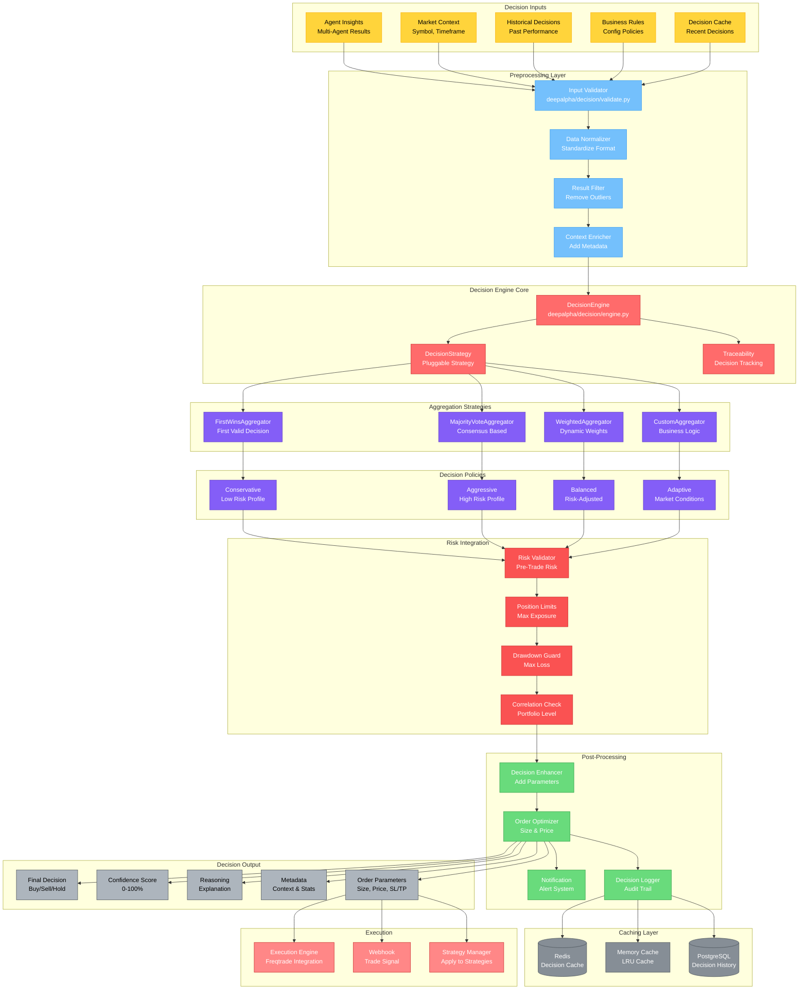

# 决策引擎架构图

## 模块概览

决策引擎是DeepAlpha的大脑，负责聚合多智能体系统的分析结果，应用决策策略，生成最终交易决策。



## 核心组件详解

### 1. 决策引擎核心

```python
# deepalpha/decision/engine.py
from abc import ABC, abstractmethod
from typing import List, Optional, Dict, Any
from dataclasses import dataclass
import asyncio
import time
import uuid

@dataclass
class DecisionResult:
    """决策结果"""
    decision: Decision
    confidence: float
    reasoning: str
    metadata: Dict[str, Any]
    agent_results: List[AgentResult]
    execution_time: float
    trace_id: str

class Decider(ABC):
    """决策器接口"""

    @abstractmethod
    async def decide(
        self,
        symbol: str,
        timeframe: str,
        agent_results: List[AgentResult],
        context: AnalysisContext
    ) -> DecisionResult:
        """生成交易决策"""
        pass

class BaseEngine(Decider):
    """基础决策引擎"""

    def __init__(
        self,
        aggregator: Aggregator,
        validator: DecisionValidator,
        enhancer: DecisionEnhancer,
        cache: DecisionCache
    ):
        self.aggregator = aggregator
        self.validator = validator
        self.enhancer = enhancer
        self.cache = cache
        self.tracer = DecisionTracer()

    async def decide(
        self,
        symbol: str,
        timeframe: str,
        agent_results: List[AgentResult],
        context: AnalysisContext
    ) -> DecisionResult:
        """执行决策流程"""

        trace_id = str(uuid.uuid4())
        start_time = time.time()

        # 1. 创建决策上下文
        decision_context = DecisionContext(
            symbol=symbol,
            timeframe=timeframe,
            agent_results=agent_results,
            context=context,
            trace_id=trace_id
        )

        # 2. 检查缓存
        cached = await self.cache.get(decision_context)
        if cached:
            self.tracer.record_cache_hit(trace_id)
            return cached

        # 3. 开始决策追踪
        self.tracer.start_trace(trace_id, decision_context)

        try:
            # 4. 验证输入
            await self.validator.validate_input(decision_context)
            self.tracer.record_validation(trace_id, True)

            # 5. 聚合智能体结果
            aggregated_result = await self.aggregator.aggregate(
                decision_context.agent_results
            )
            self.tracer.record_aggregation(
                trace_id,
                aggregated_result.strategy,
                aggregated_result.decision
            )

            # 6. 创建初始决策
            decision = Decision(
                symbol=symbol,
                timeframe=timeframe,
                signal=aggregated_result.decision,
                confidence=aggregated_result.confidence,
                reasoning=aggregated_result.reasoning,
                timestamp=int(time.time())
            )

            # 7. 增强决策
            enhanced_decision = await self.enhancer.enhance(
                decision,
                decision_context
            )

            # 8. 创建最终结果
            result = DecisionResult(
                decision=enhanced_decision,
                confidence=enhanced_decision.confidence,
                reasoning=enhanced_decision.reasoning,
                metadata=enhanced_decision.metadata,
                agent_results=agent_results,
                execution_time=time.time() - start_time,
                trace_id=trace_id
            )

            # 9. 缓存结果
            await self.cache.set(decision_context, result)

            # 10. 记录决策
            self.tracer.record_decision(trace_id, result)

            return result

        except Exception as e:
            self.tracer.record_error(trace_id, str(e))
            raise
```

### 2. 决策聚合器

```python
# deepalpha/decision/aggregator.py
class Aggregator(ABC):
    """聚合器接口"""

    @abstractmethod
    async def aggregate(self, results: List[AgentResult]) -> AggregationResult:
        """聚合智能体结果"""
        pass

class WeightedAggregator(Aggregator):
    """加权聚合器"""

    def __init__(self, weights: Dict[str, float]):
        self.weights = weights

    async def aggregate(self, results: List[AgentResult]) -> AggregationResult:
        """加权聚合决策"""

        # 1. 过滤成功的结果
        successful_results = [r for r in results if r.success]
        if not successful_results:
            return AggregationResult(
                decision=Signal.HOLD,
                confidence=0.0,
                reasoning="No successful agent results",
                strategy="weighted",
                weights_used=self.weights
            )

        # 2. 计算加权分数
        total_score = 0.0
        total_weight = 0.0
        weighted_decisions = []

        for result in successful_results:
            weight = self.weights.get(result.agent_name, 0.0)
            if weight > 0:
                # 将信号转换为数值
                signal_value = self._signal_to_numeric(result.decision)
                weighted_score = signal_value * weight * result.confidence

                total_score += weighted_score
                total_weight += weight * result.confidence

                weighted_decisions.append({
                    "agent": result.agent_name,
                    "weight": weight,
                    "signal": result.decision,
                    "confidence": result.confidence,
                    "weighted_score": weighted_score
                })

        # 3. 生成最终决策
        if total_weight == 0:
            final_decision = Signal.HOLD
            final_confidence = 0.0
        else:
            avg_score = total_score / total_weight

            if avg_score > 0.3:
                final_decision = Signal.BUY
            elif avg_score < -0.3:
                final_decision = Signal.SELL
            else:
                final_decision = Signal.HOLD

            final_confidence = min(abs(avg_score) * 100, 100.0)

        # 4. 生成推理说明
        reasoning = self._generate_reasoning(weighted_decisions, final_decision)

        return AggregationResult(
            decision=final_decision,
            confidence=final_confidence,
            reasoning=reasoning,
            strategy="weighted",
            weights_used=self.weights,
            details=weighted_decisions
        )

class MajorityVoteAggregator(Aggregator):
    """多数投票聚合器"""

    async def aggregate(self, results: List[AgentResult]) -> AggregationResult:
        """多数投票决策"""

        successful_results = [r for r in results if r.success]
        if not successful_results:
            return AggregationResult(
                decision=Signal.HOLD,
                confidence=0.0,
                reasoning="No successful agent results",
                strategy="majority_vote"
            )

        # 统计票数
        votes = {Signal.BUY: 0, Signal.SELL: 0, Signal.HOLD: 0}
        weighted_votes = {Signal.BUY: 0.0, Signal.SELL: 0.0, Signal.HOLD: 0.0}

        for result in successful_results:
            votes[result.decision] += 1
            weighted_votes[result.decision] += result.confidence

        # 找出多数
        majority_signal = max(votes, key=votes.get)
        total_votes = sum(votes.values())

        # 计算置信度
        if total_votes > 0:
            vote_confidence = votes[majority_signal] / total_votes
            weight_confidence = weighted_votes[majority_signal] / sum(weighted_votes.values())
            final_confidence = (vote_confidence + weight_confidence) / 2 * 100
        else:
            final_confidence = 0.0

        # 生成推理
        reasoning = (
            f"Majority vote: {majority_signal.value} "
            f"({votes[majority_signal]}/{total_votes} agents agree)"
        )

        return AggregationResult(
            decision=majority_signal,
            confidence=final_confidence,
            reasoning=reasoning,
            strategy="majority_vote",
            vote_breakdown=votes
        )
```

### 3. 决策验证器

```python
# deepalpha/decision/validate.py
class DecisionValidator:
    """决策验证器"""

    def __init__(self, rules: DecisionRules):
        self.rules = rules

    async def validate_input(self, context: DecisionContext) -> None:
        """验证输入数据"""

        # 1. 验证必需字段
        if not context.symbol:
            raise ValidationError("Symbol is required")
        if not context.timeframe:
            raise ValidationError("Timeframe is required")
        if not context.agent_results:
            raise ValidationError("Agent results are required")

        # 2. 验证智能体结果
        await self._validate_agent_results(context.agent_results)

        # 3. 验证市场数据
        await self._validate_market_data(context.context)

        # 4. 应用业务规则
        await self._apply_business_rules(context)

    async def validate_decision(self, decision: Decision, context: DecisionContext) -> Decision:
        """验证决策"""

        validated_decision = decision.copy()

        # 1. 风险规则验证
        validated_decision = await self._apply_risk_rules(
            validated_decision,
            context
        )

        # 2. 时间规则验证
        validated_decision = await self._apply_time_rules(
            validated_decision,
            context
        )

        # 3. 市场规则验证
        validated_decision = await self._apply_market_rules(
            validated_decision,
            context
        )

        return validated_decision

    async def _apply_risk_rules(
        self,
        decision: Decision,
        context: DecisionContext
    ) -> Decision:
        """应用风险规则"""

        # 获取当前风险状态
        risk_state = await self._get_risk_state(context.symbol)

        # 检查仓位限制
        if risk_state.position_size > self.rules.max_position_size:
            if decision.signal == Signal.BUY:
                decision.signal = Signal.HOLD
                decision.reasoning += " [Risk: Position limit reached]"
                decision.confidence *= 0.5

        # 检查回撤限制
        if risk_state.drawdown > self.rules.max_drawdown:
            decision.signal = Signal.HOLD
            decision.reasoning += " [Risk: Max drawdown exceeded]"
            decision.confidence = 0.1

        return decision
```

### 4. 决策增强器

```python
# deepalpha/decision/enhance.py
class DecisionEnhancer:
    """决策增强器"""

    def __init__(
        self,
        risk_manager: RiskManager,
        position_sizer: PositionSizer,
        optimizer: OrderOptimizer
    ):
        self.risk_manager = risk_manager
        self.position_sizer = position_sizer
        self.optimizer = optimizer

    async def enhance(
        self,
        decision: Decision,
        context: DecisionContext
    ) -> Decision:
        """增强决策"""

        enhanced_decision = decision.copy()

        # 1. 增强置信度
        enhanced_decision = await self._enhance_confidence(
            enhanced_decision,
            context
        )

        # 2. 添加执行参数
        enhanced_decision = await self._add_execution_parameters(
            enhanced_decision,
            context
        )

        # 3. 添加风险参数
        enhanced_decision = await self._add_risk_parameters(
            enhanced_decision,
            context
        )

        # 4. 优化推理说明
        enhanced_decision.reasoning = await self._enhance_reasoning(
            enhanced_decision,
            context
        )

        return enhanced_decision

    async def _add_execution_parameters(
        self,
        decision: Decision,
        context: DecisionContext
    ) -> Decision:
        """添加执行参数"""

        if decision.signal in [Signal.BUY, Signal.SELL]:
            # 计算仓位大小
            position_size = await self.position_sizer.calculate_size(
                context.symbol,
                decision.confidence,
                context.context.account_balance
            )

            # 计算价格
            current_price = context.context.current_price
            if decision.signal == Signal.BUY:
                price = await self.optimizer.calculate_buy_price(
                    current_price,
                    context.symbol
                )
                stop_loss = price * (1 - self.risk_manager.stop_loss_pct)
                take_profit = price * (1 + self.risk_manager.take_profit_pct)
            else:
                price = await self.optimizer.calculate_sell_price(
                    current_price,
                    context.symbol
                )
                stop_loss = price * (1 + self.risk_manager.stop_loss_pct)
                take_profit = price * (1 - self.risk_manager.take_profit_pct)

            # 添加到决策元数据
            decision.metadata.update({
                "position_size": position_size,
                "entry_price": price,
                "stop_loss": stop_loss,
                "take_profit": take_profit,
                "risk_reward_ratio": abs(take_profit - price) / abs(price - stop_loss)
            })

        return decision
```

### 5. 决策缓存

```python
# deepalpha/decision/cache.py
class DecisionCache:
    """决策缓存"""

    def __init__(self, redis: Redis, ttl: int = 300):
        self.redis = redis
        self.ttl = ttl
        self.memory_cache = {}
        self.memory_size_limit = 1000

    async def get(self, context: DecisionContext) -> Optional[DecisionResult]:
        """获取缓存的决策"""

        # 1. 先查内存缓存
        memory_key = self._generate_memory_key(context)
        if memory_key in self.memory_cache:
            return self.memory_cache[memory_key]

        # 2. 查Redis缓存
        redis_key = self._generate_redis_key(context)
        cached_data = await self.redis.get(redis_key)

        if cached_data:
            result = DecisionResult.from_json(cached_data)

            # 更新内存缓存
            self._update_memory_cache(memory_key, result)

            return result

        return None

    async def set(self, context: DecisionContext, result: DecisionResult) -> None:
        """缓存决策"""

        # 1. 更新内存缓存
        memory_key = self._generate_memory_key(context)
        self._update_memory_cache(memory_key, result)

        # 2. 更新Redis缓存
        redis_key = self._generate_redis_key(context)
        await self.redis.setex(
            redis_key,
            self.ttl,
            result.to_json()
        )

    def _generate_memory_key(self, context: DecisionContext) -> str:
        """生成内存缓存键"""
        return f"{context.symbol}:{context.timeframe}:{hash(str(context.context))}"

    def _generate_redis_key(self, context: DecisionContext) -> str:
        """生成Redis缓存键"""
        timestamp = int(time.time() // 60) * 60  # 分钟级缓存
        return f"decision:{context.symbol}:{context.timeframe}:{timestamp}"
```

### 6. 决策追踪器

```python
# deepalpha/decision/trace.py
class DecisionTracer:
    """决策追踪器"""

    def __init__(self):
        self.traces = {}
        self.logger = logging.getLogger(__name__)

    def start_trace(self, trace_id: str, context: DecisionContext) -> None:
        """开始追踪"""
        self.traces[trace_id] = {
            "trace_id": trace_id,
            "start_time": time.time(),
            "context": context,
            "events": []
        }

    def record_validation(self, trace_id: str, success: bool) -> None:
        """记录验证事件"""
        self._add_event(trace_id, "validation", {"success": success})

    def record_aggregation(
        self,
        trace_id: str,
        strategy: str,
        decision: Signal
    ) -> None:
        """记录聚合事件"""
        self._add_event(trace_id, "aggregation", {
            "strategy": strategy,
            "decision": decision.value
        })

    def record_decision(self, trace_id: str, result: DecisionResult) -> None:
        """记录最终决策"""
        self._add_event(trace_id, "decision", {
            "signal": result.decision.signal.value,
            "confidence": result.confidence,
            "execution_time": result.execution_time
        })

    def record_error(self, trace_id: str, error: str) -> None:
        """记录错误"""
        self._add_event(trace_id, "error", {"error": error})

    def get_trace(self, trace_id: str) -> Optional[Dict]:
        """获取追踪信息"""
        return self.traces.get(trace_id)

    def _add_event(self, trace_id: str, event_type: str, data: Dict) -> None:
        """添加事件"""
        if trace_id in self.traces:
            self.traces[trace_id]["events"].append({
                "timestamp": time.time(),
                "type": event_type,
                "data": data
            })
```

## 配置示例

```yaml
# config/decision_engine.yaml
decision_engine:
  # 聚合策略
  aggregator:
    type: "weighted"  # weighted, majority_vote, first_wins
    weights:
      technical: 0.3
      pattern: 0.2
      trend: 0.25
      risk: 0.15
      news: 0.1

  # 缓存配置
  cache:
    ttl: 300  # 5分钟
    memory_limit: 1000

  # 验证规则
  validation:
    min_confidence: 0.7
    min_agents: 3
    max_position_size: 0.02
    max_drawdown: 0.1

  # 增强配置
  enhancement:
    enable_position_sizing: true
    enable_risk_parameters: true
    enable_price_optimization: true

  # 追踪配置
  tracing:
    enable: true
    retention_days: 30
```

## 性能优化

### 1. 缓存优化
- 多级缓存（内存 + Redis）
- 智能缓存失效
- 预热机制

### 2. 并行处理
- 异步执行
- 并行验证
- 流水线处理

### 3. 批量操作
- 批量缓存更新
- 批量数据库写入
- 批量通知

## 监控指标

```python
DECISION_METRICS = {
    "decision.latency": "决策延迟",
    "decision.cache_hit_rate": "缓存命中率",
    "decision.success_rate": "决策成功率",
    "aggregation.strategy.usage": "聚合策略使用率",
    "validation.failure.rate": "验证失败率",
    "trace.active.count": "活跃追踪数"
}
```

决策引擎通过模块化设计、灵活的聚合策略和完善的验证机制，确保生成高质量、可靠的交易决策。