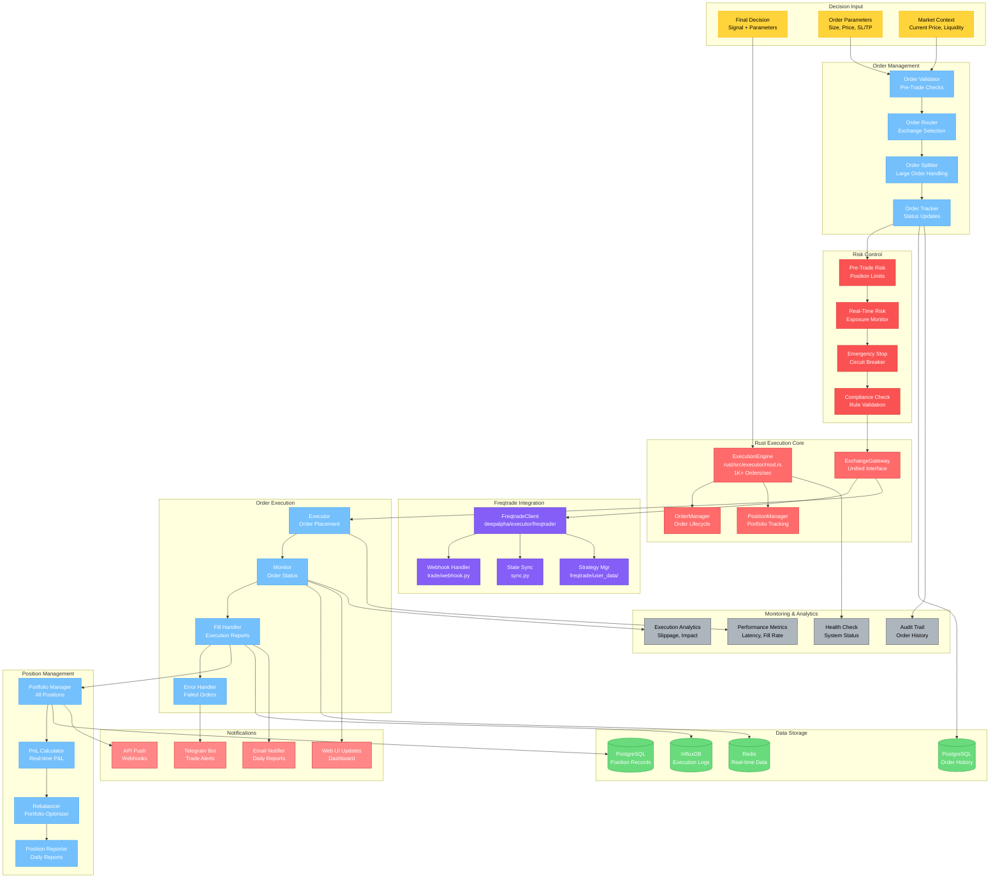

# 执行引擎架构图

## 模块概览

执行引擎负责将决策引擎的交易决策转化为实际的交易订单，管理订单执行、仓位跟踪和风险控制。



## 核心组件详解

### 1. Rust执行引擎核心

```rust
// rust/src/executor/mod.rs
use pyo3::prelude::*;
use std::collections::HashMap;
use std::sync::Arc;
use tokio::sync::{RwLock, mpsc};

#[pyclass]
pub struct ExecutionEngine {
    #[pyo3(get)]
    pub active: bool,

    // Rust高性能组件
    orders: Arc<RwLock<HashMap<String, Order>>>,
    pending_orders: Arc<RwLock<Vec<OrderId>>>,

    // 管理器
    risk_manager: Arc<RwLock<RiskManager>>,
    position_manager: Arc<PositionManager>,
    gateway: Arc<dyn ExchangeGateway + Send + Sync>,

    // 性能监控
    stats: Arc<RwLock<ExecutionStats>>,
    execution_times: Arc<RwLock<Vec<u64>>>,
}

#[pymethods]
impl ExecutionEngine {
    #[new]
    fn new() -> Self {
        let (order_tx, order_rx) = mpsc::unbounded_channel();

        Self {
            active: false,
            orders: Arc::new(RwLock::new(HashMap::new())),
            pending_orders: Arc::new(RwLock::new(Vec::new())),
            risk_manager: Arc::new(RwLock::new(RiskManager::new())),
            position_manager: Arc::new(PositionManager::new()),
            gateway: Arc::new(gateway::SimulatedGateway::new()),
            order_tx,
            stats: Arc::new(RwLock::new(ExecutionStats::default())),
            execution_times: Arc::new(RwLock::new(Vec::new())),
        }
    }

    fn start(&mut self) {
        self.active = true;
        // 启动异步执行循环
        pyo3_asyncio::tokio::run_into_stream(
            self.run_execution_loop()
        );
    }

    fn stop(&mut self) {
        self.active = false;
    }

    fn submit_order(&mut self, order_data: OrderData) -> PyResult<String> {
        if !self.active {
            return Err(PyErr::new::<pyo3::exceptions::PyRuntimeError, _>(
                "Engine is not active"
            ));
        }

        // 创建订单
        let mut order = Order::from_order_data(order_data);

        // 风险检查
        {
            let risk_manager = self.risk_manager.read().unwrap();
            if let Err(e) = risk_manager.validate_order(&order) {
                order.status = OrderStatus::Rejected;
                order.reject_reason = e.to_string();
                return Err(PyErr::new::<pyo3::exceptions::PyValueError, _>(e));
            }
        }

        // 存储订单
        order.status = OrderStatus::Submitted;
        let order_id = order.id.clone();

        {
            let mut orders = self.orders.write().unwrap();
            orders.insert(order_id.clone(), order);
        }

        // 异步提交到交易所
        let gateway = self.gateway.clone();
        let orders_ref = self.orders.clone();
        tokio::spawn(async move {
            match gateway.submit_order(order).await {
                Ok(result) => {
                    // 更新订单状态
                    let mut orders = orders_ref.write().unwrap();
                    if let Some(order) = orders.get_mut(&result.order_id) {
                        order.update_from_execution_result(result);
                    }
                }
                Err(e) => {
                    // 处理错误
                    let mut orders = orders_ref.write().unwrap();
                    if let Some(order) = orders.get_mut(&result.order_id) {
                        order.status = OrderStatus::Rejected;
                        order.reject_reason = e.to_string();
                    }
                }
            }
        });

        Ok(order_id)
    }

    fn cancel_order(&self, order_id: &str) -> PyResult<bool> {
        // 检查订单是否存在
        {
            let orders = self.orders.read().unwrap();
            if !orders.contains_key(order_id) {
                return Ok(false);
            }
        }

        // 异步取消
        let gateway = self.gateway.clone();
        let order_id = order_id.to_string();
        tokio::spawn(async move {
            gateway.cancel_order(&order_id).await;
        });

        Ok(true)
    }

    fn get_order(&self, order_id: &str) -> Option<OrderInfo> {
        let orders = self.orders.read().unwrap();
        orders.get(order_id).map(|order| order.to_info())
    }

    fn get_positions(&self) -> Vec<PositionInfo> {
        self.position_manager.read().unwrap().get_all_positions()
    }

    fn get_stats(&self) -> ExecutionStats {
        self.stats.read().unwrap().clone()
    }

    async fn run_execution_loop(&self) {
        while self.active {
            // 处理待执行订单
            self.process_pending_orders().await;

            // 更新仓位
            self.update_positions().await;

            // 清理已完成订单
            self.cleanup_completed_orders().await;

            // 更新统计信息
            self.update_stats().await;

            // 短暂休眠
            tokio::time::sleep(Duration::from_millis(100)).await;
        }
    }
}
```

### 2. Python执行引擎包装

```python
# deepalpha/executor/core.py
class ExecutionEngine:
    """Python执行引擎包装器"""

    def __init__(self):
        self._rust_engine = None
        self.freqtrade_client = None
        self.position_manager = None
        self.risk_manager = None

    async def initialize(
        self,
        freqtrade_config: Optional[Dict] = None
    ) -> None:
        """初始化执行引擎"""

        # 1. 初始化Rust引擎
        self._rust_engine = deepalpha_rust.ExecutionEngine()

        # 2. 初始化Freqtrade客户端
        if freqtrade_config:
            self.freqtrade_client = FreqtradeClient(freqtrade_config)

        # 3. 初始化管理器
        self.position_manager = PositionManager()
        self.risk_manager = RiskManager()

        # 4. 启动引擎
        self._rust_engine.start()

    async def execute_decision(
        self,
        decision: Decision,
        context: AnalysisContext
    ) -> ExecutionResult:
        """执行交易决策"""

        if decision.signal not in [Signal.BUY, Signal.SELL]:
            return ExecutionResult.success(decision, "No action needed")

        try:
            # 1. 构建订单数据
            order_data = self._build_order_data(decision, context)

            # 2. 预执行风险检查
            await self.risk_manager.pre_trade_check(order_data)

            # 3. 提交订单到Rust引擎
            order_id = self._rust_engine.submit_order(order_data)

            # 4. 记录执行
            await self._log_execution(order_id, decision, order_data)

            return ExecutionResult.success(decision, f"Order submitted: {order_id}")

        except Exception as e:
            return ExecutionResult.failure(decision, str(e))

    async def get_order_status(self, order_id: str) -> Optional[OrderInfo]:
        """获取订单状态"""
        return self._rust_engine.get_order(order_id)

    async def get_positions(self) -> List[Position]:
        """获取所有仓位"""
        rust_positions = self._rust_engine.get_positions()
        return [
            Position.from_rust_info(pos) for pos in rust_positions
        ]

    async def cancel_order(self, order_id: str) -> bool:
        """取消订单"""
        return self._rust_engine.cancel_order(order_id)

    def get_stats(self) -> ExecutionStats:
        """获取执行统计"""
        return self._rust_engine.get_stats()
```

### 3. Freqtrade集成

```python
# deepalpha/executor/freqtrade/client.py
class FreqtradeClient:
    """Freqtrade API客户端"""

    def __init__(self, config: Dict):
        self.base_url = config.get("api_server", {}).get(
            "listen_ip_address", "127.0.0.1"
        )
        self.port = config.get("api_server", {}).get("listen_port", 8080)
        self.username = config.get("api_server", {}).get("username")
        self.password = config.get("api_server", {}).get("password")

    async def create_order(
        self,
        pair: str,
        ordertype: str,
        side: str,
        amount: float,
        price: Optional[float] = None,
        params: Optional[Dict] = None
    ) -> Dict:
        """创建订单"""

        url = f"http://{self.base_url}:{self.port}/api/v1/orders"
        headers = await self._get_auth_headers()

        order_data = {
            "pair": pair,
            "ordertype": ordertype,
            "side": side,
            "amount": amount
        }

        if price is not None:
            order_data["price"] = price

        if params:
            order_data["params"] = params

        async with aiohttp.ClientSession(headers=headers) as session:
            async with session.post(url, json=order_data) as response:
                if response.status == 200:
                    return await response.json()
                else:
                    raise Exception(f"Failed to create order: {await response.text()}")

    async def get_order(self, order_id: str) -> Dict:
        """获取订单信息"""
        url = f"http://{self.base_url}:{self.port}/api/v1/orders/{order_id}"
        headers = await self._get_auth_headers()

        async with aiohttp.ClientSession(headers=headers) as session:
            async with session.get(url) as response:
                if response.status == 200:
                    return await response.json()
                else:
                    return {}

    async def cancel_order(self, order_id: str) -> bool:
        """取消订单"""
        url = f"http://{self.base_url}:{self.port}/api/v1/orders/{order_id}"
        headers = await self._get_auth_headers()

        async with aiohttp.ClientSession(headers=headers) as session:
            async with session.delete(url) as response:
                return response.status == 200

    async def get_positions(self) -> List[Dict]:
        """获取仓位信息"""
        url = f"http://{self.base_url}:{self.port}/api/v1/positions"
        headers = await self._get_auth_headers()

        async with aiohttp.ClientSession(headers=headers) as session:
            async with session.get(url) as response:
                if response.status == 200:
                    data = await response.json()
                    return data
                return []

    async def _get_auth_headers(self) -> Dict[str, str]:
        """获取认证头"""
        if self.username and self.password:
            credentials = base64.b64encode(
                f"{self.username}:{self.password}".encode()
            ).decode()
            return {"Authorization": f"Basic {credentials}"}
        return {}
```

### 4. 订单管理器

```python
# deepalpha/executor/order.py
class OrderManager:
    """订单管理器"""

    def __init__(self):
        self.orders = {}
        self.active_orders = set()
        self.lock = asyncio.Lock()

    async def create_order(self, order_data: Dict) -> Order:
        """创建订单"""
        order = Order(
            symbol=order_data["symbol"],
            side=OrderSide(order_data["side"]),
            order_type=OrderType(order_data["type"]),
            quantity=order_data["quantity"],
            price=order_data.get("price"),
            stop_loss=order_data.get("stop_loss"),
            take_profit=order_data.get("take_profit")
        )

        async with self.lock:
            self.orders[order.id] = order
            self.active_orders.add(order.id)

        return order

    async def update_order(self, order_id: str, update_data: Dict) -> bool:
        """更新订单"""
        async with self.lock:
            if order_id in self.orders:
                order = self.orders[order_id]
                order.update(update_data)
                return True
            return False

    async def get_active_orders(self) -> List[Order]:
        """获取活跃订单"""
        async with self.lock:
            return [self.orders[oid] for oid in self.active_orders]

    async def complete_order(self, order_id: str) -> None:
        """标记订单完成"""
        async with self.lock:
            if order_id in self.active_orders:
                self.active_orders.remove(order_id)
```

### 5. 仓位管理器

```python
# deepalpha/executor/position.py
class PositionManager:
    """仓位管理器"""

    def __init__(self):
        self.positions = {}
        self.lock = asyncio.Lock()

    async def update_position(self, fill: Fill) -> None:
        """更新仓位"""
        async with self.lock:
            symbol = fill.symbol

            if symbol not in self.positions:
                self.positions[symbol] = Position(symbol)

            position = self.positions[symbol]
            position.add_fill(fill)

    async def get_position(self, symbol: str) -> Optional[Position]:
        """获取仓位"""
        async with self.lock:
            return self.positions.get(symbol)

    async def get_all_positions(self) -> List[Position]:
        """获取所有仓位"""
        async with self.lock:
            return list(self.positions.values())

    async def calculate_pnl(self, symbol: str, current_price: float) -> float:
        """计算盈亏"""
        position = await self.get_position(symbol)
        if position:
            return position.calculate_pnl(current_price)
        return 0.0

    async def close_position(
        self,
        symbol: str,
        quantity: float,
        price: float
    ) -> Optional[Order]:
        """平仓"""
        position = await self.get_position(symbol)
        if not position:
            return None

        # 确定平仓方向
        side = OrderSide.SELL if position.quantity > 0 else OrderSide.BUY

        # 创建平仓订单
        order_data = {
            "symbol": symbol,
            "side": side.value,
            "type": "market",
            "quantity": min(quantity, abs(position.quantity))
        }

        return await self.create_closing_order(order_data)
```

### 6. 风险管理器

```python
# deepalpha/executor/risk.py
class RiskManager:
    """风险管理器"""

    def __init__(self):
        self.position_limits = {}
        self.daily_limits = {}
        self.emergency_stop = False

    async def pre_trade_check(self, order_data: Dict) -> None:
        """交易前风险检查"""
        if self.emergency_stop:
            raise RiskError("Emergency stop activated")

        # 1. 检查仓位限制
        await self._check_position_limit(order_data)

        # 2. 检查日交易限制
        await self._check_daily_limit(order_data)

        # 3. 检查订单大小
        await self._check_order_size(order_data)

        # 4. 检查市场风险
        await self._check_market_risk(order_data)

    async def _check_position_limit(self, order_data: Dict) -> None:
        """检查仓位限制"""
        symbol = order_data["symbol"]
        current_position = await self._get_current_position(symbol)

        # 计算新仓位
        new_quantity = order_data["quantity"]
        if order_data["side"] == "sell":
            new_quantity = -new_quantity

        new_position_size = current_position + new_quantity
        limit = self.position_limits.get(symbol, 0.02)  # 默认2%

        if abs(new_position_size) > limit:
            raise RiskError(f"Position limit exceeded for {symbol}")

    async def _check_daily_limit(self, order_data: Dict) -> None:
        """检查日交易限制"""
        today = datetime.now().date()
        daily_trades = await self._get_daily_trade_count(today)

        if daily_trades >= 100:  # 日交易次数限制
            raise RiskError("Daily trade limit exceeded")

    def activate_emergency_stop(self, reason: str) -> None:
        """激活紧急停止"""
        self.emergency_stop = True
        logger.warning(f"Emergency stop activated: {reason}")

    def deactivate_emergency_stop(self) -> None:
        """解除紧急停止"""
        self.emergency_stop = False
        logger.info("Emergency stop deactivated")
```

### 7. Webhook处理器

```python
# deepalpha/executor/freqtrade/webhook.py
from fastapi import FastAPI, Request, HTTPException
import uvicorn

app = FastAPI()

@app.post("/webhook")
async def webhook_handler(request: Request):
    """处理Freqtrade webhook"""
    try:
        data = await request.json()

        # 验证webhook
        if not await validate_webhook(data):
            raise HTTPException(status_code=400, detail="Invalid webhook")

        # 处理事件
        event_type = data.get("event")
        if event_type == "order_filled":
            await handle_order_filled(data)
        elif event_type == "order_canceled":
            await handle_order_canceled(data)
        elif event_type == "position_opened":
            await handle_position_opened(data)
        elif event_type == "position_closed":
            await handle_position_closed(data)

        return {"status": "success"}

    except Exception as e:
        logger.error(f"Webhook error: {e}")
        raise HTTPException(status_code=500, detail=str(e))

async def handle_order_filled(data: Dict):
    """处理订单成交"""
    order_id = data["order_id"]
    fill_data = {
        "symbol": data["symbol"],
        "side": data["side"],
        "quantity": data["filled"],
        "price": data["average_price"],
        "timestamp": data["order_date"]
    }

    # 更新仓位
    await position_manager.update_position(fill_data)

    # 发送通知
    await notifier.send_fill_notification(data)

    # 记录执行
    await execution_logger.log_fill(data)
```

## 配置示例

```yaml
# config/execution_engine.yaml
execution_engine:
  # Rust引擎配置
  rust:
    enabled: true
    max_orders_per_second: 1000
    risk_check_interval: 1  # seconds

  # Freqtrade配置
  freqtrade:
    api_server:
      enabled: true
      listen_ip_address: 0.0.0.0
      listen_port: 8080
      username: "deepalpha"
      password: "${FREQTRADE_API_PASSWORD}"
      ws_token: "${FREQTRADE_WS_TOKEN}"

    webhook:
      enabled: true
      webhook_url: "http://localhost:8000/webhook"

  # 风险管理
  risk:
    max_position_per_symbol: 0.02  # 2%
    max_total_position: 0.5        # 50%
    max_daily_trades: 100
    emergency_stop_enabled: true
    stop_loss_min: 0.01            # 1%
    take_profit_min: 0.015         # 1.5%

  # 订单执行
  order:
    default_type: "market"
    slippage_tolerance: 0.001      # 0.1%
    max_order_size: 0.1           # 10% of position
    order_timeout: 30             # seconds

  # 通知
  notifications:
    telegram:
      enabled: true
      bot_token: "${TELEGRAM_BOT_TOKEN}"
      chat_id: "${TELEGRAM_CHAT_ID}"
    email:
      enabled: false
      smtp_server: "smtp.gmail.com"
      smtp_port: 587
```

## 性能优化

### 1. Rust优化
- 零拷贝数据结构
- 无锁并发
- 内存池管理
- SIMD优化

### 2. 异步优化
- 协程池
- 批量操作
- 连接复用
- 流水线处理

### 3. 缓存优化
- 订单状态缓存
- 仓位信息缓存
- 市场数据缓存

## 监控指标

```python
EXECUTION_METRICS = {
    "order.submission.latency": "订单提交延迟",
    "order.fill.rate": "订单成交率",
    "order.slippage": "滑点统计",
    "position.pnl": "仓位盈亏",
    "risk.violations": "风险违规次数",
    "emergency.stops": "紧急停止次数"
}
```

执行引擎通过Rust实现的高性能核心与Python灵活的业务逻辑相结合，实现了超低延迟、高可靠的订单执行。