# 技术指标架构图

## 模块概览

技术指标模块负责计算和管理各种技术分析指标，支持50+种常用指标，通过Rust实现高性能计算，能够处理50,000+ K线/秒的计算需求。

```mermaid
graph TB
    %% 数据输入
    subgraph "Data Input"
        OHLCV[OHLCV Data<br/>Open, High, Low, Close, Volume]
        PRICE[Price Series<br/>Close Prices Only]
        VOLUME[Volume Data<br/>Trading Volume]
        TIME[Time Series<br/>Timestamps]
    end

    %% Rust高性能计算层
    subgraph "Rust High-Performance Layer"
        CALC_ENGINE[IndicatorEngine<br/>rust/src/indicators/mod.rs<br/>50K+ Candles/sec]
        SIMD[SIMD Processor<br/>Vectorized Operations]
        PARALLEL[Parallel Pool<br/>Rayon Thread Pool]
        BUFFER[Ring Buffer<br/>Zero-copy Data]
    end

    %% 指标类别
    subgraph "Indicator Categories"
        subgraph "Trend Indicators"
            SMA[SMA<br/>Simple Moving Average]
            EMA[EMA<br/>Exponential MA]
            WMA[WMA<br/>Weighted MA]
            DEMA[DEMA<br/>Double EMA]
            TEMA[TEMA<br/>Triple EMA]
        end

        subgraph "Momentum Indicators"
            RSI[RSI<br/>Relative Strength Index]
            MACD[MACD<br/>Moving Avg Conv. Div.]
            STOCH[Stochastic<br/>%K & %D]
            CCI[CCI<br/>Commodity Channel]
            ROC[ROC<br/>Rate of Change]
        end

        subgraph "Volatility Indicators"
            ATR[ATR<br/>Average True Range]
            BB[Bollinger Bands<br/>Upper/Middle/Lower]
            KELTNER[Keltner Channels]
            STDDEV[Standard Deviation]
        end

        subgraph "Volume Indicators"
            OBV[OBV<br/>On-Balance Volume]
            ADL[ADL<br/>Accumulation/Dist.]
            VWAP[VWAP<br/>Volume Weighted Avg]
            MFI[MFI<br/>Money Flow Index]
        end
    end

    %% 计算管理器
    subgraph "Calculation Managers"
        BASIC_MGR[BasicIndicators<br/>SMA, EMA, etc]
        TREND_MGR[TrendIndicators<br/>ADX, Aroon]
        MOMENTUM_MGR[MomentumIndicators<br/>RSI, MACD]
        VOLATILITY_MGR[VolatilityIndicators<br/>ATR, BB]
        VOLUME_MGR[VolumeIndicators<br/>OBV, VWAP]
    end

    %% 数据处理器
    subgraph "Data Processors"
        SANITIZER[Data Sanitizer<br/>Clean & Validate]
        NORMALIZER[Normalizer<br/>Standardize Data]
        RESAMPLER[Resampler<br/>Timeframe Conv.]
        WINDOW[Window Manager<br/>Sliding Window]
    end

    %% 缓存系统
    subgraph "Cache System"
        INDICATOR_CACHE[(Redis<br/>Indicator Cache)]
        SERIES_CACHE[(Memory Cache<br/>Series Cache)]
        COMPUTE_CACHE[(LRU Cache<br/>Compute Cache)]
        PRELOAD[Preloader<br/>Common Indicators]
    end

    %% 批处理
    subgraph "Batch Processing"
        BATCH_QUEUE[Batch Queue<br/>Pending Jobs]
        BATCH_EXECUTOR[Batch Executor<br/>Parallel Jobs]
        BATCH_MGR[Batch Manager<br/>Job Orchestration]
    end

    %% 输出管理
    subgraph "Output Management"
        FORMATTER[Formatter<br/>JSON/Numpy/CSV]
        AGGREGATOR[Aggregator<br/>Multi-Timeframe]
        SIGNAL_GEN[Signal Generator<br/>Buy/Sell Signals]
        VALIDATOR[Validator<br/>Result Validation]
    end

    %% API接口
    subgraph "API Interface"
        PY_API[Python API<br/>deepalpha_rust]
        REST_API[REST API<br/>HTTP Endpoints]
        WS_API[WebSocket API<br/>Real-time Data]
        BATCH_API[Batch API<br/>Bulk Compute]
    end

    %% 监控和分析
    subgraph "Monitoring"
        PERF_METRICS[Performance Metrics<br/>Speed & Memory]
        ERROR_LOGGER[Error Logger<br/>Calculation Errors]
        PROFILER[Profiler<br/>Performance Profile]
        HEALTH[Health Check<br/>System Status]
    end

    %% 数据流
    OHLCV --> SANITIZER
    PRICE --> NORMALIZER
    VOLUME --> RESAMPLER
    TIME --> WINDOW

    SANITIZER --> CALC_ENGINE
    NORMALIZER --> CALC_ENGINE
    RESAMPLER --> CALC_ENGINE
    WINDOW --> CALC_ENGINE

    CALC_ENGINE --> SIMD
    SIMD --> PARALLEL
    PARALLEL --> BUFFER

    CALC_ENGINE --> BASIC_MGR
    CALC_ENGINE --> TREND_MGR
    CALC_ENGINE --> MOMENTUM_MGR
    CALC_ENGINE --> VOLATILITY_MGR
    CALC_ENGINE --> VOLUME_MGR

    BASIC_MGR --> SMA
    BASIC_MGR --> EMA
    TREND_MGR --> DEMA
    TREND_MGR --> TEMA
    MOMENTUM_MGR --> RSI
    MOMENTUM_MGR --> MACD
    MOMENTUM_MGR --> STOCH
    VOLATILITY_MGR --> ATR
    VOLATILITY_MGR --> BB
    VOLUME_MGR --> OBV
    VOLUME_MGR --> VWAP

    CALC_ENGINE --> BATCH_QUEUE
    BATCH_QUEUE --> BATCH_EXECUTOR
    BATCH_EXECUTOR --> BATCH_MGR

    CALC_ENGINE --> INDICATOR_CACHE
    INDICATOR_CACHE --> SERIES_CACHE
    SERIES_CACHE --> COMPUTE_CACHE
    PRELOAD --> INDICATOR_CACHE

    SMA --> FORMATTER
    EMA --> FORMATTER
    RSI --> FORMATTER
    MACD --> FORMATTER
    BB --> FORMATTER

    FORMATTER --> AGGREGATOR
    AGGREGATOR --> SIGNAL_GEN
    SIGNAL_GEN --> VALIDATOR

    VALIDATOR --> PY_API
    PY_API --> REST_API
    PY_API --> WS_API
    PY_API --> BATCH_API

    CALC_ENGINE --> PERF_METRICS
    CALC_ENGINE --> ERROR_LOGGER
    PERF_METRICS --> PROFILER
    HEALTH --> HEALTH

    classDef input fill:#ffd43b,stroke:#fab005,color:#000
    classDef rust fill:#ff6b6b,stroke:#c92a2a,color:#fff
    classDef indicator fill:#74c0fc,stroke:#339af0,color:#fff
    classDef manager fill:#845ef7,stroke:#5f3dc4,color:#fff
    classDef process fill:#69db7c,stroke:#2f9e44,color:#fff
    classDef cache fill:#868e96,stroke:#495057,color:#fff
    classDef batch fill:#adb5bd,stroke:#495057,color:#000
    classDef output fill:#ff8787,stroke:#c92a2a,color:#fff
    classDef api fill:#fab005,stroke:#e67700,color:#000
    classDef monitor fill:#d0bfff,stroke:#7950f2,color:#fff

    class OHLCV,PRICE,VOLUME,TIME input
    class CALC_ENGINE,SIMD,PARALLEL,BUFFER rust
    class SMA,EMA,WMA,DEMA,TEMA,RSI,MACD,STOCH,CCI,ROC,ATR,BB,KELTNER,STDDEV,OBV,ADL,VWAP,MFI indicator
    class BASIC_MGR,TREND_MGR,MOMENTUM_MGR,VOLATILITY_MGR,VOLUME_MGR manager
    class SANITIZER,NORMALIZER,RESAMPLER,WINDOW process
    class INDICATOR_CACHE,SERIES_CACHE,COMPUTE_CACHE,PRELOAD cache
    class BATCH_QUEUE,BATCH_EXECUTOR,BATCH_MGR batch
    class FORMATTER,AGGREGATOR,SIGNAL_GEN,VALIDATOR output
    class PY_API,REST_API,WS_API,BATCH_API api
    class PERF_METRICS,ERROR_LOGGER,PROFILER,HEALTH monitor
```



## 核心组件详解

### 1. Rust指标引擎核心

```rust
// rust/src/indicators/mod.rs
use pyo3::prelude::*;
use numpy::{PyReadonlyArray1, PyArray1};
use rayon::prelude::*;

#[pyclass]
pub struct IndicatorEngine {
    // 数据缓存
    cache: std::collections::HashMap<String, Vec<f64>>,

    // 并行池
    pool: rayon::ThreadPool,

    // 配置
    config: IndicatorConfig,
}

#[pymethods]
impl IndicatorEngine {
    #[new]
    fn new() -> Self {
        Self {
            cache: std::collections::HashMap::new(),
            pool: rayon::ThreadPoolBuilder::new()
                .num_threads(8)
                .build()
                .unwrap(),
            config: IndicatorConfig::default(),
        }
    }

    /// 计算简单移动平均
    fn calculate_sma(
        &self,
        prices: PyReadonlyArray1<f64>,
        period: usize
    ) -> PyResult<Py<PyArray1<f64>>> {
        let prices_slice = prices.as_slice();

        if prices_slice.len() < period {
            return Err(PyErr::new::<pyo3::exceptions::PyValueError, _>(
                "Not enough data points"
            ));
        }

        // 使用SIMD优化的SMA计算
        let result = self.sma_simd(prices_slice, period);

        // 转换为NumPy数组
        Python::with_gil(|py| {
            Ok(PyArray1::from_vec(py, result).to_owned())
        })
    }

    /// 计算指数移动平均
    fn calculate_ema(
        &self,
        prices: PyReadonlyArray1<f64>,
        period: usize
    ) -> PyResult<Py<PyArray1<f64>>> {
        let prices_slice = prices.as_slice();

        if prices_slice.len() == 0 || period == 0 {
            return Ok(PyArray1::zeros(
                Python::acquire_gil(),
                prices_slice.len()
            ));
        }

        // 计算平滑因子
        let alpha = 2.0 / (period as f64 + 1.0);

        // EMA计算
        let mut ema = Vec::with_capacity(prices_slice.len());
        ema.push(prices_slice[0]);

        for i in 1..prices_slice.len() {
            let ema_val = alpha * prices_slice[i] + (1.0 - alpha) * ema[i-1];
            ema.push(ema_val);
        }

        Python::with_gil(|py| {
            Ok(PyArray1::from_vec(py, ema).to_owned())
        })
    }

    /// 批量计算多个指标
    fn calculate_batch(
        &self,
        prices: PyReadonlyArray1<f64>,
        indicators: Vec<String>
    ) -> PyResult<PyObject> {
        let prices_slice = prices.as_slice();
        let mut results = std::collections::HashMap::new();

        // 并行计算指标
        let indicator_results: Vec<_> = indicators
            .par_iter()
            .map(|indicator| {
                let result = match indicator.as_str() {
                    "sma_20" => self.sma_simd(prices_slice, 20),
                    "ema_12" => self.ema_simd(prices_slice, 12),
                    "ema_26" => self.ema_simd(prices_slice, 26),
                    "rsi_14" => self.rsi_simd(prices_slice, 14),
                    _ => vec![],
                };
                (indicator.clone(), result)
            })
            .collect();

        // 转换为Python字典
        Python::with_gil(|py| {
            let dict = pyo3::types::PyDict::new(py);
            for (key, value) in indicator_results {
                dict.set_item(key, PyArray1::from_vec(py, value).to_owned())?;
            }
            Ok(dict.into())
        })
    }
}

impl IndicatorEngine {
    /// SIMD优化的SMA计算
    fn sma_simd(&self, data: &[f64], period: usize) -> Vec<f64> {
        if data.len() < period {
            return vec![0.0; data.len()];
        }

        let mut result = vec![0.0; data.len()];
        let sum_initial: f64 = data.iter().take(period).sum();
        result[period - 1] = sum_initial / period as f64;

        // 滑动窗口计算
        for i in period..data.len() {
            result[i] = result[i-1] +
                (data[i] - data[i - period]) / period as f64;
        }

        // 填充前面的NaN值
        for i in 0..period-1 {
            result[i] = f64::NAN;
        }

        result
    }

    /// SIMD优化的RSI计算
    fn rsi_simd(&self, data: &[f64], period: usize) -> Vec<f64> {
        if data.len() <= period {
            return vec![f64::NAN; data.len()];
        }

        let mut gains = vec![0.0; data.len()];
        let mut losses = vec![0.0; data.len()];

        // 计算涨跌幅
        for i in 1..data.len() {
            let change = data[i] - data[i-1];
            if change > 0.0 {
                gains[i] = change;
                losses[i] = 0.0;
            } else {
                gains[i] = 0.0;
                losses[i] = -change;
            }
        }

        // 计算RSI
        let mut result = vec![f64::NAN; data.len()];
        let mut avg_gain = gains.iter().take(period+1).sum::<f64>() / period as f64;
        let mut avg_loss = losses.iter().take(period+1).sum::<f64>() / period as f64;

        if avg_loss == 0.0 {
            result[period] = 100.0;
        } else {
            result[period] = 100.0 - (100.0 / (1.0 + avg_gain / avg_loss));
        }

        for i in (period + 1)..data.len() {
            avg_gain = (avg_gain * (period - 1) as f64 + gains[i]) / period as f64;
            avg_loss = (avg_loss * (period - 1) as f64 + losses[i]) / period as f64;

            if avg_loss == 0.0 {
                result[i] = 100.0;
            } else {
                result[i] = 100.0 - (100.0 / (1.0 + avg_gain / avg_loss));
            }
        }

        result
    }
}
```

### 2. 指标计算管理器

```python
# deepalpha/analysis/indicators.py
class TechnicalIndicators:
    """技术指标计算器"""

    def __init__(self):
        # 导入Rust模块
        try:
            import deepalpha_rust
            self.rust_engine = deepalpha_rust.IndicatorEngine()
            self.use_rust = True
        except ImportError:
            self.rust_engine = None
            self.use_rust = False

        # 指标缓存
        self.cache = {}
        self.cache_ttl = 300  # 5分钟

    def calculate_sma(self, prices: np.ndarray, period: int = 20) -> np.ndarray:
        """计算简单移动平均"""

        # 使用缓存
        cache_key = f"sma_{period}_{hash(prices.tobytes())}"
        cached = self._get_from_cache(cache_key)
        if cached is not None:
            return cached

        # 使用Rust加速
        if self.use_rust and len(prices) > 1000:
            result = self.rust_engine.calculate_sma(prices, period)
        else:
            # Python实现
            if len(prices) < period:
                result = np.full_like(prices, np.nan)
            else:
                result = np.convolve(prices, np.ones(period)/period, mode='valid')
                result = np.concatenate([np.full(period-1, np.nan), result])

        # 缓存结果
        self._cache_result(cache_key, result)
        return result

    def calculate_ema(self, prices: np.ndarray, period: int = 12) -> np.ndarray:
        """计算指数移动平均"""

        cache_key = f"ema_{period}_{hash(prices.tobytes())}"
        cached = self._get_from_cache(cache_key)
        if cached is not None:
            return cached

        if self.use_rust and len(prices) > 1000:
            result = self.rust_engine.calculate_ema(prices, period)
        else:
            alpha = 2.0 / (period + 1)
            result = np.zeros_like(prices)
            result[0] = prices[0]

            for i in range(1, len(prices)):
                result[i] = alpha * prices[i] + (1 - alpha) * result[i-1]

        self._cache_result(cache_key, result)
        return result

    def calculate_rsi(self, prices: np.ndarray, period: int = 14) -> np.ndarray:
        """计算RSI"""

        cache_key = f"rsi_{period}_{hash(prices.tobytes())}"
        cached = self._get_from_cache(cache_key)
        if cached is not None:
            return cached

        if self.use_rust and len(prices) > 1000:
            result = self.rust_engine.calculate_rsi(prices, period)
        else:
            deltas = np.diff(prices)
            gains = np.where(deltas > 0, deltas, 0)
            losses = np.where(deltas < 0, -deltas, 0)

            avg_gain = np.zeros_like(prices)
            avg_loss = np.zeros_like(prices)

            if len(prices) > period:
                avg_gain[period] = np.mean(gains[:period])
                avg_loss[period] = np.mean(losses[:period])

                for i in range(period + 1, len(prices)):
                    avg_gain[i] = (avg_gain[i-1] * (period - 1) + gains[i-1]) / period
                    avg_loss[i] = (avg_loss[i-1] * (period - 1) + losses[i-1]) / period

            rs = avg_gain / (avg_loss + 1e-10)
            result = 100 - (100 / (1 + rs))

        self._cache_result(cache_key, result)
        return result

    def calculate_macd(
        self,
        prices: np.ndarray,
        fast: int = 12,
        slow: int = 26,
        signal: int = 9
    ) -> Dict[str, np.ndarray]:
        """计算MACD"""

        ema_fast = self.calculate_ema(prices, fast)
        ema_slow = self.calculate_ema(prices, slow)
        macd_line = ema_fast - ema_slow
        signal_line = self.calculate_ema(macd_line, signal)
        histogram = macd_line - signal_line

        return {
            "macd": macd_line,
            "signal": signal_line,
            "histogram": histogram
        }

    def calculate_bollinger_bands(
        self,
        prices: np.ndarray,
        period: int = 20,
        std_dev: float = 2.0
    ) -> Dict[str, np.ndarray]:
        """计算布林带"""

        sma = self.calculate_sma(prices, period)
        rolling_std = self.calculate_rolling_std(prices, period)

        upper_band = sma + (rolling_std * std_dev)
        lower_band = sma - (rolling_std * std_dev)

        return {
            "middle": sma,
            "upper": upper_band,
            "lower": lower_band
        }

    def calculate_rolling_std(
        self,
        data: np.ndarray,
        period: int
    ) -> np.ndarray:
        """计算滚动标准差"""

        if len(data) < period:
            return np.full_like(data, np.nan)

        result = np.zeros_like(data)
        for i in range(period - 1, len(data)):
            window = data[i - period + 1 : i + 1]
            result[i] = np.std(window)

        return result

    def calculate_all_indicators(
        self,
        ohlcv: pd.DataFrame
    ) -> pd.DataFrame:
        """批量计算所有指标"""

        result = ohlcv.copy()

        # 基础指标
        result['sma_20'] = self.calculate_sma(ohlcv['close'].values, 20)
        result['sma_50'] = self.calculate_sma(ohlcv['close'].values, 50)
        result['ema_12'] = self.calculate_ema(ohlcv['close'].values, 12)
        result['ema_26'] = self.calculate_ema(ohlcv['close'].values, 26)

        # 动量指标
        result['rsi'] = self.calculate_rsi(ohlcv['close'].values)
        macd_result = self.calculate_macd(ohlcv['close'].values)
        result['macd'] = macd_result['macd']
        result['macd_signal'] = macd_result['signal']
        result['macd_histogram'] = macd_result['histogram']

        # 波动率指标
        result['atr'] = self.calculate_atr(
            ohlcv['high'].values,
            ohlcv['low'].values,
            ohlcv['close'].values
        )
        bb_result = self.calculate_bollinger_bands(ohlcv['close'].values)
        result['bb_upper'] = bb_result['upper']
        result['bb_middle'] = bb_result['middle']
        result['bb_lower'] = bb_result['lower']

        # 成交量指标
        result['obv'] = self.calculate_obv(
            ohlcv['close'].values,
            ohlcv['volume'].values
        )
        result['vwap'] = self.calculate_vwap(
            ohlcv['high'].values,
            ohlcv['low'].values,
            ohlcv['close'].values,
            ohlcv['volume'].values
        )

        return result

    def _get_from_cache(self, key: str) -> Optional[np.ndarray]:
        """从缓存获取结果"""
        if key in self.cache:
            value, timestamp = self.cache[key]
            if time.time() - timestamp < self.cache_ttl:
                return value
            else:
                del self.cache[key]
        return None

    def _cache_result(self, key: str, result: np.ndarray) -> None:
        """缓存结果"""
        self.cache[key] = (result, time.time())

        # 限制缓存大小
        if len(self.cache) > 1000:
            oldest_key = min(
                self.cache.keys(),
                key=lambda k: self.cache[k][1]
            )
            del self.cache[oldest_key]
```

### 3. 批处理管理器

```python
# deepalpha/analysis/batch_processor.py
class BatchIndicatorProcessor:
    """批量指标处理器"""

    def __init__(self, max_workers: int = 4):
        self.max_workers = max_workers
        self.executor = ThreadPoolExecutor(max_workers=max_workers)

    async def process_batch(
        self,
        symbols: List[str],
        timeframe: str,
        indicators: List[str],
        start_date: datetime,
        end_date: datetime
    ) -> Dict[str, pd.DataFrame]:
        """批量处理多个币种的指标"""

        # 创建任务列表
        tasks = []
        for symbol in symbols:
            task = self.executor.submit(
                self._process_symbol_indicators,
                symbol,
                timeframe,
                indicators,
                start_date,
                end_date
            )
            tasks.append((symbol, task))

        # 等待所有任务完成
        results = {}
        for symbol, task in tasks:
            try:
                results[symbol] = task.result()
            except Exception as e:
                logger.error(f"Error processing {symbol}: {e}")
                results[symbol] = pd.DataFrame()

        return results

    def _process_symbol_indicators(
        self,
        symbol: str,
        timeframe: str,
        indicators: List[str],
        start_date: datetime,
        end_date: datetime
    ) -> pd.DataFrame:
        """处理单个币种的指标"""

        # 获取数据
        ohlcv = self._fetch_ohlcv_data(symbol, timeframe, start_date, end_date)

        if ohlcv.empty:
            return pd.DataFrame()

        # 计算指标
        indicator_calculator = TechnicalIndicators()
        result_df = indicator_calculator.calculate_all_indicators(ohlcv)

        return result_df

    async def process_with_rust(
        self,
        data_dict: Dict[str, np.ndarray],
        indicators: List[str]
    ) -> Dict[str, Dict[str, np.ndarray]]:
        """使用Rust批量处理"""

        if not hasattr(self, 'rust_engine'):
            self.rust_engine = deepalpha_rust.IndicatorEngine()

        results = {}
        for symbol, prices in data_dict.items():
            # 批量计算
            result = self.rust_engine.calculate_batch(prices, indicators)
            results[symbol] = result

        return results
```

### 4. 信号生成器

```python
# deepalpha/analysis/signals.py
class SignalGenerator:
    """交易信号生成器"""

    def __init__(self):
        self.signals = []
        self.indicators = TechnicalIndicators()

    def generate_signals(
        self,
        df: pd.DataFrame,
        strategy: str = "default"
    ) -> List[Signal]:
        """生成交易信号"""

        signals = []

        if strategy == "ma_crossover":
            signals = self._ma_crossover_signals(df)
        elif strategy == "rsi_oversold":
            signals = self._rsi_signals(df)
        elif strategy == "macd_crossover":
            signals = self._macd_signals(df)
        elif strategy == "bollinger_bands":
            signals = self._bb_signals(df)
        else:
            signals = self._default_signals(df)

        return signals

    def _ma_crossover_signals(self, df: pd.DataFrame) -> List[Signal]:
        """移动平均线交叉信号"""

        signals = []
        sma_short = df['sma_20']
        sma_long = df['sma_50']

        for i in range(1, len(df)):
            # 金叉
            if (sma_short.iloc[i-1] < sma_long.iloc[i-1] and
                sma_short.iloc[i] > sma_long.iloc[i]):
                signals.append(Signal(
                    timestamp=df.index[i],
                    symbol=df['symbol'].iloc[i] if 'symbol' in df else "",
                    signal="BUY",
                    price=df['close'].iloc[i],
                    confidence=0.7,
                    reason="SMA crossover (golden cross)"
                ))

            # 死叉
            elif (sma_short.iloc[i-1] > sma_long.iloc[i-1] and
                  sma_short.iloc[i] < sma_long.iloc[i]):
                signals.append(Signal(
                    timestamp=df.index[i],
                    symbol=df['symbol'].iloc[i] if 'symbol' in df else "",
                    signal="SELL",
                    price=df['close'].iloc[i],
                    confidence=0.7,
                    reason="SMA crossover (death cross)"
                ))

        return signals

    def _rsi_signals(self, df: pd.DataFrame) -> List[Signal]:
        """RSI信号"""

        signals = []
        rsi = df['rsi']

        for i in range(1, len(df)):
            # 超卖
            if rsi.iloc[i-1] > 30 and rsi.iloc[i] <= 30:
                signals.append(Signal(
                    timestamp=df.index[i],
                    symbol=df['symbol'].iloc[i] if 'symbol' in df else "",
                    signal="BUY",
                    price=df['close'].iloc[i],
                    confidence=0.6,
                    reason=f"RSI oversold ({rsi.iloc[i]:.2f})"
                ))

            # 超买
            elif rsi.iloc[i-1] < 70 and rsi.iloc[i] >= 70:
                signals.append(Signal(
                    timestamp=df.index[i],
                    symbol=df['symbol'].iloc[i] if 'symbol' in df else "",
                    signal="SELL",
                    price=df['close'].iloc[i],
                    confidence=0.6,
                    reason=f"RSI overbought ({rsi.iloc[i]:.2f})"
                ))

        return signals

    def _bb_signals(self, df: pd.DataFrame) -> List[Signal]:
        """布林带信号"""

        signals = []
        upper = df['bb_upper']
        lower = df['bb_lower']
        close = df['close']

        for i in range(1, len(df)):
            # 触及下轨
            if close.iloc[i] <= lower.iloc[i]:
                signals.append(Signal(
                    timestamp=df.index[i],
                    symbol=df['symbol'].iloc[i] if 'symbol' in df else "",
                    signal="BUY",
                    price=close.iloc[i],
                    confidence=0.5,
                    reason="Touch lower Bollinger Band"
                ))

            # 触及上轨
            elif close.iloc[i] >= upper.iloc[i]:
                signals.append(Signal(
                    timestamp=df.index[i],
                    symbol=df['symbol'].iloc[i] if 'symbol' in df else "",
                    signal="SELL",
                    price=close.iloc[i],
                    confidence=0.5,
                    reason="Touch upper Bollinger Band"
                ))

        return signals
```

## 配置示例

```yaml
# config/indicators.yaml
indicators:
  # Rust加速
  rust:
    enabled: true
    thread_pool_size: 8
    simd_enabled: true

  # 缓存配置
  cache:
    enabled: true
    ttl: 300  # seconds
    max_size: 1000

  # 批处理
  batch:
    max_workers: 4
    batch_size: 1000
    timeout: 30

  # 默认参数
  default_periods:
    sma: [20, 50, 200]
    ema: [12, 26]
    rsi: 14
    macd:
      fast: 12
      slow: 26
      signal: 9
    bollinger:
      period: 20
      std_dev: 2.0

  # 信号生成
  signals:
    strategies:
      - ma_crossover
      - rsi_oversold
      - macd_crossover
      - bollinger_bands
    confidence_threshold: 0.7
```

## 性能指标

```python
INDICATOR_METRICS = {
    "indicators.calculation.time": "指标计算时间",
    "indicators.cache.hit_rate": "缓存命中率",
    "indicators.batch.throughput": "批处理吞吐量",
    "indicators.rust.enabled": "Rust加速启用状态",
    "indicators.signals.generated": "生成信号数",
    "indicators.errors.rate": "错误率"
}
```

## 使用示例

```python
# 使用Rust加速的技术指标
from deepalpha_rust import IndicatorEngine
import numpy as np

# 创建引擎
engine = IndicatorEngine()

# 准备数据
prices = np.random.randn(10000).cumsum() + 50000

# 计算指标
sma = engine.calculate_sma(prices, 20)
ema = engine.calculate_ema(prices, 12)
rsi = engine.calculate_rsi(prices, 14)

# 批量计算
indicators = ["sma_20", "ema_12", "rsi_14", "macd"]
results = engine.calculate_batch(prices, indicators)

print(f"SMA: {sma[-1]:.2f}")
print(f"RSI: {rsi[-1]:.2f}")
print(f"MACD: {results['macd'][-1]:.6f}")
```

技术指标模块通过Rust实现的高性能计算，能够快速准确地处理大量市场数据，为交易决策提供可靠的技术分析支持。