# 市场数据模块架构图

## 模块概览

市场数据模块负责从多个交易所收集、处理和存储实时及历史市场数据，为整个交易系统提供数据支持。

```mermaid
graph TB
    %% 外部数据源
    subgraph "External Exchanges"
        BIN[Binance WebSocket]
        BIN_REST[Binance REST API]
        OTH[Other Exchanges]
        OTH_REST[Other Exchanges REST]
    end

    %% 数据收集层
    subgraph "Data Collection Layer"
        WS_CONNECTOR[WebSocket Connector<br/>deepalpha/market/source.py]
        REST_POLLER[REST API Poller<br/>deepalpha/market/source.py]
        FUNDING_FETCHER[Funding Rate Fetcher<br/>deepalpha/market/source.py]
        AGGREGATOR[Data Aggregator<br/>deepalpha/market/stream.py]
    end

    %% Rust加速层
    subgraph "Rust Acceleration"
        RUST_WS[Rust WebSocket Manager<br/>10K Connections]
        RUST_STREAM[Rust Stream Processor<br/>100K Points/sec]
        RUST_VALIDATOR[Data Validator<br/>Zero-copy Buffer]
    end

    %% 数据模型层
    subgraph "Data Models"
        CANDLE[Candle<br/>OHLCV Structure]
        CANDLE_EVENT[CandleEvent<br/>Real-time K-line]
        TRADE_EVENT[TradeEvent<br/>Tick Data]
        OPEN_INTEREST[OpenInterestPoint<br/>Open Interest]
        SUBSCRIBE_OPT[SubscribeOptions<br/>Subscription Config]
    end

    %% 存储层
    subgraph "Storage Layer"
        MEM_STORE[Memory Store<br/>deepalpha/market/store.py<br/>LRU Cache]
        REDIS_CACHE[(Redis Cache<br/>Real-time Data)]
        POSTGRES[(PostgreSQL<br/>Historical Data)]
        INFLUXDB[(InfluxDB<br/>Time Series)]
    end

    %% 数据输出
    subgraph "Data Consumers"
        INDICATORS[Technical Indicators]
        AGENTS[Multi-Agent System]
        DECISION[Decision Engine]
        STRATEGY[Strategy Engine]
        WEB_UI[Web Dashboard]
    end

    %% 数据流
    BIN --> WS_CONNECTOR
    OTH --> WS_CONNECTOR
    BIN_REST --> REST_POLLER
    OTH_REST --> REST_POLLER

    WS_CONNECTOR --> RUST_WS
    REST_POLLER --> RUST_STREAM
    FUNDING_FETCHER --> RUST_VALIDATOR

    RUST_WS --> AGGREGATOR
    RUST_STREAM --> AGGREGATOR
    RUST_VALIDATOR --> AGGREGATOR

    AGGREGATOR --> CANDLE
    AGGREGATOR --> CANDLE_EVENT
    AGGREGATOR --> TRADE_EVENT
    AGGREGATOR --> OPEN_INTEREST

    CANDLE --> MEM_STORE
    CANDLE_EVENT --> MEM_STORE
    TRADE_EVENT --> MEM_STORE

    MEM_STORE --> REDIS_CACHE
    MEM_STORE --> POSTGRES
    MEM_STORE --> INFLUXDB

    REDIS_CACHE --> INDICATORS
    REDIS_CACHE --> AGENTS
    POSTGRES --> DECISION
    INFLUXDB --> STRATEGY
    MEM_STORE --> WEB_UI

    classDef external fill:#ffd43b,stroke:#fab005,color:#000
    classDef collector fill:#74c0fc,stroke:#339af0,color:#fff
    classDef rust fill:#ff6b6b,stroke:#c92a2a,color:#fff
    classDef storage fill:#69db7c,stroke:#2f9e44,color:#fff
    classDef consumer fill:#868e96,stroke:#495057,color:#fff

    class BIN,BIN_REST,OTH,OTH_REST external
    class WS_CONNECTOR,REST_POLLER,FUNDING_FETCHER,AGGREGATOR collector
    class RUST_WS,RUST_STREAM,RUST_VALIDATOR rust
    class MEM_STORE,REDIS_CACHE,POSTGRES,INFLUXDB storage
    class INDICATORS,AGENTS,DECISION,STRATEGY,WEB_UI consumer
```



## 核心组件详细说明

### 1. 数据收集器 (Data Collectors)

#### WebSocket连接器
```python
# deepalpha/market/source.py
class Source:
    async def connect(self, symbol: str, timeframe: str) -> None
    async def subscribe(self, symbols: List[str]) -> None
    async def get_historical(self, symbol: str, start: int, limit: int) -> List[Candle]
```

**功能特性**:
- 支持多交易所连接
- 自动重连机制
- 订阅管理
- 心跳保活

#### REST API轮询器
```python
# 深度历史数据获取
async def fetch_historical_data(
    symbol: str,
    interval: str,
    start_time: datetime,
    end_time: datetime
) -> List[Candle]

# 资金费率获取
async def fetch_funding_rate(symbol: str) -> float
```

### 2. Rust加速层

#### WebSocket管理器
```rust
// rust/src/websocket/
pub struct WebSocketManager {
    connections: HashMap<String, Connection>,
    message_buffer: RingBuffer<Message>,
    stats: ConnectionStats,
}

impl WebSocketManager {
    pub fn add_connection(&mut self, id: String, url: String)
    pub fn broadcast_message(&self, topic: &str, message: &[u8])
    pub fn get_connection_count(&self) -> usize
}
```

**性能指标**:
- 并发连接: 10,000+
- 消息延迟: < 1ms
- 吞吐量: 100万 msg/s

#### 数据流处理器
```rust
// rust/src/stream/
pub struct StreamProcessor {
    validator: DataValidator,
    buffer: ZeroCopyBuffer,
    aggregator: DataAggregator,
}

impl StreamProcessor {
    pub fn process_tick(&mut self, tick: MarketTick) -> Result<()>
    pub fn aggregate_candle(&mut self) -> Option<Candle>
}
```

### 3. 数据模型

#### K线数据结构
```python
# deepalpha/market/data.py
@dataclass
class Candle:
    open: float
    high: float
    low: float
    close: float
    volume: float
    timestamp: int
    is_closed: bool = False

    def to_dict(self) -> Dict[str, Any]
    def to_json(self) -> str
```

#### 实时事件
```python
@dataclass
class CandleEvent:
    symbol: str
    timeframe: str
    candle: Candle
    event_type: EventType  # NEW, UPDATE, CLOSE

@dataclass
class TradeEvent:
    symbol: str
    price: float
    quantity: float
    side: str  # buy/sell
    timestamp: int
```

### 4. 存储系统

#### 内存存储
```python
# deepalpha/market/store.py
class MemoryKlineStore:
    def __init__(self, max_size: int = 10000):
        self._store = defaultdict(deque)
        self._max_size = max_size
        self._lock = RLock()

    async def add(self, symbol: str, timeframe: str, candle: Candle)
    async def get_latest(self, symbol: str, timeframe: str, limit: int) -> List[Candle]
    async def get_range(self, symbol: str, start: int, end: int) -> List[Candle]
```

**特性**:
- 线程安全
- LRU自动淘汰
- 批量操作支持
- 内存限制保护

### 5. 数据流处理


## 配置示例

```yaml
# config/market_data.yaml
market_data:
  exchanges:
    binance:
      websocket:
        base_url: "wss://stream.binance.com:9443"
        reconnect_interval: 5
        max_retries: 10
      rest:
        base_url: "https://api.binance.com"
        rate_limit: 1200  # requests per minute

  symbols:
    - "BTC/USDT"
    - "ETH/USDT"
    - "BNB/USDT"

  timeframes:
    - "1m"
    - "5m"
    - "15m"
    - "1h"
    - "4h"
    - "1d"

  storage:
    memory:
      max_candles_per_symbol: 10000
      cleanup_interval: 3600  # seconds
    redis:
      host: "localhost"
      port: 6379
      ttl: 3600
    postgresql:
      connection_string: "${DATABASE_URL}"
      batch_size: 1000

  rust:
    enabled: true
    websocket_buffer_size: 1000000
    stream_batch_size: 1000
```

## 性能优化策略

### 1. 内存优化
- 使用零拷贝缓冲区
- 对象池复用
- 内存预分配
- LRU缓存策略

### 2. 并发优化
- 异步I/O处理
- 连接池管理
- 批量处理
- 无锁数据结构

### 3. 持久化优化
- 批量插入
- 压缩存储
- 分区表设计
- 索引优化

## 监控指标

```python
# 关键性能指标
MARKET_DATA_METRICS = {
    "websocket.connections.total": "当前WebSocket连接数",
    "websocket.messages.received": "接收的消息总数",
    "websocket.message.latency": "消息处理延迟",
    "data.candles.processed": "处理的K线数量",
    "storage.memory.usage": "内存使用率",
    "storage.cache.hit_rate": "缓存命中率"
}
```

## 错误处理

### 异常类型
```python
class MarketDataError(Exception):
    """市场数据基础异常"""
    pass

class WebSocketError(MarketDataError):
    """WebSocket连接异常"""
    pass

class DataValidationError(MarketDataError):
    """数据验证异常"""
    pass

class StorageError(MarketDataError):
    """存储异常"""
    pass
```

### 重试机制
```python
@retry(max_attempts=3, backoff=exponential)
async def fetch_with_retry(symbol: str) -> List[Candle]:
    """带重试的数据获取"""
    pass
```