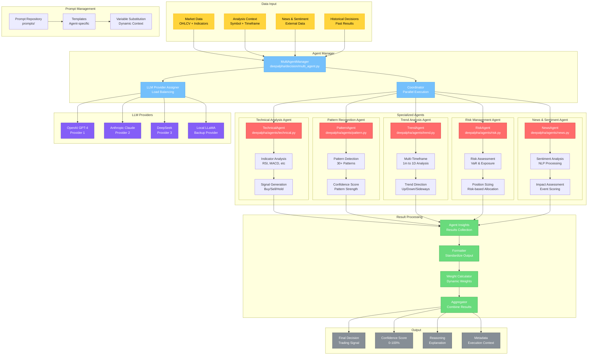

# 多智能体系统架构图

## 模块概览

多智能体系统是DeepAlpha的核心决策组件，通过多个专业化智能体的协同工作，从不同维度分析市场数据，生成交易信号。



## 核心组件详解

### 1. 多智能体管理器

```python
# deepalpha/decision/multi_agent.py
class MultiAgentManager:
    def __init__(self, agents: List[BaseAgent], llm_providers: List[LLMProvider]):
        self.agents = agents
        self.llm_providers = llm_providers
        self.load_balancer = LoadBalancer(llm_providers)

    async def analyze(
        self,
        symbol: str,
        timeframe: str,
        context: AnalysisContext
    ) -> List[AgentResult]:
        """并行执行所有智能体"""
        tasks = [
            self._run_agent(agent, symbol, timeframe, context)
            for agent in self.agents
        ]
        return await asyncio.gather(*tasks, return_exceptions=True)

    async def _run_agent(
        self,
        agent: BaseAgent,
        symbol: str,
        timeframe: str,
        context: AnalysisContext
    ) -> AgentResult:
        """运行单个智能体"""
        try:
            # 分配LLM提供者
            llm = self.load_balancer.get_provider()

            # 准备分析上下文
            analysis_data = await self._prepare_analysis_data(symbol, timeframe)

            # 执行智能体分析
            result = await agent.analyze(analysis_data, llm)

            return AgentResult(
                agent_name=agent.name,
                success=True,
                result=result,
                execution_time=0.0
            )
        except Exception as e:
            return AgentResult(
                agent_name=agent.name,
                success=False,
                error=str(e),
                execution_time=0.0
            )
```

### 2. 技术分析智能体

```python
# deepalpha/agents/technical.py
class TechnicalAgent(LLMAgent):
    """技术指标分析智能体"""

    def __init__(self, llm: LLMProvider):
        super().__init__("Technical Analysis", llm)
        self.indicators = [
            "EMA_7", "EMA_25", "EMA_99",
            "RSI_14", "MACD", "Stochastic",
            "ATR", "OBV", "Volume_Profile"
        ]

    async def analyze(
        self,
        data: AnalysisData,
        llm: LLMProvider
    ) -> AgentInsight:
        """执行技术分析"""

        # 1. 提取技术指标
        indicators_data = self._extract_indicators(data)

        # 2. 分析指标状态
        analysis = {
            "trend": self._analyze_trend(indicators_data),
            "momentum": self._analyze_momentum(indicators_data),
            "volume": self._analyze_volume(indicators_data),
            "volatility": self._analyze_volatility(indicators_data),
        }

        # 3. 生成信号
        signal = self._generate_signal(analysis)

        # 4. 使用LLM增强分析
        prompt = self._build_technical_prompt(analysis, data.context)
        llm_response = await llm.complete(prompt)

        return AgentInsight(
            agent=self.name,
            signal=signal,
            confidence=self._calculate_confidence(analysis),
            reasoning=llm_response,
            metadata={
                "indicators": indicators_data,
                "analysis": analysis,
                "llm_response": llm_response
            }
        )

    def _generate_signal(self, analysis: Dict) -> Signal:
        """基于技术分析生成交易信号"""
        score = 0

        # 趋势分析
        if analysis["trend"]["direction"] == "bullish":
            score += 2
        elif analysis["trend"]["direction"] == "bearish":
            score -= 2

        # 动量分析
        if analysis["momentum"]["rsi"] < 30:
            score += 1  # 超卖
        elif analysis["momentum"]["rsi"] > 70:
            score -= 1  # 超买

        # 成交量确认
        if analysis["volume"]["supports_trend"]:
            score += 0.5

        # 生成最终信号
        if score >= 1.5:
            return Signal.BUY
        elif score <= -1.5:
            return Signal.SELL
        else:
            return Signal.HOLD
```

### 3. 形态识别智能体

```python
# deepalpha/agents/pattern.py
class PatternAgent(LLMAgent):
    """K线形态识别智能体"""

    PATTERNS = {
        "doji": DojiPattern(),
        "hammer": HammerPattern(),
        "engulfing": EngulfingPattern(),
        "harami": HaramiPattern(),
        "morning_star": MorningStarPattern(),
        "evening_star": EveningStarPattern(),
        "head_shoulders": HeadShouldersPattern(),
        "triangle": TrianglePattern(),
        "wedge": WedgePattern(),
        # ... 更多形态
    }

    async def analyze(
        self,
        data: AnalysisData,
        llm: LLMProvider
    ) -> AgentInsight:
        """执行形态识别"""

        # 1. 识别所有形态
        detected_patterns = []
        for name, pattern in self.PATTERNS.items():
            if pattern.detect(data.candles):
                detected_patterns.append({
                    "name": name,
                    "strength": pattern.strength,
                    "direction": pattern.direction,
                    "reliability": pattern.reliability
                })

        # 2. 分析形态组合
        pattern_analysis = self._analyze_pattern_combinations(detected_patterns)

        # 3. 计算形态置信度
        confidence = self._calculate_pattern_confidence(detected_patterns)

        # 4. 生成交易信号
        signal = self._pattern_to_signal(pattern_analysis)

        # 5. LLM形态分析
        prompt = self._build_pattern_prompt(detected_patterns, data.context)
        llm_response = await llm.complete(prompt)

        return AgentInsight(
            agent=self.name,
            signal=signal,
            confidence=confidence,
            reasoning=llm_response,
            metadata={
                "detected_patterns": detected_patterns,
                "pattern_analysis": pattern_analysis,
                "count": len(detected_patterns)
            }
        )
```

### 4. 趋势分析智能体

```python
# deepalpha/agents/trend.py
class TrendAgent(LLMAgent):
    """多时间框架趋势分析智能体"""

    TIMEFRAMES = ["1m", "5m", "15m", "1h", "4h", "1d"]

    async def analyze(
        self,
        data: AnalysisData,
        llm: LLMProvider
    ) -> AgentInsight:
        """执行趋势分析"""

        # 1. 多时间框架分析
        timeframe_analysis = {}
        for tf in self.TIMEFRAMES:
            tf_data = await self._get_timeframe_data(data.symbol, tf)
            timeframe_analysis[tf] = {
                "trend": self._identify_trend(tf_data),
                "strength": self._calculate_trend_strength(tf_data),
                "duration": self._get_trend_duration(tf_data)
            }

        # 2. 趋势一致性检查
        trend_consistency = self._check_trend_consistency(timeframe_analysis)

        # 3. 趋势强度评估
        overall_strength = self._assess_overall_strength(timeframe_analysis)

        # 4. 趋势反转检测
        reversal_signals = self._detect_reversal_signals(timeframe_analysis)

        # 5. 生成趋势信号
        signal = self._generate_trend_signal(
            trend_consistency,
            overall_strength,
            reversal_signals
        )

        # 6. LLM趋势分析
        prompt = self._build_trend_prompt(timeframe_analysis, data.context)
        llm_response = await llm.complete(prompt)

        return AgentInsight(
            agent=self.name,
            signal=signal,
            confidence=overall_strength,
            reasoning=llm_response,
            metadata={
                "timeframe_analysis": timeframe_analysis,
                "trend_consistency": trend_consistency,
                "reversal_signals": reversal_signals
            }
        )
```

### 5. 风险管理智能体

```python
# deepalpha/agents/risk.py
class RiskAgent(LLMAgent):
    """风险管理智能体"""

    async def analyze(
        self,
        data: AnalysisData,
        llm: LLMProvider
    ) -> AgentInsight:
        """执行风险分析"""

        # 1. 计算当前风险敞口
        current_exposure = await self._calculate_exposure(data.symbol)

        # 2. VaR计算
        var_95 = self._calculate_var(data.returns, 0.95)
        var_99 = self._calculate_var(data.returns, 0.99)

        # 3. 波动率分析
        volatility = self._calculate_volatility(data.returns)

        # 4. 相关性分析
        correlations = await self._calculate_correlations(data.symbol)

        # 5. 压力测试
        stress_test = self._run_stress_test(data.symbol)

        # 6. 风险评级
        risk_score = self._calculate_risk_score(
            current_exposure,
            var_95,
            volatility,
            correlations
        )

        # 7. 仓位建议
        position_recommendation = self._recommend_position_size(
            risk_score,
            data.account_balance
        )

        # 8. LLM风险分析
        prompt = self._build_risk_prompt(
            current_exposure,
            var_95,
            volatility,
            stress_test
        )
        llm_response = await llm.complete(prompt)

        return AgentInsight(
            agent=self.name,
            signal=Signal.HOLD,  # 风险智能体不直接产生交易信号
            confidence=1.0 - risk_score,  # 风险越高，置信度越低
            reasoning=llm_response,
            metadata={
                "risk_score": risk_score,
                "var_95": var_95,
                "var_99": var_99,
                "volatility": volatility,
                "correlations": correlations,
                "position_recommendation": position_recommendation
            }
        )
```

### 6. 新闻情感智能体

```python
# deepalpha/agents/news.py
class NewsAgent(LLMAgent):
    """新闻情感分析智能体"""

    async def analyze(
        self,
        data: AnalysisData,
        llm: LLMProvider
    ) -> AgentInsight:
        """执行新闻情感分析"""

        # 1. 获取相关新闻
        news_items = await self._fetch_relevant_news(
            data.symbol,
            data.timeframe
        )

        # 2. 情感分析
        sentiments = []
        for news in news_items:
            sentiment = await self._analyze_sentiment(news.content)
            sentiments.append({
                "title": news.title,
                "sentiment": sentiment,
                "impact": self._assess_news_impact(news, data.symbol)
            })

        # 3. 聚合情感得分
        overall_sentiment = self._aggregate_sentiments(sentiments)

        # 4. 重大事件检测
        major_events = self._detect_major_events(news_items)

        # 5. 生成情感信号
        signal = self._sentiment_to_signal(overall_sentiment, major_events)

        # 6. LLM新闻分析
        prompt = self._build_news_prompt(news_items, overall_sentiment)
        llm_response = await llm.complete(prompt)

        return AgentInsight(
            agent=self.name,
            signal=signal,
            confidence=abs(overall_sentiment),  # 情感强度作为置信度
            reasoning=llm_response,
            metadata={
                "news_count": len(news_items),
                "sentiment": overall_sentiment,
                "major_events": major_events,
                "sentiments": sentiments[:5]  # 保留前5条
            }
        )
```

### 7. LLM提供者管理

```python
# deepalpha/gateway/llm/
class LLMManager:
    """LLM提供者管理器"""

    def __init__(self):
        self.providers = {
            "openai": OpenAIProvider(),
            "anthropic": AnthropicProvider(),
            "deepseek": DeepSeekProvider(),
            "local": LocalLLMProvider()
        }
        self.load_balancer = LoadBalancer(list(self.providers.values()))
        self.fallback_chain = FallbackChain([
            self.providers["openai"],
            self.providers["anthropic"],
            self.providers["deepseek"]
        ])

    async def complete(
        self,
        prompt: str,
        agent: str = None
    ) -> str:
        """智能的LLM调用"""

        # 1. 选择最佳提供者
        primary = self._select_provider(agent)

        try:
            # 2. 主提供者调用
            response = await primary.complete(prompt)
            return response
        except Exception as e:
            # 3. 失败时使用备用链
            return await self.fallback_chain.execute(prompt)

    def _select_provider(self, agent: str) -> LLMProvider:
        """为不同智能体选择最佳LLM提供者"""
        provider_map = {
            "technical": "openai",      # GPT-4技术分析能力强
            "pattern": "anthropic",     # Claude模式识别好
            "trend": "openai",          # GPT-4趋势分析
            "risk": "deepseek",         # DeepSeek性价比高
            "news": "anthropic",        # Claude理解新闻好
        }
        provider_name = provider_map.get(agent, "openai")
        return self.providers[provider_name]
```

## 配置示例

```yaml
# config/agents.yaml
agents:
  enabled:
    - technical
    - pattern
    - trend
    - risk
    - news

  weights:
    technical: 0.3
    pattern: 0.2
    trend: 0.25
    risk: 0.15
    news: 0.1

  llm_providers:
    openai:
      model: "gpt-4"
      max_tokens: 1000
      temperature: 0.3
      rate_limit: 60  # requests per minute

    anthropic:
      model: "claude-3-opus"
      max_tokens: 1000
      temperature: 0.2
      rate_limit: 50

    deepseek:
      model: "deepseek-chat"
      max_tokens: 1000
      temperature: 0.4
      rate_limit: 100

  execution:
    parallel: true
    timeout: 30  # seconds
    retry_attempts: 3
    fallback_enabled: true
```

## 性能优化

### 1. 并行执行
- 所有智能体并行运行
- 异步LLM调用
- 非阻塞I/O操作

### 2. 缓存策略
- LLM响应缓存
- 分析结果缓存
- 新闻情感缓存

### 3. 负载均衡
- 智能提供者选择
- 动态权重调整
- 故障自动转移

## 监控指标

```python
AGENT_METRICS = {
    "agent.execution.time": "智能体执行时间",
    "agent.success.rate": "智能体成功率",
    "llm.request.latency": "LLM请求延迟",
    "llm.token.usage": "Token使用量",
    "decision.confidence.avg": "平均决策置信度",
    "agent.parallelism": "并行执行智能体数"
}
```

这个多智能体系统通过专业化分工和并行执行，能够从多个维度全面分析市场，为决策引擎提供丰富、可靠的交易信号。