# 风险管理架构图

## 模块概览

风险管理模块负责监控和控制交易系统中的各类风险，包括市场风险、信用风险、流动性风险和操作风险，确保交易活动在风险可控范围内进行。

```mermaid
graph TB
    %% 风险数据输入
    subgraph "Risk Data Inputs"
        POSITIONS[Current Positions<br/>Portfolio Status]
        ORDERS[Active Orders<br/>Pending Trades]
        MARKET[Market Data<br/>Prices & Volatility]
        ACCOUNT[Account Info<br/>Balance & Equity]
        HISTORY[Historical Data<br/>Past Performance]
    end

    %% 风险识别层
    subgraph "Risk Identification"
        MARKET_RISK[Market Risk Detector<br/>Price & Volatility Risk]
        CREDIT_RISK[Credit Risk Monitor<br/>Counterparty Risk]
        LIQUIDITY_RISK[Liquidity Checker<br/>Market Liquidity]
        OPERATIONAL_RISK[Operational Monitor<br/>System & Process Risk]
        CONCENTRATION_RISK[Concentration Analyzer<br/>Exposure Concentration]
    end

    %% 风险测量
    subgraph "Risk Measurement"
        VAR[VaR Calculator<br/>Value at Risk]
        CVAR[CVaR Estimator<br/>Conditional VaR]
        STRESS_TEST[Stress Testing<br/>Scenario Analysis]
        SENSITIVITY[Sensitivity Analysis<br/>Greeks Calculation]
        DRAWDOWN[Drawdown Monitor<br/>Max Drawdown Tracking]
    end

    %% 风险控制
    subgraph "Risk Control"
        POSITION_LIMIT[Position Limits<br/>Max Exposure]
        LOSS_LIMIT[Loss Limits<br/>Stop Loss Rules]
        CORRELATION[Correlation Check<br/>Portfolio Diversification]
        LEVERAGE[Leverage Control<br/>Margin Requirements]
        EMERGENCY[Emergency Stops<br/>Circuit Breakers]
    end

    %% 风险决策
    subgraph "Risk Decision"
        RISK_ENGINE[Risk Engine<br/>Risk Scoring]
        DECISION_MATRIX[Decision Matrix<br/>Risk-Reward Analysis]
        APPROVAL[Approval Engine<br/>Trade Authorization]
        REJECTION[Rejection Handler<br/>Risk Breach Response]
    end

    %% 实时监控
    subgraph "Real-time Monitoring"
        MONITOR[Monitor Service<br/>Continuous Tracking]
        ALERTS[Alert Manager<br/>Risk Alerts]
        DASHBOARD[Risk Dashboard<br/>Visualization]
        REPORTS[Report Generator<br/>Risk Reports]
    end

    %% 风险存储
    subgraph "Risk Storage"
        RISK_DB[(PostgreSQL<br/>Risk Records)]
        TIME_SERIES[(InfluxDB<br/>Risk Metrics)]
        CACHE[(Redis<br/>Real-time Data)]
        ARCHIVE[(S3<br/>Historical Archive)]
    end

    %% 通知系统
    subgraph "Notifications"
        EMAIL[Email Alerts<br/>Risk Notifications]
        SMS[SMS Alerts<br/>Critical Risk]
        SLACK[Slack Bot<br/>Team Updates]
        WEBHOOK[Webhook<br/>System Integration]
    end

    %% 风险策略
    subgraph "Risk Strategies"
        CONSERVATIVE[Conservative<br/>Low Risk Strategy]
        MODERATE[Moderate<br/>Balanced Risk]
        AGGRESSIVE[Aggressive<br/>High Risk Strategy]
        DYNAMIC[Dynamic<br/>Adaptive Risk]
    end

    %% 合规检查
    subgraph "Compliance"
        REGULATORY[Regulatory Check<br/>Compliance Rules]
        INTERNAL[Internal Audit<br/>Policy Compliance]
        REPORTING[Regulatory Reporting<br/>Required Reports]
        AUDIT[Audit Trail<br/>Complete Record]
    end

    %% 数据流
    POSITIONS --> MARKET_RISK
    ORDERS --> CREDIT_RISK
    MARKET --> LIQUIDITY_RISK
    ACCOUNT --> OPERATIONAL_RISK
    HISTORY --> CONCENTRATION_RISK

    MARKET_RISK --> VAR
    CREDIT_RISK --> CVAR
    LIQUIDITY_RISK --> STRESS_TEST
    OPERATIONAL_RISK --> SENSITIVITY
    CONCENTRATION_RISK --> DRAWDOWN

    VAR --> POSITION_LIMIT
    CVAR --> LOSS_LIMIT
    STRESS_TEST --> CORRELATION
    SENSITIVITY --> LEVERAGE
    DRAWDOWN --> EMERGENCY

    POSITION_LIMIT --> RISK_ENGINE
    LOSS_LIMIT --> DECISION_MATRIX
    CORRELATION --> APPROVAL
    LEVERAGE --> REJECTION
    EMERGENCY --> MONITOR

    RISK_ENGINE --> ALERTS
    DECISION_MATRIX --> DASHBOARD
    APPROVAL --> REPORTS
    REJECTION --> CACHE

    MONITOR --> RISK_DB
    ALERTS --> TIME_SERIES
    DASHBOARD --> CACHE
    REPORTS --> ARCHIVE

    ALERTS --> EMAIL
    MONITOR --> SMS
    DASHBOARD --> SLACK
    REJECTION --> WEBHOOK

    RISK_ENGINE --> CONSERVATIVE
    DECISION_MATRIX --> MODERATE
    APPROVAL --> AGGRESSIVE
    MONITOR --> DYNAMIC

    RISK_DB --> REGULATORY
    TIME_SERIES --> INTERNAL
    ARCHIVE --> REPORTING
    CACHE --> AUDIT

    classDef input fill:#ffd43b,stroke:#fab005,color:#000
    classDef identify fill:#ff6b6b,stroke:#c92a2a,color:#fff
    classDef measure fill:#74c0fc,stroke:#339af0,color:#fff
    classDef control fill:#fa5252,stroke:#c92a2a,color:#fff
    classDef decision fill:#845ef7,stroke:#5f3dc4,color:#fff
    classDef monitor fill:#69db7c,stroke:#2f9e44,color:#fff
    classDef storage fill:#868e96,stroke:#495057,color:#fff
    classDef notify fill:#ff8787,stroke:#c92a2a,color:#fff
    classDef strategy fill:#adb5bd,stroke:#495057,color:#000
    classDef compliance fill:#fab005,stroke:#e67700,color:#000

    class POSITIONS,ORDERS,MARKET,ACCOUNT,HISTORY input
    class MARKET_RISK,CREDIT_RISK,LIQUIDITY_RISK,OPERATIONAL_RISK,CONCENTRATION_RISK identify
    class VAR,CVAR,STRESS_TEST,SENSITIVITY,DRAWDOWN measure
    class POSITION_LIMIT,LOSS_LIMIT,CORRELATION,LEVERAGE,EMERGENCY control
    class RISK_ENGINE,DECISION_MATRIX,APPROVAL,REJECTION decision
    class MONITOR,ALERTS,DASHBOARD,REPORTS monitor
    class RISK_DB,TIME_SERIES,CACHE,ARCHIVE storage
    class EMAIL,SMS,SLACK,WEBHOOK notify
    class CONSERVATIVE,MODERATE,AGGRESSIVE,DYNAMIC strategy
    class REGULATORY,INTERNAL,REPORTING,AUDIT compliance
```



## 核心组件详解

### 1. 风险引擎核心

```python
# deepalpha/risk/engine.py
class RiskEngine:
    """风险管理引擎"""

    def __init__(self, config: RiskConfig):
        self.config = config
        self.position_monitor = PositionMonitor()
        self.var_calculator = VaRCalculator(config.var)
        self.stress_tester = StressTester(config.stress_test)
        self.risk_limits = RiskLimits(config.limits)
        self.alert_manager = AlertManager()
        self.strategy_manager = RiskStrategyManager()

    async def evaluate_trade_risk(
        self,
        trade_request: TradeRequest,
        current_positions: Dict[str, Position],
        market_data: MarketData
    ) -> RiskEvaluation:
        """评估交易风险"""

        # 1. 创建风险上下文
        context = RiskContext(
            trade_request=trade_request,
            current_positions=current_positions,
            market_data=market_data,
            timestamp=int(time.time())
        )

        # 2. 计算新仓位
        new_positions = self._calculate_new_positions(
            current_positions,
            trade_request
        )

        # 3. 执行风险检查
        risk_results = await self._perform_risk_checks(
            context,
            new_positions
        )

        # 4. 计算风险指标
        risk_metrics = await self._calculate_risk_metrics(
            new_positions,
            market_data
        )

        # 5. 应用风险策略
        risk_decision = await self.strategy_manager.evaluate(
            risk_results,
            risk_metrics,
            context
        )

        # 6. 生成风险报告
        evaluation = RiskEvaluation(
            approved=risk_decision.approved,
            risk_score=risk_decision.risk_score,
            risk_level=risk_decision.risk_level,
            warnings=risk_decision.warnings,
            requirements=risk_decision.requirements,
            metrics=risk_metrics,
            details=risk_results
        )

        # 7. 记录风险评估
        await self._log_risk_evaluation(context, evaluation)

        # 8. 发送警报（如需要）
        if evaluation.risk_level >= RiskLevel.HIGH:
            await self.alert_manager.send_risk_alert(evaluation)

        return evaluation

    async def _perform_risk_checks(
        self,
        context: RiskContext,
        new_positions: Dict[str, Position]
    ) -> Dict[str, RiskCheckResult]:
        """执行所有风险检查"""

        checks = {}

        # 1. 仓位限制检查
        checks["position_limits"] = await self._check_position_limits(
            new_positions
        )

        # 2. 损失限制检查
        checks["loss_limits"] = await self._check_loss_limits(
            new_positions,
            context.market_data
        )

        # 3. 相关性检查
        checks["correlation"] = await self._check_correlation(
            new_positions
        )

        # 4. 集中度检查
        checks["concentration"] = await self._check_concentration(
            new_positions
        )

        # 5. 杠杆检查
        checks["leverage"] = await self._check_leverage(
            new_positions,
            context.trade_request.account_balance
        )

        # 6. 流动性检查
        checks["liquidity"] = await self._check_liquidity(
            context.trade_request
        )

        return checks

    async def monitor_portfolio_risk(
        self,
        positions: Dict[str, Position],
        market_data: MarketData
    ) -> PortfolioRiskReport:
        """监控投资组合风险"""

        # 1. 计算投资组合VaR
        portfolio_var = await self.var_calculator.calculate_portfolio_var(
            positions,
            market_data
        )

        # 2. 计算风险敞口
        exposures = self._calculate_exposures(positions)

        # 3. 检查风险限制
        limit_breaches = await self._check_all_limits(
            positions,
            exposures,
            portfolio_var
        )

        # 4. 生成风险报告
        report = PortfolioRiskReport(
            total_value=self._calculate_portfolio_value(positions),
            var_95=portfolio_var.var_95,
            var_99=portfolio_var.var_99,
            cvar_95=portfolio_var.cvar_95,
            max_drawdown=portfolio_var.max_drawdown,
            sharpe_ratio=portfolio_var.sharpe_ratio,
            exposures=exposures,
            limit_breaches=limit_breaches,
            risk_level=self._determine_portfolio_risk_level(
                portfolio_var,
                limit_breaches
            ),
            timestamp=int(time.time())
        )

        # 5. 发送警报
        if report.limit_breaches:
            await self.alert_manager.send_limit_breaches(
                report.limit_breaches
            )

        return report
```

### 2. VaR计算器

```python
# deepalpha/risk/var.py
import numpy as np
import pandas as pd
from scipy import stats

class VaRCalculator:
    """VaR（Value at Risk）计算器"""

    def __init__(self, config: VaRConfig):
        self.config = config
        self.confidence_levels = [0.95, 0.99]
        self.time_horizons = [1, 5, 10]  # days

    async def calculate_portfolio_var(
        self,
        positions: Dict[str, Position],
        market_data: MarketData
    ) -> VaRResult:
        """计算投资组合VaR"""

        # 1. 获取历史收益率
        returns = await self._get_historical_returns(
            list(positions.keys()),
            market_data
        )

        # 2. 计算投资组合收益率
        portfolio_returns = self._calculate_portfolio_returns(
            returns,
            positions
        )

        # 3. 计算VaR
        var_results = {}
        for horizon in self.time_horizons:
            horizon_returns = self._scale_returns(
                portfolio_returns,
                horizon
            )

            for confidence in self.confidence_levels:
                var_key = f"var_{int(confidence*100)}_{horizon}d"
                var_results[var_key] = self._calculate_var(
                    horizon_returns,
                    confidence
                )

                # 计算CVaR
                cvar_key = f"cvar_{int(confidence*100)}_{horizon}d"
                var_results[cvar_key] = self._calculate_cvar(
                    horizon_returns,
                    confidence
                )

        # 4. 计算增量VaR
        ivar_results = await self._calculate_incremental_var(
            positions,
            market_data
        )

        # 5. 计算成分VaR
        cvar_results = await self._calculate_component_var(
            positions,
            market_data
        )

        return VaRResult(
            base_currency="USDT",
            portfolio_value=sum(pos.market_value for pos in positions.values()),
            var_95_1d=var_results["var_95_1"],
            var_99_1d=var_results["var_99_1"],
            cvar_95_1d=var_results["cvar_95_1"],
            cvar_99_1d=var_results["cvar_99_1"],
            var_95_5d=var_results["var_95_5"],
            var_99_5d=var_results["var_99_5"],
            incremental_var=ivar_results,
            component_var=cvar_results,
            calculation_method=self.config.method,
            timestamp=int(time.time())
        )

    def _calculate_var(
        self,
        returns: np.ndarray,
        confidence: float
    ) -> float:
        """计算VaR"""

        if self.config.method == VaRMethod.HISTORICAL:
            return self._historical_var(returns, confidence)
        elif self.config.method == VaRMethod.PARAMETRIC:
            return self._parametric_var(returns, confidence)
        elif self.config.method == VaRMethod.MONTE_CARLO:
            return self._monte_carlo_var(returns, confidence)
        else:
            raise ValueError(f"Unknown VaR method: {self.config.method}")

    def _historical_var(
        self,
        returns: np.ndarray,
        confidence: float
    ) -> float:
        """历史模拟法VaR"""
        return -np.percentile(returns, (1 - confidence) * 100)

    def _parametric_var(
        self,
        returns: np.ndarray,
        confidence: float
    ) -> float:
        """参数法VaR（假设正态分布）"""
        mean = np.mean(returns)
        std = np.std(returns)
        z_score = stats.norm.ppf(1 - confidence)
        return -(mean + z_score * std)

    def _monte_carlo_var(
        self,
        returns: np.ndarray,
        confidence: float
    ) -> float:
        """蒙特卡洛模拟法VaR"""
        # 使用几何布朗运动模型
        n_simulations = 10000
        dt = 1/252  # 日化

        # 计算参数
        mu = np.mean(returns)
        sigma = np.std(returns)

        # 模拟
        simulated_returns = []
        for _ in range(n_simulations):
            random_shock = np.random.normal(0, 1)
            simulated_return = mu * dt + sigma * np.sqrt(dt) * random_shock
            simulated_returns.append(simulated_return)

        return -np.percentile(simulated_returns, (1 - confidence) * 100)
```

### 3. 压力测试器

```python
# deepalpha/risk/stress_test.py
class StressTester:
    """压力测试器"""

    def __init__(self, config: StressTestConfig):
        self.config = config
        self.scenarios = self._load_scenarios()

    async def run_stress_tests(
        self,
        positions: Dict[str, Position],
        market_data: MarketData
    ) -> StressTestResult:
        """运行压力测试"""

        results = {}

        # 1. 历史场景测试
        results["historical"] = await self._run_historical_scenarios(
            positions,
            market_data
        )

        # 2. 假设场景测试
        results["hypothetical"] = await self._run_hypothetical_scenarios(
            positions,
            market_data
        )

        # 3. 极端情况测试
        results["extreme"] = await self._run_extreme_scenarios(
            positions,
            market_data
        )

        # 4. 反向压力测试
        results["reverse"] = await self._run_reverse_stress_test(
            positions,
            market_data
        )

        # 5. 生成综合报告
        return self._generate_stress_test_report(results)

    async def _run_historical_scenarios(
        self,
        positions: Dict[str, Position],
        market_data: MarketData
    ) -> Dict[str, ScenarioResult]:
        """运行历史场景压力测试"""

        scenarios = {
            "covid_19": {
                "name": "COVID-19 Crash (Mar 2020)",
                "description": "Global market crash due to pandemic",
                "market_shocks": {
                    "BTC/USDT": -0.5,
                    "ETH/USDT": -0.55,
                    "overall_volatility": 3.0
                }
            },
            "ftx_collapse": {
                "name": "FTX Collapse (Nov 2022)",
                "description": "Crypto exchange collapse",
                "market_shocks": {
                    "BTC/USDT": -0.25,
                    "ETH/USDT": -0.30,
                    "alt_coins": -0.6,
                    "volatility_spike": 2.5
                }
            },
            "black_thursday": {
                "name": "Black Thursday (Mar 2020)",
                "description": "Liquidity crisis in crypto",
                "market_shocks": {
                    "BTC/USDT": -0.5,
                    "ETH/USDT": -0.6,
                    "liquidity_dry_up": 0.7
                }
            }
        }

        results = {}
        for scenario_id, scenario in scenarios.items():
            result = await self._apply_scenario(
                positions,
                market_data,
                scenario
            )
            results[scenario_id] = result

        return results

    async def _apply_scenario(
        self,
        positions: Dict[str, Position],
        market_data: MarketData,
        scenario: Dict
    ) -> ScenarioResult:
        """应用压力场景"""

        # 1. 计算初始投资组合价值
        initial_value = sum(pos.market_value for pos in positions.values())

        # 2. 应用市场冲击
        shocked_prices = self._apply_market_shocks(
            market_data,
            scenario["market_shocks"]
        )

        # 3. 计算冲击后的仓位价值
        shocked_value = 0
        position_changes = {}

        for symbol, position in positions.items():
            if symbol in shocked_prices:
                old_price = position.avg_price
                new_price = shocked_prices[symbol]

                # 计算新价值
                if position.quantity > 0:
                    new_value = position.quantity * new_price
                else:
                    new_value = position.quantity * new_price

                position_changes[symbol] = {
                    "old_value": position.market_value,
                    "new_value": new_value,
                    "pnl": new_value - position.market_value,
                    "pnl_percent": (new_value - position.market_value) / position.market_value
                }

                shocked_value += new_value

        # 4. 计算总体影响
        total_pnl = shocked_value - initial_value
        total_pnl_percent = total_pnl / initial_value

        # 5. 检查保证金需求
        margin_requirement = self._calculate_margin_requirement(
            positions,
            shocked_prices
        )

        return ScenarioResult(
            scenario_name=scenario["name"],
            initial_value=initial_value,
            shocked_value=shocked_value,
            total_pnl=total_pnl,
            total_pnl_percent=total_pnl_percent,
            position_changes=position_changes,
            margin_requirement=margin_requirement,
            worst_position=self._find_worst_position(position_changes),
            timestamp=int(time.time())
        )
```

### 4. 风险限制管理

```python
# deepalpha/risk/limits.py
class RiskLimits:
    """风险限制管理器"""

    def __init__(self, config: RiskLimitsConfig):
        self.config = config
        self.limits = {
            "position_size": config.max_position_size,
            "total_exposure": config.max_total_exposure,
            "daily_loss": config.max_daily_loss,
            "max_drawdown": config.max_drawdown,
            "leverage": config.max_leverage,
            "correlation": config.max_correlation,
            "concentration": config.max_concentration
        }

    async def check_position_limits(
        self,
        positions: Dict[str, Position],
        trade_request: TradeRequest
    ) -> LimitCheckResult:
        """检查仓位限制"""

        checks = []

        # 1. 单个仓位限制
        for symbol, position in positions.items():
            position_ratio = abs(position.market_value) / trade_request.account_balance
            if position_ratio > self.limits["position_size"]:
                checks.append(LimitBreach(
                    type="position_size",
                    symbol=symbol,
                    current_value=position_ratio,
                    limit_value=self.limits["position_size"],
                    severity=Severity.HIGH
                ))

        # 2. 总敞口限制
        total_exposure = sum(
            abs(pos.market_value) for pos in positions.values()
        ) / trade_request.account_balance
        if total_exposure > self.limits["total_exposure"]:
            checks.append(LimitBreach(
                type="total_exposure",
                current_value=total_exposure,
                limit_value=self.limits["total_exposure"],
                severity=Severity.CRITICAL
            ))

        # 3. 杠杆限制
        total_notional = sum(
            abs(pos.quantity) * pos.current_price
            for pos in positions.values()
        )
        leverage = total_notional / trade_request.account_balance
        if leverage > self.limits["leverage"]:
            checks.append(LimitBreach(
                type="leverage",
                current_value=leverage,
                limit_value=self.limits["leverage"],
                severity=Severity.HIGH
            ))

        return LimitCheckResult(
            approved=len(checks) == 0,
            breaches=checks,
            total_score=sum(b.severity.value for b in checks)
        )

    async def check_drawdown_limit(
        self,
        current_drawdown: float,
        account_balance: float
    ) -> LimitCheckResult:
        """检查回撤限制"""

        if current_drawdown > self.limits["max_drawdown"]:
            return LimitCheckResult(
                approved=False,
                breaches=[LimitBreach(
                    type="max_drawdown",
                    current_value=current_drawdown,
                    limit_value=self.limits["max_drawdown"],
                    severity=Severity.CRITICAL
                )],
                total_score=Severity.CRITICAL.value
            )

        return LimitCheckResult(approved=True, breaches=[], total_score=0)

    async def check_correlation_limit(
        self,
        positions: Dict[str, Position],
        correlation_matrix: pd.DataFrame
    ) -> LimitCheckResult:
        """检查相关性限制"""

        checks = []
        symbols = list(positions.keys())

        for i in range(len(symbols)):
            for j in range(i + 1, len(symbols)):
                symbol1, symbol2 = symbols[i], symbols[j]
                correlation = correlation_matrix.loc[symbol1, symbol2]

                if abs(correlation) > self.limits["correlation"]:
                    checks.append(LimitBreach(
                        type="correlation",
                        symbol=f"{symbol1}-{symbol2}",
                        current_value=abs(correlation),
                        limit_value=self.limits["correlation"],
                        severity=Severity.MEDIUM
                    ))

        return LimitCheckResult(
            approved=len(checks) == 0,
            breaches=checks,
            total_score=sum(b.severity.value for b in checks)
        )
```

### 5. 实时风险监控

```python
# deepalpha/risk/monitor.py
class RiskMonitor:
    """实时风险监控器"""

    def __init__(self, config: MonitorConfig):
        self.config = config
        self.alert_manager = AlertManager()
        self.running = False

    async def start_monitoring(
        self,
        positions: Dict[str, Position],
        market_data_stream: AsyncIterator[MarketData]
    ) -> None:
        """启动实时监控"""

        self.running = True
        portfolio_value = self._calculate_portfolio_value(positions)
        peak_value = portfolio_value
        daily_pnl = 0.0
        daily_start_value = portfolio_value

        async for market_data in market_data_stream:
            if not self.running:
                break

            # 1. 更新仓位价值
            for symbol, position in positions.items():
                if symbol in market_data.prices:
                    position.current_price = market_data.prices[symbol]
                    position.market_value = (
                        position.quantity * position.current_price
                    )
                    position.unrealized_pnl = (
                        (position.current_price - position.avg_price) * position.quantity
                    )

            # 2. 计算投资组合指标
            portfolio_value = self._calculate_portfolio_value(positions)
            current_pnl = portfolio_value - daily_start_value
            drawdown = (peak_value - portfolio_value) / peak_value

            # 3. 检查风险限制
            await self._check_real_time_limits(
                positions,
                portfolio_value,
                current_pnl,
                drawdown
            )

            # 4. 更新峰值
            if portfolio_value > peak_value:
                peak_value = portfolio_value

            # 5. 记录指标
            await self._record_metrics(
                portfolio_value,
                current_pnl,
                drawdown
            )

            # 6. 短暂休眠
            await asyncio.sleep(self.config.check_interval)

    async def _check_real_time_limits(
        self,
        positions: Dict[str, Position],
        portfolio_value: float,
        daily_pnl: float,
        drawdown: float
    ) -> None:
        """检查实时风险限制"""

        alerts = []

        # 1. 日损失限制
        if daily_pnl < -self.config.max_daily_loss * portfolio_value:
            alerts.append(RiskAlert(
                type="daily_loss",
                message=f"Daily loss exceeded: {daily_pnl:.2f}",
                severity=AlertSeverity.CRITICAL,
                value=daily_pnl,
                limit=-self.config.max_daily_loss * portfolio_value
            ))

        # 2. 最大回撤限制
        if drawdown > self.config.max_drawdown:
            alerts.append(RiskAlert(
                type="max_drawdown",
                message=f"Max drawdown exceeded: {drawdown:.2%}",
                severity=AlertSeverity.CRITICAL,
                value=drawdown,
                limit=self.config.max_drawdown
            ))

        # 3. 单个仓位损失
        for symbol, position in positions.items():
            if position.unrealized_pnl < -self.config.max_position_loss * portfolio_value:
                alerts.append(RiskAlert(
                    type="position_loss",
                    message=f"Position loss exceeded for {symbol}: {position.unrealized_pnl:.2f}",
                    severity=AlertSeverity.HIGH,
                    symbol=symbol,
                    value=position.unrealized_pnl,
                    limit=-self.config.max_position_loss * portfolio_value
                ))

        # 4. 发送警报
        for alert in alerts:
            await self.alert_manager.send_alert(alert)
```

## 配置示例

```yaml
# config/risk_management.yaml
risk_management:
  # VaR配置
  var:
    confidence_levels: [0.95, 0.99]
    time_horizons: [1, 5, 10]
    method: "historical"  # historical, parametric, monte_carlo
    lookback_days: 250

  # 压力测试
  stress_test:
    enabled: true
    scenarios: ["covid_19", "ftx_collapse", "black_thursday"]
    custom_scenarios: []

  # 风险限制
  limits:
    max_position_size: 0.02      # 2% per position
    max_total_exposure: 0.5       # 50% total exposure
    max_daily_loss: 0.05         # 5% daily loss
    max_drawdown: 0.15           # 15% max drawdown
    max_leverage: 3.0            # 3x leverage
    max_correlation: 0.8         # 80% max correlation
    max_concentration: 0.1       # 10% max concentration

  # 监控配置
  monitor:
    enabled: true
    check_interval: 5  # seconds
    real_time_alerts: true

  # 警报配置
  alerts:
    email:
      enabled: true
      recipients: ["risk@example.com"]
    slack:
      enabled: true
      webhook_url: "${SLACK_WEBHOOK_URL}"
    telegram:
      enabled: true
      bot_token: "${TELEGRAM_BOT_TOKEN}"
      chat_id: "${TELEGRAM_CHAT_ID}"

  # 合规配置
  compliance:
    regulatory_reporting: true
    audit_retention_days: 2555  # 7 years
    internal_audit: true
```

## 监控指标

```python
RISK_METRICS = {
    "risk.var_95": "95% VaR",
    "risk.cvar_95": "95% CVaR",
    "risk.max_drawdown": "最大回撤",
    "risk.daily_pnl": "日盈亏",
    "risk.position_count": "仓位数",
    "risk.total_exposure": "总敞口",
    "risk.leverage": "杠杆倍数",
    "risk.correlation_avg": "平均相关性",
    "risk.alert_count": "警报数量",
    "risk.limit_breaches": "限制违规次数"
}
```

风险管理模块通过全面的风险识别、测量和控制机制，确保交易系统在各种市场条件下都能保持风险可控。