# WebSocket管理架构图

## 模块概览

WebSocket管理模块负责处理实时双向通信，支持10,000+并发连接，提供市场数据推送、交易信号通知和系统状态更新等功能。

```mermaid
graph TB
    %% 客户端连接
    subgraph "Client Connections"
        WEB_CLIENT[Web Clients<br/>React/Vue Dashboard]
        MOBILE_CLIENT[Mobile Apps<br/>iOS/Android]
        TRADING_BOT[Trading Bots<br/>Automated Systems]
        THIRDPARTY[3rd Party<br/>API Integrations]
    end

    %% 连接层
    subgraph "Connection Layer"
        NGINX[Nginx<br/>Load Balancer]
        SSL[SSL/TLS<br/>Termination]
        RATE_LIMIT[Rate Limiter<br/>IP based]
        AUTH[Authentication<br/>JWT + API Key]
    end

    %% Rust WebSocket核心
    subgraph "Rust WebSocket Core"
        WS_MANAGER[WebSocketManager<br/>rust/src/websocket/manager.rs<br/>10K Connections]
        CONNECTION_POOL[ConnectionPool<br/>Connection Management]
        MESSAGE_ROUTER[MessageRouter<br/>Topic Based Routing]
        BROADCAST[Broadcaster<br/>Message Broadcasting]
    end

    %% 消息处理
    subgraph "Message Processing"
        PARSER[Message Parser<br/>JSON Validation]
        SERIALIZER[Serializer<br/>Efficient Encoding]
        COMPRESSOR[Compressor<br/>Message Compression]
        FILTER[Message Filter<br/>Content Filtering]
    end

    %% 订阅管理
    subgraph "Subscription Management"
        SUB_MANAGER[SubscriptionManager<br/>Topic Registry]
        AUTH_CHECK[Authorization<br/>Permission Check]
        TOPIC_TREE[Topic Tree<br/>Hierarchical Topics]
        MATCHER[Subscription Matcher<br/>Pattern Matching]
    end

    %% 消息处理器
    subgraph "Message Handlers"
        MARKET_DATA[MarketDataHandler<br/>Price Updates]
        ORDER_HANDLER[OrderHandler<br/>Order Updates]
        POSITION_HANDLER[PositionHandler<br/>Position Changes]
        NOTIFICATION[NotificationHandler<br/>System Alerts]
        CHAT_HANDLER[ChatHandler<br/>User Messages]
    end

    %% 数据源
    subgraph "Data Sources"
        EXCHANGE_WS[Exchange WebSockets<br/>Binance, etc]
        DECISION_ENGINE[Decision Engine<br/>Trading Signals]
        RISK_SYSTEM[Risk System<br/>Risk Alerts]
        EXECUTION[Execution Engine<br/>Trade Updates]
        DATABASE[(Database<br/>User Data)]
    end

    %% 消息队列
    subgraph "Message Queue"
        KAFKA[Apache Kafka<br/>Message Streaming]
        REDIS_QUEUE[Redis Queue<br/>Fast Queue]
        EVENT_BUS[Event Bus<br/>Internal Events]
    end

    %% 缓存层
    subgraph "Cache Layer"
        SESSION_CACHE[(Redis<br/>Session Store)]
        MESSAGE_CACHE[(Redis<br/>Message Cache)]
        SUB_CACHE[(Redis<br/>Subscription Cache)]
        STATE_CACHE[(Redis<br/>Connection State)]
    end

    %% 监控和日志
    subgraph "Monitoring & Logging"
        METRICS[Metrics Collector<br/>Connection Stats]
        LOGGER[Structured Logger<br/>Event Logging]
        TRACER[Distributed Tracer<br/>Request Tracking]
        HEALTH[Health Check<br/>System Status]
    end

    %% 高可用
    subgraph "High Availability"
        CLUSTER[WebSocket Cluster<br/>Multi-instance]
        FAILOVER[Failover Manager<br/>Auto Failover]
        RECOVERY[Recovery Service<br/>State Recovery]
        SYNC[State Sync<br/>Cross-instance]
    end

    %% 数据流
    WEB_CLIENT --> NGINX
    MOBILE_CLIENT --> NGINX
    TRADING_BOT --> NGINX
    THIRDPARTY --> NGINX

    NGINX --> SSL
    SSL --> RATE_LIMIT
    RATE_LIMIT --> AUTH

    AUTH --> WS_MANAGER
    WS_MANAGER --> CONNECTION_POOL
    WS_MANAGER --> MESSAGE_ROUTER
    WS_MANAGER --> BROADCAST

    MESSAGE_ROUTER --> PARSER
    PARSER --> SERIALIZER
    SERIALIZER --> COMPRESSOR
    COMPRESSOR --> FILTER

    AUTH --> SUB_MANAGER
    SUB_MANAGER --> AUTH_CHECK
    SUB_MANAGER --> TOPIC_TREE
    SUB_MANAGER --> MATCHER

    FILTER --> MARKET_DATA
    FILTER --> ORDER_HANDLER
    FILTER --> POSITION_HANDLER
    FILTER --> NOTIFICATION
    FILTER --> CHAT_HANDLER

    EXCHANGE_WS --> KAFKA
    DECISION_ENGINE --> KAFKA
    RISK_SYSTEM --> KAFKA
    EXECUTION --> KAFKA
    DATABASE --> REDIS_QUEUE

    KAFKA --> EVENT_BUS
    REDIS_QUEUE --> EVENT_BUS
    EVENT_BUS --> BROADCAST

    WS_MANAGER --> SESSION_CACHE
    SUB_MANAGER --> SUB_CACHE
    MARKET_DATA --> MESSAGE_CACHE
    BROADCAST --> STATE_CACHE

    WS_MANAGER --> METRICS
    MESSAGE_ROUTER --> LOGGER
    AUTH --> TRACER
    CONNECTION_POOL --> HEALTH

    WS_MANAGER --> CLUSTER
    CLUSTER --> FAILOVER
    FAILOVER --> RECOVERY
    RECOVERY --> SYNC

    classDef client fill:#ffd43b,stroke:#fab005,color:#000
    classDef conn fill:#74c0fc,stroke:#339af0,color:#fff
    classDef rust fill:#ff6b6b,stroke:#c92a2a,color:#fff
    classDef process fill:#845ef7,stroke:#5f3dc4,color:#fff
    classDef handler fill:#69db7c,stroke:#2f9e44,color:#fff
    classDef source fill:#ff8787,stroke:#c92a2a,color:#fff
    classDef queue fill:#adb5bd,stroke:#495057,color:#000
    classDef cache fill:#868e96,stroke:#495057,color:#fff
    classDef monitor fill:#fab005,stroke:#e67700,color:#000
    classDef ha fill:#d0bfff,stroke:#7950f2,color:#fff

    class WEB_CLIENT,MOBILE_CLIENT,TRADING_BOT,THIRDPARTY client
    class NGINX,SSL,RATE_LIMIT,AUTH conn
    class WS_MANAGER,CONNECTION_POOL,MESSAGE_ROUTER,BROADCAST rust
    class PARSER,SERIALIZER,COMPRESSOR,FILTER,SUB_MANAGER,AUTH_CHECK,TOPIC_TREE,MATCHER process
    class MARKET_DATA,ORDER_HANDLER,POSITION_HANDLER,NOTIFICATION,CHAT_HANDLER handler
    class EXCHANGE_WS,DECISION_ENGINE,RISK_SYSTEM,EXECUTION,DATABASE source
    class KAFKA,REDIS_QUEUE,EVENT_BUS queue
    class SESSION_CACHE,MESSAGE_CACHE,SUB_CACHE,STATE_CACHE cache
    class METRICS,LOGGER,TRACER,HEALTH monitor
    class CLUSTER,FAILOVER,RECOVERY,SYNC ha
```



## 核心组件详解

### 1. Rust WebSocket管理器

```rust
// rust/src/websocket/manager.rs
use std::collections::HashMap;
use std::sync::Arc;
use tokio::sync::{RwLock, mpsc, broadcast};
use uuid::Uuid;
use serde::{Serialize, Deserialize};

#[pyclass]
pub struct WebSocketManager {
    /// 连接管理
    connections: Arc<RwLock<HashMap<String, Connection>>>,

    /// 订阅管理
    subscriptions: Arc<RwLock<HashMap<String, Vec<String>>>>,

    /// 消息广播
    message_tx: broadcast::Sender<Message>,
    message_rx: broadcast::Receiver<Message>,

    /// 连接池
    connection_pool: Arc<ConnectionPool>,

    /// 统计信息
    stats: Arc<RwLock<ConnectionStats>>,

    /// 配置
    config: WebSocketConfig,
}

#[pymethods]
impl WebSocketManager {
    #[new]
    fn new() -> Self {
        let (message_tx, message_rx) = broadcast::channel(10000);

        Self {
            connections: Arc::new(RwLock::new(HashMap::new())),
            subscriptions: Arc::new(RwLock::new(HashMap::new())),
            message_tx,
            message_rx,
            connection_pool: Arc::new(ConnectionPool::new()),
            stats: Arc::new(RwLock::new(ConnectionStats::default())),
            config: WebSocketConfig::default(),
        }
    }

    fn start(&mut self) -> PyResult<()> {
        // 启动消息处理循环
        let manager = self.clone();
        tokio::spawn(async move {
            manager.run_message_loop().await;
        });

        // 启动连接清理任务
        let manager = self.clone();
        tokio::spawn(async move {
            manager.run_cleanup_task().await;
        });

        Ok(())
    }

    fn add_connection(
        &mut self,
        connection_id: String,
        url: String,
        auth_token: Option<String>
    ) -> PyResult<bool> {
        let mut connections = self.connections.write().unwrap();

        // 检查连接数限制
        if connections.len() >= self.config.max_connections {
            return Ok(false);
        }

        // 验证认证令牌
        if let Some(token) = auth_token {
            if !self.validate_token(&token) {
                return Ok(false);
            }
        }

        // 创建连接
        let connection = Connection::new(
            connection_id.clone(),
            url,
            auth_token,
        );

        connections.insert(connection_id, connection);

        // 更新统计
        self.update_stats(|stats| {
            stats.total_connections += 1;
            stats.active_connections = connections.len();
        });

        Ok(true)
    }

    fn subscribe(
        &mut self,
        connection_id: &str,
        topic: &str,
        auth_token: Option<String>
    ) -> PyResult<bool> {
        // 验证权限
        if let Some(token) = auth_token {
            if !self.check_subscribe_permission(&token, topic) {
                return Ok(false);
            }
        }

        // 添加订阅
        let mut subscriptions = self.subscriptions.write().unwrap();
        let conns = subscriptions.entry(topic.to_string()).or_insert_with(Vec::new);

        if !conns.contains(&connection_id.to_string()) {
            conns.push(connection_id.to_string());
        }

        Ok(true)
    }

    fn broadcast(&mut self, topic: &str, message: &PyBytes) -> PyResult<usize> {
        let message = Message {
            id: Uuid::new_v4().to_string(),
            topic: topic.to_string(),
            payload: message.as_bytes().to_vec(),
            timestamp: chrono::Utc::now().timestamp_millis(),
        };

        // 广播消息
        let count = self.message_tx.send(message).unwrap_or(0);
        Ok(count)
    }

    fn get_stats(&self) -> ConnectionStats {
        self.stats.read().unwrap().clone()
    }
}

impl WebSocketManager {
    async fn run_message_loop(&self) {
        let mut rx = self.message_tx.subscribe();

        loop {
            match rx.recv().await {
                Ok(message) => {
                    self.handle_message(message).await;
                }
                Err(broadcast::error::RecvError::Lagged(skipped)) => {
                    eprintln!("Message lagged, skipped {} messages", skipped);
                }
                Err(_) => break,
            }
        }
    }

    async fn handle_message(&self, message: Message) {
        let subscriptions = self.subscriptions.read().unwrap();

        // 获取订阅者
        if let Some(subscribers) = subscriptions.get(&message.topic) {
            let connections = self.connections.read().unwrap();

            // 并发发送消息
            let handles: Vec<_> = subscribers
                .iter()
                .filter_map(|conn_id| connections.get(conn_id))
                .map(|conn| {
                    let message = message.clone();
                    let conn = conn.clone();
                    tokio::spawn(async move {
                        conn.send_message(&message).await
                    })
                })
                .collect();

            // 等待所有发送完成
            futures::future::join_all(handles).await;

            // 更新统计
            self.update_stats(|stats| {
                stats.messages_sent += subscribers.len() as u64;
            });
        }
    }

    async fn run_cleanup_task(&self) {
        let mut interval = tokio::time::interval(
            Duration::from_secs(30)
        );

        loop {
            interval.tick().await;
            self.cleanup_dead_connections().await;
        }
    }

    async fn cleanup_dead_connections(&self) {
        let mut connections = self.connections.write().unwrap();
        let mut subscriptions = self.subscriptions.write().unwrap();

        // 查找死连接
        let dead_connections: Vec<String> = connections
            .iter()
            .filter(|(_, conn)| !conn.is_alive())
            .map(|(id, _)| id.clone())
            .collect();

        // 清理连接
        for conn_id in &dead_connections {
            connections.remove(conn_id);

            // 清理订阅
            for subs in subscriptions.values_mut() {
                subs.retain(|id| id != conn_id);
            }
        }

        // 更新统计
        if !dead_connections.is_empty() {
            self.update_stats(|stats| {
                stats.active_connections = connections.len();
                stats.disconnected_connections += dead_connections.len() as u64;
            });
        }
    }
}
```

### 2. 连接管理器

```rust
// rust/src/websocket/connection.rs
use tokio_tungstenite::{connect_async, WebSocketStream};
use tokio::net::TcpStream;
use futures_util::{SinkExt, StreamExt};

#[derive(Clone)]
pub struct Connection {
    pub id: String,
    pub url: String,
    pub auth_token: Option<String>,
    pub user_id: Option<String>,
    pub permissions: Vec<String>,
    pub created_at: chrono::DateTime<chrono::Utc>,
    pub last_activity: Arc<RwLock<chrono::DateTime<chrono::Utc>>>,
    pub message_count: Arc<RwLock<u64>>,
    pub websocket: Arc<RwLock<Option<WebSocketStream<tokio::TungsteniteMaybeTlsStream<TcpStream>>>>>,
}

impl Connection {
    pub fn new(id: String, url: String, auth_token: Option<String>) -> Self {
        Self {
            id,
            url,
            auth_token,
            user_id: None,
            permissions: Vec::new(),
            created_at: chrono::Utc::now(),
            last_activity: Arc::new(RwLock::new(chrono::Utc::now())),
            message_count: Arc::new(RwLock::new(0)),
            websocket: Arc::new(RwLock::new(None)),
        }
    }

    pub async fn connect(&self) -> Result<(), Box<dyn std::error::Error>> {
        let (ws_stream, _) = connect_async(&self.url).await?;

        // 发送认证消息
        if let Some(token) = &self.auth_token {
            let auth_msg = serde_json::json!({
                "type": "auth",
                "token": token
            });

            let mut ws = ws_stream;
            ws.send(tokio_tungstenite::tungstenite::Message::Text(
                auth_msg.to_string()
            )).await?;

            // 等待认证响应
            if let Some(msg) = ws.next().await {
                match msg {
                    Ok(tokio_tungstenite::tungstenite::Message::Text(text)) => {
                        let response: serde_json::Value = serde_json::from_str(&text)?;
                        if response["status"] == "ok" {
                            if let Some(user_id) = response["user_id"].as_str() {
                                self.user_id = Some(user_id.to_string());
                            }
                            if let Some(permissions) = response["permissions"].as_array() {
                                self.permissions = permissions
                                    .iter()
                                    .filter_map(|p| p.as_str())
                                    .map(|p| p.to_string())
                                    .collect();
                            }
                        }
                    }
                    _ => return Err("Auth failed".into()),
                }
            }

            *self.websocket.write().unwrap() = Some(ws_stream);
        }

        Ok(())
    }

    pub async fn send_message(&self, message: &Message) -> Result<(), Box<dyn std::error::Error>> {
        let mut ws = self.websocket.write().unwrap();

        if let Some(ref mut websocket) = *ws {
            let msg = serde_json::json!({
                "id": message.id,
                "topic": message.topic,
                "payload": base64::encode(&message.payload),
                "timestamp": message.timestamp
            });

            websocket.send(
                tokio_tungstenite::tungstenite::Message::Text(msg.to_string())
            ).await?;

            // 更新活动时间和消息计数
            *self.last_activity.write().unwrap() = chrono::Utc::now();
            *self.message_count.write().unwrap() += 1;
        }

        Ok(())
    }

    pub fn is_alive(&self) -> bool {
        // 检查最后活动时间
        let last_activity = *self.last_activity.read().unwrap();
        let elapsed = chrono::Utc::now() - last_activity;

        // 30秒无活动视为死连接
        elapsed.num_seconds() < 30
    }
}
```

### 3. Python WebSocket处理器

```python
# deepalpha/transport/websocket/handlers/market_data.py
class MarketDataHandler:
    """市场数据WebSocket处理器"""

    def __init__(self, manager: WebSocketManager):
        self.manager = manager
        self.subscriptions = set()
        self.market_data_client = None

    async def handle_subscription(
        self,
        connection_id: str,
        message: Dict
    ) -> None:
        """处理市场数据订阅"""

        action = message.get("action")
        symbols = message.get("symbols", [])
        timeframes = message.get("timeframes", [])

        if action == "subscribe":
            await self._subscribe_market_data(
                connection_id,
                symbols,
                timeframes
            )
        elif action == "unsubscribe":
            await self._unsubscribe_market_data(
                connection_id,
                symbols,
                timeframes
            )

    async def _subscribe_market_data(
        self,
        connection_id: str,
        symbols: List[str],
        timeframes: List[str]
    ) -> None:
        """订阅市场数据"""

        for symbol in symbols:
            for timeframe in timeframes:
                topic = f"market_data.{symbol}.{timeframe}"

                # 添加到WebSocket订阅
                self.manager.subscribe(connection_id, topic)

                # 添加到内部订阅
                self.subscriptions.add((symbol, timeframe))

                # 如果是首次订阅，启动数据流
                if self._is_first_subscription(symbol, timeframe):
                    await self._start_data_stream(symbol, timeframe)

    async def _start_data_stream(self, symbol: str, timeframe: str) -> None:
        """启动数据流"""

        # 从交易所获取实时数据
        async for tick in self.market_data_client.subscribe_ticker(symbol):

            # 构建消息
            message = {
                "type": "ticker",
                "symbol": symbol,
                "price": tick.price,
                "change": tick.change,
                "change_percent": tick.change_percent,
                "volume": tick.volume,
                "timestamp": tick.timestamp
            }

            # 广播消息
            topic = f"market_data.{symbol}.{timeframe}"
            await self.manager.broadcast(
                topic,
                json.dumps(message).encode()
            )

    async def handle_candle_update(
        self,
        candle: Candle,
        timeframe: str
    ) -> None:
        """处理K线更新"""

        message = {
            "type": "candle",
            "symbol": candle.symbol,
            "timeframe": timeframe,
            "open": candle.open,
            "high": candle.high,
            "low": candle.low,
            "close": candle.close,
            "volume": candle.volume,
            "is_closed": candle.is_closed,
            "timestamp": candle.timestamp
        }

        topic = f"market_data.{candle.symbol}.{timeframe}"
        await self.manager.broadcast(
            topic,
            json.dumps(message).encode()
        )

    def _is_first_subscription(
        self,
        symbol: str,
        timeframe: str
    ) -> bool:
        """检查是否是首次订阅"""
        return len([
            (s, t) for s, t in self.subscriptions
            if s == symbol and t == timeframe
        ]) == 1
```

### 4. 消息路由器

```python
# deepalpha/transport/websocket/router.py
class MessageRouter:
    """消息路由器"""

    def __init__(self):
        self.handlers = {
            "market_data": MarketDataHandler(),
            "orders": OrderHandler(),
            "positions": PositionHandler(),
            "notifications": NotificationHandler(),
            "chat": ChatHandler(),
        }
        self.topic_patterns = [
            (re.compile(r"^market_data\."), "market_data"),
            (re.compile(r"^orders\."), "orders"),
            (re.compile(r"^positions\."), "positions"),
            (re.compile(r"^notifications\."), "notifications"),
            (re.compile(r"^chat\."), "chat"),
        ]

    async def route_message(
        self,
        connection_id: str,
        message: Dict
    ) -> None:
        """路由消息到相应处理器"""

        topic = message.get("topic", "")
        handler_type = self._get_handler_type(topic)

        if handler_type in self.handlers:
            handler = self.handlers[handler_type]

            # 处理消息
            if hasattr(handler, "handle_message"):
                await handler.handle_message(connection_id, message)
            elif hasattr(handler, "handle_subscription"):
                await handler.handle_subscription(connection_id, message)

    def _get_handler_type(self, topic: str) -> str:
        """根据主题获取处理器类型"""
        for pattern, handler_type in self.topic_patterns:
            if pattern.match(topic):
                return handler_type
        return "default"
```

### 5. 认证和授权

```python
# deepalpha/transport/websocket/auth.py
class WebSocketAuth:
    """WebSocket认证和授权"""

    def __init__(self, jwt_secret: str):
        self.jwt_secret = jwt_secret
        self.api_keys = {}
        self.rate_limiter = RateLimiter()

    async def authenticate(self, token: str) -> Optional[Dict]:
        """认证令牌"""

        # 检查速率限制
        if not self.rate_limiter.check(token):
            raise WebSocketError("Rate limit exceeded")

        try:
            # JWT验证
            if token.startswith("jwt_"):
                payload = jwt.decode(
                    token[4:],
                    self.jwt_secret,
                    algorithms=["HS256"]
                )
                return payload

            # API Key验证
            elif token.startswith("key_"):
                key_info = self.api_keys.get(token)
                if key_info and not key_info["revoked"]:
                    return key_info

        except jwt.InvalidTokenError:
            pass

        return None

    async def authorize(
        self,
        user: Dict,
        topic: str,
        action: str
    ) -> bool:
        """授权检查"""

        # 管理员权限
        if user.get("role") == "admin":
            return True

        # 检查权限
        permissions = user.get("permissions", [])

        # 构建所需权限
        required_permission = f"{topic}.{action}"

        # 检查是否有权限或通配符权限
        return (
            required_permission in permissions or
            f"{topic}.*" in permissions or
            "*.*" in permissions
        )
```

### 6. 监控和指标

```python
# deepalpha/transport/websocket/monitoring.py
class WebSocketMonitor:
    """WebSocket监控"""

    def __init__(self):
        self.metrics = {
            "connections_total": 0,
            "connections_active": 0,
            "messages_sent": 0,
            "messages_received": 0,
            "errors_total": 0,
            "latency_ms": 0,
        }
        self.start_time = time.time()

    async def collect_metrics(self, manager: WebSocketManager) -> Dict:
        """收集指标"""

        stats = manager.get_stats()

        self.metrics.update({
            "connections_total": stats.total_connections,
            "connections_active": stats.active_connections,
            "messages_sent": stats.messages_sent,
            "messages_received": stats.messages_received,
            "errors_total": stats.errors_total,
            "uptime_seconds": int(time.time() - self.start_time),
        })

        return self.metrics

    async def export_prometheus_metrics(self) -> str:
        """导出Prometheus格式指标"""

        metrics = []

        # 连接指标
        metrics.append(
            f'websocket_connections_total {self.metrics["connections_total"]}'
        )
        metrics.append(
            f'websocket_connections_active {self.metrics["connections_active"]}'
        )

        # 消息指标
        metrics.append(
            f'websocket_messages_sent_total {self.metrics["messages_sent"]}'
        )
        metrics.append(
            f'websocket_messages_received_total {self.metrics["messages_received"]}'
        )

        # 错误指标
        metrics.append(
            f'websocket_errors_total {self.metrics["errors_total"]}'
        )

        # 延迟指标
        metrics.append(
            f'websocket_latency_ms {self.metrics["latency_ms"]}'
        )

        return "\n".join(metrics)
```

## 配置示例

```yaml
# config/websocket.yaml
websocket:
  # 服务器配置
  server:
    host: "0.0.0.0"
    port: 8001
    ssl_enabled: true
    ssl_cert: "/path/to/cert.pem"
    ssl_key: "/path/to/key.pem"

  # 连接管理
  connections:
    max_connections: 10000
    max_connections_per_ip: 100
    heartbeat_interval: 30
    connection_timeout: 300

  # 消息配置
  messages:
    max_message_size: 1048576  # 1MB
    compression_enabled: true
    compression_threshold: 1024
    batch_size: 100

  # 认证
  auth:
    jwt_secret: "${JWT_SECRET}"
    api_key_header: "X-API-Key"
    rate_limit:
      requests_per_minute: 60
      burst_size: 10

  # 订阅
  subscriptions:
    max_subscriptions_per_connection: 100
    topic_pattern_enabled: true
    wildcard_topics: true

  # 集群
  cluster:
    enabled: false
    node_id: "ws-node-1"
    discovery_service: "consul"
    sync_interval: 5

  # 监控
  monitoring:
    metrics_enabled: true
    prometheus_port: 9091
    health_check_interval: 10
```

## 性能优化

### 1. 连接优化
- 连接池复用
- 长连接保持
- 自动重连机制

### 2. 消息优化
- 消息批处理
- 压缩传输
- 二进制协议

### 3. 内存优化
- 零拷贝操作
- 对象池
- 定期清理

## 监控指标

```python
WEBSOCKET_METRICS = {
    "websocket.connections.total": "总连接数",
    "websocket.connections.active": "活跃连接数",
    "websocket.messages.sent": "发送消息数",
    "websocket.messages.received": "接收消息数",
    "websocket.latency.ms": "消息延迟",
    "websocket.errors.rate": "错误率",
    "websocket.throughput.msg_per_sec": "消息吞吐量"
}
```

WebSocket管理模块通过Rust实现的高性能核心，能够支持大规模并发连接，提供稳定可靠的实时通信服务。